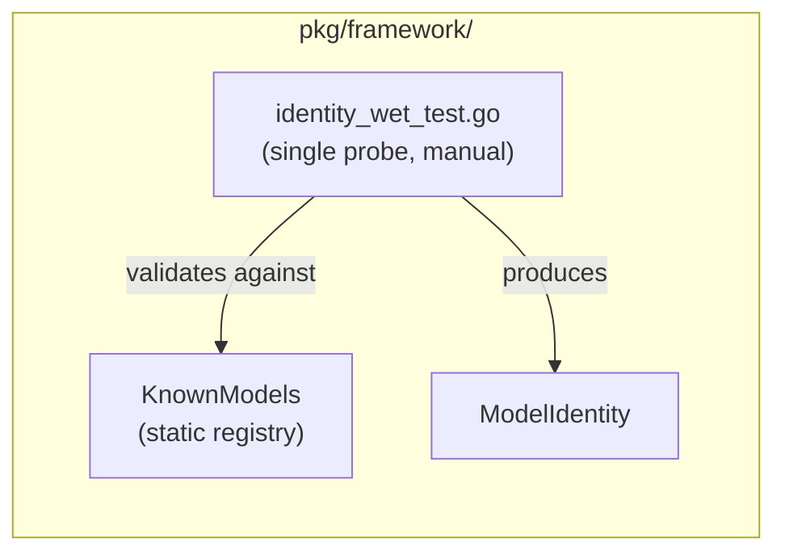
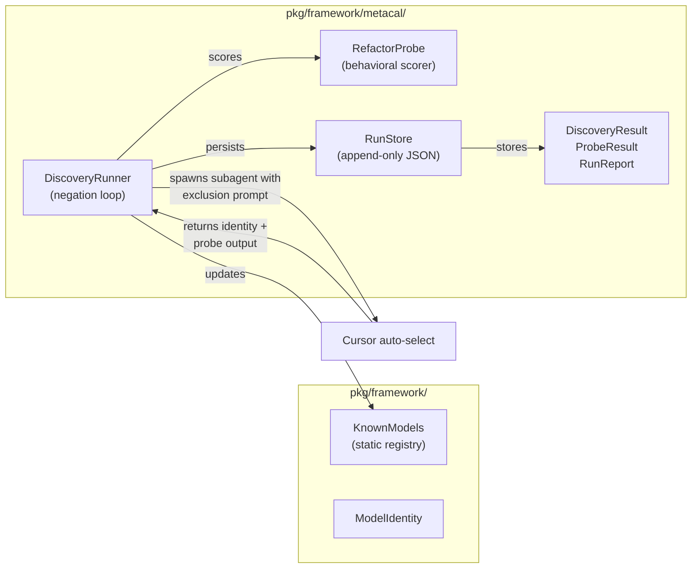

# Contract — metacal-run-1

**Status:** active  
**Goal:** Discover all models available in Cursor's auto-select via prompt negation, run one behavioral probe on each, and persist results as the first empirical meta-calibration dataset.  
**Serves:** Framework showcase (weekend side-quest — gate extension)

## Contract rules

- Discovery iterations are sequential (each depends on the previous exclusion list).
- The refactoring probe input is deterministic and version-controlled.
- Results are append-only JSON — never overwrite a prior run.
- Zero imports from Asterisk domain packages (`calibrate`, `orchestrate`, `origami`). This is framework-level.
- New code goes in `pkg/framework/metacal/`, consistent with the `pkg/framework/` location.

## Context

### The prompt negation technique

Cursor's auto-select picks a model for each agent task. By iteratively excluding previously discovered models in the system prompt, we force Cursor to select a different model each time. This is a zero-cost model enumeration technique — no API keys, no provider accounts, just prompt engineering against the IDE's own model router.

### Existing infrastructure

- **`KnownModels` registry** — `pkg/framework/known_models.go` tracks foundation models by name/provider/version.
- **`ModelIdentity`** — `pkg/framework/identity.go` is the struct for model fingerprints.
- **Identity wet test** — `pkg/framework/identity_wet_test.go` validates model self-identification against the registry.
- **MCP server** — `asterisk serve` supports Cursor subagent spawning via the Task tool.
- **Signal bus** — `emit_signal`/`get_signals` for subagent coordination.

### Relationship to meta-calibration vision contract

This contract is the **first empirical run** of the meta-calibration system described in `draft/meta-calibration.md`. It implements only the discovery loop and one probe (refactoring). The vision contract's full battery (5+ probes), normalization, and persona wiring remain future work. Results from this run feed into the vision contract's Phase 2-4 design.

### Current architecture



### Desired architecture



## FSC artifacts

| Artifact | Target | Compartment |
|----------|--------|-------------|
| First meta-calibration run results (JSON) | `pkg/framework/metacal/runs/` | domain |
| Model discovery protocol notes | `notes/` | domain |

## Execution strategy

**Test-as-runner design.** The discovery loop is a recursive Go test function. The `seen` map is the accumulator. Each recursion level = one negation iteration. The fail-fast assertion IS the termination condition: when a model repeats, `t.Fatalf` fires with the full inventory. `t.Cleanup` persists the dataset to JSON regardless of pass/fail.

```
func discoverModels(t, iteration, seen map, exclude []ModelIdentity) {
    model := spawnSubagent(buildExclusionPrompt(exclude))
    if _, exists := seen[model]; exists → t.Fatalf("exhausted at iteration %d, %d unique models")
    seen[model] = result
    discoverModels(t, iteration+1, seen, append(exclude, model))  // recurse
}
```

Build types first (Phase 1), then the probe scorer (Phase 2), then the recursive discovery test (Phase 3), then the store (Phase 4). Each phase is independently testable. The package has zero domain imports at all times.

## Tasks

### Phase 1 — Types

- [ ] Create `pkg/framework/metacal/types.go` with `DiscoveryResult`, `ProbeResult`, `ProbeScore`, `RunReport`, `DiscoveryConfig`
- [ ] `DiscoveryResult`: `Iteration int`, `ModelIdentity`, `ExclusionPrompt string`, `ProbeResult`, `Timestamp`
- [ ] `ProbeResult`: `ProbeID string`, `RawOutput string`, `Score ProbeScore`, `Elapsed time.Duration`
- [ ] `ProbeScore`: `Renames int`, `FunctionSplits int`, `CommentsAdded int`, `StructuralChanges int`, `TotalScore float64`
- [ ] `RunReport`: `RunID string`, `StartTime`, `EndTime`, `Config DiscoveryConfig`, `Results []DiscoveryResult`, `UniqueModels []ModelIdentity`
- [ ] `DiscoveryConfig`: `MaxIterations int`, `ProbeID string`, `TerminateOnRepeat bool`
- [ ] Unit tests for type construction and JSON round-trip

### Phase 2 — Refactoring probe

- [ ] Create `pkg/framework/metacal/probe.go` with `RefactorProbe` struct
- [ ] Create deterministic messy Go function input (hardcoded in `probe.go` or `testdata/`)
- [ ] Implement `ScoreRefactorOutput(original, refactored string) ProbeScore` — counts renames, splits, comments, structural changes
- [ ] Implement `BuildProbePrompt(input string) string` — the prompt given to the subagent alongside the messy code
- [ ] Unit tests for scorer with known inputs/outputs

### Phase 3 — Recursive discovery test

- [ ] Create `pkg/framework/metacal/discovery.go` with prompt builders and response parsers
- [ ] Implement `BuildExclusionPrompt(seen []ModelIdentity) string` — constructs the negation prompt
- [ ] Implement `BuildIdentityPrompt() string` — the "identify yourself" prompt fragment
- [ ] Implement `ParseIdentityResponse(raw string) (ModelIdentity, error)` — extracts model identity from subagent response
- [ ] Implement `ParseProbeResponse(raw string) (string, error)` — extracts refactored code from subagent response
- [ ] Create `pkg/framework/metacal/discovery_test.go` with recursive `discoverModels` function
- [ ] `discoverModels(t, iteration, seen map[string]DiscoveryResult, exclude []ModelIdentity)` — recursive, fail-fast on repeat
- [ ] `t.Cleanup` persists `seen` map to JSON via `RunStore` regardless of pass/fail
- [ ] `t.Fatalf` on repeat reports: iteration count, unique model count, full model list
- [ ] Unit tests for prompt builder and response parser with stub data
- [ ] Wet test (`//go:build wet`) for the live recursive discovery loop

### Phase 4 — Store and integration

- [ ] Create `pkg/framework/metacal/store.go` with `RunStore` interface and `FileRunStore` (append-only JSON)
- [ ] `SaveRun(report RunReport) error`, `LoadRun(runID string) (RunReport, error)`, `ListRuns() ([]string, error)`
- [ ] Auto-register newly discovered models into `KnownModels` (or print the registration line)
- [ ] Unit tests for store round-trip

### Phase 5 — Validate and tune

- [ ] Validate (green) — all tests pass, zero domain imports, store round-trip works
- [ ] Tune (blue) — refactor for quality, review naming, ensure scorer is deterministic
- [ ] Validate (green) — all tests still pass after tuning

## Acceptance criteria

**Given** a Cursor IDE session with auto-select enabled,  
**When** the discovery runner executes with `MaxIterations=15`,  
**Then**:
- At least 2 distinct foundation models are discovered (based on current Cursor offering)
- Each discovered model has a `DiscoveryResult` with a scored `ProbeResult`
- Results are persisted to JSON in `pkg/framework/metacal/runs/`
- Previously unknown models are flagged with the exact `KnownModels` registration line
- The run terminates cleanly (no infinite loops, no orphaned subagents)

**Given** a `RunReport` with N discovered models,  
**When** `ProbeScore` values are compared,  
**Then** scores are deterministic for identical probe outputs (same input → same score).

**Given** the discovery runner is executed twice,  
**When** results are loaded from the store,  
**Then** both runs are independently loadable and neither overwrites the other.

## Security assessment

No trust boundaries affected. The discovery runner operates entirely within the Cursor IDE session. Probe inputs are synthetic (no user data, no secrets). Model identity data is non-sensitive (publicly known model names and providers).

## Wet run protocol

The auto agent follows this loop to execute the live discovery run. **Zero file I/O within the loop** — prompts are built inline, subagent responses travel as messages, and scoring uses stdin piping. The only file write is the final report persistence.

### Prerequisites

- Working directory: project root (`/home/dpopsuev/Workspace/asterisk`)
- `go build ./cmd/metacal` succeeds
- `pkg/framework/metacal/runs/` directory exists (has `.gitkeep`)

### Loop (zero file I/O)

```
SEEN = {}           # map[key] → AnalyzeResult JSON (agent context)
EXCLUDE = []        # array of ModelIdentity JSON objects (agent context)
ITERATION = 0
MAX_ITERATIONS = 15
RUN_ID = "discovery-" + timestamp
START_TIME = now()
RESULTS = []        # ordered list of DiscoveryResult objects

while ITERATION < MAX_ITERATIONS:
    ITER_START = now()

    1. BUILD PROMPT (inline — no CLI call, no file)
       The agent constructs the prompt in its own context by concatenating:
         a. Identity block (from BuildIdentityPrompt — the agent knows this text)
         b. Exclusion block (from EXCLUDE array — "Do NOT select: ..." for each entry)
         c. Probe block (from BuildProbePrompt — the agent knows this text)
       No `metacal prompt` call. No temp files.

    2. SPAWN SUBAGENT
       Launch Task subagent (subagent_type=generalPurpose, model=fast) with PROMPT.
       Capture the full response text as RESPONSE (message, not file).

    3. ANALYZE RESPONSE (stdin pipe — no temp file)
       RESULT = $(echo "$RESPONSE" | go run ./cmd/metacal analyze --response-file -)
       Parse RESULT JSON → extract key, identity, code, score, known, wrapper fields.

    4. DEDUP CHECK
       If RESULT.key is in SEEN:
         TERM_REASON = "repeat at iteration {ITERATION}: model {key} seen at iteration {prev}"
         Break loop
       If RESULT.wrapper == true:
         Log warning: "ORANGE: wrapper identity detected — probe may need hardening"
         TERM_REASON = "wrapper detected at iteration {ITERATION}"
         Break loop

    5. GOLDEN FILE UPDATE (one-time, iteration 0 only)
       If ITERATION == 0 and RESULT.wrapper == false:
         Write RESPONSE to pkg/framework/metacal/testdata/response_combined.txt
         This keeps TestCombinedPrompt_ReturnsFoundation current with real data.

    6. RECORD
       SEEN[RESULT.key] = RESULT
       Append RESULT.identity to EXCLUDE
       Append to RESULTS
       ITERATION++
       ITER_ELAPSED = now() - ITER_START
       Log: "iteration {N}: {model_name} (score={total_score}) [{ITER_ELAPSED}ms]"

end loop

If ITERATION == MAX_ITERATIONS:
  TERM_REASON = "max iterations reached"
```

### Post-loop

```
TOTAL_ELAPSED = now() - START_TIME
Log: "discovery complete: {len(SEEN)} unique models in {ITERATION} iterations [{TOTAL_ELAPSED}ms]"

6. BUILD REPORT (inline JSON — no temp file)
   Construct RunReport JSON in agent context:
     { run_id, start_time, end_time, config, results, unique_models, termination_reason }

7. PERSIST (stdin pipe)
   echo "$REPORT_JSON" | go run ./cmd/metacal save --report-file - --runs-dir pkg/framework/metacal/runs

8. UPDATE KNOWN MODELS
   For each discovered model where known == false:
     Print the exact KnownModels registration line:
       "model-key": {ModelName: "...", Provider: "...", Version: "..."},
     Propose adding it to pkg/framework/known_models.go

9. SUMMARY
   Print: N unique models discovered in M iterations
   Print: per-model scores table (model, provider, score, elapsed)
   Print: total elapsed time
   Print: termination reason
```

### I/O budget

| Operation | Old protocol | Zero-IO protocol |
|-----------|-------------|-----------------|
| Temp file writes | ~30 (excludes + responses + report) | 0 |
| Temp file reads | ~30 | 0 |
| CLI execs in loop | ~30 (prompt + analyze per iteration) | ~15 (analyze only, via stdin) |
| File writes total | ~31 | 1 (final report via stdin pipe) |
| Golden file writes | 0 | 1 (iteration 0, conditional) |

### Observability

- **ORANGE** (problem signals): wrapper identity detected, parse failures, subagent timeout, empty response.
- **YELLOW** (success signals): per-iteration `"iteration N: MODEL (score=X.XX) [Yms]"`, total elapsed at completion, report persistence confirmation.
- If `metacal analyze` via stdin fails unexpectedly, log the raw response length and first 200 chars for diagnosis.

### Error handling

- If `metacal analyze` fails (parse error): log the raw response excerpt, save partial results, set TERM_REASON to the error, break.
- If a subagent returns empty/refused ("EXCLUDED"): log it, set TERM_REASON, break.
- If a subagent times out: retry once with the same prompt. If it fails again, break.
- Always persist whatever results were collected — partial runs are valuable.

### Manual use

The `metacal prompt` subcommand is **not** used in the automated loop but remains available for manual prompt inspection:
```
go run ./cmd/metacal prompt
go run ./cmd/metacal prompt --exclude-file models.json
```

## Notes

2026-02-21 16:00 — Design refinement: test-as-runner pattern. The discovery loop is a recursive Go test function. `seen` map is the accumulator, fail-fast `t.Fatalf` on model repeat is the termination condition (reports N unique models). `t.Cleanup` persists results to JSON regardless of pass/fail. Wet test tag for live runs.

2026-02-21 15:00 — Contract created. Extends the weekend side-quest with a first empirical meta-calibration run. Concept: prompt negation to enumerate Cursor's model pool. Discovery + one refactoring probe per model. Automated via Task tool subagents.
