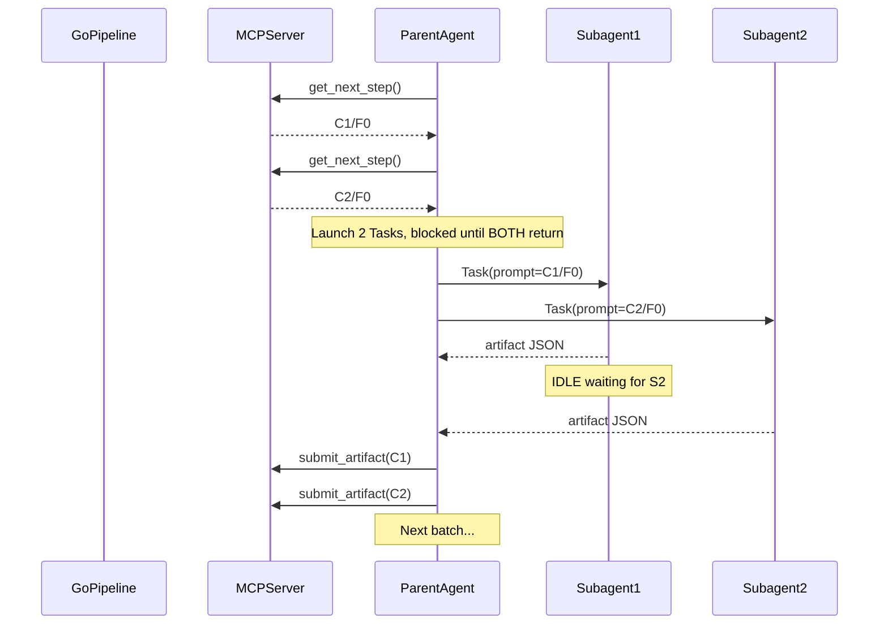
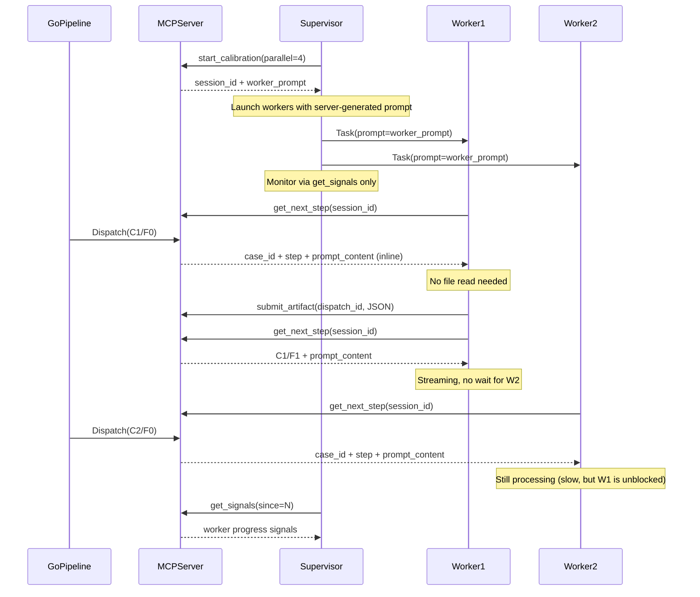

# Contract — papercup-v2-hardening

**Status:** active  
**Goal:** Embed the Papercup v2 choreography protocol into Go code so the agent cannot misinterpret it: server-generated worker prompt, inline prompt content, protocol-agnostic gate messages, and a thin v2 supervisor skill.  
**Serves:** PoC completion (gate)

## Contract rules

- The `start_calibration` response MUST include a `worker_prompt` field generated by Go code. The skill becomes a thin supervisor that passes this prompt to Task subagents verbatim.
- The `get_next_step` response MUST include a `prompt_content` field with the full prompt text inline. Workers MUST NOT need to call `Read` on a file path.
- Gate mechanism logic (`peakPullers`, `batchPeak`, `sessionPeakInFlight`) is unchanged. Only warning message text changes.
- The rewritten skill MUST NOT call `get_next_step` or `submit_artifact` from the parent agent. Workers own those calls (Papercup v2 choreography).
- Cross-repo: Origami `docs/cursor-skill-guide.md` Agent Bus Protocol section flips from v1 to v2.

## Context

- `internal/mcp/server.go` — MCP server with 6 tools: `start_calibration`, `get_next_step`, `submit_artifact`, `get_report`, `emit_signal`, `get_signals`.
- `internal/mcp/session.go` — `MuxDispatcher`-based session; capacity gate (`PullerEnter`/`PullerExit`, `peakPullers`, `CheckCapacityGate`), TTL watchdog.
- `internal/mcp/server_test.go` — Integration tests for MCP server and subagent interaction.
- `skills/asterisk-calibrate/SKILL.md` — Current v1 skill with batch-pull orchestration pattern.
- `origami/rules/domain/agent-bus.mdc` — Papercup v2 protocol specification (worker loop, supervisor pattern, signal protocol).
- `origami/contracts/active/papercup-protocol-maturity.md` — Papercup v2 contract; Phase 1 (choreography migration) is the relevant phase.
- `origami/docs/cursor-skill-guide.md` — Cursor Skill developer guide; Agent Bus Protocol section (lines 89-118) still describes v1.

### Root cause analysis

The `asterisk-calibrate/SKILL.md` describes Papercup v1 orchestration: parent pulls N steps, launches N Tasks, waits for ALL to return, submits all, repeats. This causes:

1. **Weakest Link** — fast workers idle waiting for the slowest to finish before the next batch starts.
2. **Batching** — no streaming between rounds; steps queue up while the parent blocks.

The v2 choreography protocol exists in `agent-bus.mdc` and the Papercup contract, but the skill — the actual instruction set the agent follows — still implements v1. The agent followed the skill, not the rule.

### Current architecture

Papercup v1 — Parent is the exclusive switchboard for `get_next_step` and `submit_artifact`.



### Desired architecture

Papercup v2 — Workers own the full loop. Parent is supervisor. Prompt content is inline.



## Capacity gate compatibility

The gate has three opening paths, all compatible with v2:

| Path | v1 trigger | v2 trigger |
|------|-----------|-----------|
| `batchPeak >= 4` | Parent pulls 4 before submitting | All 4 workers pull in first round before any submits |
| `sessionPeakInFlight >= 4` | Same as batchPeak | Same — 4 concurrent in-flight steps |
| `peakPullers >= 4` | N/A (designed for v2) | 4 workers call `get_next_step` simultaneously at startup |

The `peakPullers` path is the primary v2 detector — it latches at high-water mark and never resets. Gate mechanism needs zero code changes; only warning message text changes.

## FSC artifacts

| Artifact | Target | Compartment |
|----------|--------|-------------|
| Updated `asterisk-calibrate` skill (v2 supervisor pattern) | `skills/asterisk-calibrate/SKILL.md` | domain |
| Updated Cursor Skill guide (v2 protocol) | `origami/docs/cursor-skill-guide.md` | domain (cross-repo) |

## Execution strategy

Two phases. Phase 1 is the server-side embedding (testable in isolation). Phase 2 is the skill rewrite and docs (depends on Phase 1 being wired).

### Phase 1 — Server-side embedding

Embed the v2 protocol into Go code: server-generated worker prompt, inline prompt content, protocol-agnostic gate messages. All testable via `go test ./internal/mcp/...`.

### Phase 2 — Skill rewrite and docs

Rewrite the skill to v2 supervisor pattern. Update Origami guide. Update the `asterisk-calibrate-skill` contract notes.

## Coverage matrix

| Layer | Applies | Rationale |
|-------|---------|-----------|
| **Unit** | yes | `WorkerPrompt()` generation, inline prompt reading, gate message text. |
| **Integration** | yes | `TestStartCalibration_WorkerPrompt`, `TestGetNextStep_InlinePrompt` via MCP server test harness. |
| **Contract** | yes | `startCalibrationOutput` and `getNextStepOutput` struct changes are backward-compatible (additive fields). |
| **E2E** | yes | Manual: invoke `/asterisk-calibrate ptp-mock` in Cursor after skill rewrite. |
| **Concurrency** | N/A | Gate tracking code unchanged; existing concurrency tests cover it. |
| **Security** | N/A | No new trust boundaries. `prompt_content` is the same data as `prompt_path` — just delivered inline instead of via file read. |

## Tasks

### Phase 1 — Server-side embedding

- [x] **P1.1** Add `WorkerPrompt()` method to `Session` in `internal/mcp/session.go` — generates complete worker loop instructions with session_id, step schemas (F0-F6), signal protocol, inline prompt usage hint.
- [x] **P1.2** Add `worker_prompt` and `worker_count` fields to `startCalibrationOutput`; wire `WorkerPrompt()` into `handleStartCalibration`.
- [x] **P1.3** Add `prompt_content` field to `getNextStepOutput`; read prompt file inline in `handleGetNextStep`. Graceful fallback if file read fails.
- [x] **P1.4** Reword `CapacityWarning` in `handleGetNextStep` to protocol-agnostic: `"system under capacity: %d/%d workers active"`.
- [x] **P1.5** Reword `CheckCapacityGate` error message in `session.go` to neutral language: `"capacity gate: %d/%d concurrent workers observed (peak: %d). System expects %d workers"`.
- [x] **P1.6** Add tests: `TestStartCalibration_WorkerPrompt`, `TestGetNextStep_InlinePrompt`, `TestCapacityWarning_ProtocolAgnostic`, `TestCapacityGate_ProtocolAgnostic`, `TestWorkerMode_StreamRegistration`, `TestWorkerMode_NoWorkerID_Ignored`, `TestV2Workers_FullDrain_Deterministic`, `TestV2Workers_ViaResolve_Deterministic`, `TestV2Workers_ConcurrencyTiming_Deterministic`, `TestWorkerPrompt_StepSchemas`, `TestWorkerPrompt_SessionIDEmbedded`.
- [x] **P1.7** Validate (green) — `go build ./...` && `go test ./internal/mcp/...` && `go test ./...`.
- [x] **P1.NEW** Worker mode tracking: `RegisterWorker()` method, `WorkerModeStats()`, server intercepts `worker_started` signals to register workers with declared mode.

### Phase 2 — Skill rewrite and docs

- [x] **P2.1** Rewrite `.cursor/skills/asterisk-calibrate/SKILL.md` to v2 supervisor pattern: call `start_calibration` -> launch `worker_count` Tasks with `worker_prompt` -> monitor via `get_signals` -> `get_report`. Removed all `get_next_step`/`submit_artifact` calls from skill. Removed "Parallel mode" batch-pull section.
- [x] **P2.2** Update `origami/docs/cursor-skill-guide.md` "Agent Bus Protocol" section: flipped responsibility table to v2, replaced "Parallel mode" with supervisor/worker pattern, referenced server-generated `worker_prompt`.
- [x] **P2.3** Update `asterisk-calibrate-skill.md` contract notes with v1 -> v2 migration note.
- [x] **P2.4** Validate (green) — `go build ./...` in both Asterisk and Origami.
- [x] **P2.5** Tune (blue) — reviewed skill and guide for clarity; both follow v2 pattern consistently.
- [x] **P2.6** Validate (green) — all tests pass in both repos.

## Acceptance criteria

```gherkin
Given a calibration session started with parallel=4
When start_calibration returns
Then the response includes a non-empty worker_prompt field containing the session_id
  And the response includes worker_count=4

Given a running calibration with available steps
When a worker calls get_next_step and receives a step
Then the response includes a prompt_content field with the full prompt text
  And prompt_content matches the content of the file at prompt_path

Given a v2 worker subagent receiving a get_next_step response
When the response contains a capacity_warning
Then the warning text does NOT mention "launch subagents" or "pull more steps"
  And uses neutral language like "system under capacity"

Given the rewritten asterisk-calibrate skill
When an agent reads the skill
Then the skill does NOT contain get_next_step or submit_artifact calls from the parent
  And the skill instructs the parent to launch N Tasks with worker_prompt
  And the skill instructs the parent to monitor via get_signals only
```

## Security assessment

No trust boundaries affected. `prompt_content` is the same data as `prompt_path` — delivered inline instead of via file read. No new attack surface.

## Not in scope

- Zone-aware stickiness (Papercup P2) — separate phase in `origami/contracts/active/papercup-protocol-maturity.md`.
- Work stealing (Papercup P3) — separate phase.
- Adaptive worker lifecycle (Papercup P4) — separate phase; basic replacement via supervisor IS included in skill.
- Origami skill scaffold template update (Papercup P1.2) — done in Origami repo separately.

## Notes

2026-02-24 — Contract created from plan `papercup_v2_skill_embed_692e78c7`. Motivated by wet calibration run where the agent reverted to v1 batch-pull despite v2 being documented in `agent-bus.mdc`. Root cause: skill described v1, agent followed the skill. Fix: embed v2 in Go code so the server generates the worker prompt, making misinterpretation impossible.
