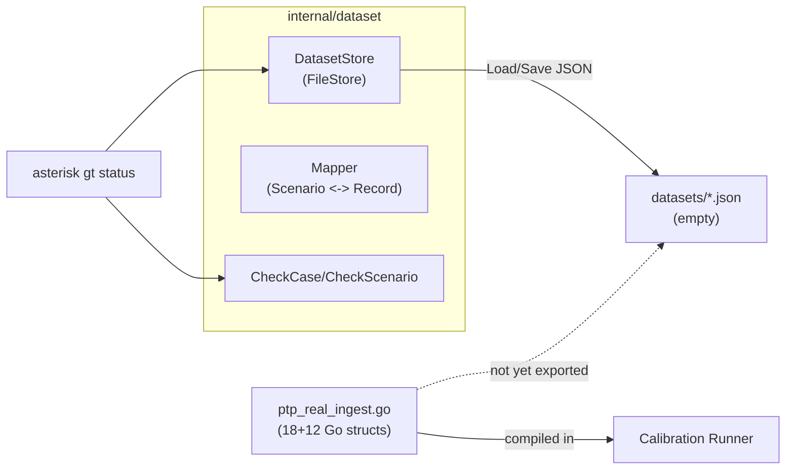
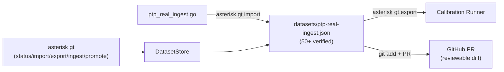

# Contract — Ground Truth Dataset

**Status:** closed (absorbed)  
**Goal:** Grow the ground truth dataset from 18 verified cases to 50+ via agentic curation, stored as reviewable JSON files. CLI-first with `asterisk gt` subcommands. Export as git-tracked JSON and open GitHub PR for team review.  
**Serves:** Dataset growth (SHOULD for Phase 5a mitigation Item 4)  
**Closure:** Phases 1-2 (CLI, JSON export) implemented. Remaining scope absorbed by `data-ingestion-pipeline.md` (automatic dataset growth via DSL pipeline) and `consumer-cli-scaffold.md` (Origami — `dataset` command replaces `gt`).

## Contract rules

Global rules only, plus:

- **Reviewability-first** (`rules/reviewability-first.mdc`): the canonical dataset is a git-tracked JSON file. Every mutation appears in PR diffs. No binary stores.
- **Adapter-driver pattern** (`rules/abstraction-boundaries.mdc`): Asterisk's `DatasetStore` wraps the generic `curate.Store` from Origami. PTP is the first scenario driver.
- **CLI-first citizen**: all operations are `asterisk gt` subcommands. Any agent can use them.

## Context

- **Origami `curate/` package:** Generic curation primitives — `Record`, `Field`, `Schema`, `FieldSpec`, `Store`, `FileStore`, `CheckCompleteness`, `Walker`. Framework-level, domain-agnostic.
- **Asterisk `internal/dataset/` package (implemented):** Domain adapter layer — `DatasetStore` (wraps `calibrate.Scenario`), `FileStore`, `CompletenessResult`, `CheckCase`/`CheckScenario`, `AsteriskSchema`, `GroundTruthCaseToRecord`/`RecordToGroundTruthCase`, `ScenarioToDataset`/`DatasetToScenario`. Bridges `calibrate.Scenario` <-> `curate.Record`.
- **CLI (implemented):** `cmd/asterisk/cmd_gt.go` — `asterisk gt status [scenario]` lists datasets or shows per-case completeness.
- **Dataset types:** `internal/calibrate/types.go` — `Scenario`, `GroundTruthRCA`, `GroundTruthCase`.
- **Current scenario data:** `internal/calibrate/scenarios/ptp_real_ingest.go` — 18 verified + 12 candidate cases as Go structs.
- **`datasets/` directory:** Exists but empty. Target for exported JSON.
- **Notes:** `notes/test-cards-assessment.md` — Data Card documenting the current dataset.

### Current architecture

Phase 1-2 are implemented: store, completeness tracker, CLI status, schema, mapper. The gap is Phase 7: the dataset has never been exported to JSON, expanded, or submitted as a PR.

### Desired architecture

## FSC artifacts

| Artifact | Target | Compartment |
|----------|--------|-------------|
| Dataset Data Card update | `notes/test-cards-assessment.md` | domain |

## Execution strategy

### Already implemented (Phases 1-2)

- `DatasetStore` interface + `FileStore` (JSON persistence)
- `AsteriskSchema` (completeness field specs via `curate.Schema`)
- `GroundTruthCaseToRecord` / `RecordToGroundTruthCase` (domain mapper)
- `CheckCase` / `CheckScenario` (completeness scoring via `curate.CheckCompleteness`)
- `asterisk gt status [scenario]` CLI command

### Remaining work

**Phase 1b — Import/Export CLI** (small):
1. `asterisk gt import --from-go ptp-real-ingest` — serialize Go structs to `datasets/ptp-real-ingest.json`
2. `asterisk gt export --scenario ptp-real-ingest` — load JSON into `calibrate.Scenario` for calibration

**Phase 7 — Dataset expansion + GitHub PR** (the real deliverable):
1. Export initial dataset
2. Identify additional RP launches for ingestion
3. Ingest evidence for candidates, promote ready ones
4. Open GitHub PR with the JSON dataset for team review

**Deferred (post-PoC):**
- Phase 3: Evidence source adapters (Jira, GitHub PR, File) — `EvidenceSource` interface
- Phase 4: AI extractor subagents via `curate.Walker`
- Phase 5: Promote + calibration integration (wire `DatasetStore.Load()` as alternative scenario source)
- Phase 6: MCP tools via PipelineServer domain hooks (not hand-wired)

## Rename note

~~The `internal/origami/` package has been renamed to `internal/dataset/`.~~ Done via `rename-origami-to-dataset` contract.

## Coverage matrix

| Layer | Applies | Rationale |
|-------|---------|-----------|
| **Unit** | yes | Store round-trip, completeness scoring, mapper (existing tests cover this) |
| **Integration** | no | No cross-boundary changes in remaining phases |
| **Contract** | no | Internal package, no public API |
| **E2E** | no | Dataset CLI is standalone |
| **Concurrency** | no | No shared state |
| **Security** | no | No trust boundaries; local file operations only |

## Tasks

### Phase 1b — Import/Export CLI

- [ ] **D1** Write `asterisk gt import --from-go ptp-real-ingest` to serialize Go structs to `datasets/ptp-real-ingest.json`
- [ ] **D2** Write `asterisk gt export --scenario ptp-real-ingest` to load JSON into `calibrate.Scenario`
- [ ] **D3** Unit tests: round-trip (import -> load -> compare with Go structs)

### Phase 7 — Dataset expansion + GitHub PR

- [ ] **D4** Run `asterisk gt import` to produce initial `datasets/ptp-real-ingest.json`
- [ ] **D5** Identify additional RP launches for ingestion (new PTP CI runs)
- [ ] **D6** Ingest evidence for candidate cases, promote ready candidates
- [ ] **D7** Open GitHub PR with `datasets/ptp-real-ingest.json` for team review
- [ ] **D8** Iterate: ingest, promote, update JSON, push
- [ ] **D9** Acceptance: PR merged with 30+ verified cases in JSON dataset

### Cleanup

- [x] **D10** Rename `internal/origami/` to `internal/dataset/` (done via `rename-origami-to-dataset` contract)
- [ ] **D11** Validate (green) — all tests pass
- [ ] **D12** Tune (blue) — refactor for quality
- [ ] **D13** Validate (green) — all tests pass after tuning

## Acceptance criteria

- **Given** the existing `ptp-real-ingest` Go scenario with 18 verified + 12 candidates,
- **When** `asterisk gt import --from-go ptp-real-ingest` is run,
- **Then** `datasets/ptp-real-ingest.json` contains the full Scenario as reviewable JSON.

- **Given** `datasets/ptp-real-ingest.json` exists,
- **When** `asterisk gt export --scenario ptp-real-ingest` is run,
- **Then** the calibration runner can load from JSON and scores only verified cases (same behavior as Go structs).

- **Given** the PR with `datasets/ptp-real-ingest.json` is merged,
- **When** calibration runs with `--scenario ptp-real-ingest`,
- **Then** it uses the JSON dataset with 30+ verified cases.

- **Structural invariant:** The canonical dataset is always a git-tracked JSON file. Every mutation produces a reviewable diff.

## Security assessment

No trust boundaries affected. Local file operations only. Dataset JSON does not contain secrets or PII (test names, error messages, defect categories).

## Notes

- 2026-02-25 — Contract rewritten. Renamed from `origami-ground-truth-ingestor` to `ground-truth-dataset`. Key changes: (1) removed "origami" from name — this is Asterisk domain work, (2) acknowledged Phases 1-2 are already implemented via `internal/origami/` + `cmd_gt.go`, (3) updated references to use `curate/` package (Origami framework) instead of `MuxDispatcher`, (4) deferred Phases 3-6 with note that MCP bridge should use PipelineServer domain hooks not hand-wired tools, (5) added rename note for `internal/origami/` -> `internal/groundtruth/`.
- 2026-02-19 06:00 — PoC scope trimming: only Phases 1-2 + Phase 7 in scope. Phases 3-6 deferred.
- 2026-02-19 04:00 — Phase 5a mitigation: dataset target raised to 50+, robustness requirements added.
- 2026-02-18 — Storage: JSON files not SQLite (reviewability-first). CLI-first, thin MCP, generic with PTP as first driver.
