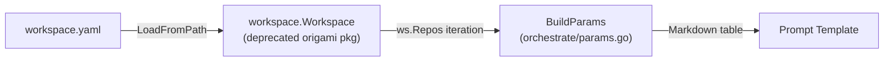
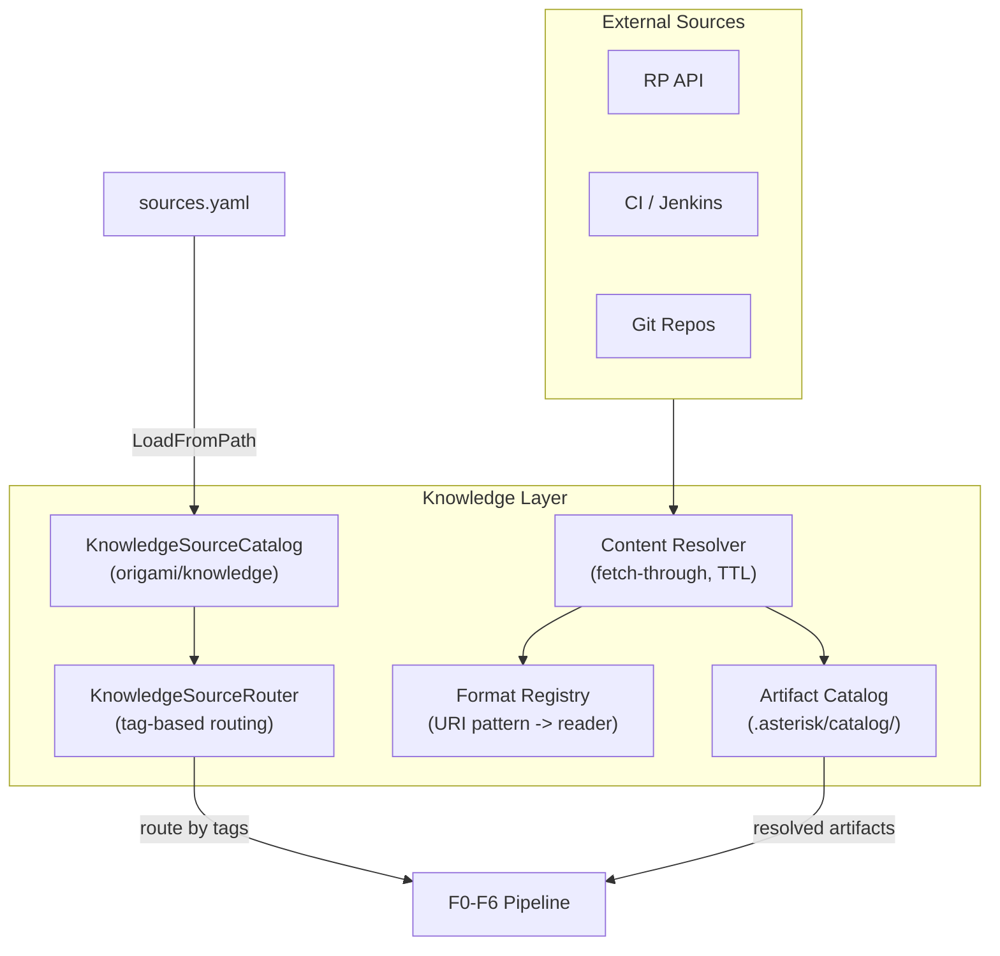

# Contract — Knowledge Source Migration

**Status:** closed (Phase 1 complete, remainder absorbed)  
**Goal:** Migrate Asterisk from deprecated `origami/workspace` to `origami/knowledge` types, then build a local artifact catalog with fetch-through, format registry, and CI log readers on the new `Source`/`KnowledgeSourceCatalog` primitives.  
**Serves:** PoC quality / pitch polish (SHOULD)  
**Closure:** Phase 1 (migrate 11 files from `workspace` to `knowledge`) complete. Phase 2 (artifact catalog) absorbed by `refine-rtfm-routing-policy.md` (ReadPolicy + prompt injection) and `knowledge-source-evolution.md` (long-term architecture).

## Contract rules

- Phase 1 (migration) is a prerequisite for Phase 2 (catalog). Do not start catalog work on deprecated types.
- Catalog is local-first: fetch once, store locally, serve from cache.
- Follow scenario-vs-generic rule: catalog infrastructure is generic; format registry entries and reader implementations for PTP CI are scenario-specific.
- Every fetched artifact gets a resolution status and TTL.

## Context

- **Origami `knowledge/` package (complete):** `Source` (Name, Kind, URI, Purpose, Branch, Tags), `KnowledgeSourceCatalog` (Sources), `KnowledgeSourceRouter` + `RouteRule` + `TagMatchRule`. Backward-compatible loader reads both `repos:` and `sources:` YAML.
- **Origami `workspace/` package (deprecated):** `Workspace{Repos []Repo}`, `Repo{Path, URL, Name, Purpose, Branch}`. Still imported by Asterisk.
- **Migration guide:** See `origami/.cursor/contracts/completed/framework/knowledge-source-catalog.md` — consumer migration table and 11-file list.
- **Completed prerequisite:** `workspace-mvp.md` — RP attributes, Jira links, repo paths wired into prompts. M12/M13 gaps addressed.
- **Real CI artifacts on disk:** `archive/ci/4.21/16_feb_26/` contains `#5400.txt` (1.4 MB) and `failed_ptp_suite_test.zip` (9 MB).
- **CI notification email:** `notes/ci-notification-and-fetch.mdc` — RP, Jenkins, S3, Polarion URLs.
- **Related:** `evidence-gap-brief.md` — gap categories map 1:1 to artifact taxonomy domains, making gap briefs a demand signal for catalog expansion.

### Current architecture

Asterisk imports `origami/workspace` in 11 files. The `knowledge/` package with `Source`, `KnowledgeSourceCatalog`, and `KnowledgeSourceRouter` exists in Origami but is unused by Asterisk.

### Desired architecture

## FSC artifacts

| Artifact | Target | Compartment |
|----------|--------|-------------|
| Migration changelog (workspace -> knowledge) | `notes/` | domain |
| Format registry design reference | `docs/` | domain |

## Execution strategy

**Phase 0 — MCP rename** (mechanical, 1 session): Rename MCP server entries from generic names to the `origami-{purpose}` convention (`origami-pipeline-marshaller`, `origami-kami-debugger`). Update `.cursor/mcp.json`, `PipelineConfig.Name`, and skill references.

**Phase 1 — Consumer migration** (mechanical, 1-2 sessions):

1. Update all 11 files from `origami/workspace` imports to `origami/knowledge`
2. Rename types: `*workspace.Workspace` -> `*knowledge.KnowledgeSourceCatalog`, `workspace.Repo` -> `knowledge.Source`
3. Update field access: `ws.Repos` -> `catalog.Sources`, `.Path`/`.URL` -> `.URI`
4. Rename `workspace_convert.go` -> `catalog_convert.go`, return `*knowledge.KnowledgeSourceCatalog`
5. Build, lint, test — all green before proceeding

**Phase 2 — Artifact catalog** (substantial, carried from workspace-catalog):

1. Design catalog entry schema extending `Source` with resolution metadata
2. Build format registry, readers, fetch-through resolver
3. Wire into pipeline, add CLI pre-population command

## Coverage matrix

| Layer | Applies | Rationale |
|-------|---------|-----------|
| **Unit** | yes | Phase 1: migration correctness. Phase 2: readers, resolver, registry CRUD |
| **Integration** | yes | Phase 2: fetch-through against RP API stub |
| **Contract** | yes | Phase 1: public API change (Workspace -> KnowledgeSourceCatalog) |
| **E2E** | no | Stub calibration validates pipeline with new types |
| **Concurrency** | no | No shared state |
| **Security** | yes | Phase 2: ZIP readers, URL fetch, disk persistence |

## Tasks

### Phase 0 — Rename MCP servers

- [ ] **R1** Rename `.cursor/mcp.json` key `"marshaller"` to `"origami-pipeline-marshaller"`
- [ ] **R2** Update `PipelineConfig.Name` in `internal/mcpconfig/server.go` from `"asterisk"` to `"origami-pipeline-marshaller"`
- [ ] **R3** Add `"origami-kami-debugger"` entry to `.cursor/mcp.json` (placeholder, wired when Kami is built in Origami)
- [ ] **R4** Update Asterisk calibration skill (`asterisk-calibrate/SKILL.md`) to reference new MCP server name `origami-pipeline-marshaller`
- [ ] **R5** Update Asterisk analyze skill (`asterisk-analyze/SKILL.md`) if it references the MCP server name
- [ ] **R6** Validate — `go build ./...`, `go test ./...`, skill references consistent

### Phase 1 — Consumer migration

- [x] **M1** Update `cmd/asterisk/cmd_analyze.go`: `workspace.LoadFromPath` -> `knowledge.LoadFromPath`, `ws.Repos` -> `catalog.Sources`
- [x] **M2** Update `cmd/asterisk/cmd_cursor.go`: `workspace.LoadFromPath` -> `knowledge.LoadFromPath`, pass `catalog` to `RunStep`
- [x] **M3** Update `internal/calibrate/adapter.go`: `SetWorkspace(ws *workspace.Workspace)` -> `SetCatalog(cat *knowledge.KnowledgeSourceCatalog)`
- [x] **M4** Update `internal/calibrate/adapt/llm.go`: `ws *workspace.Workspace` field -> `catalog *knowledge.KnowledgeSourceCatalog`
- [x] **M5** Update `internal/calibrate/adapt/routing.go` + `routing_test.go`: `SetWorkspace` -> `SetCatalog`
- [x] **M6** Rename `internal/calibrate/workspace_convert.go` -> `catalog_convert.go`: `ScenarioToWorkspace` -> `ScenarioToCatalog`, return `*knowledge.KnowledgeSourceCatalog`
- [x] **M7** Update `internal/investigate/analyze.go`: `AnalyzeWithWorkspace` parameter type
- [x] **M8** Update `internal/orchestrate/params.go` + `params_test.go`: `BuildParams` signature, `WorkspaceParams` -> iterate `catalog.Sources`, `.Path`/`.URL` -> `.URI`
- [x] **M9** Update `internal/orchestrate/runner.go`: `RunStep` parameter type
- [x] **M10** Validate (green) — `go build ./...`, `go test ./...` all pass with zero `origami/workspace` imports remaining

### Phase 2 — Artifact catalog

- [ ] **C1** Design catalog entry schema (URI, local path, content type, reader, TTL, resolution status, checksum) as extension of `knowledge.Source`
- [ ] **C2** Implement catalog registry (`registry.json`) with CRUD operations
- [ ] **C3** Implement fetch-through resolver for RP API responses (cache `LaunchResource`, `TestItemResource`)
- [ ] **C4** Implement fetch-through resolver for local files (copy to catalog with metadata)
- [ ] **C5** Design format registry (URI pattern -> reader mapping, seeded with PTP CI patterns)
- [ ] **C6** Implement `jenkins_console_log` reader (ANSI strip, error-line extraction)
- [ ] **C7** Implement `ginkgo_test_bundle` reader (ZIP extraction, Ginkgo JSON parse)
- [ ] **C8** Implement `plain_text` and `json` readers as baseline
- [ ] **C9** Wire catalog into pipeline: prompt templates can reference catalog artifacts
- [ ] **C10** Add `asterisk fetch --launch <ID>` pre-population command
- [ ] **C11** Validate (green) — catalog fetch-through works for RP data and local CI logs in stub scenario
- [ ] **C12** Tune (blue) — TTL defaults, reader heuristics, token budget impact of injected artifacts
- [ ] **C13** Validate (green) — all tests pass after tuning

## Acceptance criteria

- **Given** Asterisk is built after Phase 1,
- **When** `go build ./...` completes,
- **Then** zero files import `origami/workspace`; all use `origami/knowledge`.

- **Given** `asterisk fetch --launch 33195` is run,
- **When** the catalog is inspected,
- **Then** RP launch data and associated test items are stored locally with metadata.

- **Given** a Jenkins console log (`#5400.txt`) is registered in the catalog,
- **When** the F3 Investigation prompt requests log context,
- **Then** the reader extracts error lines and injects a summarized view within token budget.

- **Given** `failed_ptp_suite_test.zip` is registered in the catalog,
- **When** the format registry is queried,
- **Then** it identifies the content as a Ginkgo test bundle and routes to the correct reader.

## Security assessment

| OWASP | Finding | Mitigation |
|-------|---------|------------|
| A10 | Catalog fetches from RP API and potentially S3/Jenkins URLs. URL injection possible via catalog config. | URL allowlist by domain. Default: configured RP host, known CI domains. |
| A01 | ZIP reader processes archive files. Malicious archives could contain path traversal entries. | Validate extracted paths: reject entries with `..` components. Limit extracted file size. |
| A02 | Catalog stores RP API responses and CI logs on disk. Sensitive data persistence. | Catalog directory `0700`, files `0600`. TTL-based eviction. Catalog contents must not be committed. |

## Notes

- 2026-02-25 — Contract created. Replaces `workspace-catalog.md`. Adds Phase 1 (consumer migration from deprecated `origami/workspace` to `origami/knowledge`) as prerequisite. Phase 2 carries forward all 12 catalog tasks from the original contract, reframed on `Source`/`KnowledgeSourceCatalog` types. Motivated by completion of Origami `knowledge-source-catalog` contract which renamed `Workspace` -> `KnowledgeSourceCatalog`, `Repo` -> `Source`.

- 2026-02-25 — Phase 1 (M1-M10) marked complete. Migration was completed prior to contract formalization — codebase already uses `origami/knowledge` with zero `origami/workspace` imports. Phase 0 (R1-R6) and Phase 2 (C1-C13) remain open.
