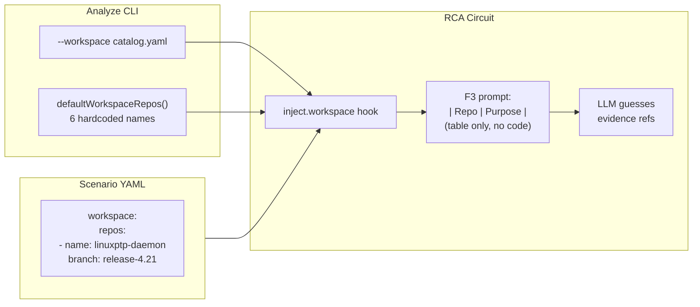
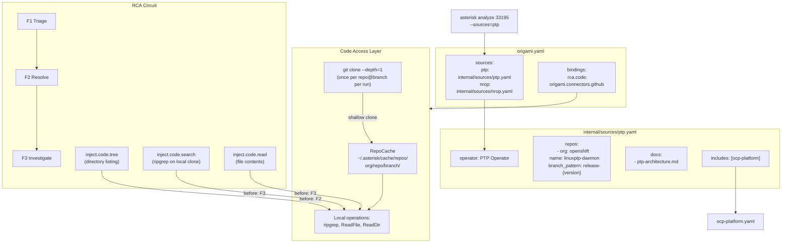

# Contract — knowledge-sources-github

**Status:** absorbed  
**Goal:** Composable source packs + GitHub code access give the RCA circuit real evidence for investigation, replacing prompt-only repo metadata and hardcoded fallbacks.  
**Serves:** CursorAdapter M19 improvement (baseline: 0.58, target: >= 0.70)  
**Absorbed by:** Prior Origami contracts (`domain-separation-container`, `decoupled-schematics`, `knowledge-source-evolution`) implemented 95% of this scope. Remaining workspace→sources rename + synthesis layer merged into Origami `knowledge-layer` contract.

## Contract rules

- **Safety > Speed** applies doubly: shallow clones add startup latency but unlock accuracy. Token budget is irrelevant at 50,000x ROI.
- **Deterministic first:** Clone, search (ripgrep), and file read are deterministic. Only the LLM reasoning over fetched code is stochastic.
- Origami breaking changes are expected (PoC era). Delete `workspace` references immediately — no deprecation shims.

## Context

Three compounding issues make RCA investigation weak:

1. **No code access.** Repos are prompt decoration — the LLM sees a table of names/purposes but never reads actual code. Evidence refs are hallucinated. This explains M12/M13 at 0.00 and M9/M10 below threshold in wet calibration.
2. **Hardcoded fallback.** `defaultWorkspaceRepos()` in `origami/schematics/rca/cmd/helpers.go` bakes 6 PTP-specific repo names into code.
3. **No composability.** Can't mix operators (PTP + NROP), can't deduplicate shared sources (OCP platform docs), can't identify which operator a failure belongs to.
4. **"workspace" naming is defunct.** Overloaded term (IDE, K8s, Origami all use it). Replaced by "sources" throughout.

### Wet calibration evidence (2026-03-03)

| Metric | Value | Threshold | Root cause |
|--------|-------|-----------|------------|
| M12 Evidence Recall | 0.00 | >= 0.65 | LLM hallucinating evidence refs — never reads code |
| M13 Evidence Precision | 0.00 | >= 0.45 | Same — refs are guesses from training data |
| M9 Repo Selection Precision | 0.44 | >= 0.65 | No feedback loop to validate selections |
| M10 Repo Selection Recall | 0.50 | >= 0.80 | Repos are just names, no context from actual code |
| M15 Component Identification | 0.64 | >= 0.75 | Can't verify component ownership without code |
| M1 Defect Type Accuracy | 0.73 | >= 0.85 | Weak evidence leads to wrong classification |
| M19 Overall Accuracy | 0.58 | >= 0.70 | Weighted aggregate |

### Current architecture



### Desired architecture



### Plug-and-play code hooks

Code access is split into three composable hooks, each independently attachable to any circuit node via `before:`. The circuit YAML is the experimentation surface — reconfigure without rebuilding.

| Hook | Operation | Cost | Typical attachment |
|------|-----------|------|--------------------|
| `inject.code.tree` | `os.ReadDir` on local clone | Trivial | F2 Resolve — see repo structure before picking |
| `inject.code.search` | `ripgrep` on local clone | Low | F3 Investigate — find files matching triage keywords |
| `inject.code.read` | `os.ReadFile` from local clone | Token budget | F3 Investigate — inject ranked file contents |

Experiment by moving hooks around in the circuit YAML:

```yaml
# Experiment A: code only at F3
nodes:
  - name: investigate
    before: [inject.code.search, inject.code.read]

# Experiment B: tree at F2, full code at F3
nodes:
  - name: resolve
    before: [inject.code.tree]
  - name: investigate
    before: [inject.code.search, inject.code.read]
```

### Local clone cache

Repos are shallow-cloned on first access and reused for the entire run. All search/read operations are local filesystem — no per-file API calls.

```
~/.asterisk/cache/repos/
  openshift/linuxptp-daemon/release-4.21/        <- shallow clone
  openshift/ptp-operator/release-4.21/
  openshift-kni/cnf-features-deploy/master/
```

- **Cache key:** `(org, repo, branch)` → local directory
- **Clone:** `git clone --depth=1 --branch <branch> --single-branch` (one GitHub call per repo)
- **Lifetime:** persist across runs for the same branch (release branches are immutable)
- **Eviction:** TTL-based or `asterisk cache clear`
- **Thread safety:** clone is atomic per key; parallel walkers sharing a cache see the same snapshot

## FSC artifacts

| Artifact | Target | Compartment |
|----------|--------|-------------|
| Source pack YAML format spec | `docs/source-packs.md` | domain |
| GitHub connector design | `docs/connectors-github.md` | domain |
| "sources" glossary entry | `glossary/glossary.mdc` | domain |

## Execution strategy

Four phases, strictly ordered. Each phase leaves the build green.

**Phase 1 — Source packs (DSL + composability)**
Define the SourcePack struct, YAML format, loader with includes/dedup, manifest integration, and CLI flag. Delete hardcoded fallback. This phase is code-only — no GitHub calls yet.

**Phase 2 — Code access layer (clone + local operations)**
Build the local-clone cache (`~/.asterisk/cache/repos/`), GitHub auth for cloning, and the `CodeReader` interface backed by local filesystem operations (ripgrep for search, os.ReadFile for content, os.ReadDir for trees). One shallow clone per repo@branch — all subsequent operations are local, no per-file API calls. Add the `code` socket to the RCA schematic. Wire via binding.

**Phase 3 — Code injection hooks**
Build the three composable `inject.code.*` hooks (tree, search, read) that run as `before:` hooks on circuit nodes. Uses triage keywords + resolved repos to search local clones via ripgrep, fetch relevant files, and inject code snippets into the prompt context. Token-budget capping ranks files by relevance. Update F3 prompt template. Hooks are independently attachable per node in circuit YAML for experimentation.

**Phase 4 — Rename + cleanup**
Rename workspace → sources throughout (types, hooks, params, templates, scenarios). Propagate operator tags for cross-operator recall.

## Coverage matrix

| Layer | Applies | Rationale |
|-------|---------|-----------|
| **Unit** | yes | SourcePack loader, branch resolver, RepoCache logic, code injection hooks |
| **Integration** | yes | Real `git clone` to temp dir (gated by network), inject.code hooks with real walker context |
| **Contract** | yes | CodeReader interface contract; SourcePack YAML schema validation |
| **E2E** | yes | Stub calibration with StubCodeReader; dry calibration with canned code dirs; wet calibration with real clones |
| **Concurrency** | yes | RepoCache must be thread-safe (parallel walkers share cloned repos via per-key mutex) |
| **Security** | yes | GitHub token handling, cache dir permissions, no secrets in prompts |

## Tasks

### Phase 1 — Source packs

- [ ] P1.1: Define `SourcePack` struct and YAML format in `origami/knowledge/source_pack.go` (name, operator, description, version_key, includes, repos, docs)
- [ ] P1.2: Add `Org`, `BranchPattern`, `Exclude` fields to `knowledge.Source`; remove static `Branch` from source pack repos
- [ ] P1.3: Implement `LoadPack()` in `origami/knowledge/loader.go` with recursive includes resolution and `(org, name)` dedup
- [ ] P1.4: Implement `ResolveBranch()` in `origami/knowledge/branch_resolver.go` — envelope version + branch_pattern → resolved branch
- [ ] P1.5: Add `Sources map[string]string` to `fold/manifest.go` Manifest struct
- [ ] P1.6: Replace `--workspace` with `--sources` in analyze/cursor/calibrate commands; required flag, no fallback
- [ ] P1.7: Delete `defaultWorkspaceRepos()` from `helpers.go`
- [ ] P1.8: Create `asterisk/internal/sources/ptp.yaml` and `ocp-platform.yaml` source packs
- [ ] P1.9: Add `sources:` section to `asterisk/origami.yaml`

### Phase 2 — Code access layer

- [ ] P2.1: Create `origami/connectors/github/` package with `component.yaml`
- [ ] P2.2: Define `CodeReader` interface in `origami/schematics/rca/source.go` (SearchCode, ReadFile, ListTree)
- [ ] P2.3: Add `code` socket to `origami/schematics/rca/component.yaml`
- [ ] P2.4: Implement `RepoCache` in `origami/connectors/github/cache.go`: clone-on-first-access, key=(org,repo,branch), TTL eviction
- [ ] P2.5: Implement `git clone --depth=1 --branch <branch> --single-branch` with timeout and error handling
- [ ] P2.6: Implement `SearchCode` — local ripgrep on cloned repos (keyword + path filtering)
- [ ] P2.7: Implement `ReadFile` — `os.ReadFile` from local clone
- [ ] P2.8: Implement `ListTree` — `os.ReadDir` recursive walk on local clone, respecting `.gitignore`
- [ ] P2.9: GitHub auth: token from `GITHUB_TOKEN` env or `~/.config/asterisk/github-token` file (600 perms)
- [ ] P2.10: Cache directory: `~/.asterisk/cache/repos/<org>/<repo>/<branch>/`; `asterisk cache clear` subcommand
- [ ] P2.11: Thread safety: per-key clone mutex, parallel walkers share completed clones
- [ ] P2.12: Add `rca.code: origami.connectors.github` binding to `asterisk/origami.yaml`
- [ ] P2.13: Build `StubCodeReader` for stub calibration (empty results)
- [ ] P2.14: Build `MockCodeReader` for dry calibration (canned code from scenario testdata)

### Phase 3 — Code injection hooks

- [ ] P3.1: Define `CodeParams`, `CodeTreeParams`, `CodeSearchResult`, `CodeFileParams` types in `origami/schematics/rca/params_types.go`
- [ ] P3.2: Build `inject.code.tree` hook: list directory structure of resolved repos, inject as collapsible tree into context
- [ ] P3.3: Build `inject.code.search` hook: ripgrep local clones with F1 keywords + F2 selected repos, return ranked match snippets
- [ ] P3.4: Build `inject.code.read` hook: fetch full file contents for top-ranked search hits, inject into context
- [ ] P3.5: Token-budget capping: total injected code capped at ~8K tokens, files ranked by keyword density
- [ ] P3.6: Update F3 investigate prompt (`asterisk/internal/prompts/investigate/deep-rca.md`) with `{{.Code}}` section
- [ ] P3.7: Add evidence ref verification post-step: check cited file/symbol exists via local clone readdir
- [ ] P3.8: Create mock code testdata for ptp-mock scenario (`scenarios/ptp-mock/code/`)
- [ ] P3.9: Wire hooks into circuit YAML with `before:` — initially attach tree to F2, search+read to F3

### Phase 4 — Rename + cleanup

- [ ] P4.1: Rename `WorkspaceConfig` → `SourcePackConfig` in `cal_types.go`
- [ ] P4.2: Rename `WorkspaceParams` → `SourceParams` in `params_types.go`
- [ ] P4.3: Merge `inject.workspace` into `inject.sources` in `hooks_inject.go`
- [ ] P4.4: Update all prompt templates: `{{.Workspace.Repos}}` → `{{.Sources.Repos}}`
- [ ] P4.5: Propagate operator tag from source pack into store cases for cross-operator recall
- [ ] P4.6: Update scenario YAMLs to reference source packs instead of inline repo lists

### Validation

- [ ] V1: Validate (green) — unit tests pass, stub calibration passes, build green across Origami + Asterisk + Achilles
- [ ] V2: Tune (blue) — refactor for quality, no behavior changes
- [ ] V3: Validate (green) — all tests still pass after tuning
- [ ] V4: Wet calibration — run with `--sources=ptp` and real GitHub access, measure M12/M13/M19 improvement

## Acceptance criteria

**Given** an Asterisk source pack `ptp.yaml` with repos (org + branch_pattern) and an envelope with version "4.21",  
**When** `asterisk analyze 33195 --sources=ptp` runs,  
**Then** branches resolve to `release-4.21`, GitHub code is fetched for selected repos, and F3 investigate receives real code snippets in its prompt.

**Given** the RCA circuit produces evidence refs like `linuxptp-daemon:pkg/daemon/config.go:holdover`,  
**When** the evidence verification post-step runs,  
**Then** refs are checked against actual GitHub file existence and marked `verified: true/false`.

**Given** `--sources=ptp,nrop` is passed,  
**When** both packs include `ocp-platform`,  
**Then** shared sources are deduplicated by `(org, name)` and each case is tagged with its operator for recall scoping.

**Given** no `--sources` flag is passed,  
**When** `asterisk analyze` runs,  
**Then** it errors with a list of available source packs from the manifest.

**Metric gates** (wet calibration, ptp-mock):
- M12 Evidence Recall > 0.30 (baseline: 0.00)
- M13 Evidence Precision > 0.20 (baseline: 0.00)
- M19 Overall Accuracy >= 0.65 (baseline: 0.58)

## Security assessment

| OWASP | Finding | Mitigation |
|-------|---------|------------|
| A01 Broken Access Control | GitHub token grants repo read access | Token from file with 600 perms (same pattern as RP key). Never logged or embedded in prompts. |
| A02 Cryptographic Failures | Token transmitted to GitHub for clone | HTTPS-only git clone; no custom TLS. |
| A03 Injection | Repo org/name from YAML used in `git clone` URL | URL constructed programmatically (no shell interpolation). Org/repo validated against source pack whitelist. |
| A05 Security Misconfiguration | Cache directory contains cloned repos | Cache under `~/.asterisk/cache/` with 700 perms. Clones are read-only shallow. |
| A07 SSRF | CodeReader could clone arbitrary repos | Connector only clones repos listed in loaded source packs; arbitrary org/repo rejected. |

## Notes

2026-03-03 23:30 — Contract created from plan mode research. Wet calibration baseline established: M19=0.58, M12/M13=0.00. Root cause: LLM never reads actual code — repos are prompt-only metadata. GitHub hybrid approach selected (API for search, Contents API for reading). Source packs replace the defunct "workspace" concept with composable, per-operator YAML files.

2026-03-04 00:15 — Revised Phase 2-3 based on design discussion. Replaced per-file GitHub API calls with local shallow-clone cache + ripgrep. Code access split into three composable hooks (tree, search, read) configurable per node in circuit YAML. Cache keyed by (org, repo, branch), persists across runs for immutable release branches. All search/read operations are local filesystem after one clone per repo.
