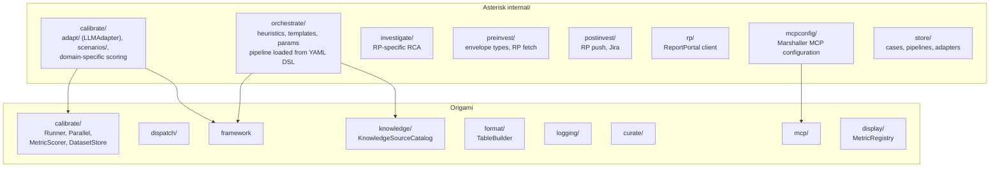

# Contract — deadcode-dedup-architecture

**Status:** complete  
**Goal:** Remove confirmed dead code, catalog deduplication candidates using the Achilles heuristic ("Would Achilles need this?"), and produce a boundary map of domain (Asterisk) vs framework (Origami).  
**Serves:** PoC completion

## Contract rules

- **Achilles heuristic:** If a piece of Asterisk logic would also be needed by Achilles (the second Origami consumer), it is generic and belongs in Origami. If it is RP/RCA-specific, it stays.
- Dead code removal must not break `go build ./...` or `go test ./...`.
- Deduplication candidates are cataloged here but migrated in separate follow-up contracts.

## Context

Asterisk went through a major distillation (`distillation-endgame`) that moved framework packages to Origami. A second pass is needed: some generic patterns (calibration runner, metric scoring, dataset store, display formatting) remain in Asterisk because they were developed during domain work. Now that Achilles exists as a second Origami consumer, the boundary is clearer.

### Current architecture

```mermaid
flowchart TB
    subgraph asterisk [Asterisk internal/]
        calibrate["calibrate/\nrunner, parallel, metrics,\nscore, dialectic, adapt/"]
        orchestrate["orchestrate/\nheuristics, templates,\npipeline_def, params"]
        investigate["investigate/\nRP-specific RCA"]
        preinvest["preinvest/\nenvelope types, RP fetch"]
        postinvest["postinvest/\nRP push, Jira"]
        rp["rp/\nReportPortal client"]
        mcpconfig_pkg["mcpconfig/\nMarshaller MCP config"]
        origami_bridge["origami/\nDatasetStore, mapper,\ncompleteness"]
        display["display/\nmetric names, formatting"]
        store["store/\ncases, pipelines, adapters"]
        scenarios["calibrate/scenarios/\nptp_mock, ptp_real, daemon_mock"]
    end

    subgraph origami [Origami]
        fw["framework\nNode, Edge, Walker, Runner"]
        dispatch["dispatch/\nMuxDispatcher, SignalBus"]
        mcp_fw["mcp/\nPipelineServer"]
        workspace["workspace/\nWorkspace, Repo"]
        format["format/\nTableBuilder"]
        logging["logging/"]
        curate["curate/\nSchema, Dataset"]
    end

    calibrate --> fw
    calibrate --> dispatch
    calibrate --> format
    calibrate --> logging
    mcpconfig_pkg --> mcp_fw
    mcpconfig_pkg --> dispatch
    orchestrate --> fw
    orchestrate --> workspace
    origami_bridge --> curate
```

### Desired architecture

## FSC artifacts

| Artifact | Target | Compartment |
|----------|--------|-------------|
| Boundary map (domain vs framework) | `docs/` | domain |

## Execution strategy

1. **Remove dead code** — delete confirmed dead items, fix stale references.
2. **Produce boundary map** — document what stays vs what moves, with the Achilles heuristic applied.
3. **Catalog dedup candidates** — each candidate gets a priority and a note on whether it becomes its own migration contract.
4. Validate, tune, validate.

## Coverage matrix

| Layer | Applies | Rationale |
|-------|---------|-----------|
| **Unit** | yes | Verify no test breakage after dead code removal |
| **Integration** | no | No cross-boundary changes; code is deleted, not moved |
| **Contract** | no | No API changes |
| **E2E** | no | Stub calibration confirms no regression |
| **Concurrency** | no | No shared state changes |
| **Security** | no | No trust boundaries affected |

## Tasks

### Dead code removal

- [x] Remove dialectic subsystem from `internal/calibrate/` (6 files: runner, hearing, metrics + tests) + dead struct fields (`DialecticConfig`, 5 `CaseResult` fields)
- [x] Fix stale `internal/format` reference in `internal/calibrate/tokimeter_test.go` (lines 146-147)
- [x] Fix stale `internal/curate` references in `CONTRIBUTING.md` and `pipelines/curation.yaml`
- [x] Move `examples/framework/` + `pipelines/*.yaml` to Origami repo — deleted stale copies from Asterisk; `defect-court.yaml` copied to Origami `testdata/`
- [x] Delete `internal/wiring/` + `cmd/run-mock-flow/` — mock flow superseded by calibration pipeline; update Makefile/justfile
- [x] Remove dead framework adapters: `BuildEdgeFactory`, `buildHeuristicMap`, `heuristicEdge`, `transitionToAction` from `internal/orchestrate/framework_adapters.go` — superseded by expression edges in `AsteriskPipelineDef`
- [x] Remove `README.md.post` — stale draft README
- [x] Remove `pipelines/rca-investigation.yaml` — stale duplicate of `asterisk-rca.yaml`

### Renames

- [x] Rename `internal/mcp/` to `internal/mcpconfig/` — clarify it's Marshaller MCP configuration, not a server implementation
- [x] Rename `CursorAdapter` to `LLMAdapter` — adapter dispatches to any LLM, not Cursor-specific; rename file, type, constructor, options, error prefixes, CLI flag values

### DSL extraction

- [x] Extract `AsteriskPipelineDef` from Go struct to `pipelines/asterisk-rca.yaml`; load via `framework.LoadPipeline()`, override vars from `Thresholds`

### Architectural overview

- [x] Produce boundary map document at `.cursor/docs/boundary-map.md` with the Achilles heuristic applied to every `internal/` package

### Deduplication catalog

- [x] Catalog deduplication candidates in the boundary map with migration priority (P1/P2/P3) and follow-up contract references

### Quality gates

- [x] Validate (green) — `go build ./...` and `go test ./...` pass after cleanup round 2
- [x] Tune (blue) — dialectic removal, stale ref fixes, stale file deletion
- [x] Validate (green) — all tests still pass after tuning

## Acceptance criteria

- **Given** the dialectic files are removed, **when** `go build ./...` and `go test ./...` run, **then** all pass with no references to deleted code.
- **Given** the stale `internal/format` and `internal/curate` references are fixed, **when** searching the repo for those strings, **then** no stale references remain.
- **Given** the boundary map is produced, **when** an agent reads it, **then** every `internal/` package is classified as domain (stays) or framework-candidate (moves) with the Achilles heuristic applied.
- **Given** the dedup catalog is complete, **when** an agent reads it, **then** each candidate has a priority (P1/P2/P3) and notes on follow-up contract.

## Security assessment

No trust boundaries affected.

## Notes

2026-02-25 — **Contract complete.** Final task done: deleted `examples/framework/` (3 files) and 3 stale pipeline YAMLs (`curation.yaml`, `defect-dialectic.yaml`, `defect-court.yaml`) from Asterisk. Copied `defect-court.yaml` to Origami `testdata/` (the others already existed in Origami). Updated `README.md` and `CONTRIBUTING.md`. Only `pipelines/asterisk-rca.yaml` (domain-specific) remains.

2026-02-25 — Cleanup round 3 executed. Dialectic subsystem removed (6 files + dead struct fields), stale references fixed, stale files deleted. Boundary map and dedup catalog produced.

2026-02-25 — Cleanup round 2 executed. Deep codebase re-scan findings:
- **Additional dead code:** `BuildEdgeFactory` + `heuristicEdge` (superseded by expression edges), `internal/wiring/` + `cmd/run-mock-flow/` (superseded by calibration pipeline), `README.md.post` (stale draft).
- **Renames:** `internal/mcp/` → `internal/mcpconfig/` (clarity: it's Marshaller config, not a server). `CursorAdapter` → `LLMAdapter` (dispatches to any LLM via Dispatcher, not Cursor-specific).
- **DSL extraction:** `AsteriskPipelineDef` Go struct → `pipelines/asterisk-rca.yaml` loaded via `framework.LoadPipeline()`. Eliminates 70+ lines of Go struct construction.
- **Interactive runner observation:** `RunStep`/`SaveArtifactAndAdvance` in `orchestrate/runner.go` is the original file-based interactive flow (`asterisk cursor` + `asterisk save`). The calibration pipeline (`parallel.go` → adapter → dispatcher → MCP) is the actual architecture. The interactive runner reimplements what `framework.Runner.Walk()` does. Candidate for future removal.

2026-02-24 — Contract created from codebase audit. Findings:
- **Dead code:** Dialectic subsystem (4 files), stale format/curate refs, misplaced framework example.
- **Dedup candidates (Achilles heuristic YES):** Generic calibration runner pattern, metric scoring framework, DatasetStore/FileStore, ground truth schema + completeness, human-readable display formatting.
- **Stays in Asterisk:** investigate, preinvest, postinvest, rp, orchestrate (heuristics/templates), mcpconfig (Marshaller config), scenarios, LLM adapter, store.
- Companion: `origami/knowledge-source-catalog` (separate contract) handles workspace→KnowledgeSourceCatalog rename.
