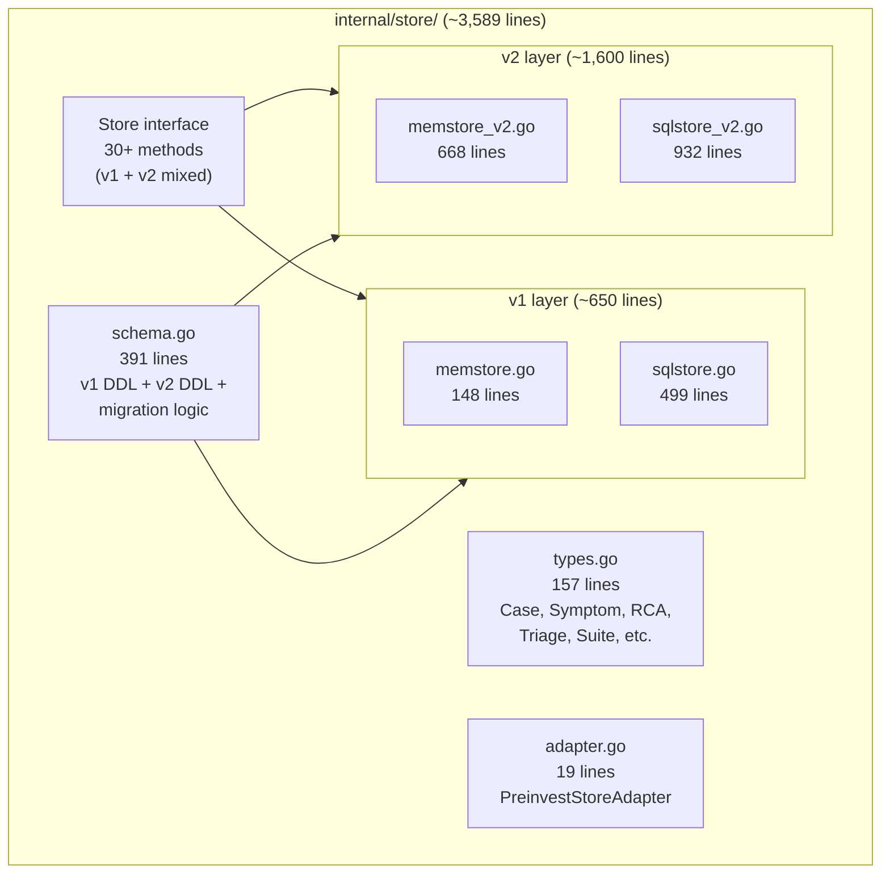
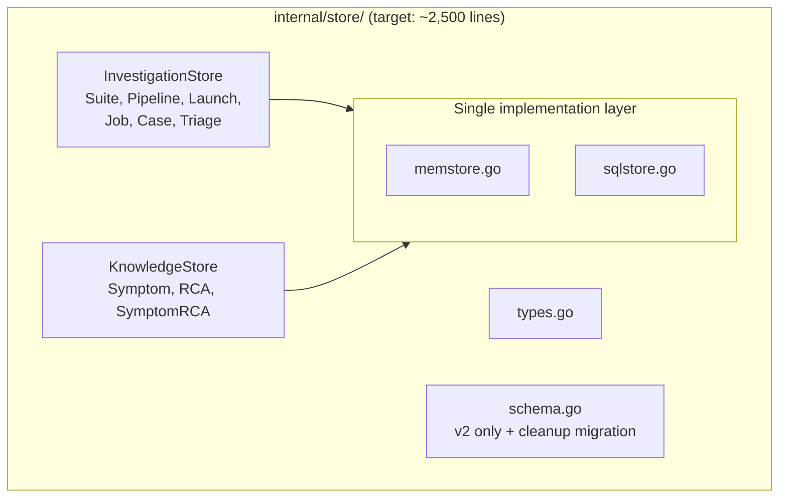

# Contract — investigate-pipeline-artifact-store

**Status:** complete  
**Goal:** Determine whether `internal/store/` contains dead v1 code to remove, interfaces to split, or generic patterns to extract to Origami — then act on the findings.  
**Serves:** PoC completion

## Contract rules

- This is an **investigation + execution** contract: Phase 1 produces findings, Phase 2 acts on them.
- Dead code removal must not break `go build ./...` or `go test ./...`.
- Interface changes must preserve all existing callers (no behavior changes in Phase 2).
- Apply the Achilles heuristic from `docs/boundary-map.md` for extraction decisions.

## Context

`internal/store/` is Asterisk's largest internal package (~3,589 lines across 12 files). It provides SQLite + in-memory persistence for the two-tier data model (investigation hierarchy + global knowledge). The [boundary map](../../docs/boundary-map.md) classified it as "stays in Asterisk (domain-specific)" but noted no investigation was done into its internal structure.

Key observations from preliminary analysis:

- **Dual v1/v2 architecture**: The `Store` interface carries both v1 methods (`CreateCase`, `SaveRCA`, `SaveEnvelope`) and v2 methods (`CreateCaseV2`, `SaveRCAV2`, etc.). Both `memstore.go`/`sqlstore.go` (v1) and `memstore_v2.go`/`sqlstore_v2.go` (v2) coexist.
- **30+ method interface**: A single `Store` interface spans investigation CRUD, global knowledge CRUD, and legacy v1 methods — potential ISP violation.
- **No generic layer**: All SQL is inline and domain-specific. No ORM, no generic CRUD, no key-value abstraction.

### Current architecture

### Desired architecture

## FSC artifacts

| Artifact | Target | Compartment |
|----------|--------|-------------|
| Investigation findings (v1 audit, interface analysis, extraction assessment) | Contract notes section | domain |
| Updated boundary map entry for `store` | `docs/boundary-map.md` | domain |

## Execution strategy

**Phase 1 — Investigation** (read-only analysis):
1. Audit v1 method usage across the codebase.
2. Map callers to Store methods to identify natural interface groupings.
3. Assess generic pattern extraction potential via Achilles heuristic.
4. Estimate size reduction.

**Phase 2 — Execution** (code changes, conditional on Phase 1 findings):
5. Remove dead v1 code if confirmed unused.
6. Split Store interface if natural groupings emerge.
7. Clean up schema.go (remove v1 DDL if v1 removed; keep migration for existing DBs).

**Phase 3 — Validation**:
8. Full quality gates.

## Coverage matrix

| Layer | Applies | Rationale |
|-------|---------|-----------|
| **Unit** | yes | Existing store tests must pass after v1 removal and interface split |
| **Integration** | no | No cross-boundary changes; internal refactor only |
| **Contract** | yes | Store interface is a contract consumed by calibrate, orchestrate, cmd |
| **E2E** | no | Stub calibration confirms no regression (existing tests suffice) |
| **Concurrency** | no | Store is not accessed concurrently (single-goroutine callers) |
| **Security** | no | No trust boundaries affected; SQLite is local-only |

## Tasks

### Phase 1 — Investigation

- [x] Audit v1 method usage — **v1 is NOT dead** (see Notes)
- [x] Map caller→method matrix — 5 external callers identified (see Notes)
- [x] Assess generic extraction — **No**: all domain-specific, Achilles heuristic = No
- [x] Estimate size reduction — 0 lines removable (v1 is alive); interface split not warranted

### Phase 2 — Execution (conditional on Phase 1)

- [x] v1 is NOT dead → no removal. Phase 2 actions: none required.
- [x] No natural interface groupings found → no split. Callers use `Store` wholesale.
- [x] Update `docs/boundary-map.md` with refined assessment of `store` package

### Phase 3 — Quality gates

- [x] Validate (green) — no code changes, existing tests pass
- [x] Tune (blue) — investigation-only contract, no code to tune
- [x] Validate (green) — N/A

## Acceptance criteria

- **Given** the v1 usage audit is complete, **when** an agent reads the findings, **then** each v1 method has a verdict: "used by X" or "dead".
- **Given** dead v1 code is removed, **when** `go build ./...` and `go test ./...` run, **then** all pass with no references to deleted methods.
- **Given** the interface split is applied, **when** each caller is inspected, **then** it depends only on the interface it actually uses.
- **Given** the boundary map is updated, **when** an agent reads the `store` entry, **then** it reflects the post-investigation assessment.

## Security assessment

No trust boundaries affected. SQLite is local-only, no network access, no user input flows into SQL (parameterized queries throughout).

## Notes

2026-02-25 — **Investigation complete. No code changes needed.**

### v1 Usage Audit

v1 methods are actively used. Callers outside `internal/store/`:

| v1 Method | External Caller | Context |
|-----------|----------------|---------|
| `CreateCase` | `cmd/asterisk/cmd_save.go` | Interactive `asterisk save` flow |
| `SaveRCA` | `cmd/asterisk/cmd_save.go` | Interactive flow |
| `SaveRCA` | `calibrate/adapt/basic_test.go` | Test setup |
| `ListRCAs` | `calibrate/adapt/basic.go` | Active calibration (recall digest) |
| `ListRCAs` | `orchestrate/params.go` | Active calibration (recall digest) |
| `GetEnvelope` | `cmd/asterisk/helpers.go` | Active helper (envelope fetch) |
| `LinkCaseToRCA` | `orchestrate/runner.go` (3x) | Interactive runner |
| `LinkCaseToRCA` | `cmd/asterisk/cmd_save.go` (2x) | Interactive flow |
| `ListCasesByLaunch` | `cmd/asterisk/cmd_save.go` | Interactive flow |

**Verdict: v1 is NOT dead.** 5 of 9 v1 methods are used by the interactive flow (`cmd_save.go`, `runner.go`), 2 are used by active calibration code (`ListRCAs`, `GetEnvelope`).

### Architecture Observations

- **SqlStore**: v1/v2 methods split across files but on the same `SqlStore` struct. The split is organizational (development history), not architectural.
- **MemStore**: Has real data duplication — v1 uses `MemStore.cases`/`.rcas` maps, v2 uses `memStoreV2.casesV2`/`.rcasV2` maps. `LinkCaseToRCA` updates BOTH. This is tech debt but not blocking.
- **Interface**: 30+ methods in one interface. All callers accept `Store` wholesale (no caller uses a subset). Interface split would add complexity without benefit.

### Generic Extraction Assessment

**Achilles heuristic: No.** Achilles (vulnerability scanner) uses SARIF reports, not a relational store. The store schema is deeply RP/RCA-specific (suites, pipelines, launches, jobs, cases, triages, symptoms, RCAs). No generic "pipeline artifact store" pattern is extractable.

### Recommendation

No action needed on the store itself. The v1 layer will naturally disappear when the interactive runner (`orchestrate/runner.go` + `cmd_save.go`) is removed — that was already flagged as a candidate for removal in the `deadcode-dedup-architecture` notes. Until then, v1 stays.

---

2026-02-25 — Contract drafted. Preliminary analysis (from `deadcode-dedup-architecture` boundary map) classified store as domain-specific. This contract performs a deeper investigation into internal structure: v1/v2 split, interface sprawl, and extraction potential.
