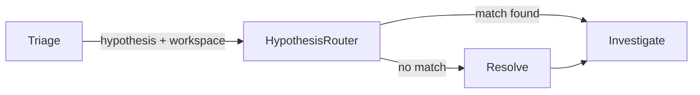

# Contract — M9/M10 Tuning: Four Points of Pain

**Status:** complete  
**Goal:** Lift M9 (Repo Selection Precision) to >= 0.70 and M10 (Repo Selection Recall) to >= 0.80 by replacing AI repo selection with deterministic hypothesis-based routing.  
**Serves:** PoC completion (gate: rp-e2e-launch)

## Contract rules

- Each fix: implement, stub validate, re-run dry calibration (ptp-mock, parallel=4, 4 fast workers), measure delta.
- Do NOT modify ground truth or scoring thresholds.
- Supersedes M9 portion of `m3-m9-tuning.md`. M3 is already fixed (0.83, passing).

## Context

- **Baseline:** ptp-mock dry R6-R8 (2026-02-24): M9 trending 0.60→0.40→0.20, M10 trending 0.75→0.50→0.00
- **Parent contract:** `m3-m9-tuning.md` (M3 complete, M9 prompt-based fix insufficient)
- **Scenario:** ptp-mock (12 cases, 4 symptoms, 3 RCAs, 3 versions)

### Four points of pain

1. **Triage overcounting** — Workers list 2-3 candidate repos instead of 1, preventing the triage-single-repo shortcut from firing. Cases that should be deterministically correct become probabilistic AI decisions.
2. **Resolve overwrites triage** — When Resolve runs unnecessarily, `runner.go:404` zeros out the triage selection and replaces it with the Resolve worker's choice.
3. **Recall miss cascade** — When a case misses recall (M3 failure), it falls through to Triage → Resolve, inflating the number of cases scored for M9/M10.
4. **Repo name ambiguity** — The fast model confuses `ptp-test-framework` (test code) with `linuxptp-daemon-operator` (product code) because both contain the domain keyword "PTP".

### Root cause

The pipeline asks an AI worker to choose repos at the Resolve step. This decision should be deterministic for the common case: triage already outputs `defect_type_hypothesis`, and the workspace repos have a `Purpose` field. The mapping is a lookup, not a judgment call.

### Desired architecture

## FSC artifacts

Code only — no FSC artifacts.

## Execution strategy

1. **Implement `selectRepoByHypothesis`** — helper that maps hypothesis prefix (`pb`, `au`, `en`) to workspace repos by Purpose keywords.
2. **Wire into parallel runner** — after triage, auto-select repos and skip Resolve dispatch when match found. Safety valve: fall through to Resolve if no match.
3. **Add H7b edge** — pipeline graph edge for hypothesis-based repo routing (triage → investigate shortcut).
4. **Unit tests** — classifier function + heuristic evaluation.
5. **Dry calibration** — verify M9 >= 0.70, M10 >= 0.80, M18 decreases.

## Coverage matrix

| Layer | Applies | Rationale |
|-------|---------|-----------|
| **Unit** | yes | `selectRepoByHypothesis` mapping, H7b heuristic evaluation |
| **Integration** | no | No cross-boundary changes |
| **Contract** | no | No API schema changes |
| **E2E** | yes | Dry calibration measures M9/M10 deltas |
| **Concurrency** | no | Repo routing is per-case, not cross-case |
| **Security** | no | No trust boundaries affected |

## Tasks

- [ ] Implement `selectRepoByHypothesis` helper (hypothesis prefix → workspace repos by Purpose keywords)
- [ ] Wire into `parallel.go`: after triage, auto-select repos and skip Resolve dispatch when match found
- [ ] Add H7b edge to `pipeline_def.go` and `heuristics.go` for hypothesis-based repo routing
- [ ] Unit tests for classifier and H7b heuristic
- [ ] Stub calibration: 19/19 pass
- [ ] Dry calibration: M9 >= 0.70, M10 >= 0.80, M18 decreases
- [ ] Update `m3-m9-tuning.md` to note M9 superseded
- [ ] Validate (green) — all tests pass, acceptance criteria met.
- [ ] Tune (blue) — refactor for quality. No behavior changes.
- [ ] Validate (green) — all tests still pass after tuning.

## Acceptance criteria

- **Given** triage produces a `defect_type_hypothesis` and workspace repos have Purpose metadata,
- **When** hypothesis prefix matches a repo Purpose,
- **Then** the Resolve step is skipped and the matching repo is auto-selected.

- **Given** the deterministic routing is active,
- **When** ptp-mock dry calibration runs with parallel=4,
- **Then** M9 >= 0.70 (from 0.20), M10 >= 0.80 (from 0.00).

- **Given** no hypothesis match is found,
- **When** the safety valve fires,
- **Then** the case falls through to Resolve as before.

## Security assessment

No trust boundaries affected.

## Notes

- 2026-02-24 19:30 — **R10: 19/19 PASS.** M9=1.00, M10=1.00, M18=55609, M19=0.83. All acceptance criteria met. The `deploy`/`manifests` exclusion in the classifier fixed the cnf-features-deploy false positive from R9. Zero F2 Resolve dispatches, zero loops. Contract goals achieved.
- 2026-02-24 19:15 — **R9 (first run):** M9=0.62, M10=0.75 — improved but not passing. Root cause: `cnf-features-deploy` Purpose contains "operators" (plural), matching the `pb*` include keyword. Fix: added "deploy" and "manifests" to pb exclude list.
- 2026-02-24 19:00 — Contract created. Supersedes M9 portion of `m3-m9-tuning.md`. Prompt-based M9 fix was insufficient; this contract takes a structural approach via deterministic hypothesis-based repo routing.
