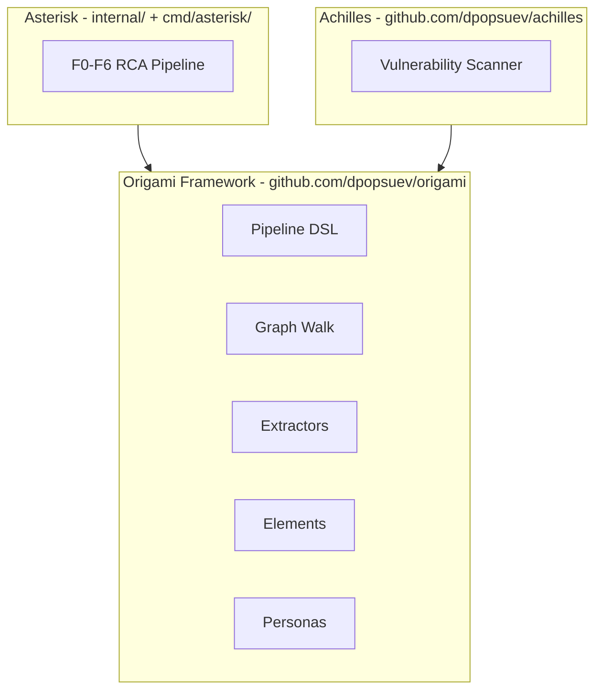

# Contract — asterisk-origami-distillation

**Status:** complete  
**Goal:** Empirically validate the Origami framework boundary by classifying every package and building a second tool (Achilles) with zero domain imports.  
**Serves:** Framework showcase (current goal)

## Contract rules

Global rules only, plus:

- **Zero internal/ imports in Achilles.** `github.com/dpopsuev/achilles` must compile using only `github.com/dpopsuev/origami` and stdlib. This is the litmus test.
- **Distillation manifest is a living document.** Updated as packages are promoted or new tools are added.

## Context

- `docs/distillation-manifest.md` — Package classification, dependency graph, boundary validation results.
- `docs/framework-guide.md` — Developer guide with reference implementations.
- `contracts/active/origami-agentic-network-framework.md` — Origami identity and Extractor primitive (prerequisite).
- `pipelines/achilles.yaml` — Second Origami pipeline definition (in Achilles repo).

### Current architecture

Single domain tool (Asterisk) built on Origami. No empirical proof that the framework works for other domains.

### Desired architecture

## FSC artifacts

| Artifact | Target | Compartment |
|----------|--------|-------------|
| Distillation manifest | `docs/` | domain |
| Achilles reference in framework guide | `docs/` | domain |
| Updated architecture diagram | `docs/` | domain |

## Execution strategy

Phase 1: Classify every package (framework/domain/promote-candidate) and produce the distillation manifest with Mermaid dependency graph. Phase 2: Build Achilles pipeline (YAML, types, extractors, nodes, edges). Phase 3: Wire CLI and end-to-end execution (govulncheck integration). Phase 4: Validate boundary with `go list -deps` comparison. Phase 5: Contract, indexes, framework guide updates.

## Coverage matrix

| Layer | Applies | Rationale |
|-------|---------|-----------|
| **Unit** | no | Achilles is a demo/reference tool; integration test is the pipeline walk itself |
| **Integration** | yes | End-to-end pipeline walk: scan -> classify -> assess -> report |
| **Contract** | yes | Zero `internal/` imports in `github.com/dpopsuev/achilles` verified by `go list -deps` |
| **E2E** | yes | `achilles scan .` and `achilles scan /tmp/vuln-test2` both succeed |
| **Concurrency** | no | Single walker, sequential pipeline |
| **Security** | yes | Achilles shells out to govulncheck — command injection risk assessed |

## Tasks

### Phase 1 — Distillation Manifest

- [x] Classify every package in the codebase (framework / domain / promote-candidate)
- [x] Build Mermaid dependency graph showing imports between packages
- [x] Identify boundary violations (none found) and promotion candidates
- [x] Create `.cursor/docs/distillation-manifest.md`

### Phase 2 — Achilles Pipeline

- [x] Create `pipelines/achilles.yaml` — 4-node pipeline definition (in Achilles repo)
- [x] Create domain types (Finding, Severity, Assessment) in `github.com/dpopsuev/achilles`
- [x] Create GovulncheckExtractor, ClassifyExtractor in `github.com/dpopsuev/achilles`
- [x] Create scan, classify, assess, report nodes in `github.com/dpopsuev/achilles`
- [x] Create V1-V6 edge evaluation in `github.com/dpopsuev/achilles`

### Phase 3 — Working MVP

- [x] Create CLI with cobra (`achilles scan`, `achilles render`) in `github.com/dpopsuev/achilles`
- [x] Wire end-to-end: govulncheck -> parse -> classify -> assess -> report
- [x] Test on vulnerable repo (12 findings, color output)
- [x] Test on clean repo (shortcut path, zero findings)

### Phase 4 — Boundary Validation

- [x] `go list -deps github.com/dpopsuev/achilles` — zero `internal/` imports confirmed
- [x] Document shared primitives table (16 shared types)
- [x] Update distillation manifest with validation findings

### Phase 5 — Housekeeping

- [x] Create this contract
- [x] Update `contracts/index.mdc`
- [x] Update `contracts/current-goal.mdc`
- [x] Update `docs/framework-guide.md` with Achilles as second reference implementation
- [x] Validate (green) — all tests pass
- [x] Validate — `go build ./...` succeeds

## Acceptance criteria

**Given** the Origami framework in `github.com/dpopsuev/origami`,  
**When** this contract is complete,  
**Then**:
- A distillation manifest classifies every package as framework, domain, or promote-candidate
- Achilles (`github.com/dpopsuev/achilles`) compiles and runs using only `github.com/dpopsuev/origami` imports
- `go list -deps github.com/dpopsuev/achilles` shows zero `internal/` imports
- Achilles produces a security assessment for both vulnerable and clean repos
- The framework guide references both Asterisk and Achilles as reference implementations
- All existing tests pass (`go test ./...`)

## Security assessment

| OWASP | Finding | Mitigation |
|-------|---------|------------|
| A03 Injection | `scanNode` constructs `exec.Command("govulncheck", "-json", "./...")` — repoPath is passed as `cmd.Dir`, not as an argument. No user input in the command string. | `repoPath` is resolved via `filepath.Abs` and validated (must contain `go.mod`). No shell expansion. |
| A10 SSRF | govulncheck fetches from `vuln.go.dev` — no user-controlled URLs | N/A — govulncheck's own URL is hardcoded |

## Notes

2026-02-23 00:15 — Contract complete. All acceptance criteria met. Successor contract: `distillation-endgame.md` (Pillar 1: code migration, Pillar 2: framework evolution).

2026-02-22 23:30 — Repos split: Origami extracted to github.com/dpopsuev/origami, VulnScan renamed to Achilles at github.com/dpopsuev/achilles. Asterisk imports origami as external dependency.

2026-02-22 23:00 — All 5 phases complete. Achilles is a working Go vulnerability scanner built entirely on Origami. Boundary validated: zero `internal/` imports. 16 shared framework primitives. Both shortcut (clean) and full (vulnerable) pipeline paths tested. Distillation manifest created with package classification, dependency graph, and promotion candidates.
