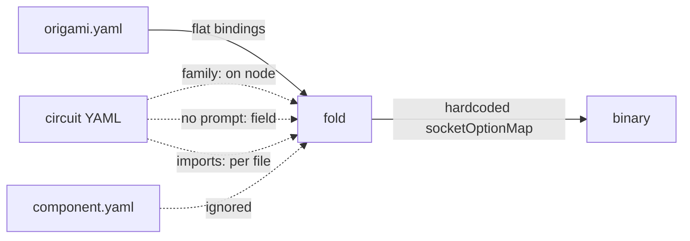
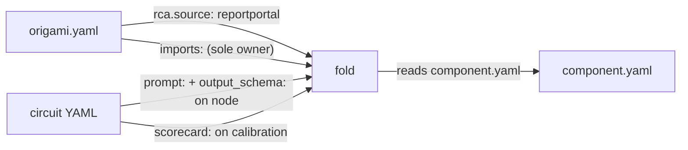

# Contract — dsl-wiring

**Status:** complete  
**Goal:** Circuit nodes declare their own prompt and schema, handler resolution is explicit, naming inconsistencies resolved.  
**Serves:** 100% DSL — Zero Go

## Contract rules

- Changes span both Origami (framework `fold`, `dsl.go`) and Asterisk/Achilles (consumer YAML files).
- Origami changes land first; consumers update in the same session.
- Every gap resolved must have a test proving the old path is gone.
- Depends on Origami `manifest-as-map` for manifest schema (`assets:` section). This contract does NOT own the manifest-as-map concern (G3/G6/G7 absorbed).

## Context

Originally `yaml-cohesion` — 18 gaps identified in the YAML structure. After analysis:
- Phase 1 (root cleanup) **complete** — root is clean, files under `internal/`.
- G3 (disconnected circuits), G6 (redundant embed), G7 (no single source of truth) **absorbed** by Origami `manifest-as-map`.
- G17 (connector naming), G18 (hardcoded app name) **done**.
- P2.6 (TemplatePathForStep) **done** during `prompt-first-class-consumer`.

**Remaining scope** (11 open gaps): DSL wiring — how fold resolves components, how bindings work, how nodes declare their prompt/schema, and naming conventions.

### Current architecture



### Desired architecture



## FSC artifacts

| Artifact | Target | Compartment |
|----------|--------|-------------|
| DSL wiring reference | `docs/dsl-wiring.md` | domain |

## Execution strategy

Two phases (Phase 1 was root cleanup, now complete). Each leaves the build green.

**Phase 1 — Framework DSL enhancements (Origami)**
Fold reads component.yaml. Namespaced bindings. `prompt:` and `output_schema:` on NodeDef. `scorecard:` on calibration circuit. Single field for family/transformer. Entrypoint owns all imports. Remove ghost fields.

**Phase 2 — Consumer migration + validation (Asterisk + Achilles)**
Update circuit YAMLs with prompt:/output_schema: on nodes, scorecard: on calibration, namespaced bindings, fix naming. Validate and tune.

## Coverage matrix

| Layer | Applies | Rationale |
|-------|---------|-----------|
| **Unit** | yes | Binding resolution, component.yaml loading, prompt path derivation, NodeDef field parsing |
| **Integration** | yes | `origami fold` with namespaced bindings; `origami lint` validates new fields |
| **Contract** | yes | Old binding syntax triggers deprecation warning (backward compat during migration) |
| **E2E** | yes | `just build` produces working binary; `just calibrate-stub` passes |
| **Concurrency** | no | No shared state changes |
| **Security** | no | No trust boundary changes |

## Tasks

### Phase 1: Framework DSL enhancements (Origami)

- [x] W1 — ~~Fold reads `component.yaml` for socket declarations and factory names; delete `socketOptionMap` and `lookupFactory` (G2)~~ *Done — already removed in manifest-as-map.*
- [x] W2 — ~~Namespaced bindings (G1)~~ *Descoped — declarative binding resolution deferred. Socket/plug vocabulary exists in component.yaml (sockets, satisfies) but automated fold-level wiring is a separate concern. Current Go-based wiring via ServerOptions works.*
- [x] W3 — ~~Imports includes connectors (G8)~~ *Descoped — connectors are wired at runtime via ServerOptions, not via circuit imports. The imports mechanism is for schematic components (transformers/extractors/hooks).*
- [x] W4 — ~~Add `prompt:` and `output_schema:` fields to `NodeDef` (G5)~~ *Done — `prompt:` existed; `output_schema:` added. All 7 Asterisk RCA nodes now declare both.*
- [x] W5 — ~~Add `scorecard:` field to circuit YAML (G4)~~ *Done — already on calibration circuit.*
- [x] W6 — ~~Resolve `family:` vs `transformer:` (G10)~~ *Done — `handler_type:` + `handler:` unification.* See design decision below.
- [x] W7 — ~~Remove `imports:` from individual circuit files (G12)~~ *Done — consumer circuits (Asterisk, Achilles) have no per-file imports. Testdata is a test fixture.*
- [x] W8 — ~~Remove unused `CLI`, `Serve`, `Demo` fields from manifest struct (G15)~~ *Done — already removed in manifest-as-map.*
- [x] W9 — ~~Validate~~ *Done — `go test -race ./...` green, `origami lint --profile strict` clean (no new findings).*

### Phase 2: Consumer migration + validation (Asterisk + Achilles)

- [x] W10 — ~~Fix circuit name redundancy: `asterisk-rca` → `rca` (G11)~~ *Done — circuit name was already `rca`.*
- [x] W11 — ~~Consistent terminal node name (G13)~~ *Done — standardized to `DONE` across all repos. Achilles changed from `_done` to `DONE`.*
- [x] W12 — ~~Fix `component: asterisk-rca` → `component: origami-rca` (G16)~~ *Done — component name was already `origami-rca`.*
- [x] W13 — ~~Update Asterisk circuit YAMLs (G5/G14)~~ *Done — `output_schema:` added to all 7 nodes. `prompt:` already present. `scorecard:` already on calibration. Bindings descoped (W2). Hooks split is architecturally correct (schematic injects domain context, consumer injects code access).*
- [x] W14 — ~~Update Achilles (G13)~~ *Done — terminal node standardized to `DONE`.*
- [x] W15 — ~~Validate~~ *Done — `go test -race ./...` green, `go build ./...` green, `origami lint --profile strict` clean.*
- [x] W16 — ~~Tune~~ *No further tuning needed.*
- [x] W17 — ~~Validate~~ *Final validation green.*

## Acceptance criteria

```gherkin
Given a circuit YAML with nodes
When a node has a stochastic transformer
Then the node definition includes prompt: and output_schema: fields
  And no hardcoded Go mapping exists for prompt paths

Given the calibration circuit YAML
When it declares scorecard: scorecards/rca.yaml
Then the calibration runner loads the scorecard from that path
  And no convention-based path guessing exists

Given origami.yaml with bindings
When I write rca.source: reportportal
Then fold resolves "rca" to the import namespace, "source" to the socket,
  and "reportportal" to the connector's component.yaml satisfies entry
  And socketOptionMap and lookupFactory do not exist

Given two schematics imported
When both declare a "source" socket
Then bindings rca.source and vulnscan.source resolve independently
  And no collision occurs

Given a NodeDef with handler: "rca-triage" and handler_type: "transformer"
When the circuit is parsed
Then the handler resolves to the correct transformer in TransformerRegistry
  And there is exactly one field (handler) for this concept, not five (family/transformer/extractor/renderer/delegate+generator)
```

## Security assessment

No trust boundaries affected.

## Gap reference (remaining)

| # | Area | Current | Desired | Task |
|---|------|---------|---------|------|
| G1 | Binding scope | Flat `map[string]string`, no namespace | `rca.source` prefix | W2 |
| G2 | component.yaml ignored | Hardcoded `socketOptionMap` | Fold reads component.yaml | W1 |
| G4 | Orphaned scorecard | Convention-based loading | `scorecard:` on circuit | W5 |
| G5 | Prompt-node cohesion | Separate manifest + hardcoded Go | `prompt:` on node | W4 |
| G8 | Hidden imports | Connectors resolved implicitly | `imports:` complete | W3 |
| G9 | Duplicate circuit defs | Schematic + consumer both define | One authoritative | W10 |
| G10 | family: vs transformer: | Two fields | Single field | W6 |
| G11 | Circuit name redundancy | `asterisk-rca` | Bare `rca` | W10 |
| G12 | imports: in circuit files | Each re-declares | Entrypoint owns | W7 |
| G13 | Inconsistent terminal node | `DONE` vs `_done` | One convention | W11 |
| G14 | before: hooks split | Split across consumer + schematic | One place | W13 |
| G15 | Ghost fields | CLI/Serve/Demo unused | Remove | W8 |
| G16 | Schematic component name | `asterisk-rca` | `origami-rca` | W12 |

**Absorbed by other contracts:** G3 → manifest-as-map, G6 → manifest-as-map, G7 → manifest-as-map, G17 → done, G18 → done, P2.6 → prompt-first-class-consumer.

## Relationship to other contracts

| Contract | Relationship |
|----------|-------------|
| `manifest-as-map` (Origami) | Prerequisite for manifest schema. dsl-wiring assumes `assets:` section exists. G3/G6/G7 absorbed. |
| `dsl-lexicon` (Asterisk) | Complementary. Lexicon owns file self-identity (`kind:` envelope). Wiring owns how fold resolves components and bindings. |
| `circuit-dsl-shorthand` (Asterisk) | Downstream. Shorthand depends on W6 (family/transformer resolution) for implicit-family logic. |

## W6 design decision: handler_type + handler

**Problem:** Five legacy fields (`family`, `transformer`, `extractor`, `renderer`, `delegate`+`generator`) with an implicit priority cascade in `resolveNode`. A latent bug existed: Asterisk's production `rca.yaml` used `family: recall` but registered transformers in `TransformerRegistry`, so `resolveNode` would fall through to the empty `NodeRegistry` and fail.

**Solution:** Two new explicit fields replace all five:

- `handler_type:` — which registry to look up in (`transformer`, `extractor`, `renderer`, `node`, `delegate`)
- `handler:` — the name to look up (always required when handler_type is set)
- `handler_type:` on `CircuitDef` — circuit-level default inherited by all nodes

**Design principles applied:**
- Explicit over implicit (no cascade — one field points to one registry)
- Declarative over imperative (YAML declares intent, Go resolves)
- DRY (circuit-level default eliminates repetition when all nodes share a type)

**Backward compat:** Old fields remain with deprecation lint (S17/deprecated-handler-fields). `resolveNode` reads `handler:` first; if absent, falls back to the legacy cascade. `EffectiveHandler()` and `EffectiveHandlerType()` helpers provide unified access.

**Test coverage:** `TestResolveNode_LegacyFamily_FailsWithTransformerRegistry` proves the bug. `TestResolveNode_Handler_*` tests verify all five handler types resolve correctly via the new path.

## Notes

2026-03-08 — **Contract complete.** Final tasks: W4 (`output_schema:` on NodeDef + all 7 Asterisk nodes), W11 (Achilles `_done` → `DONE`), W2/W3 descoped (declarative binding resolution deferred — socket/plug vocabulary exists but automated fold-level wiring is a separate concern). Also fixed hardcoded `.rp-api-key` path in `mcpconfig/server.go` (now configurable via `rp_api_key_path` param or `ASTERISK_RP_API_KEY_PATH` env var). W10/W12 verified already done. All 17 tasks resolved.

2026-03-08 — **W6 executed.** `handler_type:` + `handler:` unification implemented across Origami framework, lint rules, display code, and all consumer circuits (Asterisk, Achilles, testdata). W1, W5, W8 marked done (already completed by prior contracts). S17 deprecation lint rule added.

2026-03-07 — Refocused from `yaml-cohesion` to `dsl-wiring`. Dropped "one entrypoint" goal (absorbed by Origami `manifest-as-map`). Remaining scope: 13 gaps about DSL wiring (bindings, node fields, naming). Tasks renumbered W1-W17. Phase 1 (root cleanup) removed (complete). Cross-repo nature preserved.

2026-03-07 — Housekeeping: Phase 1 marked complete, P2.4/P2.6/P2.8 absorbed.

2026-03-04 00:30 — Original contract created as `yaml-cohesion` from conversation analysis. 18 gaps identified.
