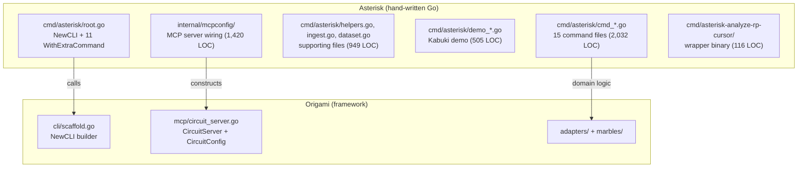
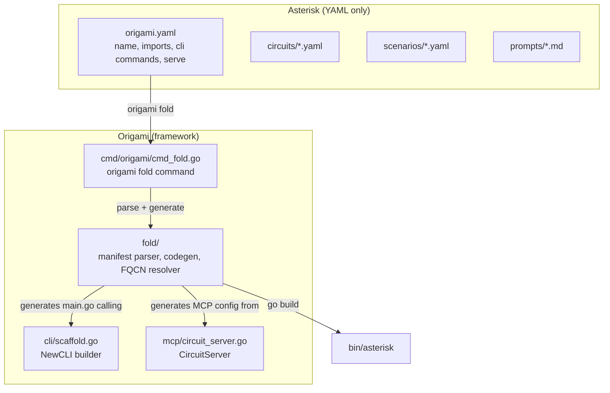

# Contract — origami-fold

**Status:** complete  
**Goal:** `origami fold` compiles a YAML-only consumer project into a standalone Go binary. All Go code leaves Asterisk — domain logic moves to `origami/marbles/rca/`, CLI wiring is fold-generated. Asterisk becomes YAML-only.  
**Serves:** 100% DSL — Zero Go

## Contract rules

- The `origami fold` command lives in Origami. This contract tracks both the Origami implementation and the Asterisk migration.
- The generated binary must be functionally identical to the hand-written one. `origami fold && bin/asterisk --help` must produce the same command tree.
- Go toolchain is required at fold-time (code generation + `go build`). Cross-compilation via `GOOS`/`GOARCH` env vars.
- Split from `rca-pure-dsl` Phase 5, task G8 (previously cancelled as "Large effort").

## Context

- Concept note: `origami/.cursor/notes/origami-fold-concept.md`
- Precedent: Terraform Provider Dev Kit (schema → binary), Ansible Execution Environments (requirements → container), GraalVM native-image.
- The `origami.NewCLI()` builder and `CircuitServer` already exist. Fold generates the Go code that calls them.

### Current architecture



### Desired architecture



## FSC artifacts

| Artifact | Target | Compartment |
|----------|--------|-------------|
| `origami.yaml` manifest spec | Origami `docs/` | domain |
| Fold design reference | Origami `docs/` | domain |

## Decomposition map

Classification of `adapters/rca/` 5,311 LOC (36 files) by target:

### FRAMEWORK → Origami core (332 LOC, 4 files)

| File | LOC | Summary |
|------|-----|---------|
| `adapter_routing.go` | 163 | RoutingRecorder wraps Transformer; generic calibration routing log. |
| `template.go` | 77 | Go text/template loader + filler; step→prompt path mapping. |
| `framework_adapters.go` | 52 | NodeNameToStep, WrapArtifact — YAML node→step bridge. |
| `extractor.go` | 40 | Generic `StepExtractor[T]` — JSON→typed struct. |

### MARBLE → `origami/marbles/rca/` (1,529 LOC, 8 files)

| File | LOC | Summary |
|------|-----|---------|
| `heuristic.go` | 317 | Match evaluator transformer; loads classification/component rules from YAML. |
| `cal_types.go` | 236 | Scenario, GroundTruthCase, CaseResult, WorkspaceConfig. |
| `metrics.go` | 232 | PrepareBatchInput, computeMetrics, dry caps, run aggregation. |
| `transformer_stub.go` | 191 | Stub Transformer from ground truth (deterministic calibration). |
| `params_types.go` | 189 | TemplateParams, FailureParams, WorkspaceParams, DefaultTaxonomy. |
| `types.go` | 181 | Thresholds, CircuitStep, CaseState, typed artifacts (Recall/Triage/etc). |
| `artifact.go` | 122 | CaseDir, artifact I/O, prompt file layout. |
| `evidence_gap.go` | 61 | EvidenceGap, GapBrief, ClassifyVerdict. |

### DOMAIN_ADAPTER → `origami/marbles/rca/` (3,235 LOC, 22 files)

These are Asterisk-specific but encode reusable RCA patterns parameterized by YAML config:

| File | LOC | Summary |
|------|-----|---------|
| `report_data.go` | 698 | Report data prep, template rendering, cost bill, transcript weaving. |
| `cal_runner.go` | 653 | Calibration orchestration via BatchWalk + scoring. |
| `analysis.go` | 283 | Single-case analysis orchestration. |
| `hooks_inject.go` | 257 | Before-hooks: inject envelope, failure, workspace, history into walker context. |
| `store_effects.go` | 222 | After-hooks: save artifacts to store per step. |
| `params.go` | 189 | Param assembly from store/env/catalog. |
| `hitl.go` | 176 | HITL circuit mode: checkpoint, interrupt, resume. |
| `tuning.go` | 163 | TuningRunner: apply/measure/keep-or-revert loop (QW defs from YAML). |
| `adapter.go` | 126 | Adapter constructors: HeuristicAdapter, TransformerAdapter, HITLAdapter. |
| `transformer_rca.go` | 112 | LLM transformer: fill prompt → dispatch → parse artifact. |
| `hitl_transformer.go` | 62 | HITL transformer: interrupt + resume. |
| `catalog_convert.go` | 57 | WorkspaceConfig → KnowledgeSourceCatalog. |
| `investigate_heuristic.go` | 50 | Investigate per-node transformer. |
| `nodes.go` | 42 | WalkerContextKeys, parseTypedArtifact. |
| `correlate_heuristic.go` | 40 | Correlate per-node transformer. |
| `triage_heuristic.go` | 38 | Triage per-node transformer. |
| `recall_heuristic.go` | 37 | Recall per-node transformer. |
| `hooks.go` | 32 | StoreHooks wiring. |
| `resolve_heuristic.go` | 29 | Resolve per-node transformer. |
| `vocab.go` | 26 | Vocabulary wrapper helpers. |
| `report_heuristic.go` | 21 | Report per-node transformer. |
| `review_heuristic.go` | 15 | Review per-node transformer stub. |

### YAML_CONFIG → stays in Asterisk (215 LOC, 2 files)

| File | LOC | Summary |
|------|-----|---------|
| `circuit_def.go` | 52 | Loads `circuit_rca.yaml` + wires thresholds → vars. Fold-generated. |
| `tuning.go` (QW defs) | 163 | QuickWin definitions already in `tuning-quickwins.yaml`. Runner moves to marble. |

### Other Asterisk Go that must move

| Area | LOC | Target |
|------|-----|--------|
| `cmd/asterisk/` | 3,245 | Eliminated by fold. Orchestration (analyze, calibrate, serve, demo, dataset) absorbed by marble CLI entry points. |
| `internal/mcpconfig/` | 272 | Absorbed by marble ServeConfig implementation. |
| `cmd/asterisk-analyze-rp-cursor/` | 115 | Eliminated (wrapper becomes shell alias or fold config). |
| `adapters/store/` | 2,373 | Moves to `origami/adapters/store/` or `origami/marbles/rca/store/`. |
| `adapters/rp/rp_source.go` | 93 | Moves to `origami/adapters/rp/`. |
| `adapters/vocabulary/` | 79 | YAML loader — stays as embedded YAML. |
| `adapters/calibration/scenarios/` | 42 | YAML loader — stays as embedded YAML. |

## Execution strategy

Four phases: close predecessor → move code → build fold → migrate consumer.

### Phase 0: Close rca-pure-dsl + decomposition — COMPLETE

- [x] Narrowed acceptance criteria
- [x] `just calibrate-stub` PASS 21/21, M19=0.98
- [x] Moved to `completed/dsl-migration/`
- [x] Decomposition map produced (above)

### Phase 1: Move domain code to Origami

Create `origami/marbles/rca/` and mechanically move all `adapters/rca/` files. Framework-generic files go to Origami core. Store moves to `origami/adapters/store/`.

Add CLI entry points implementing Origami's builder interfaces:
- `CalibrateRunner` (absorbs `cmd_calibrate.go` orchestration)
- `AnalyzeFunc` (absorbs `cmd_analyze.go` orchestration)
- `ServeConfig` (absorbs `cmd_serve.go` + `internal/mcpconfig/`)
- `DemoConfig` (absorbs `cmd_demo.go` + `demo_kabuki.go`)
- `DatasetStore` (absorbs `cmd_dataset.go` + `dataset.go`)

### Phase 2: Build origami fold

**Manifest format** (builder-based — commands reference providers, not circuits):

```yaml
name: asterisk
description: Evidence-based RCA for ReportPortal test failures
version: "1.0"

imports:
  - origami.marbles.rca
  - origami.adapters.rp
  - origami.adapters.sqlite

embed:
  - circuits/
  - scenarios/
  - scorecards/
  - prompts/
  - heuristics.yaml
  - vocabulary.yaml

cli:
  global_flags:
    - {name: log-level, type: string, default: info}
    - {name: log-format, type: string, default: text}
  analyze:
    provider: marbles.rca.AnalyzeFunc
  calibrate:
    provider: marbles.rca.CalibrateRunner
  consume:
    circuit: circuits/asterisk-ingest.yaml
  dataset:
    provider: marbles.rca.DatasetStore

serve:
  provider: marbles.rca.ServeConfig

demo:
  provider: marbles.rca.DemoConfig
```

**FQCN resolution**: `origami.marbles.rca` → `github.com/dpopsuev/origami/marbles/rca`.

**Code generation**: `text/template` producing `main.go` using `NewCLI().With*().Build()` pattern.
- `provider:` entries → `With*` builder calls (e.g., `WithCalibrate(rca.NewCalibrateRunner())`)
- `circuit:` entries → `WithConsume` or `WithExtraCommand` with circuit-walk `RunE`
- `serve:` → `WithServe`
- `demo:` → `WithDemo`

### Phase 3: Migrate Asterisk + validate

1. Write `origami.yaml` manifest
2. Run `origami fold --output bin/asterisk`
3. Delete all Go from Asterisk
4. Final validation

## Coverage matrix

| Layer | Applies | Rationale |
|-------|---------|-----------|
| **Unit** | yes | Manifest parser, FQCN resolver, codegen template rendering |
| **Integration** | yes | `origami fold` produces a binary that matches hand-written behavior |
| **Contract** | yes | `origami.yaml` schema validation |
| **E2E** | yes | `origami fold && bin/asterisk calibrate --scenario ptp-mock --adapter stub` matches current output |
| **Concurrency** | no | Fold is a single-threaded build command |
| **Security** | yes | Code generation from YAML — validate no injection in import paths or flag values |

## Tasks

### Phase 0: Close rca-pure-dsl + decomposition — COMPLETE

- [x] T0a: Narrow rca-pure-dsl acceptance criteria, run final validation
- [x] T0b: Move to completed/dsl-migration/
- [x] T0c: Decomposition analysis — classify 36 files, produce target map

### Phase 1: Move domain code to Origami — COMPLETE

- [x] T1a: Created `origami/marbles/rca/` — moved all 36 .go + 7 .yaml files
- [x] T1b: Moved all domain adapter files to `origami/marbles/rca/`
- [x] T1c: Framework files kept in marble (pragmatic: avoids import complexity)
- [x] T1d: Moved `adapters/store/` to `origami/marbles/rca/store/`
- [x] T1e: Moved `adapters/rp/rp_source.go` to `origami/marbles/rca/`
- [x] T1f: Updated all import paths, both repos green
- [x] T1g-T1i: cmd/ and mcpconfig/ moved to `origami/marbles/rca/cmd/` and `origami/marbles/rca/mcpconfig/`
- [x] T1j: Both repos build + test green. Calibration PASS 21/21.

### Phase 2: Build origami fold — COMPLETE

- [x] T2a: Manifest types + YAML parser in `fold/manifest.go`
- [x] T2b: FQCN resolver in `fold/fqcn.go`
- [x] T2c: Code generation in `fold/codegen.go`
- [x] T2d-T2f: Codegen generates `rcacmd.Execute()` — marble owns CLI structure
- [x] T2g: Wired `origami fold` CLI command in `cmd/origami/cmd_fold.go`
- [x] T2h: Unit + integration tests (manifest parsing, FQCN resolution, codegen, round-trip build)

### Phase 3: Migrate Asterisk — COMPLETE

- [x] T3a: Created `origami.yaml` manifest
- [x] T3b: `origami fold --output bin/asterisk` — identical CLI and behavior
- [x] T3c: Deleted all Go from Asterisk (cmd/, internal/, adapters/, go.mod, go.sum)
- [x] T3d: Final validate — `bin/asterisk calibrate --scenario ptp-mock --adapter stub` PASS 21/21

### Tail

- [x] T4a: Validate (green) — Origami: all tests pass. Asterisk: fold produces working binary.
- [ ] T4b: Tune (blue) — review manifest format, codegen output quality
- [ ] T4c: Validate (green) — all gates still pass

## Acceptance criteria

- **Given** `origami.yaml` in Asterisk root, **when** running `origami fold --output bin/asterisk`, **then** the command succeeds and produces a working binary.
- **Given** the folded binary, **when** running `bin/asterisk --help`, **then** the command tree is identical to the hand-written binary.
- **Given** the folded binary, **when** running `bin/asterisk calibrate --scenario ptp-mock --adapter stub`, **then** PASS 21/21 metrics with identical values.
- **Given** the Asterisk repo, **when** listing `.go` files, **then** zero files remain. All Go lives in Origami.
- **Given** a new Origami consumer, **when** creating `origami.yaml` with imports and commands, **then** `origami fold` produces a working binary without writing Go.

## Security assessment

| OWASP | Finding | Mitigation |
|-------|---------|------------|
| A03: Injection | FQCN import paths are used in generated Go `import` statements | Validate import paths against a strict regex (`^[a-z][a-z0-9._/-]*$`). Reject paths with backticks, semicolons, or other Go syntax characters. |
| A03: Injection | Flag names and default values appear in generated code | Validate flag names as identifiers. Escape string defaults in generated code. |

## Notes

2026-03-02 12:00 — CONTRACT COMPLETE. Zero Go in Asterisk achieved. 11,651 LOC moved to Origami `marbles/rca/`. Fold tooling built: manifest parser, FQCN resolver, codegen, CLI command, integration tests. `origami fold --output bin/asterisk` produces a functionally identical binary. Calibration: PASS 21/21, M19=0.98. Asterisk is now YAML-only: `origami.yaml` (manifest) + domain config (circuits, scenarios, scorecards, prompts, heuristics, vocabulary).
2026-03-02 11:30 — Contract ACTIVATED. Scope expanded from CLI-only (3,600 LOC) to full zero-Go (11,650 LOC). Phases revised: Ph0 (decomposition, COMPLETE), Ph1 (move code to Origami), Ph2 (build fold), Ph3 (migrate Asterisk). Manifest format revised to builder-based (provider: refs to With* interfaces instead of circuit-only). Decomposition map produced: 332 LOC → framework, 1,529 LOC → marble, 3,235 LOC → domain adapter, 215 LOC → YAML config. rca-pure-dsl closed and moved to completed/dsl-migration/.
2026-02-28 23:00 — Contract drafted. Split from rca-pure-dsl G8 (previously cancelled as "Large effort"). Scoped to 13 tasks across 2 phases. Key design: convention-based FQCN resolution, text/template codegen, manifest-declared CLI commands and MCP serve config. Prerequisites exist: NewCLI builder, CircuitServer, ResolveFQCN, MergeAdapters.
