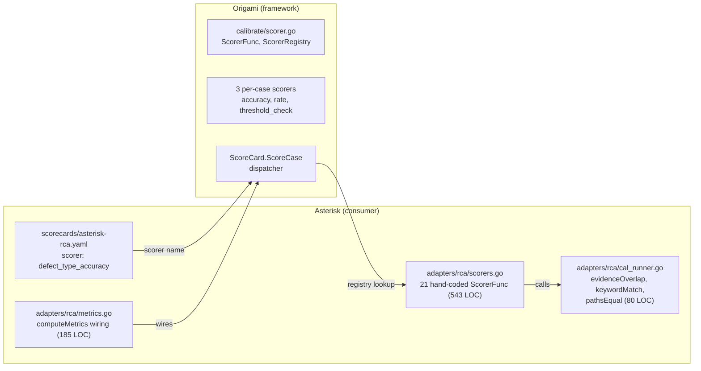
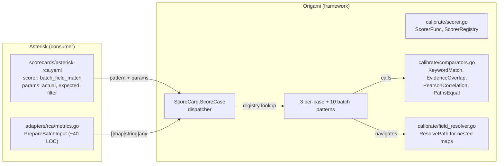

# Contract — scorer-pattern

**Status:** complete  
**Goal:** All 21 Asterisk RCA metrics are expressed as YAML scorer declarations in the scorecard — zero Go scorer implementations remain in Asterisk.  
**Serves:** 100% DSL — Zero Go

## Contract rules

- Any scorer that cannot be expressed via a framework batch pattern is a missing Origami primitive — file it, implement it, then delete the Go.
- Comparison primitives (keyword match, set overlap, correlation) belong in Origami's `calibrate/` package — they are domain-agnostic.
- Asterisk retains only a thin `PrepareBatchInput` helper (~40 LOC) to convert typed structs to `[]map[string]any`. This is data marshalling, not domain logic.
- Split from `rca-pure-dsl` Phase 3, task G5 (scorer registry + evaluation engine).

## Context

Phase 1 of rca-pure-dsl identified G5 (scorer registry + evaluation engine) as a framework gap. Deconstruction showed all 21 scorers decompose into exactly 10 generic patterns. The algorithm (iterate batch, compare fields, aggregate) is generic. The domain knowledge is field paths — declarable in YAML.

### Current architecture

### Desired architecture

## FSC artifacts

| Artifact | Target | Compartment |
|----------|--------|-------------|
| Batch scorer pattern catalog (10 patterns) | Origami `docs/` | domain |

## Execution strategy

Bottom-up: build the Origami primitives first, then migrate Asterisk's scorers to YAML declarations.

### Pattern decomposition

All 21 scorers decompose into 10 parameterized patterns:

| Pattern | Metrics | Logic |
|---------|---------|-------|
| `batch_field_match` | M1, M2, M15, M16 | Compare actual field == expected field per case. Return correct/total. |
| `batch_bool_rate` | M3, M4, M6, M7 | Filter by ground truth flag, count actual bool matches. Return ratio. |
| `batch_set_precision` | M9, M13 | Set overlap: relevant_selected / total_selected, averaged or summed. |
| `batch_set_recall` | M10, M12 | Set overlap: relevant_selected / total_relevant, averaged or summed. |
| `batch_set_exclusion` | M11 | 1 - (cases with excluded items / total cases). |
| `batch_keyword_score` | M14, M14b | Keyword match in text field. Average score. |
| `batch_correlation` | M8 | Pearson correlation between two numeric fields. |
| `batch_sum_ratio` | M17 | Sum actual / sum expected across batch. |
| `batch_field_sum` | M18 | Sum a numeric field with optional fallback. |
| `batch_group_linkage` | M5 | Group by key, check all in group share same actual value. |

### Data model

Batch scorers receive:
- `caseResult` = `[]map[string]any` (batch of merged result + ground truth items)
- `groundTruth` = `map[string]any` (batch-level context: workspace repos, etc.)
- `params` = per-metric config from scorecard YAML

This fits the existing `ScorerFunc(caseResult, groundTruth any, params map[string]any)` signature without changes.

### LOC impact

- Asterisk: **-700 LOC** (scorers.go deleted, metrics.go trimmed, helpers moved)
- Origami: **+500 LOC** (10 patterns + comparators + field resolver + tests)

## Coverage matrix

| Layer | Applies | Rationale |
|-------|---------|-----------|
| **Unit** | yes | Each batch scorer pattern tested independently with synthetic data |
| **Integration** | yes | `just calibrate-stub` before/after comparison |
| **Contract** | yes | Scorecard YAML params validated by schema |
| **E2E** | yes | Metric values identical before/after migration |
| **Concurrency** | no | Scoring is single-threaded batch processing |
| **Security** | no | No trust boundaries — scores computed from local data |

## Tasks

### Origami: framework primitives

- [ ] T1: Move comparison primitives to `calibrate/comparators.go` — `KeywordMatch`, `EvidenceOverlap`, `PathsEqual`, `SmokingGunWords`, `PearsonCorrelation`
- [ ] T2: Add field path resolver to `calibrate/field_resolver.go` — `ResolvePath(m map[string]any, path string) (any, bool)`
- [ ] T3: Implement `batch_field_match` and `batch_bool_rate` patterns (M1-M4, M6-M7, M15-M16)
- [ ] T4: Implement `batch_set_precision`, `batch_set_recall`, `batch_set_exclusion` patterns (M9-M13)
- [ ] T5: Implement `batch_keyword_score` and `batch_correlation` patterns (M8, M14, M14b)
- [ ] T6: Implement `batch_sum_ratio`, `batch_field_sum`, `batch_group_linkage` patterns (M5, M17-M18)

### Asterisk: migration

- [ ] T7: Update `scorecards/asterisk-rca.yaml` — replace custom scorer names with batch pattern names + params
- [ ] T8: Add `PrepareBatchInput` helper in `metrics.go` — convert typed structs to maps for framework scoring
- [ ] T9: Delete `scorers.go` + trim `metrics.go` + remove moved helpers from `cal_runner.go`

### Tail

- [ ] T10: Validate (green) — `go build`, `go test`, `just calibrate-stub`
- [ ] T11: Tune (blue) — review YAML scorecard for consistency
- [ ] T12: Validate (green) — all gates still pass

## Acceptance criteria

- **Given** `scorecards/asterisk-rca.yaml`, **when** listing scorer names, **then** all use framework batch patterns — zero custom scorer registrations.
- **Given** `just calibrate-stub`, **when** run before and after, **then** all 21 metric values are identical.
- **Given** a new Origami consumer (e.g., Achilles), **when** defining a scorecard, **then** all batch patterns are available without writing Go scorers.
- **Given** `adapters/rca/scorers.go`, **when** listing after this contract, **then** the file does not exist.

## Security assessment

No trust boundaries affected. Scores computed from local data.

## Notes

2026-02-28 22:00 — Contract drafted. Split from rca-pure-dsl Phase 3 (G5 scorer gap). All 21 scorers decomposed into 10 generic batch patterns. Comparison primitives (evidenceOverlap, keywordMatch, pathsEqual, smokingGunWords, pearsonCorrelation) identified as framework-level code. Field path resolver needed for nested map navigation.
