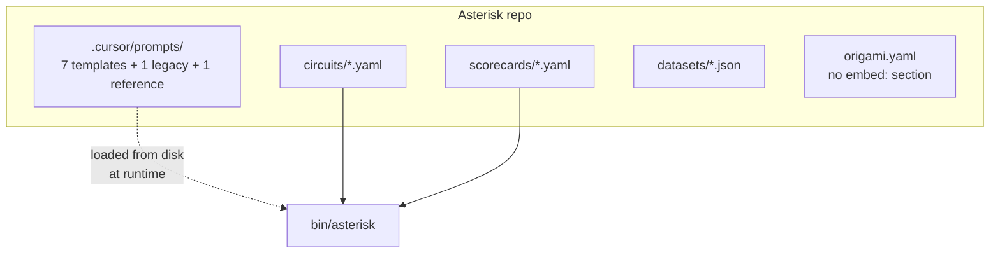

# Contract — prompt-first-class-consumer

**Status:** complete
**Goal:** Prompt templates are source artifacts at repo root with machine-readable metric mapping.
**Serves:** 100% DSL — Zero Go

## Contract rules

- Companion contract: Origami `prompt-first-class` (provides embed, validation, lint infrastructure).
- Clean break: `.cursor/prompts/` is deleted entirely, no symlink or redirect.
- Completed contracts (historical) are left as-is — they describe what was true at the time.
- Depends on Origami `prompt-first-class` Phase 1 (embed support) for full binary integration.

## Context

- Prompts currently in `.cursor/prompts/` — a knowledge-store path, not a source path.
- No prompt-to-metric mapping — the link between changing a template and its affected metrics is tribal knowledge.
- `origami.yaml` manifest has no `embed:` section — prompts aren't declared as build artifacts.
- `knowledge-store.mdc` (always-applied rule) lists `prompts/` as a `.cursor/` subdirectory.
- 15 files across docs, notes, and contracts reference `.cursor/prompts/` (completed contracts are historical, left as-is).

### Current architecture



### Desired architecture


## FSC artifacts

| Artifact | Target | Compartment |
|----------|--------|-------------|
| Prompt-to-metric mapping | `prompts/manifest.yaml` | domain (repo root) |
| Updated prompt workflow docs | `docs/prompts.mdc` | domain |

## Execution strategy

Two phases, each validated by inspection:

1. **Move + manifest** — Relocate templates from `.cursor/prompts/` to `prompts/`, create `manifest.yaml`, delete `.cursor/prompts/`.
2. **Update references** — Update `origami.yaml`, `knowledge-store.mdc`, docs, notes, indexes.

## Coverage matrix

| Layer | Applies | Rationale |
|-------|---------|-----------|
| **Unit** | no | Zero Go in Asterisk. Validation is tested in Origami companion contract. |
| **Integration** | no | Binary integration tested after `origami fold` rebuild. |
| **Contract** | yes | `manifest.yaml` is the contract between prompt files and metrics. Validated by schema. |
| **E2E** | no | Prompt rendering tested via calibration in Origami. |
| **Concurrency** | no | No concurrent access patterns. |
| **Security** | no | No trust boundaries affected. |

## Tasks

- [x] T1: Move prompts to `prompts/` — Relocate from `.cursor/prompts/` to `prompts/` at repo root. Delete `.cursor/prompts/` entirely (clean break). Maintain subdirectory structure (`recall/`, `triage/`, `resolve/`, `investigate/`, `correlate/`, `review/`, `report/`). Drop `rca.md` (legacy v1, unused by any circuit step). Keep `review/gap-analysis.md` (referenced by F3 output format, not a template itself).
- [x] T2: Create `prompts/manifest.yaml` — Prompt-to-metric mapping with `families:` (templates) and `references:` (static docs) sections:

```yaml
families:
  - step: F0_RECALL
    template: recall/judge-similarity.md
    affected_metrics: [M3, M4]
    output_schema: recall-result.json
  - step: F1_TRIAGE
    template: triage/classify-symptoms.md
    affected_metrics: [M2, M6, M7]
    output_schema: triage-result.json
  - step: F2_RESOLVE
    template: resolve/select-repo.md
    affected_metrics: [M9, M10, M11]
    output_schema: resolve-result.json
  - step: F3_INVESTIGATE
    template: investigate/deep-rca.md
    affected_metrics: [M1, M8, M12, M13, M14, M14b, M15]
    output_schema: artifact.json
  - step: F4_CORRELATE
    template: correlate/match-cases.md
    affected_metrics: [M5]
    output_schema: correlate-result.json
  - step: F5_REVIEW
    template: review/present-findings.md
    affected_metrics: [M16]
    output_schema: review-decision.json
  - step: F6_REPORT
    template: report/regression-table.md
    affected_metrics: []
    output_schema: jira-draft.json

references:
  - path: review/gap-analysis.md
    referenced_by: [F3_INVESTIGATE]
    purpose: "Evidence gap categories and output format for gap_brief field"
```

- [x] T3: Update `origami.yaml` — Add `embed: [prompts/]` to the manifest.
- [x] T4: Update `knowledge-store.mdc` — Remove `| prompts/ | RCA prompt templates (file-based) |` row from the `.cursor/` directory layout table. Prompts are now source artifacts at repo root, not knowledge-store artifacts.
- [x] T5: Update docs and indexes — Update `.cursor/docs/prompts.mdc` to point at `prompts/` as the canonical location. Remove `.cursor/prompts/index.mdc`. Update cross-references in `.cursor/docs/index.mdc`, `.cursor/notes/ci-analysis-flow.mdc`, `.cursor/notes/pre-dev-decisions.mdc`, `.cursor/docs/cursor-handoff.mdc`. Completed contracts (historical) left as-is.
- [x] Validate (green) — `prompts/` at repo root contains all 7 templates + 1 reference file + manifest. `.cursor/prompts/` is gone. All live docs point to new location.
- [x] Tune (blue) — refactor for quality. No behavior changes.
- [x] Validate (green) — all acceptance criteria still met after tuning.

## Acceptance criteria

- **Given** the Asterisk repo, **When** an agent reads `prompts/manifest.yaml`, **Then** it can determine which metrics are affected by changing a given template.
- **Given** `origami.yaml` with `embed: [prompts/]`, **When** `origami fold` runs, **Then** prompt templates are bundled into the binary.
- **Given** `prompts/` at repo root, **When** `origami lint --profile strict` runs against a circuit, **Then** it validates prompt templates from the canonical location.
- **Given** `knowledge-store.mdc`, **When** an agent reads the directory layout, **Then** `prompts/` does not appear as a `.cursor/` subdirectory.
- **Given** `.cursor/prompts/`, **When** listing the directory, **Then** it does not exist (clean break).

## Security assessment

No trust boundaries affected.

## Notes

2026-03-01 — Contract drafted. Companion: Origami `prompt-first-class`.
2026-03-03 — Complete. All 7 templates + 1 reference moved to `prompts/` at repo root. `manifest.yaml` created with step-to-metric mapping. `origami.yaml` updated with `embed: [prompts/]`. `.cursor/prompts/` deleted (clean break). `rca.md` (legacy v1) dropped. All live docs, indexes, and knowledge-store updated to point at new location. Completed contracts (historical) left as-is.
