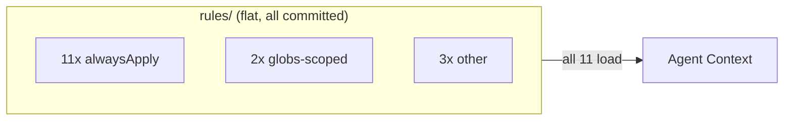
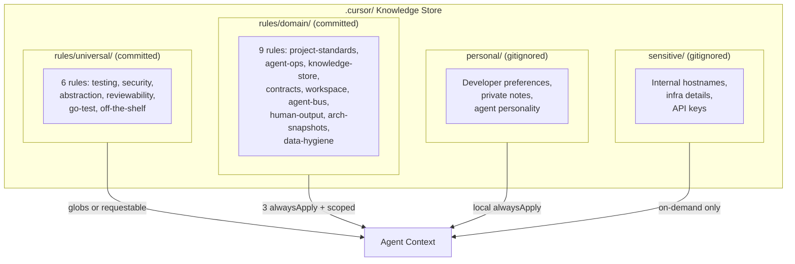

# Contract — FSC Knowledge Compartmentalization

**Status:** complete  
**Goal:** The `.cursor/` knowledge store is divided into four compartments (universal, domain, personal, sensitive) with tiered rule routing that reduces always-applied context from 11 rules to 3, enables multi-team collaboration, and prevents future data-swipe incidents.  
**Serves:** PoC completion

## Contract rules

- Migration is non-destructive: `git mv` preserves history; no content is lost.
- Personal and sensitive compartments are gitignored — they never enter version control.
- Existing rule behavior is preserved: the same constraints apply, only the loading strategy changes.
- The `alwaysApply` count must drop from 11 to 3. All other rules get scoped or agent-requestable routing.

## Current Architecture

Flat, undivided knowledge store. All rules in one `rules/` directory. 11 of 16 rules `alwaysApply: true`, all loading into every conversation.

## Desired Architecture

Four compartments with tiered routing. Only 3 rules always-apply; the rest load when relevant.

## Context

- `rules/knowledge-store.mdc` — current persistence protocol, no compartment model.
- `rules/data-hygiene.mdc` — placeholder enforcement, pre-commit hook. Motivated by the data-swipe incident (72 commits rewritten).
- `.gitignore` — currently ignores `.dev/`, `.cursor/mcp.json`, `.jira/`, `.rp-api-key`, `.env`. Does not ignore `.cursor/personal/` or `.cursor/sensitive/`.
- Rule frontmatter survey: 11 `alwaysApply: true`, 2 `globs`-scoped (`**/*.go`), 1 description-only, 2 no frontmatter.

## Execution strategy

1. Write contract (this file).
2. Create directory structure and gitignore entries.
3. Move rules into compartments via `git mv`.
4. Update frontmatter for tiered routing.
5. Update knowledge-store.mdc to document the compartment model.
6. Seed personal/ and sensitive/ with READMEs.
7. Update all indexes.

## Tasks

- [x] Write this contract
- [x] Create directories: `rules/universal/`, `rules/domain/`, `personal/`, `sensitive/`
- [x] Update `.gitignore` for `personal/` and `sensitive/`
- [x] Move universal rules (6) to `rules/universal/`
- [x] Move domain rules (9) to `rules/domain/`
- [x] Update frontmatter: 3 `alwaysApply`, 4 globs-scoped, 3 knowledge-store-scoped, 5 agent-requestable
- [x] Update `knowledge-store.mdc` with compartment model documentation
- [x] Seed `personal/README.md` and `sensitive/README.md`
- [x] Copy `.dev/data-swipe-patterns.txt` to `sensitive/` (consolidated; original kept for pre-commit hook)
- [x] Update `rules/index.mdc` with new structure
- [x] Update `contracts/index.mdc` and `current-goal.mdc`
- [x] Validate — 15 rules (6 universal + 9 domain), 3 alwaysApply, gitignore works, build + tests pass
- [x] Tune — routing decisions validated: 7 globs patterns verified reasonable, 3 alwaysApply confirmed as core domain rules
- [x] Validate — 21/21 checks pass: 6 universal + 9 domain, 3 alwaysApply, gitignore works, frontmatter correct, build + tests pass

## Acceptance criteria

- **Given** a developer working on a Go test file,
- **When** the agent loads rules,
- **Then** it gets 3 always-applied + relevant globs-scoped rules (testing, go-test, off-the-shelf, abstraction) — not the full 11.

- **Given** a new team member cloning the repo,
- **When** they create `.cursor/personal/preferences.mdc`,
- **Then** it is gitignored and does not appear in `git status`.

- **Given** a developer adding an internal hostname to a note,
- **When** they save it in `.cursor/sensitive/infra-details.md`,
- **Then** it is gitignored, never committed, and `data-hygiene.mdc` does not flag it.

- **Given** the migration is complete,
- **When** `git log --stat` is reviewed,
- **Then** all rule files show as renames (not delete+create) preserving history.

## Notes

- 2026-02-19 02:30 — Contract created. 4 compartments: universal (committed, generic IT), domain (committed, repo-specific), personal (gitignored, developer soul), sensitive (gitignored, security). Rule routing overhaul: 11 alwaysApply -> 3 alwaysApply + scoped/requestable.
- 2026-02-19 02:45 — Implementation complete. 15 rules moved via git mv (6 universal, 9 domain). Frontmatter updated: 3 alwaysApply (project-standards, agent-operations, knowledge-store), 7 globs-scoped, 5 agent-requestable. .gitignore updated for personal/ and sensitive/. knowledge-store.mdc extended with compartment model documentation. personal/ and sensitive/ seeded with READMEs. data-swipe-patterns.txt consolidated to sensitive/. All indexes updated. go build + go test pass.
- 2026-02-19 03:30 — Contract closed. 21/21 validation checks pass. All acceptance criteria met. Routing decisions tuned and verified. Moved to completed/knowledge-store/.
