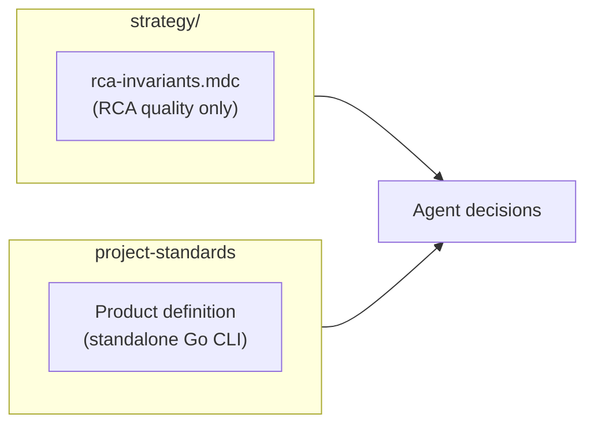
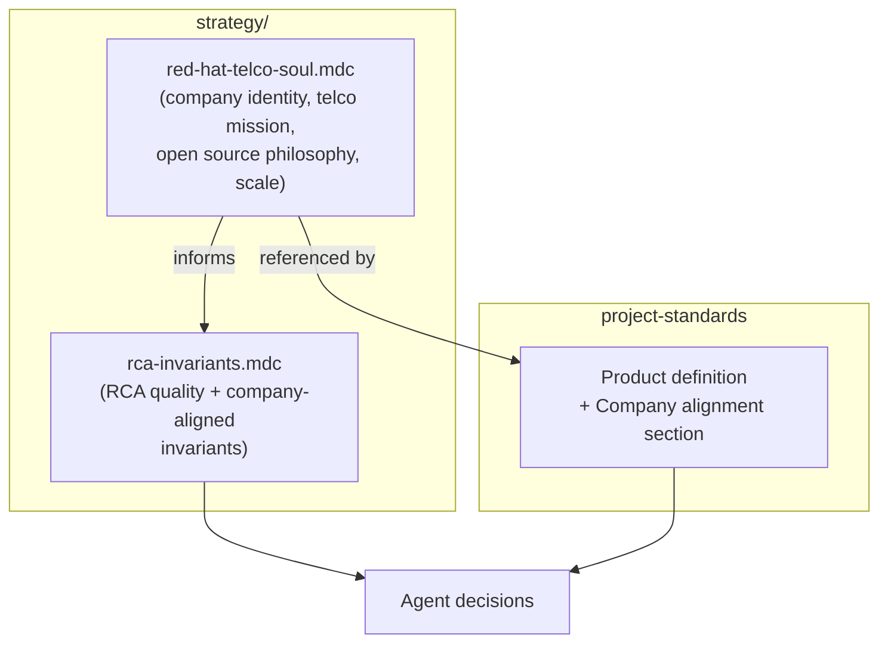

# Contract — Soul: Red Hat Telco

**Status:** complete  
**Goal:** The project's strategy, invariants, and standards explicitly encode Red Hat's identity, open source philosophy, telco mission, and scale awareness — transforming Asterisk from a solo PoC into a company-aligned tool.  
**Serves:** PoC completion

## Contract rules

- The soul document is a living strategy reference, not a one-time artifact. It evolves as the project and company evolve.
- Company alignment must be practical — expressed as design invariants and decision criteria, not aspirational statements.
- No existing behavior is removed. This contract adds alignment, not restrictions.

## Current Architecture

Solo-scoped project identity. One strategy file (`rca-invariants.mdc`) covering only RCA quality. No company context, no telco domain awareness, no scale expectations.

## Desired Architecture

Company-aligned identity layer. Soul document provides context; invariants encode actionable constraints; project standards reference company alignment.

## Context

- `strategy/rca-invariants.mdc` — 7 existing RCA quality invariants, no company alignment.
- `rules/domain/project-standards.mdc` — product definition, methodology, data handling. No mention of Red Hat, telco, or scale.
- Red Hat: 20,000+ employees, $6.5B revenue, 100% of Fortune Global 500 telcos, upstream-first open source philosophy.
- Telco strategy: OpenShift as telco cloud, 5G/Open RAN, CNF certification, partner ecosystem (Nokia, Ericsson, Samsung, etc.).
- Current domain: PTP Operator CI on OpenShift (far-edge-vran, RAN). Must generalize to N operators.

## Execution strategy

1. Write the soul document (`strategy/red-hat-telco-soul.mdc`).
2. Write this contract.
3. Extend `rca-invariants.mdc` with company-aligned invariants.
4. Add company alignment section to `project-standards.mdc`.
5. Update all indexes.

## Tasks

- [x] Write `strategy/red-hat-telco-soul.mdc` — Red Hat identity, telco mission, OSS philosophy, scale awareness
- [x] Write this contract
- [x] Extend `strategy/rca-invariants.mdc` — add upstream-first, multi-operator, multi-CI, community-ready, evidence transparency invariants
- [x] Add "Company alignment" section to `rules/domain/project-standards.mdc` — Red Hat identity, telco domain, scale reference
- [x] Update `strategy/index.mdc`, `contracts/index.mdc`, `current-goal.mdc`
- [x] Validate — all references correct (strategy index, contracts index, current-goal, project-standards), invariants actionable, build + tests pass
- [x] Tune — soul document is a living reference; scale targets will adjust as adoption grows. Initial tuning complete.

## Acceptance criteria

- **Given** an agent making an architectural decision,
- **When** it reads the strategy directory,
- **Then** it finds company identity, telco domain context, and scale expectations alongside RCA quality invariants.

- **Given** a new team member onboarding,
- **When** they read `strategy/red-hat-telco-soul.mdc`,
- **Then** they understand who we are (Red Hat), what domain we serve (telco QE), how we work (upstream-first, evidence-first, open by default), and what scale we target.

- **Given** a design decision between a PTP-specific and a generic approach,
- **When** the agent checks the invariants,
- **Then** it finds "design for N operators, not just PTP" and chooses the generic path.

## Notes

- 2026-02-19 03:00 — Contract created. Soul document written with 7 sections: identity, telco mission, working principles, QE mission, scale awareness, telco landscape, RP relationship. Research: Red Hat 20k+ employees, $6.5B revenue, 100% Fortune Global 500 telcos. Telco strategy: OpenShift for 5G/RAN, CNF certification, partner ecosystem. OSS philosophy: upstream-first, developer autonomy, open participation guidelines.
- 2026-02-19 03:15 — Implementation complete. Soul document at `strategy/red-hat-telco-soul.mdc`. 5 company-aligned invariants added to `rca-invariants.mdc` (upstream-first, multi-operator, multi-CI, community-ready, evidence transparency). Company alignment section added to `project-standards.mdc`. All indexes updated. Build + tests pass.
- 2026-02-19 03:30 — Contract closed. All validation checks pass. References verified across strategy index, contracts index, current-goal, and project-standards. Moved to completed/knowledge-store/.
