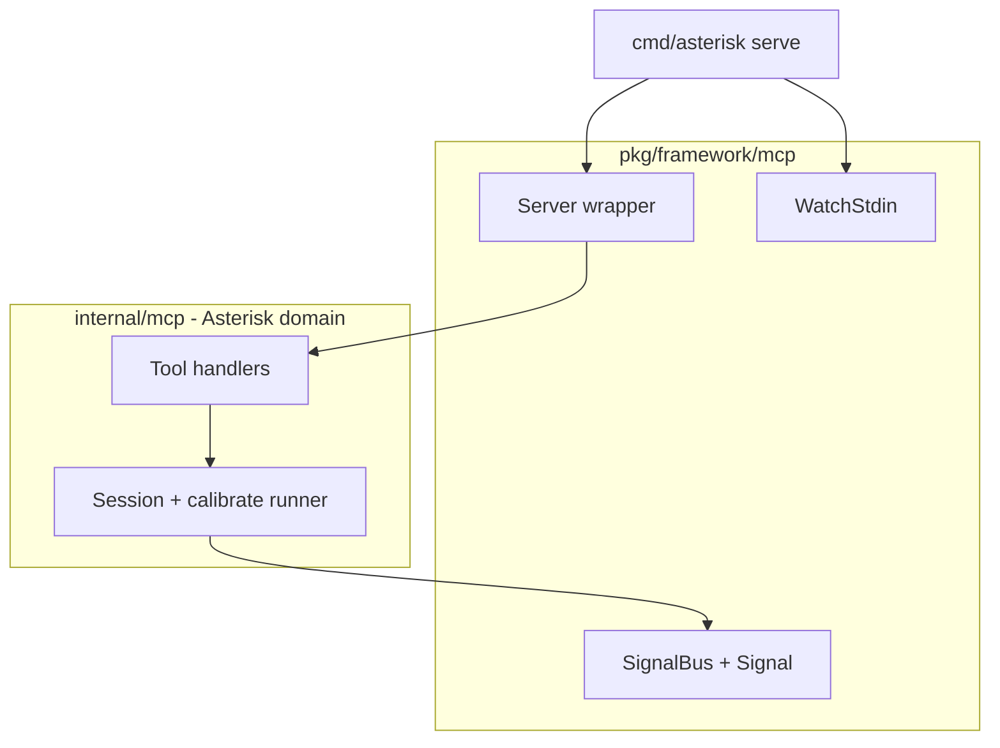

# Contract — Underload & Decouple: Framework-Level MCP

**Status:** complete  
**Goal:** Move generic MCP (server, SignalBus, WatchStdin) into the framework so Asterisk and Origami get MCP out of the box; Asterisk domain keeps only session and tool handlers.  
**Serves:** Architecture evolution (framework MCP; domain-calibration / Origami alignment)

## Contract rules

- Follow the **Red-Orange-Green-Yellow-Blue** cycle (see `rules/testing-methodology.mdc`). Every code increment: Red (failing test) → Orange (problem signals) → Green (implement) → Yellow (success signals) → Blue (refactor).
- Framework package `pkg/framework/mcp/` has **zero** imports of `internal/calibrate`, `internal/origami`, or any `internal/` domain package. Only external dep: `github.com/modelcontextprotocol/go-sdk`.
- Asterisk `internal/mcp/` uses framework MCP for server, SignalBus, and WatchStdin; behavior (tool names, JSON schemas, calibration flow) is unchanged.

## Context

- **Current:** `internal/mcp/` is fully Asterisk-coupled: Server, Session, SignalBus, WatchStdin, and six calibration tools all live there and import `internal/calibrate`, `dispatch`, `scenarios`, etc.
- **Target:** Framework provides `pkg/framework/mcp` (Server wrapper, SignalBus + Signal, WatchStdin). Asterisk provides Session + tool handlers and registers tools via `sdkmcp.AddTool(fwServer.MCPServer, ...)`. Origami (later) can use the same framework and add its own session/tools.
- Plan reference: `.cursor/plans/underload_decouple_mcp_*.plan.md` (or equivalent).

### Desired architecture

## FSC artifacts

| Artifact | Target | Compartment |
|----------|--------|-------------|
| Framework MCP package | `pkg/framework/mcp/` | framework |
| Contract + ROGYB execution log | This contract | contracts |
| "MCP out of the box" subsection | `docs/framework-guide.md` | domain |

## Execution strategy (ROGYB)

Each deliverable follows the cycle:

1. **Red** — Write a failing test (or assertion) that defines the desired behavior (e.g. framework SignalBus used by internal/mcp; framework Server used by Asterisk).
2. **Orange** — Add or keep instrumentation for problem signals (errors, session mismatch, shutdown).
3. **Green** — Implement the minimal change so the test passes (move SignalBus to framework; refactor internal/mcp to use it).
4. **Yellow** — Add or keep success signals (e.g. test passes, build green, calibration flow unchanged).
5. **Blue** — Refactor for clarity; remove duplication; update index/docs.

Apply ROGYB to: (A) framework SignalBus + Signal, (B) framework WatchStdin, (C) framework Server, (D) Asterisk session/server refactor to consume framework MCP, (E) remove `internal/mcp/stdin_watch*.go`, (F) contract closure and docs.

## Tasks

### Framework MCP (ROGYB per component)

- [x] **SignalBus** — Red: test in `pkg/framework/mcp` that Emit/Since/Len behave as required. Green: `signal.go` + `signal_test.go` (no domain imports). Yellow: tests pass. Blue: none.
- [x] **WatchStdin** — Red: test that WatchStdin does not consume stdin. Green: `stdio.go` + `stdio_test.go` (stdlib log only). Yellow: tests pass. Blue: none.
- [x] **Server** — Red: test that NewServer(name, version) returns server with MCPServer set. Green: `server.go` wrapping sdkmcp.Server. Yellow: build passes. Blue: comment that domains register via sdkmcp.AddTool(s.MCPServer, ...).

### Asterisk consumes framework MCP (ROGYB)

- [x] **Session uses framework SignalBus** — Red: internal/mcp test that Session.Bus is framework type (or same API). Orange: existing MCP tests cover session/signal behavior. Green: session.go uses `fwmcp.SignalBus`, remove local Signal/SignalBus; getSignalsOutput uses `fwmcp.Signal`. Yellow: all internal/mcp tests pass. Blue: tidy imports.
- [x] **Server uses framework Server + WatchStdin** — Red: server test still passes (unchanged behavior). Green: server.go uses fwmcp.NewServer; internal/mcp/stdin_watch.go delegates to fwmcp.WatchStdin; register tools with sdkmcp.AddTool(s.MCPServer, ...). cmd_serve uses internal/mcp (which wraps framework). Yellow: `go test ./internal/mcp/...` and `just calibrate-stub` pass. Blue: stdin_watch_test.go removed (framework stdio_test.go covers it).
- [x] **Validate** — Green: `go build ./...` and `go test ./...` pass; no new lints. Yellow: document in framework-guide. Blue: update contracts index.

### Contract and docs

- [x] **Contract** — This document is the execution plan; update Tasks/Notes as work proceeds.
- [x] **Docs** — Add "MCP out of the box" to `docs/framework-guide.md`: framework provides `pkg/framework/mcp` (Server, SignalBus, WatchStdin); domains implement session and tools and register with the framework server.
- [x] **Index** — Update `.cursor/contracts/index.mdc` with this contract in active/.

## Acceptance criteria

- **Framework** `pkg/framework/mcp` exists with Server (NewServer), SignalBus + Signal (NewSignalBus, Emit, Since, Len), WatchStdin. Package has zero domain imports.
- **Asterisk** `internal/mcp` uses framework for server, SignalBus, WatchStdin; Session and all six tool handlers remain; existing MCP integration tests and `just calibrate-stub` pass.
- **Origami** — No implementation in this contract; docs state that Origami (or any domain) can add its own session and tools using the same framework MCP.
- **ROGYB** — Execution followed Red → Orange → Green → Yellow → Blue for each component; Notes log any deviations.

## Security assessment

No trust boundaries affected. MCP server runs in-process; SignalBus and WatchStdin are process-local. Framework does not handle user or external data.

## Notes

2026-02-22 — Contract created. ROGYB and contract-first execution strategy added so rule router and future agents apply testing-methodology and knowledge-store conventions. Plan-driven implementation had started (Phase 1 framework MCP files added) without a contract or explicit ROGYB; this contract formalizes the remainder and aligns with project standards.
2026-02-21 — MCP decoupling completed. internal/mcp now uses pkg/framework/mcp for SignalBus, Server, and WatchStdin only; Session and all six tool handlers remain in internal/mcp. go test ./internal/mcp/... and just calibrate-stub pass. "MCP out of the box" subsection added to docs/framework-guide.md.
2026-02-21 — Contract closed. All tasks complete. Moved to completed/mcp/.
