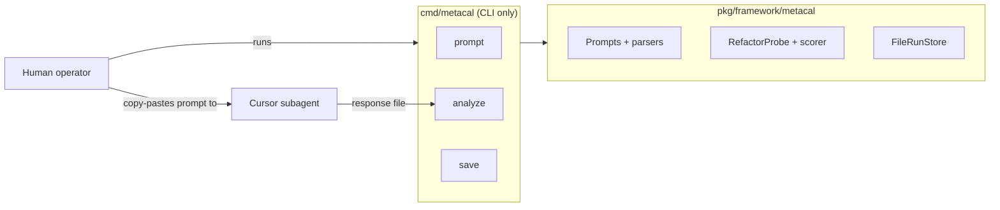
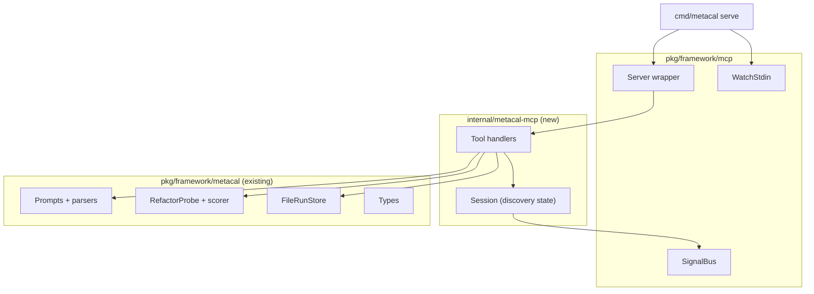

# Contract — metacal-mcp-server

**Status:** complete  
**Goal:** Expose meta-calibration discovery as an MCP server (`metacal serve`) so Cursor can drive the negation loop end-to-end without human CLI steps between iterations.  
**Serves:** Architecture evolution / Framework showcase

## Contract rules

- Follow the **Red-Orange-Green-Yellow-Blue** cycle (see `rules/testing-methodology.mdc`).
- Zero imports from Asterisk domain packages (`calibrate`, `orchestrate`, `origami`). Server code uses only `pkg/framework/mcp` and `pkg/framework/metacal`.
- Reuse existing `pkg/framework/metacal` logic (prompts, parsers, scorer, store). MCP handlers are thin wrappers — no duplicated domain logic.
- The existing CLI subcommands (`prompt`, `analyze`, `save`) remain functional; `serve` is additive.

## Context

- **metacal-run-1** proves the discovery loop works with a manual CLI flow: human runs `metacal prompt`, feeds output to a Cursor subagent, pipes response to `metacal analyze`, then `metacal save`. Each iteration requires human coordination.
- **Asterisk calibration MCP** (`asterisk serve`) uses a `start` / `get_next` / `submit` / `report` pattern that maps cleanly to discovery iterations.
- **Framework MCP** (`pkg/framework/mcp`) provides `NewServer`, `SignalBus`, and `WatchStdin` — all reusable for a second MCP server process.
- This contract is not blocking metacal-run-1; it becomes valuable when the manual loop proves cumbersome or when automated multi-probe runs (vision: `meta-calibration.md`) require agent-driven orchestration.

### Current architecture

### Desired architecture

## FSC artifacts

| Artifact | Target | Compartment |
|----------|--------|-------------|
| MCP tool schema reference (discovery tools) | `docs/` or `docs/framework-guide.md` | domain |

## Execution strategy

Mirror the calibration MCP pattern: thin handler layer wrapping existing library functions. Session holds iteration state (seen map, config, current iteration). Each `get_discovery_prompt` / `submit_discovery_response` cycle is one iteration of the negation loop.

Build in order: (1) Session + state management, (2) Tool handlers, (3) `serve` subcommand in `cmd/metacal`, (4) `.cursor/mcp.json` config for second server, (5) Validate with a manual discovery run via MCP.

## Tasks

### Phase 1 — Session and state

- [x] Create `internal/metacal-mcp/session.go` with `Session` struct holding discovery config, seen map, iteration counter, `*fwmcp.SignalBus`, and `RunReport` accumulator
- [x] `NewSession(config DiscoveryConfig)` initializes state and emits `session_started`
- [x] Unit tests for session state transitions (start, advance iteration, detect repeat, finalize report)

### Phase 2 — Tool handlers

- [x] Create `internal/metacal-mcp/server.go` with `Server` struct wrapping `*sdkmcp.Server`
- [x] **`start_discovery`** — input: `DiscoveryConfig` JSON; creates session, returns session ID + config echo
- [x] **`get_discovery_prompt`** — returns `BuildFullPrompt(seen)` for current iteration; returns `done=true` if terminated
- [x] **`submit_discovery_response`** — input: raw response text; parses identity + probe, scores, updates seen map, advances iteration; returns parsed result JSON
- [x] **`get_discovery_report`** — returns `RunReport` JSON; persists to `FileRunStore` if session is finalized
- [x] **`emit_signal` / `get_signals`** — delegate to `session.Bus` (same pattern as calibration)
- [x] Unit tests for each handler (mock session, verify JSON schemas)

### Phase 3 — CLI serve subcommand

- [x] Add `serve` case to `cmd/metacal/main.go` switch (or migrate to Cobra if warranted)
- [x] `cmdServe` creates `internal/metacal-mcp.NewServer()`, calls `fwmcp.WatchStdin`, runs over `StdioTransport`
- [x] Add `.cursor/mcp.json` entry for metacal server (separate from asterisk)

### Phase 4 — Validate and tune

- [x] Validate (green) — `go build ./...`, `go test ./...`, manual MCP discovery run
- [x] Tune (blue) — refactor for quality, align naming with calibration MCP
- [x] Validate (green) — all tests still pass after tuning

## Acceptance criteria

- **Given** `metacal serve` is running over stdio, **when** Cursor calls `start_discovery` then iteratively `get_discovery_prompt` / `submit_discovery_response`, **then** the server drives the full negation loop and returns a complete `RunReport` via `get_discovery_report`.
- **Given** a discovery session reaches a repeated model, **when** `submit_discovery_response` detects the repeat, **then** the session terminates and `get_discovery_prompt` returns `done=true`.
- **Given** `metacal serve` is configured in `.cursor/mcp.json`, **when** Cursor connects, **then** all six tools are discoverable and callable.
- Zero imports from `internal/calibrate`, `internal/orchestrate`, or any Asterisk domain package.
- Existing CLI subcommands (`prompt`, `analyze`, `save`) remain functional and unchanged.

## Security assessment

No trust boundaries affected. MCP server runs in-process over stdio; discovery state is process-local. No external data beyond what the subagent returns (same trust model as calibration MCP).

## Notes

2026-02-21 — Contract created as draft. Not blocking metacal-run-1 (which works via CLI). Activates when agent-driven discovery loop is needed or when meta-calibration vision contract (multi-probe, ModelProfiles) progresses.
2026-02-21 — Implemented and activated. internal/metacalmcp package with Session + Server + 6 tool handlers. Tests pass. `metacal serve` subcommand added. .cursor/mcp.json updated with metacal entry. Package uses internal/metacalmcp (Go-valid name instead of internal/metacal-mcp).
2026-02-21 — Contract closed. All 4 phases complete. Moved to completed/mcp/.
