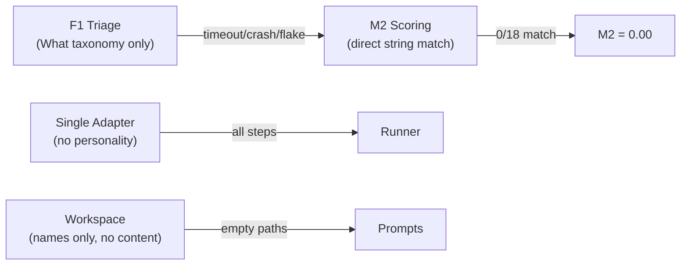
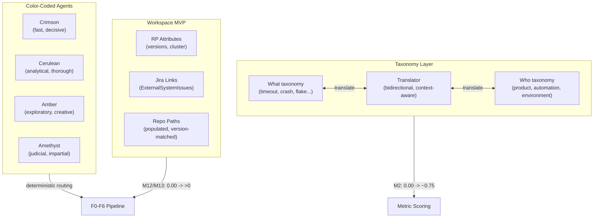

# Contract — Phase 5a Mitigation Plan

**Status:** complete  
**Goal:** Address all 6 root causes from the CursorAdapter blind calibration (M19=0.50) through taxonomy translation, color-coded subagent identity, workspace MVP, dataset expansion, and convergence tuning — lifting M19 toward 0.70+ without architectural rewrites.  
**Serves:** PoC completion

## Contract rules

- Each item is independently shippable. Items 1-3 are must/should for PoC; items 5-6 are on hold or covered by other items.
- The color system is a naming convention and personality framework, not a code dependency. It applies to contracts, prompts, and human communication.
- Workspace decomposition follows the new contract-sizing rule: must/should/nice splits.

## Current Architecture

Single-taxonomy scoring, single-adapter dispatch, no workspace content resolution, small dataset, no convergence intelligence.

## Desired Architecture

Bidirectional taxonomy translation, color-coded adapter personalities with deterministic routing, workspace MVP with real content, expanded dataset, intelligent convergence.

## Context

- `notes/phase-5a-post-run-analysis.md` — full post-run analysis: 6 root causes, 7 priority fixes
- `contracts/draft/agent-adapter-overloading.md` — multi-adapter architecture (color system extends this)
- `contracts/draft/workspace-revisited.md` — full workspace vision (MVP split from this)
- `contracts/draft/origami-ground-truth-ingestor.md` — dataset curation (expansion target added)
- `taxonomy/symptom-translator.mdc` — Who/What mapping (created by this contract)

## Items

### Item 1: Taxonomy Translator (M2 = 0.00) — MUST

Two valid taxonomies coexist: RP's "Who" (`product/automation/environment`) and Asterisk's "What" (`timeout/assertion/crash/infra/config/flake/unknown`). Both are domain-valid. Solution: a bidirectional translator.

- **Deliverable**: `taxonomy/symptom-translator.mdc` with mapping table
- **Deliverable**: `internal/taxonomy/translator.go` with `Translator` interface (future Go implementation)
- **Impact**: M2 from 0.00 to ~0.75 with static mapping; ~0.90 with context-aware disambiguation

### Item 2: Color-Coded Subagent Identity — SHOULD

Each subagent gets a color name encoding personality along temperature (warm=fast, cool=slow) and saturation (vivid=opinionated, muted=neutral). PoC palette: Crimson (fast/decisive), Cerulean (analytical/thorough), Amber (exploratory/creative), Amethyst (judicial/impartial).

- **Deliverable**: Updated `agent-adapter-overloading.md` with color system and `AdapterTraits.Color`
- **Deliverable**: Subagent mux testing framework design (deterministic dispatch assertions)
- **Impact**: Pitch identity, deterministic testing, parallel execution framework

### Item 3: Workspace MVP — MUST

Wire RP launch attributes, Jira links, and repo paths into prompts. Split from workspace-revisited.

- **Deliverable**: `contracts/draft/workspace-mvp.md` (must-have split)
- **Deliverable**: `contracts/draft/workspace-catalog.md` (should-have split)
- **Deliverable**: Trimmed `workspace-revisited.md` (nice-to-have vision)
- **Impact**: M12/M13 from 0.00 to >0; M15 from 0.44 to ~0.70

### Item 4: Origami Dataset Expansion — SHOULD

Dataset too small (18 verified). Target 50+ verified cases. Add PR workflow for reviewable dataset.

- **Deliverable**: Updated `origami-ground-truth-ingestor.md` with size target and PR workflow
- **Impact**: Statistical significance, broader failure pattern coverage

### Item 5: Convergence Tuning — ON HOLD (Cerulean task)

M17=6 loops, M18=149K tokens. Deferred until workspace MVP provides data quality indicators. A Cerulean-class analytical task.

### Item 6: Parallel Execution — COVERED BY ITEM 2

MuxDispatcher already supports concurrency. The color-coded framework provides deterministic testing for parallel routing. No separate deliverable needed.

## Tasks

- [x] Write this contract
- [x] Write `taxonomy/symptom-translator.mdc` — Who/What mapping table, extension protocol
- [x] Update `agent-adapter-overloading.md` — color system, personality profiles, testing framework
- [x] Create `workspace-mvp.md` — must-have workspace split (RP attrs, Jira links, repo paths)
- [x] Create `workspace-catalog.md` — should-have workspace split (catalog, format registry, CI logs)
- [x] Trim `workspace-revisited.md` — keep only nice-to-have vision (Parts 4-6)
- [x] Update `origami-ground-truth-ingestor.md` — dataset size target, PR workflow, robustness
- [x] Write `rules/domain/contract-sizing.mdc` — goal alignment check, must/should/nice splits
- [x] Update all indexes — contracts, current-goal (full urgency re-tier), taxonomy, rules
- [x] Validate — all contracts consistent, no orphaned references, `go build ./...` passes
- [x] Tune — urgency tiers reviewed, SHOULD contracts ordered, scope-trimming notes added

## Acceptance criteria

- **Given** the taxonomy translator maps "crash" to "product",
- **When** M2 is scored against RP ground truth,
- **Then** the score improves from 0.00 to >= 0.70.

- **Given** a calibration run with color-coded subagents,
- **When** Crimson handles F1 Triage and Cerulean handles F3 Investigation,
- **Then** the routing decision is logged with color name and personality tags.

- **Given** the workspace MVP wires RP attributes into prompts,
- **When** the adapter processes F3 Investigation,
- **Then** OCP version, cluster name, and operator versions are visible in the prompt.

- **Given** the origami dataset has 30+ verified cases,
- **When** calibration runs,
- **Then** M19 is computed on a statistically meaningful sample.

## Notes

- 2026-02-19 04:00 — Contract created. 6 items from Phase 5a post-run analysis. Items 1+3 are must (M2=0.00, M12/M13=0.00). Item 2+4 are should (identity + dataset). Item 5 on hold (convergence). Item 6 covered by item 2 (parallel). Full urgency audit of all contracts performed.
- 2026-02-19 — All 9 contract-writing tasks completed. `go build ./...` passes. Urgency tiers reviewed and SHOULD contracts ordered. Contract closed.
