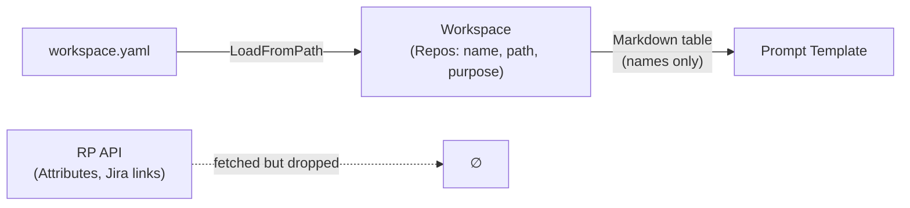
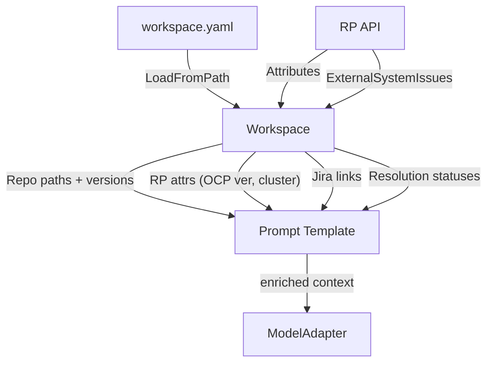

# Contract — Workspace MVP

**Status:** complete  
**Goal:** Wire RP launch attributes (`Attributes`), Jira links (`ExternalSystemIssues`), and repo `Path` fields into prompt templates — giving the pipeline real content instead of empty metadata tables. Surface resolution status per artifact so prompts communicate what is available and what is missing.  
**Serves:** PoC completion (Phase 5a mitigation Item 3, MUST)

## Contract rules

- Backward-compatible: existing `internal/workspace.Workspace` consumers must not break.
- No new external dependencies: work with data already fetched by `internal/rp/` and declared in workspace config.
- Every new field surfaced to prompts must include a resolution status (`resolved`, `unavailable`).
- Split from `workspace-revisited.md` — this contract covers Phase 1 only (near-term, PoC-blocking).

## Current Architecture

Flat declarative repo list. RP launch `Attributes`, `ExternalSystemIssues`, and repo content paths are fetched or available but never reach the prompt templates.

## Desired Architecture

Workspace populates prompt templates with real data: RP launch attributes (OCP version, operator versions, cluster name), Jira links from `ExternalSystemIssues`, and repo paths resolved from workspace config. Each field carries resolution status.

## Context

- `internal/workspace/workspace.go` — flat `Repos []Repo` with `Path`, `URL`, `Name`, `Purpose`, `Branch`. Never reads content.
- `internal/rp/client.go` — `LaunchResource.Attributes` (map of `AttributeResource`), `TestItemResource.ExternalSystemIssues` — already fetched, not surfaced.
- `orchestrate/params.go` — `WorkspaceParams` injected into prompts as Markdown table.
- `contracts/draft/workspace-revisited.md` — full vision (this contract is the must-have split).
- `contracts/draft/phase-5a-mitigation.md` — parent mitigation plan; this is Item 3.
- Phase 5a finding: M12/M13=0.00 (repo selection), M15=0.44 (version identification). Root cause: prompts contain repo names but no paths, no RP attributes, no Jira context.

## Tasks

- [x] Extend `WorkspaceParams` to include RP launch `Attributes` as a structured map (key-value pairs)
- [x] Extend `WorkspaceParams` to include `ExternalSystemIssues` (Jira ticket IDs + URLs) per test item
- [x] Populate repo `Path` fields in F2/F3 prompts from workspace config (currently empty strings)
- [x] Add resolution status enum (`resolved`, `unavailable`) to each workspace field
- [x] Update prompt templates (F1 triage, F2 resolve, F3 investigate) to render RP attributes, Jira links, and repo paths
- [x] Update prompt templates to show resolution status when a field is unavailable
- [x] Wire `LaunchResource.Attributes` into `CaseInput` via `preinvest.Envelope.LaunchAttributes`
- [x] Wire `TestItemResource.ExternalSystemIssues` into `CaseInput` via `preinvest.FailureItem.ExternalIssues`
- [x] Add unit tests for attribute surfacing and resolution status (5 tests)
- [x] Validate — `go build ./...` passes, `go test ./...` all green
- [x] Tune — templates render attrs/Jira/repos with unavailable fallback; deduplication on Jira links

## Acceptance criteria

- **Given** a launch with `Attributes` containing `ocp_version=4.21` and `operator_version=4.21.0-202402`,
- **When** the F3 Investigation prompt is rendered,
- **Then** the prompt contains the OCP version and operator version in a readable format.

- **Given** a test item linked to Jira ticket `OCPBUGS-70233`,
- **When** the F1 Triage prompt is rendered,
- **Then** the prompt contains the Jira ticket ID and URL.

- **Given** the workspace config declares `linuxptp-daemon` at path `/home/user/repos/linuxptp-daemon`,
- **When** the F3 Investigation prompt is rendered,
- **Then** the repo path is present (not an empty string).

- **Given** a launch where `Attributes` is empty (no attributes set),
- **When** the prompt is rendered,
- **Then** the RP attributes section shows `resolution_status: unavailable` and the prompt notes "no launch attributes available."

## Security assessment

| OWASP | Finding | Mitigation |
|-------|---------|------------|
| A03 | Jira ticket URLs from RP could contain injection payloads if RP data is tampered with. | Validate URL format before rendering into prompts. Allow only known Jira domains. |
| A05 | RP `Attributes` keys/values are free-form strings; unexpected content could confuse prompt parsing. | Render attributes as a read-only table; never use attribute values as code or template directives. |

## Notes

- 2026-02-19 04:00 — Contract created. Split from `workspace-revisited.md` Phase 1. Directly addresses Phase 5a root causes #3 (M12/M13=0.00) and #4 (M15=0.44). Minimum viable workspace that unblocks PoC scoring improvements.
- 2026-02-19 — All 11 tasks completed. Changes: `preinvest.Envelope` extended with `LaunchAttributes`, `FailureItem` with `ExternalIssues`; `rp.FetchEnvelope` wires both; `WorkspaceParams` extended with `LaunchAttributes`, `JiraLinks`, `ResolutionStatus`; `BuildParams` populates from envelope; F1/F2/F3 templates render new data with unavailable fallback. 5 unit tests added. Full test suite green.
