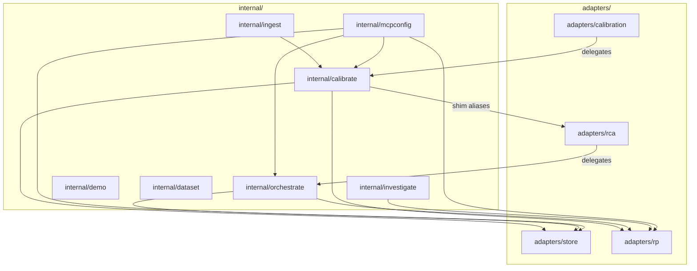
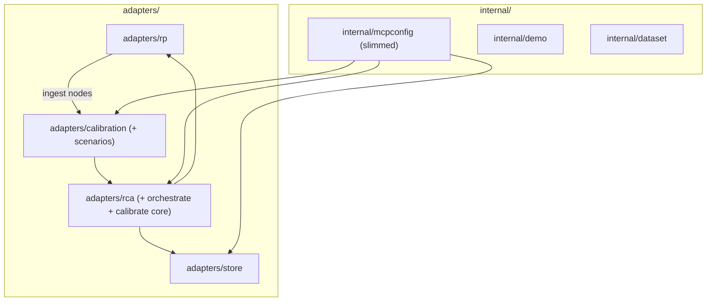

# Contract — asterisk-internal-cleanup

**Status:** complete  
**Goal:** All domain logic lives in `adapters/` packages; `internal/` contains only wiring (`mcpconfig`), presentation (`demo`), and data (`dataset`).  
**Serves:** Polishing & Presentation (should)

## Contract rules

- Good API > Stable API. Break freely — sole consumer, pre-dev state.
- Delete over deprecate. No shim layers survive completion.
- Build + test after every phase. No multi-phase blind edits.

## Context

Continues the pure-DSL migration from the previous session ([Pure-DSL Migration](09b25877-eb39-47f7-9197-86dea1b877b4)). That session moved `internal/store` → `adapters/store`, merged `internal/rp` + `preinvest` + `postinvest` → `adapters/rp`, moved `ModelAdapter` → `adapters/rca`, created `adapters/calibration` with strangler-fig delegation, and moved `internal/display` → `display/`.

Five packages remain in `internal/` that should be merged into `adapters/`:

| Package | Files | Key exports | Current consumers |
|---------|-------|-------------|-------------------|
| `internal/orchestrate` | 14 | `BuildParams`, `RunStep`, `CircuitDef`, heuristics, templates | `adapters/rca`, `internal/calibrate` |
| `internal/calibrate` | ~35 | `RunCalibration`, `Scenario`, metrics, transcripts, `adapt/` (Basic/Stub/LLM) | `adapters/calibration`, `internal/mcpconfig`, `internal/ingest` |
| `internal/investigate` | 5 | `Analyze`, `EnvelopeSource`, `Artifact` | `cmd/asterisk`, `adapters/rp` (inlined) |
| `internal/ingest` | 4 | Ingest circuit nodes, `DedupIndex` | `cmd/asterisk` |
| `internal/mcpconfig` | 4 | MCP server wiring | `cmd/asterisk` |

Packages that stay: `internal/dataset` (domain data), `internal/demo` (Kabuki theme).

### Current architecture



### Desired architecture



## FSC artifacts

Code only — no FSC artifacts.

## Execution strategy

Strangler fig, phase by phase. Each phase moves one package, updates all imports, and runs build + test. Cycle-breaking via type inlining or interface extraction where needed. The order is dependency-driven: orchestrate first (fewest reverse deps), then calibrate core (biggest), then scenarios, then investigate + ingest (unblocked once calibrate moves), then mcpconfig cleanup.

## Coverage matrix

| Layer | Applies | Rationale |
|-------|---------|-----------|
| **Unit** | yes | All existing tests move with their code; must remain green after each phase |
| **Integration** | yes | `just calibrate-stub` after phases 1-3; full build + test after each phase |
| **Contract** | no | No API schema changes — this is a mechanical restructuring |
| **E2E** | yes | `just calibrate-stub` validates end-to-end circuit after merge |
| **Concurrency** | no | No new shared state or parallel paths introduced |
| **Security** | no | No trust boundaries affected — pure code movement |

## Tasks

- [ ] **P1: Merge `internal/orchestrate/` → `adapters/rca/`** — Move params, runner, heuristics, templates. Delete deprecated `bridgeNode` and `buildNodeRegistry`. Update all imports. Delete `internal/orchestrate/`.
- [ ] **P2: Merge `internal/calibrate/` core → `adapters/rca/`** — Move `RunCalibration`, metrics, analysis, transcripts, `adapt/` sub-packages (Basic, Stub, LLM adapters). Remove shim aliases in `adapter.go`. Update all imports.
- [ ] **P3: Move `internal/calibrate/scenarios/` → `adapters/calibration/`** — Scenario definitions and ground truth live with the calibration adapter. Delete remaining `internal/calibrate/`.
- [ ] **P4: Merge `internal/investigate/` → consumers** — `Analyze` + `EnvelopeSource` into `adapters/rp/` or `cmd/asterisk/`. Delete `internal/investigate/`.
- [ ] **P5: Merge `internal/ingest/` → `adapters/rp/`** — Now possible because calibrate dependency is resolved. Delete `internal/ingest/`.
- [ ] **P6: Slim `internal/mcpconfig/`** — Update all imports to `adapters/rca` and `adapters/calibration` directly. Move to `cmd/asterisk/` if it becomes thin enough.
- [ ] **P7 (deferred): Delete `display/`** — Blocked on Origami `rich-vocabulary` contract. Asterisk's `display/` becomes a `RichMapVocabulary` registration. Mark complete when RichVocabulary lands.
- [ ] Validate (green) — `go build ./...`, `go test ./...`, `just calibrate-stub` all pass.
- [ ] Tune (blue) — Clean up any naming inconsistencies, remove dead code, improve package docs.
- [ ] Validate (green) — all tests still pass after tuning.

## Acceptance criteria

```gherkin
Given the Asterisk codebase after this contract
When I run `ls internal/`
Then only `dataset/`, `demo/`, and `mcpconfig/` directories exist

Given any Go file in `adapters/rca/`
When I check its import paths
Then no imports reference `internal/orchestrate` or `internal/calibrate`

Given any Go file in `adapters/rp/`
When I check its import paths
Then no imports reference `internal/investigate` or `internal/ingest`

Given `internal/calibrate/adapter.go`
Then the file does not exist (shim aliases deleted)

Given the full test suite
When I run `go build ./... && go test ./...`
Then all tests pass with zero failures

Given the stub calibration
When I run `just calibrate-stub`
Then it completes successfully with no metric regressions
```

## Security assessment

No trust boundaries affected. Pure mechanical code movement between packages within the same binary.

## Notes

2026-02-27 — Contract drafted. Continues pure-DSL migration. P7 (display/) deferred pending Origami `rich-vocabulary` contract.
