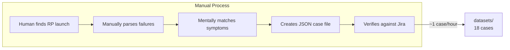
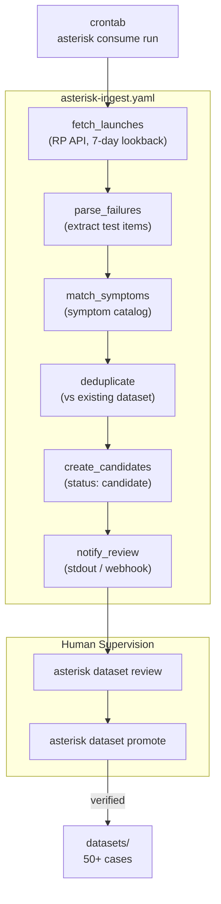

# Contract — Data Ingestion Circuit

**Status:** complete  
**Goal:** Define data ingestion as a DSL circuit (`asterisk-ingest.yaml`) for automatic dataset growth via CRON, with human supervision through `dataset review`/`promote` commands — replacing ad-hoc Python scripts with a visible, debuggable, Kami-observable circuit.  
**Serves:** Polishing & Presentation (should)

## Contract rules

- The ingestion circuit is a standard Origami DSL circuit. It uses the same `nodes:`, `edges:`, `start:`, `done:` format as `asterisk-rca.yaml`.
- Node implementations are Go-registered extractors/transformers. The circuit YAML defines the graph; the Go code does the work.
- The circuit is triggered by system-level CRON (`crontab` + `asterisk consume run`). Framework-level scheduling is deferred.
- Human supervision is mandatory: new cases enter as `candidate` status. Only `asterisk dataset promote <id>` moves them to `verified`.
- Deduplication is based on RP launch ID + test item ID. Same failure appearing in multiple runs is deduplicated.
- The RP source adapter (`internal/rp/`) is reused. No new RP API calls — the same fetch logic used by `analyze`.

## Context

- **Problem:** Asterisk's ground truth dataset has 18 verified cases. Growing it requires manual work: find RP launches, parse failures, match symptoms, create case files, verify. This is a circuit problem.
- **Current state:** Dataset growth is a manual process. Some Python scripts exist but are not integrated. The `asterisk gt` command (being renamed to `dataset`) manages existing cases but cannot discover new ones.
- **Motivating example:** PTP Operator CI produces ~5-10 failures per week. Most are known symptom patterns. Automatically ingesting them as candidates and presenting them for human review would grow the dataset 10x faster.
- **Cross-references:**
  - `consumer-cli-scaffold` (Origami, draft) — `consume` command (Tier 2) walks this circuit. `dataset` command (Tier 1) manages results.
  - `principled-calibration-scorecard` (Both, draft) — more data = better threshold validation
  - `ground-truth-dataset` (Asterisk, draft) — this circuit automates the growth that `ground-truth-dataset` described manually

### Current architecture



### Desired architecture



## Circuit Definition

```yaml
circuit: asterisk-ingest
description: "Fetch new CI failures from RP, create candidate cases, grow the dataset"

nodes:
  - name: fetch_launches
    family: ingest.fetch
    config:
      source: rp
      lookback_days: 7
      project: "{{rp_project}}"

  - name: parse_failures
    family: ingest.parse
    config:
      extractor: rp-failure-parser

  - name: match_symptoms
    family: ingest.match
    config:
      symptom_catalog: "{{scenario_path}}"

  - name: deduplicate
    family: ingest.dedup
    config:
      dataset_path: "{{dataset_dir}}"

  - name: create_candidates
    family: ingest.candidate
    config:
      output_dir: "{{candidate_dir}}"
      status: candidate

  - name: notify_review
    family: ingest.notify
    config:
      channel: stdout

edges:
  - from: fetch_launches
    to: parse_failures
    when: "len(output.launches) > 0"
  - from: parse_failures
    to: match_symptoms
    when: "len(output.failures) > 0"
  - from: match_symptoms
    to: deduplicate
    when: "true"
  - from: deduplicate
    to: create_candidates
    when: "len(output.new_cases) > 0"
  - from: create_candidates
    to: notify_review
    when: "true"
  - from: fetch_launches
    to: DONE
    when: "len(output.launches) == 0"

start: fetch_launches
done: DONE
```

## CRON Integration

```bash
# System-level cron -- framework scheduler deferred
# Runs daily at 06:00 UTC
0 6 * * * /usr/local/bin/asterisk consume run --config /etc/asterisk/ingest.yaml >> /var/log/asterisk-ingest.log 2>&1
```

The `consume run` command (from `consumer-cli-scaffold`) walks the ingestion circuit. The circuit is a standard Origami graph walk — visible in Kami if a server is running.

## Human Supervision Commands

```bash
asterisk dataset review          # List all candidates with status, date, symptom match
asterisk dataset promote C042    # Move candidate C042 to verified status
asterisk dataset status ingest   # Show last ingest run: cases found, deduped, candidates created
```

## FSC artifacts

| Artifact | Target | Compartment |
|----------|--------|-------------|
| Ingestion circuit YAML | `circuits/asterisk-ingest.yaml` | domain |
| Ingest node implementations | `internal/ingest/` | domain |

## Execution strategy

Phase 1 defines the circuit YAML and registers it. Phase 2 implements the node extractors/transformers (`fetch`, `parse`, `match`, `dedup`, `candidate`, `notify`). Phase 3 implements deduplication logic. Phase 4 wires `consume run` to walk the circuit. Phase 5 implements `dataset review`/`promote` for human supervision. Phase 6 validates with a real RP data source. Phase 7 tunes and adds CRON documentation.

## Coverage matrix

| Layer | Applies | Rationale |
|-------|---------|-----------|
| **Unit** | yes | Each node extractor independently: fetch returns launches, parse extracts failures, dedup filters, candidate creates files |
| **Integration** | yes | Walk full circuit with mock RP data, verify candidates created |
| **Contract** | yes | Circuit YAML schema, candidate file format, dedup key (launch_id + test_item_id) |
| **E2E** | yes | `asterisk consume run` with real RP project, verify candidates appear |
| **Concurrency** | no | Ingestion is sequential by design (CRON trigger, single walk) |
| **Security** | yes | RP API credentials handling (reuse existing `internal/rp/` auth) |

## Tasks

### Phase 1 — Circuit definition

- [ ] **Y1** Create `circuits/asterisk-ingest.yaml` with the circuit definition above
- [ ] **Y2** Register circuit via `RegisterEmbeddedCircuit` in `init()`
- [ ] **Y3** Validate circuit loads and graph builds: `origami circuit validate asterisk-ingest.yaml`

### Phase 2 — Node implementations

- [ ] **N1** `ingest.fetch` node: calls RP API to list launches in lookback window, filters by project
- [ ] **N2** `ingest.parse` node: extracts failed test items from launches, creates failure structs
- [ ] **N3** `ingest.match` node: matches failures against symptom catalog (existing `scenarios/*.go` patterns)
- [ ] **N4** `ingest.dedup` node: checks failure against existing dataset by launch_id + test_item_id key
- [ ] **N5** `ingest.candidate` node: creates candidate case JSON files in output directory
- [ ] **N6** `ingest.notify` node: prints summary to stdout (webhook support deferred)
- [ ] **N7** Unit tests for each node with mock inputs

### Phase 3 — Deduplication

- [ ] **D1** Define dedup key: `{rp_project}:{launch_id}:{test_item_id}`
- [ ] **D2** Scan existing dataset directory for known keys
- [ ] **D3** Filter out failures whose key already exists
- [ ] **D4** Unit test: same failure in two launches → deduplicated to one candidate

### Phase 4 — Wire `consume run`

- [ ] **C1** Implement `consume run` to load and walk `asterisk-ingest.yaml`
- [ ] **C2** Pass circuit vars from `--config` or env vars (`RP_PROJECT`, `RP_URL`, etc.)
- [ ] **C3** Exit with summary: "Fetched X launches, found Y failures, created Z candidates (W deduplicated)"
- [ ] **C4** Integration test: `asterisk consume run` with mock RP returns expected candidates

### Phase 5 — Human supervision

- [ ] **H1** `dataset review`: list candidates from candidate directory, show date/symptom/status
- [ ] **H2** `dataset promote <id>`: move candidate from `candidates/` to `datasets/`, set status to `verified`
- [ ] **H3** Promoted case gets a sequential ID following existing dataset convention
- [ ] **H4** Unit test: promote moves file, updates status, assigns ID

### Phase 6 — Real RP validation

- [ ] **R1** Run `asterisk consume run` against real PTP Operator CI project
- [ ] **R2** Verify: launches fetched, failures parsed, symptoms matched, candidates created
- [ ] **R3** Run `asterisk dataset review` and promote one candidate
- [ ] **R4** Verify promoted case is valid for calibration

### Phase 7 — Validate and tune

- [ ] Validate (green) — `go build ./...`, `go test ./...`. Circuit walks end-to-end with mock data.
- [ ] Tune (blue) — lookback window, symptom matching sensitivity, dedup key granularity, review UX.
- [ ] Validate (green) — all tests still pass after tuning.

## Acceptance criteria

**Given** an RP project with 5 failed launches in the last 7 days,  
**When** `asterisk consume run` walks the ingestion circuit,  
**Then** failures are parsed, symptoms matched, duplicates filtered, and N candidate files created in the candidate directory.

**Given** a candidate case C042,  
**When** `asterisk dataset promote C042` is run,  
**Then** the case moves to the verified dataset with a sequential ID, and `asterisk dataset status` shows it as verified.

**Given** the same RP launch is ingested twice,  
**When** the dedup node processes the second run,  
**Then** no duplicate candidate is created.

**Given** the ingestion circuit is running,  
**When** a Kami server is active,  
**Then** the circuit walk is visible in Kami with node-by-node progress.

## Security assessment

| OWASP | Finding | Mitigation |
|-------|---------|------------|
| A07 | RP API credentials used by fetch node | Reuses existing `internal/rp/` auth. No new credential handling. Credentials via env vars, not in circuit YAML. |
| A01 | Circuit vars (`{{rp_project}}`) could be injected | Circuit vars are loaded from config file, not user input. Template rendering escapes values. |

## Notes

2026-02-26 — Contract created. Replaces manual dataset growth with an automated, observable circuit. The circuit uses the same Origami DSL as the RCA circuit — visible in Kami, debuggable, auditable. Human supervision (review/promote) ensures no unverified data enters the calibration dataset. CRON is system-level; a framework scheduler is deferred to `visual-editor` Ph3.
