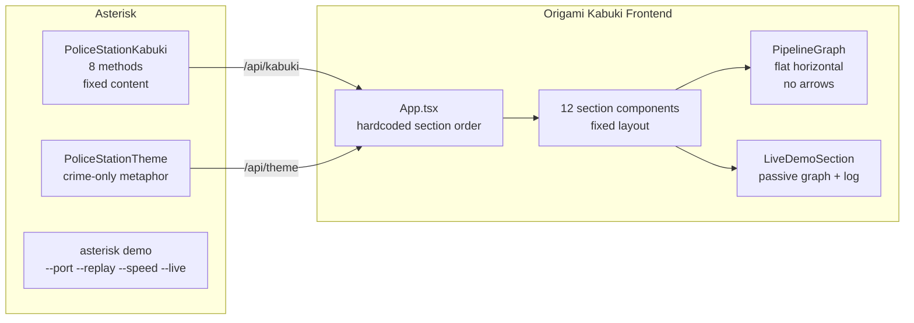
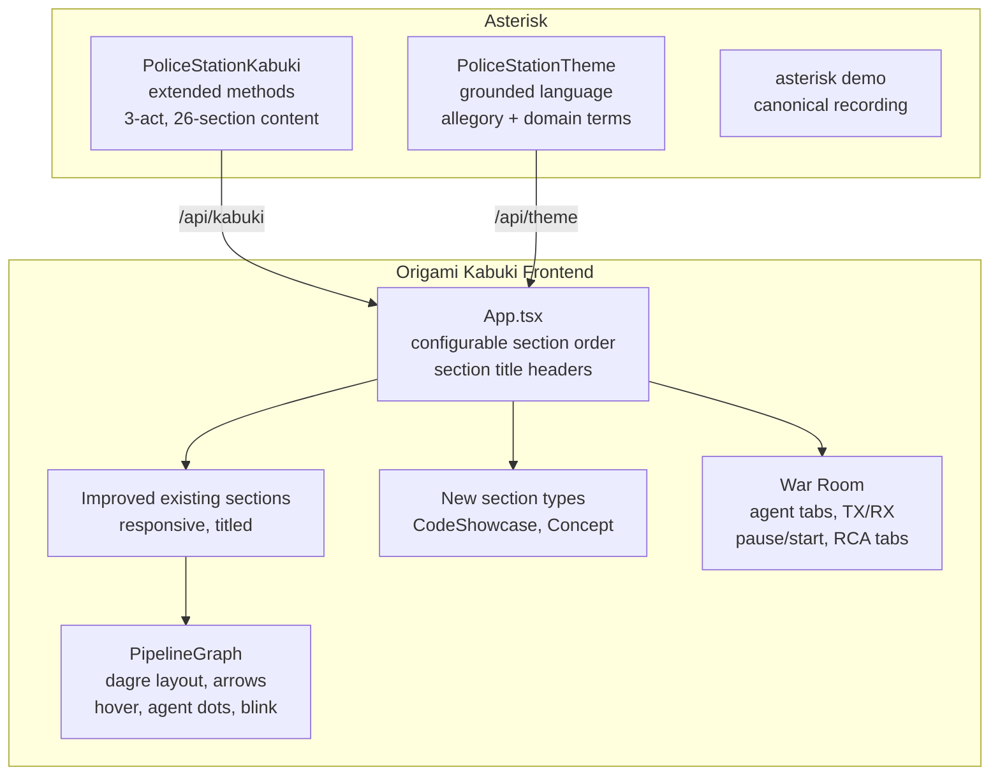

# Contract — Improve Asterisk Kabuki Demo

**Status:** complete  
**Goal:** Overhaul the Asterisk Kabuki demo into a three-act narrative (Product, Engine, Science) with a War Room live-analysis view, grounded language, interactive graphs, responsive scaling, and new section types — turning a failed first demo into a compelling showcase.  
**Serves:** Polishing & Presentation (should)

## Contract rules

- This is a **flow and glue-code** contract. No changes to how Asterisk's pipeline or Origami's framework behave. All changes are in Kabuki frontend (Origami) and Asterisk's KabukiConfig/Theme content.
- Changes span **two repos**: Origami (Kabuki frontend React components, KabukiConfig interface extensions) and Asterisk (PoliceStationKabuki content, PoliceStationTheme grounding, CLI adjustments).
- Every section page must display its own title matching the Agenda label.
- The police allegory is excellent — keep it, but pair every metaphor with its real domain term on the same line.
- The War Room is the cherry on top. It must work in both replay and live mode.
- Adapters & Marbles showcase (Act 2) is a conceptual placeholder until `origami-adapters` and `origami-marbles` contracts ship. Show the design and DSL surface, mark as "coming next."

## Context

- **Completed `demo-presentation`** (`completed/presentation/demo-presentation.md`): PoliceStationKabuki + PoliceStationTheme, `asterisk demo` CLI, integration tests. Phase 3 (canonical recording) deferred — absorbed into this contract's Phase 8.
- **Completed `kabuki-presentation-engine`** (Origami): KabukiConfig interface, 12 section components, 3 API endpoints, scroll-snap + keyboard nav.
- **Completed `kami-live-debugger`** (Origami): EventBridge, KamiServer, SSE events (`node_enter`, `node_exit`, `transition`, `walker_switch`), 14 MCP tools, Recorder/Replayer.
- **Current LiveDemoSection** (`origami/kami/frontend/src/sections/LiveDemoSection.tsx`): Passive layout — graph + event log + evidence panel. No agent tabs, no TX/RX popups, no play/pause controls, no case tabs.
- **Current PipelineGraph** (`origami/kami/frontend/src/components/PipelineGraph.tsx`): Flat horizontal layout (`x: 200*i, y: 100`). No auto-layout (dagre/elkjs). No edge arrows. No hover tooltips. No element-colored agent dots.
- **Current SolutionSection** (`origami/kami/frontend/src/sections/SolutionSection.tsx`): Node cards with unicode arrow (`→`). No interactive graph, no hover depth.
- **Current section ordering** (hardcoded in `App.tsx`): Hero → Agenda → Problem → Solution → Agents → Transition → Live Demo → Results → Competitive → Architecture → Roadmap → Closing. Fixed — not configurable by the consumer.
- **Completed `papercup-protocol-maturity`** (Origami): Papercup v2 choreography, zone stickiness, work stealing, adaptive lifecycle, transport decoupling. The orchestration layer showcased in Act 3.
- **Completed `asterisk-calibrate-skill`** (Asterisk): `asterisk-calibrate` Cursor Skill (v2 choreography, MCP-based, 4 parallel workers). Showcased in Act 3.
- **Completed `cursor-skill`** (Asterisk): `asterisk-investigate` Cursor skill; signal-based F0-F6 artifact production. Precursor to `asterisk-analyze`.
- **Completed `origami-cursor-first-architecture`** (Origami): CLIDispatcher, skill scaffold, provider routing. Cursor as first-class citizen.
- **Completed `knowledge-source-catalog`** (Origami): KnowledgeSourceCatalog + Source types, KnowledgeSourceRouter for tag-based routing.
- **RTFM node** (`internal/rtfm/`, `internal/orchestrate/`): Deterministic doc lookup via `DocRegistry`, version extraction, `ContextResult` artifact. The `context` node in the pipeline. Showcased in Act 3.
- **Adversarial Dialectic** (Origami, `agentic-framework-III.3-shadow`): D0-D4 escalation levels, antithesis personas, prosecution vs defense. Showcased in Act 2.
- **Masks** (Origami, `agentic-framework-III.2-masks`): Detachable middleware masks. Showcased in Act 2.
- **Three MCP servers**: `origami-pipeline-marshaller` (pipeline operations), `origami-kami-debugger` (14 debug tools), `origami-ouroboros-metacalibration` (discovery + marshaller). All complete and running. Showcased in Act 2.
- **Soft dependencies**: `origami-adapters` (Origami, draft/vision) and `origami-marbles` (Origami, draft/vision) for Act 2 DSL purity story. Not blockers — demo proceeds with conceptual placeholders.

### Current architecture

### Desired architecture

### Story flow (26 sections, three acts + bookends)

```mermaid
flowchart TB
    subgraph act1 [Act 1 -- Asterisk: The Product]
        Hero[Hero]
        Agenda[Agenda]
        Problem[Problem]
        Solution[Solution]
        Agents[Meet the Agents]
        Transition[Transition]
        WarRoom2[War Room]
        Results[Results]
    end

    subgraph act2 [Act 2 -- Origami: The Engine]
        DSL[DSL Showcase]
        Colors[Color Coding]
        OrigArch[Origami Architecture]
        KamiArch["Kami: The Demiurge Pattern"]
        MCPs["Three MCP Servers"]
        Dialectic["Adversarial Dialectic"]
        Masks_[Masks]
        KnowledgeSources["Knowledge Sources\nwith Read Labels"]
        AdaptersMarbles[Adapters and Marbles]
    end

    subgraph act3 [Act 3 -- Deep Science]
        Ouroboros[Ouroboros]
        Personas[Persona Deep Dive]
        Papercup[Papercup Protocol]
        Skills[Cursor Skills]
        RTFM_["RTFM"]
        Process_["The Process -- grand finale"]
    end

    subgraph bookends [Bookends]
        Competitive[Competitive]
        Roadmap[Roadmap]
        Closing[Closing]
    end

    Hero --> Agenda --> Problem --> Solution --> Agents --> Transition --> WarRoom2 --> Results
    Results --> DSL --> Colors --> OrigArch --> KamiArch --> MCPs --> Dialectic --> Masks_ --> KnowledgeSources --> AdaptersMarbles
    AdaptersMarbles --> Ouroboros --> Personas --> Papercup --> Skills --> RTFM_ --> Process_
    Process_ --> Competitive --> Roadmap --> Closing
```

## FSC artifacts

| Artifact | Target | Compartment |
|----------|--------|-------------|
| Demo lessons learned (what failed and why) | `notes/demo-postmortem.md` | domain |
| Canonical recording | `testdata/demo/ptp-real-ingest.jsonl` | domain |

## Execution strategy

Phase 1 fixes structural issues (section titles, responsive scaling, configurable ordering for 26 sections). Phase 2 grounds the language (domain terms alongside police metaphor). Phase 3 overhauls the graph (dagre layout, arrows, hover, agent dots). Phase 4 builds the War Room (the centerpiece live-analysis view). Phase 5 adds new section types for Act 2 and Act 3 content. Phase 6 populates Act 2 (9 sections: DSL, Color Coding, Architecture, Kami Demiurge, Three MCPs, Adversarial Dialectic, Masks, Knowledge Sources with Read Labels, Adapters & Marbles). Phase 7 populates Act 3 (6 sections: Ouroboros, Personas, Papercup Protocol, Cursor Skills, RTFM, The Process grand finale). Phase 8 records the canonical demo. Phase 9 validates. Bloated-first — reduction during Phase 9 tuning.

Phases 1-4 are Origami-heavy (frontend). Phases 2, 6-7 are Asterisk-heavy (content). Phase 8 requires a wet calibration session.

## Coverage matrix

| Layer | Applies | Rationale |
|-------|---------|-----------|
| **Unit** | yes | New KabukiConfig methods return data, section ordering logic, graph layout |
| **Integration** | yes | `asterisk demo --replay` serves all three acts, all sections render, War Room works |
| **Contract** | yes | KabukiConfig interface extensions, new section type props |
| **E2E** | yes | Full replay in Cursor browser viewport, all sections visible and titled |
| **Concurrency** | no | Single-user demo, no shared state |
| **Security** | no | Localhost demo, no trust boundaries |

## Tasks

### Phase 1 — Foundation

- [ ] **F1** Add visible `<h2>` section title to every section component matching Agenda labels (Origami frontend, all 12 sections)
- [ ] **F2** Add responsive CSS breakpoints for Cursor web browser viewport — sections scale comfortably without horizontal scroll or content clipping (Origami frontend)
- [ ] **F3** Add `SectionOrder() []string` method to `KabukiConfig` interface — returns ordered section IDs; `App.tsx` renders in that order instead of hardcoded (Origami `kami/presentation.go` + frontend)
- [ ] **F4** Implement `SectionOrder()` in `PoliceStationKabuki` returning the three-act order (Asterisk `kabuki.go`)
- [ ] **F5** Unit tests: `SectionOrder()` returns valid section IDs, all IDs exist in the rendered set

### Phase 2 — Language Grounding

- [ ] **L1** Update `PoliceStationKabuki` section content — add real domain terms alongside police metaphor:
  - Problem: "Crimes Against CI / Automated Root-Cause Analysis for CI Failures"
  - Architecture: "Recall — Witness Interview / Historical Failure Lookup", "Triage — Case Classification / Defect Type Classification", "Resolve — Jurisdiction Check / Repository Selection", etc.
- [ ] **L2** Update `PoliceStationTheme.NodeDescriptions()` — each value is `"<police metaphor> / <real domain description>"`
- [ ] **L3** Update `PoliceStationTheme.AgentIntros()` — add `Description` field (if interface allows) with real role alongside catchphrase
- [ ] **L4** Review all user-visible strings in kabuki.go and theme.go — every allegory line must have its domain counterpart on the same line

### Phase 3 — Graph Overhaul

- [ ] **G1** Replace `PipelineGraph` horizontal layout with dagre or elkjs auto-layout — nodes positioned by topology, not index (Origami frontend)
- [ ] **G2** Add edge arrows via ReactFlow `markerEnd` — all edges show directional arrows (Origami frontend)
- [ ] **G3** Add node hover tooltips — show node description from Theme's `NodeDescriptions()` on hover (Origami frontend)
- [ ] **G4** Element-colored agent position dots — when `node_enter` events arrive, the active node shows the agent's element color (Fire=Crimson, Water=Cerulean, etc.) instead of flat red (Origami frontend)
- [ ] **G5** Dark grey for unvisited nodes — nodes not yet touched are `#4a4a4a`, not light grey (Origami frontend)
- [ ] **G6** Replace `SolutionSection` unicode arrows with proper SVG arrows or ReactFlow mini-graph with hover tooltips (Origami frontend)
- [ ] **G7** Blink animation — active node pulses gently (CSS `@keyframes`) to draw attention (Origami frontend)

### Phase 4 — War Room

- [ ] **W1** Redesign `LiveDemoSection` layout — three horizontal bands: agent tabs (top), graph + TX/RX (middle), RCA tabs (bottom) (Origami frontend)
- [ ] **W2** Agent tabs (top bar) — one tab per active agent, colored by element. Click to follow that agent's perspective. Derived from `KamiEvent.agent` field (Origami frontend)
- [ ] **W3** TX popup (left panel) — shows the selected agent's outgoing prompt. Auto-updates from `signal` events carrying prompt content (Origami frontend)
- [ ] **W4** RX popup (right panel) — shows the selected agent's incoming response. Auto-updates from `node_exit` events carrying response data (Origami frontend)
- [ ] **W5** Pipeline graph (center) — enhanced `PipelineGraph` from Phase 3 with per-agent coloring and blink (Origami frontend)
- [ ] **W6** Pause/Start controls — toggle replay playback or live mode. For replay: pause/resume `Replayer` via WebSocket command. For live: pause/resume walk via MCP `kami_pause`/`kami_resume` (Origami frontend)
- [ ] **W7** RCA case tabs (bottom bar) — one tab per case (C01, C02, ...). Click to see that case's current RCA state (summary, confidence, defect type). Derived from `node_exit` events at `report` node (Origami frontend)
- [ ] **W8** Integration test: War Room renders in replay mode with agent tabs, TX/RX panels, and RCA tabs populated from events

### Phase 5 — New Section Types

- [ ] **S1** Create `CodeShowcaseSection` component — syntax-highlighted code blocks (YAML, Go) with optional annotations. Props: `title`, `blocks: {language, code, annotation?}[]` (Origami frontend)
- [ ] **S2** Create `ConceptSection` component — reusable concept card grid. Props: `title`, `subtitle?`, `cards: {name, icon?, description, color?}[]` (Origami frontend)
- [ ] **S3** Add `CodeShowcase() []CodeBlock` method to `KabukiConfig` — returns code blocks for DSL showcase sections (Origami `kami/presentation.go`)
- [ ] **S4** Add `Concepts() []ConceptGroup` method to `KabukiConfig` — returns concept card groups for educational sections (Origami `kami/presentation.go`)
- [ ] **S5** Wire new section types into `App.tsx` section renderer — recognize new section IDs in `SectionOrder()` (Origami frontend)
- [ ] **S6** Unit tests: new components render with sample data, props validation

### Phase 6 — Act 2 Content: Origami Engine Reveal

- [ ] **A2-1** DSL Showcase section — show `asterisk-rca.yaml` with annotations highlighting nodes, edges, zones, walkers, elements, personas. Explain how each YAML field maps to runtime behavior (Asterisk `kabuki.go`)
- [ ] **A2-2** Color Coding section — Elements-to-colors mapping with visual examples (Fire=Crimson, Water=Cerulean, Earth=Cobalt, Air=Amber, Diamond=Sapphire, Lightning, Iron). Concept cards with color swatches (Asterisk `kabuki.go`)
- [ ] **A2-3** Origami Architecture section — graph-based walker model: Node/Edge/Graph interfaces, Walker traversal, Zone grouping. Concept cards or architecture diagram (Asterisk `kabuki.go`)
- [ ] **A2-4** Kami: The Demiurge Pattern section — triple-homed server architecture: MCP stdio + HTTP/SSE + WebSocket. One EventBridge, three transports. Explain how the War Room is possible: SSE for events, WS for commands, MCP for agent tools. Architecture diagram concept card (Asterisk `kabuki.go`)
- [ ] **A2-5** Three MCP Servers section — three concept cards, one per server:
  - `origami-pipeline-marshaller`: `start_pipeline`, `get_next_step`, `submit_step`, `get_report`, `emit_signal`, `get_signals`, `get_worker_health`
  - `origami-kami-debugger`: `kami_pause`, `kami_resume`, `kami_highlight_nodes`, `kami_set_breakpoint`, etc. (14 tools)
  - `origami-ouroboros-metacalibration`: marshaller tools + `assemble_model_profiles`
  (Asterisk `kabuki.go`)
- [ ] **A2-6** Adversarial Dialectic section — D0-D4 escalation levels: antithesis personas challenging conclusions. Prosecution vs defense, confidence threshold gates. Concept cards showing the escalation ladder (Asterisk `kabuki.go`)
- [ ] **A2-7** Masks section — detachable behavioral middleware. How masks modify agent behavior without changing identity. Composable: stack multiple masks. Concept card explaining the pattern with examples (Asterisk `kabuki.go`)
- [ ] **A2-8** Knowledge Sources with Read Labels section — framework building block: `KnowledgeSourceCatalog`, `Source` types (`SourceKindRepo`, `SourceKindDoc`, `SourceKindAPI`), `KnowledgeSourceRouter` for tag-based selection. Showcase the `ReadPolicy` labels (`Read: Always`, `Read: When...`) that tell agents which knowledge is mandatory prerequisite reading and which is conditionally relevant. Concept cards showing the policy system + code showcase with example `Source` definitions including `ReadPolicy` and `ReadWhen` fields (Asterisk `kabuki.go`)
- [ ] **A2-9** Adapters & Marbles section — conceptual design with DSL surface examples. Adapters: helper bundles (transformers, extractors, hooks). Marbles: reusable graph nodes (atomic, composite subgraphs). Marked as "coming next" (Asterisk `kabuki.go`)

*Soft dependency:* A2-9 is a placeholder. Updated to show real FQCN resolution and marble YAML when `origami-adapters` and `origami-marbles` contracts ship.

### Phase 7 — Act 3 Content: Deep Science

- [ ] **A3-1** Ouroboros section — meta-calibration process: 3-node seed pipeline (Generator, Subject, Judge), PersonaSheet, auto-routing, discovery-tuning. Concept cards (Asterisk `kabuki.go`)
- [ ] **A3-2** Persona Deep Dive section — the 8 personas (Herald, Seeker, Sentinel, Weaver + Antithesis counterparts), their elements, behavioral traits, quantified affinity scores. Concept cards with element colors (Asterisk `kabuki.go`)
- [ ] **A3-3** Papercup Protocol section — v2 choreography: server generates worker prompts, workers independently loop `get_next_step`/`submit_step`. Zone stickiness routes steps to the right worker. Work stealing handles stragglers. Adaptive lifecycle: workers self-terminate when done. Code showcase showing the choreography sequence or concept cards (Asterisk `kabuki.go`)
- [ ] **A3-4** Cursor Skills section — two showcases:
  - `asterisk-calibrate`: parent supervisor launches 4 parallel worker subagents via Task tool. Workers own the `get_next_step`/`submit_step` loop independently.
  - `asterisk-analyze`: the agent IS the reasoning engine. Reads SKILL.md, produces F0-F6 artifacts via signal.json.
  - CLIDispatcher pattern: Cursor agent drives the binary.
  Code showcase showing SKILL.md structure and signal.json protocol (Asterisk `kabuki.go`)
- [ ] **A3-5** RTFM section — the applied enforcement mechanism: mandatory doc lookup before repo selection (the `context` node in the pipeline). `DocRegistry`, version extraction from RP launch attributes, `ContextResult` artifact with architecture notes, disambiguations, and component mapping. Shows how `Read: Always` sources (from Act 2's Knowledge Sources) are consumed by the RTFM node to prevent domain confusion (e.g., `linuxptp-daemon` pod vs repo). Concept cards + code showcase showing the `context` node YAML, `DocEntry` with `ReadPolicy`, and `ContextResult` JSON (Asterisk `kabuki.go`)
- [ ] **A3-6** The Process section (grand finale) — ties ALL the pieces together: how a single CI failure flows through the entire system. RP launch → RTFM context → 7 pipeline nodes, with parallel agents coordinated by Papercup, debugged by Kami, tools exposed via three MCP servers, quality-checked by Adversarial Dialectic, calibrated by Ouroboros. Evidence chain from raw data to RCA verdict. Code showcase or concept cards (Asterisk `kabuki.go`)

### Phase 8 — Canonical Recording

- [ ] **R1** Run a real wet calibration session with Kami recording enabled (`asterisk demo --live` alongside `asterisk calibrate`)
- [ ] **R2** Trim the recording to a compelling 3-5 minute segment showing multi-agent cooperation
- [ ] **R3** Commit recording as `testdata/demo/ptp-real-ingest.jsonl`
- [ ] **R4** Verify replay runs cleanly in War Room view with all agent tabs, TX/RX, and RCA tabs populated

### Phase 9 — Validate and Tune

- [ ] Validate (green) — `go build ./...`, `go test ./...` across both repos. Demo replay runs end-to-end with all three acts. All sections render correctly in Cursor web browser viewport. War Room agent tabs, TX/RX, and controls work.
- [ ] Tune (blue) — section transition timing, graph layout density, War Room panel proportions, color contrast, font sizes for Cursor viewport.
- [ ] Validate (green) — all tests still pass after tuning.

## Acceptance criteria

**Given** `asterisk demo --replay testdata/demo/ptp-real-ingest.jsonl`,  
**When** a browser navigates to the demo URL,  
**Then** the presentation follows the three-act narrative with 26 sections: Act 1 (Asterisk product: Problem through Results, 8 sections), Act 2 (Origami engine: DSL through Adapters & Marbles including Kami Demiurge, Three MCPs, Adversarial Dialectic, Masks, Knowledge Sources with Read Labels, 9 sections), Act 3 (Deep Science: Ouroboros through The Process including Papercup, Cursor Skills, RTFM, 6 sections), followed by Competitive, Roadmap, Closing.

**Given** the War Room section during replay,  
**When** multiple agents are active in the pipeline,  
**Then** agent tabs appear at the top (one per agent, colored by element), clicking a tab shows that agent's TX (left popup) and RX (right popup), the graph highlights the selected agent's current node with element color and blink animation, and unvisited nodes are dark grey.

**Given** the War Room section,  
**When** the user clicks Pause,  
**Then** replay stops and the graph holds its current state. Clicking Start resumes.

**Given** any section page (Problem, Architecture, etc.),  
**When** the page is displayed,  
**Then** the page has a visible `<h2>` title matching the Agenda label.

**Given** the Architecture section,  
**When** the component "Triage" is displayed,  
**Then** its description reads something like "Case Classification — Defect Type Classification" (police metaphor and real domain term together).

**Given** the demo viewed in Cursor's embedded web browser,  
**When** the viewport is narrower than a standard monitor,  
**Then** all sections scale responsively without horizontal scroll or content clipping.

**Given** the Solution section,  
**When** the pipeline graph is displayed,  
**Then** nodes are connected by directional arrows (not unicode `→`), and hovering a node shows its description from the Theme.

**Given** the Three MCP Servers section,  
**When** displayed,  
**Then** three concept cards appear, one per server (`origami-pipeline-marshaller`, `origami-kami-debugger`, `origami-ouroboros-metacalibration`), each listing its tools.

**Given** the Kami Demiurge Pattern section,  
**When** displayed,  
**Then** it shows the triple-homed architecture (MCP + HTTP/SSE + WS) and explains how one EventBridge feeds three transports.

**Given** the Adversarial Dialectic section,  
**When** displayed,  
**Then** concept cards show the D0-D4 escalation ladder with antithesis persona roles.

**Given** the Papercup Protocol section,  
**When** displayed,  
**Then** it explains the v2 choreography: server-generated worker prompts, independent worker loops, zone stickiness, and work stealing.

**Given** the Cursor Skills section,  
**When** displayed,  
**Then** it showcases both `asterisk-calibrate` (supervisor + 4 parallel workers) and `asterisk-analyze` (agent as reasoning engine), with code examples of SKILL.md structure and signal.json protocol.

**Given** the Knowledge Sources with Read Labels section (Act 2),  
**When** displayed,  
**Then** it shows the `KnowledgeSourceCatalog`, `Source` types with `ReadPolicy` labels (`Read: Always`, `Read: When...`), and the `KnowledgeSourceRouter` policy system that distinguishes mandatory from conditional knowledge.

**Given** the RTFM section (Act 3),  
**When** displayed,  
**Then** it shows the `context` node in the pipeline YAML, `DocRegistry` with `ReadPolicy`-aware lookup, version extraction, and the `ContextResult` artifact with disambiguations and component mapping. It references Act 2's Knowledge Sources as the policy source.

**Given** The Process section (grand finale),  
**When** displayed,  
**Then** it traces a single CI failure through the complete system: RP launch, RTFM context, 7 pipeline nodes, Papercup-coordinated agents, Kami debugging, MCP tool exposure, Dialectic quality checks, Ouroboros calibration.

## Security assessment

No trust boundaries affected. The demo runs on localhost, serves static content, and reads a local JSONL file. No external API calls, no user input beyond CLI flags.

## Notes

2026-02-26 — Contract created from demo postmortem. Six failures identified: no live action, poor graph, language too strong on allegory, scaling issues, missing section titles, wrong story order. Three-act structure agreed: Asterisk (product) → Origami (engine) → Deep Science. War Room view designed from user's ASCII art. Absorbs Phase 3 of `demo-presentation` (canonical recording). Soft dependency on `origami-adapters` + `origami-marbles` for Act 2 DSL purity story — those sections are placeholders until the contracts ship.

2026-02-26 — Expanded from 18 to 25 sections. Added 7 missing topics: Kami Demiurge pattern (Act 2), Three MCP Servers (Act 2), Adversarial Dialectic (Act 2), Masks (Act 2), Papercup Protocol (Act 3), Cursor Skills (Act 3), Knowledge Sources + RTFM (Act 3). "The Process" promoted to grand finale tying all pieces together. Bloated-first approach — add everything, reduce during tuning.

2026-02-26 — Split "Knowledge Sources + RTFM" (A3-5) into two sections: "Knowledge Sources with Read Labels" moved to Act 2 (A2-8, framework building block showing the `ReadPolicy` system) and "RTFM" stays in Act 3 (A3-5, applied enforcement mechanism). Total sections: 25 → 26. Motivated by the `refine-rtfm-routing-policy` contract formalizing the distinction: Knowledge Sources are the inventory with read labels (Origami framework), RTFM is the enforcement discipline that consumes those labels (Asterisk domain).

2026-02-26 — Laws of UX + Color Harmony + Dark Mode. Pre-R4 enhancement applied to Kabuki frontend. (1) Created Laws of UX case study (`origami/.cursor/docs/laws-of-ux-kabuki.md`) mapping 10 UX laws to Kabuki design decisions — Aesthetic-Usability Effect, Peak-End Rule, Von Restorff, Doherty Threshold, Hick's Law, Miller's Law, Common Region, Uniform Connectedness, Fitts's Law, Serial Position Effect. (2) Expanded color palette from 17 to 50+ tokens covering the full Red Hat brand palette (all gray steps including gray-95 "UX black", secondary teal/purple/orange/yellow, information palette). (3) Added semantic design token layer (surface-canvas, surface-accent, text-primary, brand-accent, etc.) that resolves at runtime via CSS custom properties. (4) Fixed WCAG AA violations: `text-rh-red-50` on dark backgrounds replaced with `text-brand` which resolves to red-40 (#f56e6e) in dark mode (passes AA contrast on gray-95). (5) Added dark/light mode: `useTheme` hook with 3-state toggle (system/light/dark), `ThemeToggle` component, `prefers-color-scheme` media query, `.dark` class override. Toggle visible in both Kabuki (floating) and debugger (header) modes. (6) Migrated all 12 section components + PipelineGraph + KamiOverlay + App.tsx from hardcoded palette classes to semantic token classes. Dark mode creates gray-80 (canvas) vs gray-95 (accent) contrast for section rhythm. (7) Per-act color harmony: Act 1 = red + teal, Act 2 = red + purple, Act 3 = red + teal + purple, per Red Hat brand guideline of 1-2 secondary colors per composition.

2026-02-27 — Contract closed. Phases 1-7 (implementation) confirmed complete. Integration test hardened to verify three-act content (27 sections, 4 code showcases, 11 concept groups). FSC artifact `notes/demo-postmortem.md` written. Phase 8 (canonical recording) deferred — requires wet calibration session with Kami recording enabled; current sample.jsonl is synthetic. Phase 9 validation green (build, test, demo replay).
