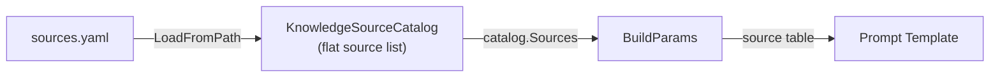
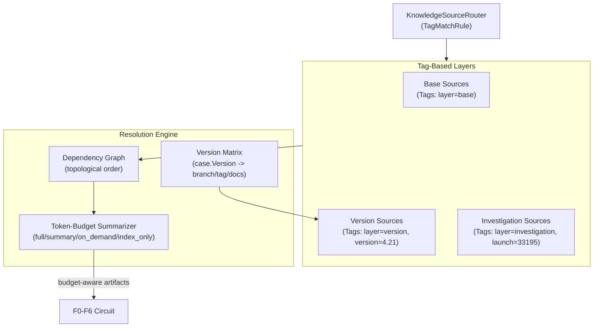

# Contract — Knowledge Source Evolution

**Status:** complete  
**Goal:** Layered knowledge source composition via `Source.Tags`, artifact dependency graph with topological resolution, token-budget-aware summarization circuit, documentation caching, and must-gather ingestion.  
**Serves:** Polishing & Presentation (vision)

## Contract rules

- Global rules only.
- This is a **future-phase** contract. Do not implement until `knowledge-source-migration.md` (Phase 1 migration + Phase 2 catalog) is complete.
- Backward-compatible with existing `KnowledgeSourceCatalog` consumers.

## Decomposition note

This contract is the third tier of a three-way split, now reframed on `origami/knowledge` primitives:

| Contract | Urgency | Scope |
|----------|---------|-------|
| ~~`workspace-mvp.md`~~ | ~~MUST~~ | ~~Wire RP attrs, Jira links, repo paths into prompts.~~ **Complete.** |
| `knowledge-source-migration.md` | SHOULD | Phase 1: Migrate 11 files to `origami/knowledge`. Phase 2: Artifact catalog, format registry, CI readers. |
| `knowledge-source-evolution.md` (this) | NICE | Layered composition via tags, dependency graph, token-budget summarization. |

## Context

- **Framework primitives (Origami `knowledge/`):** `Source{Name, Kind, URI, Purpose, Branch, Tags}`, `KnowledgeSourceCatalog{Sources}`, `KnowledgeSourceRouter` with `TagMatchRule` and `RequestTagMatchRule`.
- **Key insight:** `Source.Tags` replaces the layered workspace composition model. Instead of separate Base/Version/Investigation workspace objects, layers become tag queries: `Tags["layer"]="base"`, `Tags["version"]="4.21"`, `Tags["launch"]="33195"`. The router filters sources by tag, producing an effective catalog per context.
- **Metrics:** M9 (source selection precision), M10 (source selection recall), M11 (red-herring rejection).
- **Related:** `evidence-gap-brief.md` gap categories map 1:1 to artifact taxonomy domains (A-H below).

### Current architecture

After `knowledge-source-migration.md` completes:

Flat source list with no layering, no dependency resolution, no summarization.

### Desired architecture

Effective catalog = `Router.Route(Tags{layer: base})` + `Router.Route(Tags{layer: version, version: case.Version})` + `Router.Route(Tags{layer: investigation, launch: launch_id})`.

## Connection to Evidence Gap Brief

The `evidence-gap-brief.md` gap categories (`log_depth`, `source_code`, `ci_context`, `cluster_state`, `version_info`, `historical`, `jira_context`, `human_input`) map 1:1 to the artifact taxonomy domains below. Gap briefs are a **demand signal** for catalog expansion: repeated `log_depth` gaps mean CI job logs should be prioritized; `version_info` gaps mean RP launch attributes need surfacing.

## Artifact taxonomy reference

Preserved from prior analysis. Eight domains of knowledge sources:

- **A. Source code** — Git repos, history, file trees
- **B. Test execution data** — RP launch metadata, test items, logs, attachments
- **C. CI artifacts** — Job console logs, test result bundles, CI configs, S3 collect
- **D. Issue tracking** — Jira tickets, Bugzilla/Errata, GitHub issues
- **E. Documentation** — OCP docs, operator docs, Red Hat KB, internal wikis
- **F. Cluster / environment state** — must-gather, node logs, CRDs, image manifests
- **G. Prior knowledge** — Symptom database, prior RCAs, calibration history
- **H. Notification / trigger data** — CI notification email with all entry-point URLs

## Graceful degradation

### Resolution status model

Every source carries a resolution status:

| Status | Meaning |
|--------|---------|
| `resolved` | Content successfully fetched and available |
| `cached` | Available from catalog (may be stale; TTL-controlled) |
| `degraded` | Partial content (truncated log, summary only, wrong version) |
| `unavailable` | Fetch failed (network, auth, 404, timeout) |
| `unknown` | Resolution not yet attempted (lazy resolution) |

### Confidence impact matrix

| Source type | If missing | Confidence impact |
|---|---|---|
| Error message / log snippet | Critical | Cap at 0.30 |
| Full job console log | Moderate | Cap at 0.60 |
| Source code access | Moderate | Cap at 0.65 |
| RP launch attributes | Low-Moderate | -0.10 for env/version failures |
| Jira ticket context | Low | -0.05 |
| CI config | Low-Moderate | -0.10 for env/config failures |
| OCP documentation | Low | -0.05 for platform issues |
| Prior RCA | Low | Miss recall hit; no accuracy penalty |
| Cluster state | Variable | Critical for hardware/env; irrelevant for code bugs |

Values are tuning targets — determine experimentally via calibration.

### Explicit "I don't know" over hallucination

When a source is unavailable: state what was expected, list what conclusions cannot be drawn, suggest how the human can provide the missing data. Never fabricate content (guard G29: hallucinated-evidence).

## FSC artifacts

| Artifact | Target | Compartment |
|----------|--------|-------------|
| Knowledge source layering design | `docs/` | domain |
| Confidence impact calibration data | `notes/` | domain |

## Execution strategy

1. **Phase 3 (future):** Version matrix format, Git repo checkout with version-parametric branch selection, documentation caching (OCP docs, operator release notes), Jira integration.
2. **Phase 4 (distant):** Tag-based layered composition, artifact dependency graph with topological resolution, token-budget-aware summarization circuit, must-gather dump ingestion.

## Coverage matrix

| Layer | Applies | Rationale |
|-------|---------|-----------|
| **Unit** | yes | Version matrix resolution, tag-based layer filtering, dependency graph, summarizer |
| **Integration** | yes | Cross-source dependency resolution |
| **Contract** | no | No new public API; extends existing KnowledgeSourceCatalog |
| **E2E** | yes | Full circuit with layered sources produces correct per-case context |
| **Concurrency** | no | No shared state |
| **Security** | yes | Inherits catalog security concerns (A10, A01, A02, A06) |

## Tasks

### Phase 3 — Version-aware resolution

- [ ] **E1** Define version matrix format and resolution logic (`Source.Tags["version"]` -> branch/tag/docs URL)
- [ ] **E2** Implement Git repo checkout with version-parametric branch selection
- [ ] **E3** Implement documentation caching (OCP docs, operator release notes)
- [ ] **E4** Validate (green) — version matrix resolves correct branches per `case.Version`

### Phase 4 — Layered composition and dependency graph

- [ ] **E5** Define tag-based layer semantics: `Tags["layer"]` = `base` | `version` | `investigation`
- [ ] **E6** Implement `KnowledgeSourceRouter` layer queries to produce effective catalog per context
- [ ] **E7** Implement artifact dependency graph with topological resolution
- [ ] **E8** Implement token-budget-aware summarization circuit (strategies: `full`, `summary`, `on_demand`, `index_only`)
- [ ] **E9** Wire must-gather dump ingestion as a source kind
- [ ] **E10** Validate (green) — composition layers produce correct effective catalog per case
- [ ] **E11** Tune (blue) — confidence impact values via calibration experiments
- [ ] **E12** Validate (green) — all tests pass after tuning

## Acceptance criteria

- **Given** a `KnowledgeSourceCatalog` with sources tagged `layer=base`, `layer=version`, `layer=investigation`,
- **When** the router queries for `Tags{layer: version, version: "4.21"}`,
- **Then** only sources with matching tags are returned.

- **Given** an artifact dependency graph where Jira resolution depends on RP item data,
- **When** the resolver processes dependencies,
- **Then** RP items are fetched before Jira tickets (topological order).

- **Given** a 1.4 MB Jenkins console log in the catalog,
- **When** the summarizer applies `summary` strategy with a 4K token budget,
- **Then** the output is a concise error-focused extraction within budget.

- **Given** sources across versions 4.18 and 4.21,
- **When** `case.Version = "4.21"`,
- **Then** the version matrix resolves to `release-4.21` branches and 4.21 docs URLs.

## Security assessment

Inherits security concerns from `knowledge-source-migration.md` Phase 2 (catalog). Additional:

| OWASP | Finding | Mitigation |
|-------|---------|------------|
| A10 | Version matrix could map to arbitrary Git branches or documentation URLs. | Validate branch names against repo metadata. Documentation URLs must match allowlist. |
| A06 | must-gather dumps contain cluster state including secrets, certificates, and config. | Strip known sensitive paths (`/etc/kubernetes/pki/`, secrets) during ingestion. Never inject raw must-gather into prompts. |

## Connection to existing contracts

| Contract | Relationship |
|----------|-------------|
| **Persona system** | Persona source-binding maps to base/version layers via `Source.Tags`. |
| **Defect Dialectic** | Prosecution and defense share the same catalog. Discovery (D1) = expose catalog to defense. |
| **MCP dispatcher** | MCP tools expose catalog queries: `search_catalog`, `fetch_artifact`, `get_artifact_summary`. |
| **rp-adapter-v2** | `LogScope` feeds into catalog as a new source kind. |
| **RP E2E launch** | First real consumer of multi-source catalog. |

## Notes

- 2026-02-25 — Contract created. Replaces `workspace-revisited.md`. Reframed on `origami/knowledge` primitives: layered composition uses `Source.Tags` instead of separate workspace objects; `KnowledgeSourceRouter` with `TagMatchRule` provides the filtering. Phases 3-4 retained from original. Artifact taxonomy (Parts 1-6) condensed into reference section. Confidence impact matrix and degradation model preserved.
