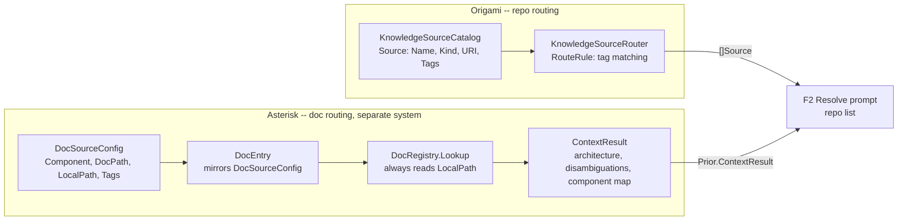
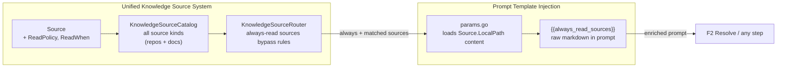

# Contract — Replace RTFM with Knowledge Source ReadPolicy

**Status:** complete  
**Goal:** Replace the Asterisk RTFM node (`context`) and its entire supporting package (`internal/rtfm/`) with `ReadPolicy` labels on Origami's `Source` type — mandatory documentation is routed by `KnowledgeSourceRouter` and injected directly into prompt templates via `{{always_read_sources}}`, eliminating the need for a dedicated graph node, dedicated types, or a separate doc routing system.  
**Serves:** Polishing & Presentation (should)

## Contract rules

- Changes span **two repos**: Origami (framework `Source` type, router logic) and Asterisk (delete `internal/rtfm/`, remove `context` node, update prompt templates).
- `ReadPolicy` is a framework-level concept on Origami's `Source`. Asterisk consumes it; Asterisk does not define its own parallel policy type.
- Backward compatible: sources without an explicit `ReadPolicy` default to `conditional` (existing behavior unchanged).
- The "always" policy means the source content is injected into every pipeline run regardless of tag matching or routing rules. It is mandatory prerequisite knowledge.
- The "conditional" policy means the source follows existing `RouteRule` logic — included only when tags match.
- `ReadWhen` is a human-readable condition string for conditional sources (e.g., "when investigating PTP operator failures"). It serves documentation and demo purposes, not runtime logic.
- **RTFM is fully superseded.** The `context` node, edges H6/H6b, `DocRegistry`, `DocEntry`, `DocSourceConfig`, and `ContextResult` are all deleted. No shims, no deprecation markers.

## Context

- **Completed `knowledge-source-catalog`** (Origami): `Source` type (`Name`, `Kind`, `URI`, `Purpose`, `Branch`, `Tags`), `KnowledgeSourceCatalog`, `KnowledgeSourceRouter` with `TagMatchRule` and `RequestTagMatchRule`. No read policy concept.
- **RTFM node** (Asterisk, to be deleted): `DocEntry` (`Component`, `DocPath`, `LocalPath`, `Tags`), `DocRegistry.Lookup`, `ContextResult` artifact. Always reads `LocalPath` when file exists — no policy labels.
- **Two parallel systems → one**: Origami's `Source`/`KnowledgeSourceCatalog` routes repos and APIs. Asterisk's `DocSourceConfig`/`DocEntry` routes documentation. They share no code despite solving the same problem. ReadPolicy unifies them: docs become `Source{Kind: SourceKindDoc, ReadPolicy: Always}` in the catalog.
- **What RTFM did (3 things, all replaced):**
  1. **Route** docs → replaced by `ReadPolicy: Always` on `Source` in `KnowledgeSourceRouter`
  2. **Read** content → replaced by prompt template parameter builder loading `Source.LocalPath`
  3. **Structure** output → replaced by injecting raw doc markdown into prompts via `{{always_read_sources}}`
- **Motivating example**: PTP architecture doc disambiguates `linuxptp-daemon` (pod name) from `linuxptp-daemon` (repo name). Without it, the agent selects the wrong repo. This doc becomes `Source{ReadPolicy: Always}` — mandatory domain knowledge injected into every prompt that needs it.
- **What gets deleted:**
  - `internal/rtfm/` (entire package)
  - `context` node from `asterisk-rca.yaml`
  - Edges H6 and H6b (triage→context→resolve becomes triage→resolve direct)
  - `DocSourceConfig` from `internal/calibrate/types.go`
  - `ContextResult` artifact type
  - `Prior.ContextResult` from prompt templates
- **Cross-references**:
  - `knowledge-source-evolution` (Asterisk, draft/vision) — layered composition, artifact dependency graph. This contract provides the policy primitive that evolution builds on.
  - `origami-marbles` (Origami, draft) — RTFM marble reference removed; superseded by ReadPolicy.
  - `principled-calibration-scorecard` (Both, draft) — ReadPolicy feeds into evidence quality (M12, M13).

### Current architecture

### Desired architecture

**Deleted:** `internal/rtfm/`, `DocRegistry`, `DocEntry`, `DocSourceConfig`, `ContextResult`, `context` node, edges H6/H6b.

## FSC artifacts

| Artifact | Target | Compartment |
|----------|--------|-------------|
| ReadPolicy design reference | `docs/read-policy.md` (Origami) | domain |

## Execution strategy

Phase 1 adds `ReadPolicy` and `ReadWhen` to Origami's `Source` type and updates the router to always include always-read sources. Phase 2 deletes `internal/rtfm/`, removes the `context` node from the pipeline YAML, deletes `DocSourceConfig`, and updates `params.go` to inject always-read source content via `{{always_read_sources}}`. Phase 3 converts existing PTP doc sources to `Source{ReadPolicy: Always}` in the knowledge catalog. Phase 4 validates across both repos.

## Coverage matrix

| Layer | Applies | Rationale |
|-------|---------|-----------|
| **Unit** | yes | Router always-read bypass, params.go injects always-read content, default policy backward compat |
| **Integration** | yes | Stub calibration passes without context node, always-read doc content appears in prompt |
| **Contract** | yes | Source struct fields, ReadPolicy enum values, router behavior with always-read sources |
| **E2E** | yes | Full pipeline walk with `context` node removed, always-read content injected, metrics unchanged |
| **Concurrency** | no | Source catalog is read-only at runtime |
| **Security** | no | No trust boundaries affected — local file reads, same as today |

## Tasks

### Phase 1 — ReadPolicy on Source (Origami)

- [ ] **P1** Add `ReadPolicy` type and constants (`ReadAlways`, `ReadConditional`) to `knowledge/source.go`
- [ ] **P2** Add `ReadPolicy ReadPolicy` and `ReadWhen string` fields to `Source` struct with `json:"read_policy,omitempty" yaml:"read_policy,omitempty"` and `json:"read_when,omitempty" yaml:"read_when,omitempty"` tags
- [ ] **P3** Update `KnowledgeSourceRouter.Route()` in `knowledge/router.go`: always include sources with `ReadPolicy == ReadAlways` regardless of rule matching. Deduplicate against rule-matched sources.
- [ ] **P4** Default behavior: sources with empty `ReadPolicy` or `ReadConditional` follow existing routing logic (backward compatible)
- [ ] **P5** Update `testdata/catalog.yaml` and `testdata/catalog.json` with example always-read and conditional sources
- [ ] **P6** Unit tests: router returns always-read sources even when no rule matches, conditional sources follow existing behavior, empty policy defaults to conditional, deduplication works

### Phase 2 — Delete RTFM, inject into prompts (Asterisk)

- [ ] **R1** Delete `internal/rtfm/` package entirely (registry.go and all tests)
- [ ] **R2** Remove `context` node from `pipelines/asterisk-rca.yaml`
- [ ] **R3** Remove edges H6 (triage→context) and H6b (context→resolve); add direct edge triage→resolve
- [ ] **R4** Delete `DocSourceConfig` from `internal/calibrate/types.go`
- [ ] **R5** Delete `ContextResult` artifact type and all references to `Prior.ContextResult` in prompt templates
- [ ] **R6** Update `internal/orchestrate/params.go`: add `AlwaysReadSources` field that loads `Source.LocalPath` content for all `ReadPolicy: Always` sources from the catalog
- [ ] **R7** Update prompt templates to use `{{always_read_sources}}` where RTFM content was previously consumed (F2_RESOLVE and any other templates that used `Prior.ContextResult`)
- [ ] **R8** Remove `lookupDomainContext` and related RTFM wiring from `internal/calibrate/parallel.go`
- [ ] **R9** Unit tests: `params.go` injects always-read content, prompt templates render with `{{always_read_sources}}`

### Phase 3 — Convert existing doc sources to catalog entries

- [ ] **L1** Register PTP architecture doc as `Source{Kind: SourceKindDoc, ReadPolicy: ReadAlways, LocalPath: "datasets/docs/ptp/architecture.md"}` in the knowledge catalog
- [ ] **L2** Remove `ptpDocSources()` from scenario code — replaced by catalog entries
- [ ] **L3** Add `ReadWhen` labels to conditional sources (forward-looking)
- [ ] **L4** Verify stub calibration still passes (`just calibrate-stub`)

### Phase 4 — Validate and tune

- [ ] Validate (green) — `go build ./...`, `go test ./...` across both repos. Stub calibration passes. RTFM node produces ContextResult with always-read doc.
- [ ] Tune (blue) — review ReadPolicy naming, ReadWhen label phrasing, router deduplication efficiency.
- [ ] Validate (green) — all tests still pass after tuning.

## Acceptance criteria

**Given** a `KnowledgeSourceCatalog` with one `ReadPolicy: always` source and one `ReadPolicy: conditional` source,  
**When** `KnowledgeSourceRouter.Route()` is called with a request that matches neither source's tags,  
**Then** only the always-read source is returned.

**Given** a `KnowledgeSourceCatalog` with one `ReadPolicy: always` source and one `ReadPolicy: conditional` source,  
**When** `KnowledgeSourceRouter.Route()` is called with a request that matches the conditional source's tags,  
**Then** both sources are returned (always-read + matched conditional).

**Given** a `Source` with no `ReadPolicy` set (empty string),  
**When** it is processed by the router,  
**Then** it behaves as `ReadConditional` (backward compatible — existing behavior unchanged).

**Given** the PTP architecture doc registered as `Source{ReadPolicy: ReadAlways}` in the catalog,  
**When** `params.go` builds prompt parameters for the F2_RESOLVE step,  
**Then** the doc content is injected into the prompt via `{{always_read_sources}}` without requiring a `context` node.

**Given** `pipelines/asterisk-rca.yaml` with the `context` node removed,  
**When** the pipeline graph is built,  
**Then** `triage` connects directly to `resolve` via a single edge. No context node exists in the graph.

**Given** `just calibrate-stub` with RTFM deleted and ReadPolicy injecting doc content,  
**When** the stub calibration runs,  
**Then** all metrics pass and M19 remains at previous levels (no regression from removing the context node).

## Security assessment

No trust boundaries affected. `ReadPolicy` is a metadata label on local source definitions. No new file access patterns — `DocRegistry` already reads local files. No external API calls introduced.

## Notes

2026-02-26 — Contract created. Motivated by the RTFM node implementation revealing that the PTP architecture doc is mandatory reading — without it, agents confuse `linuxptp-daemon` the pod with `linuxptp-daemon` the repo. The `Read: Always` / `Read: When...` labeling system makes this policy explicit and generalizable.

2026-02-26 — Contract reframed: RTFM is fully superseded by ReadPolicy. The `context` node did three things (route, read, structure) that are all handled by the routing layer + prompt template injection. **Deleted:** `internal/rtfm/`, `context` node, edges H6/H6b, `DocSourceConfig`, `ContextResult`. **Kept:** `ReadPolicy`/`ReadWhen` on `Source`, `KnowledgeSourceRouter` always-include logic, PTP doc as `Source{ReadPolicy: Always}`, raw doc content in prompts via `{{always_read_sources}}`.
