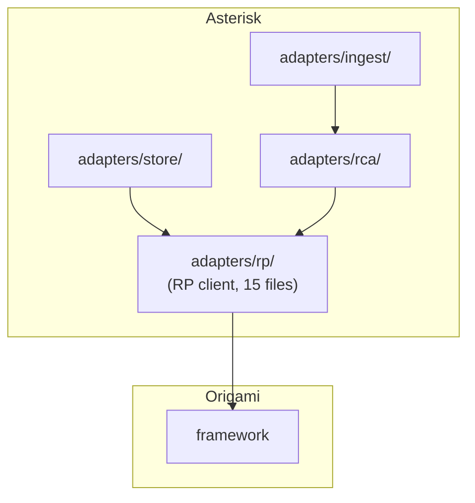
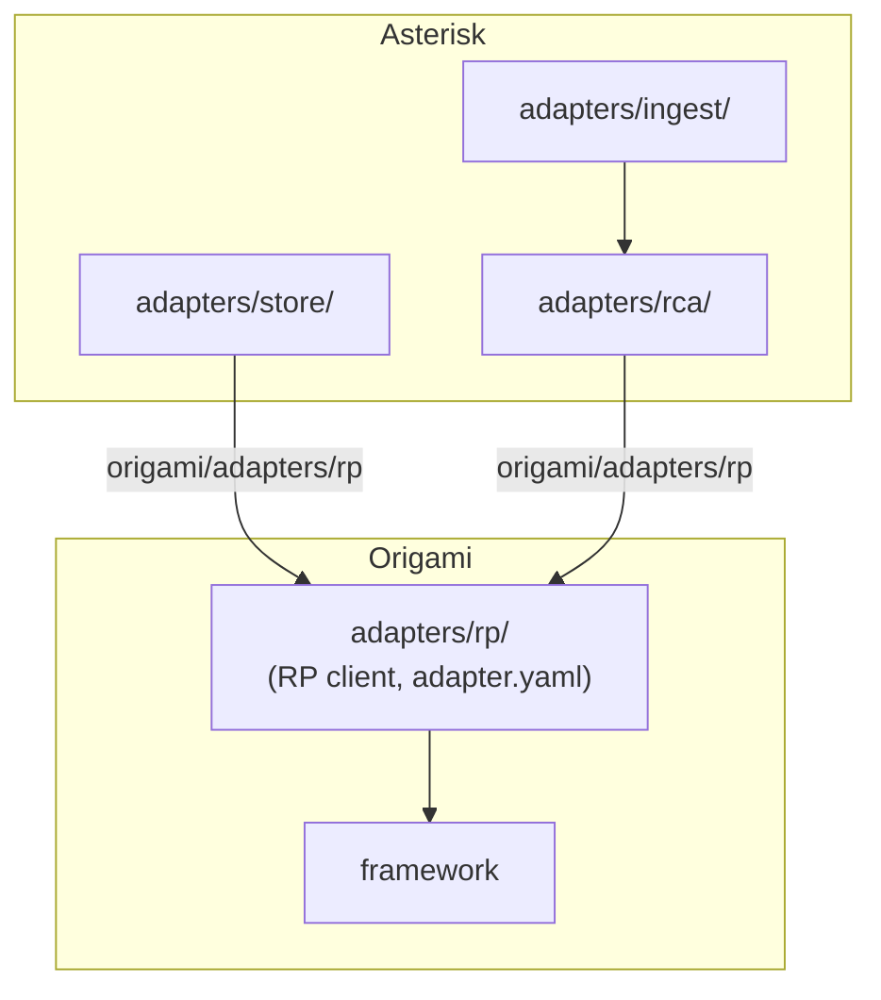

# Contract — adapter-migration

**Status:** draft  
**Goal:** The RP adapter lives in Origami; Asterisk imports it as a dependency.  
**Serves:** 100% DSL — Zero Go

## Contract rules

- Zero domain imports: Origami's RP adapter must not import from Asterisk or any consumer.
- Lift-and-drop: move files, update imports, verify green. No redesign.

## Context

Asterisk's `adapters/rp/` is a reusable ReportPortal I/O adapter (~600 LOC, 15 files): API client, envelope fetching, defect pushing, dataset ingestion. It imports only `origami/logging` and `origami/knowledge` — no Asterisk dependencies. This makes it a clean lift-and-drop to Origami, following the Ansible collection pattern where reusable plugins live in the engine/collection repo, not in the playbook repo.

### Current architecture



### Desired architecture



## FSC artifacts

Code only — no FSC artifacts.

## Execution strategy

Single workstream: move files, update imports, verify both repos green.

1. Create `origami/adapters/rp/` and copy all files from `asterisk/adapters/rp/`.
2. Update package path in all Go files (`package rp` stays, import paths change).
3. Update all Asterisk imports: `asterisk/adapters/rp` → `github.com/dpopsuev/origami/adapters/rp`.
4. Delete `asterisk/adapters/rp/`.
5. Verify both repos build and test green.

## Coverage matrix

| Layer | Applies | Rationale |
|-------|---------|-----------|
| **Unit** | yes | Origami `go test ./adapters/rp/...` must pass |
| **Integration** | yes | Asterisk `go build`, `go test`, `just calibrate-stub` |
| **Contract** | no | No API changes — same types, same functions |
| **E2E** | yes | `just calibrate-stub` must produce identical output |
| **Concurrency** | no | No concurrency changes |
| **Security** | yes | Review credential handling during move |

## Tasks

- [ ] Create `origami/adapters/rp/` and move all files from `asterisk/adapters/rp/`
- [ ] Update all Asterisk imports: `asterisk/adapters/rp` → `github.com/dpopsuev/origami/adapters/rp`
- [ ] Delete `asterisk/adapters/rp/`
- [ ] Verify Origami builds and tests green (`go build ./...`, `go test ./...`)
- [ ] Verify Asterisk builds and tests green (`go build ./...`, `go test ./...`, `just calibrate-stub`)
- [ ] Validate (green) — `just test-race` on both repos
- [ ] Tune (blue) — review adapter.yaml, clean up any stale references
- [ ] Validate (green) — all gates still pass

## Acceptance criteria

```gherkin
Scenario: RP adapter builds in Origami
  Given adapters/rp/ exists in the Origami repo
  When go build ./... is run in Origami
  Then build succeeds with zero errors

Scenario: Asterisk uses RP adapter from Origami
  Given Asterisk imports github.com/dpopsuev/origami/adapters/rp
  When go build ./... is run in Asterisk
  Then build succeeds with zero errors
  And just calibrate-stub produces identical output

Scenario: No RP code remains in Asterisk
  Given the Asterisk repo
  When listing adapters/rp/
  Then the directory does not exist
```

## Security assessment

| OWASP | Finding | Mitigation |
|-------|---------|------------|
| A01: Broken Access Control | RP adapter moves to higher-visibility location | Review `client.go` for credential handling; ensure tokens come from env/config, never hardcoded |

## Notes

2026-02-27 23:00 — Scoped down to RP adapter move only. SQLite DSL work split into its own contract `sqlite-dsl-adapter`. This contract is now a clean lift-and-drop.
