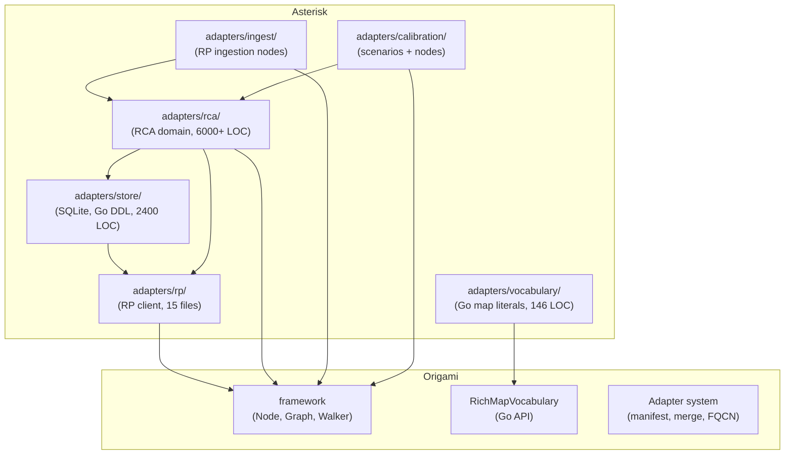
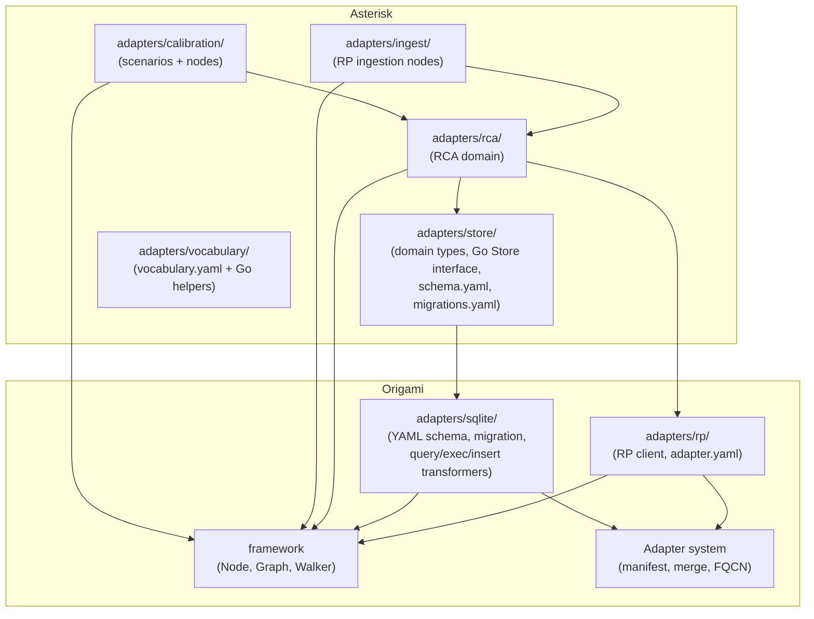

# Contract — adapter-migration

**Status:** draft  
**Goal:** Reusable adapters (RP, SQLite) live in Origami with DSL-defined schemas; Asterisk consumes them.  
**Serves:** Polishing & Presentation (pure-DSL vision)

## Contract rules

- Zero domain imports: Origami adapters must not import from Asterisk or any consumer.
- Ansible collection pattern: generic operations in the framework, domain schema/data in the consumer.
- Each workstream must leave both repos building and testing green before the next begins.


## Context

Asterisk has six adapter directories. Two need migration work:

| Adapter | LOC | Category | Action |
|---------|-----|----------|--------|
| `rp/` | ~600 | Reusable RP I/O | Lift-and-drop to Origami |
| `store/` | ~2,400 | SQLite persistence | DSL schema in Origami framework; domain stays |
| `vocabulary/` | ~146 | Display names | Covered by `scenario-dsl-extraction` contract Task 6 |
| `calibration/` | — | Scenarios | Covered by `scenario-dsl-extraction` contract |
| `ingest/` | ~760 | RP ingestion nodes | Stays (not pure; domain logic in Go nodes) |
| `rca/` | ~6,000+ | RCA domain | Deferred to separate deep dive contract |

**Ansible SQLite collection precedent:** `ttafsir.sqlite_utils` provides `create` (schema as YAML columns/pk/defaults), `insert` (records as YAML dicts), `run_sql` (parameterized queries), and `lookup` — all declarative. No SQL in the playbook. This is the model for Workstream 2.

### Current architecture



### Desired architecture



## FSC artifacts

| Artifact | Target | Compartment |
|----------|--------|-------------|
| Adapter migration pattern (Ansible-style) | `docs/` | domain |
| SQLite DSL schema spec | Origami `docs/` | domain  |

## Execution strategy

Two workstreams, executed in dependency order:

**WS1 first** (RP adapter move) — lift-and-drop `rp/` to Origami. Asterisk import paths updated.

**WS2 second** (SQLite DSL) — depends on WS1 (store/ imports rp/Envelope, path changes). Implements YAML schema definition, migration DSL, and query/exec/insert transformers in Origami. Asterisk's schema.go becomes schema.yaml + migrations.yaml.

Each workstream builds and tests green before the next starts.

## Coverage matrix

| Layer | Applies | Rationale |
|-------|---------|-----------|
| **Unit** | yes | Schema parser, migration engine, transformer round-trips |
| **Integration** | yes | Asterisk `go build`, `go test` after each import path change; `just calibrate-stub` end-to-end |
| **Contract** | yes | SQLite schema YAML validation |
| **E2E** | yes | `just calibrate-stub` must produce identical results before and after |
| **Concurrency** | yes | SQLite adapter must handle concurrent reads (MemStore in tests, SqlStore in walk) |
| **Security** | yes | RP adapter moves to a more visible location; review for credential handling, URL construction |

## Tasks

### WS1: RP Adapter to Origami (lift-and-drop)

- [ ] Create `origami/adapters/rp/` and move all files from `asterisk/adapters/rp/`
- [ ] Update all Asterisk imports: `asterisk/adapters/rp` → `github.com/dpopsuev/origami/adapters/rp`
- [ ] Verify Origami builds and tests green (`go build ./...`, `go test ./...`)
- [ ] Verify Asterisk builds and tests green

### WS2: SQLite DSL Adapter (Origami + Asterisk)

- [ ] Design YAML schema format for table definitions (columns, types, pk, not_null, defaults, unique, foreign_keys, indexes)
- [ ] Implement `origami/adapters/sqlite/` package: schema parser, DDL generator from YAML
- [ ] Implement migration DSL: versioned YAML operations (create_table, add_column, rename_table, raw_sql for complex data migration)
- [ ] Implement `sqlite.query`, `sqlite.exec`, `sqlite.insert` transformers (Ansible-style parameterized operations)
- [ ] Implement `MemDB` (in-memory SQLite for testing)
- [ ] Convert `asterisk/adapters/store/schema.go` DDL strings to `schema.yaml` + `migrations/v1-to-v2.yaml`
- [ ] Refactor `SqlStore` and `MemStore` to use Origami's SQLite adapter underneath
- [ ] Unit tests: schema round-trip, migration engine, transformer CRUD

### Tail

- [ ] Validate (green) — `go build`, `go test`, `just calibrate-stub`, `just test-race` on both repos
- [ ] Tune (blue) — review YAML schemas for consistency; clean up dead Go code
- [ ] Validate (green) — all gates still pass after tuning

## Acceptance criteria

```gherkin
Feature: RP Adapter in Origami

  Scenario: RP adapter builds in Origami
    Given adapters/rp/ exists in the Origami repo
    When go build ./... is run in Origami
    Then build succeeds with zero errors

  Scenario: Asterisk uses RP adapter from Origami
    Given Asterisk imports github.com/dpopsuev/origami/adapters/rp
    When go build ./... is run in Asterisk
    Then build succeeds with zero errors
    And just calibrate-stub produces identical output

Feature: SQLite DSL Schema

  Scenario: Schema defined as YAML
    Given a schema.yaml with table "symptoms" (columns, pk, indexes)
    When the SQLite adapter parses and applies it
    Then the resulting DDL matches the expected CREATE TABLE + CREATE INDEX

  Scenario: Migration from YAML
    Given a migrations/v1-to-v2.yaml with rename_table and create_table operations
    When the migration engine runs against a v1 database
    Then the database schema matches v2
    And existing data is preserved

  Scenario: Query transformer
    Given a pipeline node using sqlite.query transformer
    And params: {breed: "Tabby"}
    When the node executes
    Then it returns rows matching the parameterized query

  Scenario: Schema stays reviewable
    Given schema.yaml in Asterisk
    When a developer modifies a column
    Then git diff shows the YAML change (not embedded Go SQL strings)
```

## Security assessment

| OWASP | Finding | Mitigation |
|-------|---------|------------|
| A03: Injection | SQLite query/exec transformers accept parameterized queries | Enforce parameterized queries only; reject string interpolation in transformer input |
| A01: Broken Access Control | RP adapter moves to Origami (higher visibility) | Review `client.go` for credential handling; ensure tokens come from env/config, never hardcoded |

## Notes

2026-02-27 22:00 — Removed WS3 (vocabulary DSL). Vocabulary extraction stays in `scenario-dsl-extraction` contract Task 6. This contract now covers two workstreams: RP adapter lift-and-drop, SQLite DSL adapter.
2026-02-27 21:30 — Contract drafted. Two adapter migration workstreams: RP adapter lift-and-drop, SQLite DSL adapter (Ansible collection pattern). Store schema moves from Go SQL strings to YAML. RCA deep dive deferred to separate contract.
