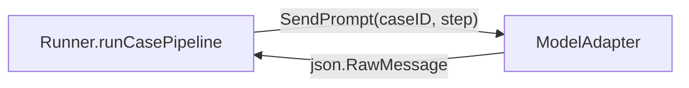
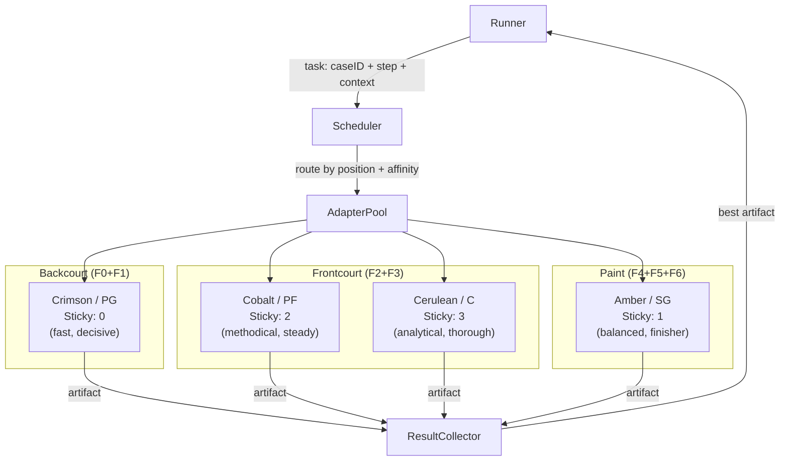

# Contract — Agent Adapter Overloading

**Status:** draft  
**Goal:** Multiple adapters operate concurrently within a single calibration run, with a Scheduler routing each pipeline step to the best-suited adapter based on task characteristics and adapter personality profiles.  
**Serves:** Architecture evolution

## Contract rules

- The `ModelAdapter` interface remains backward-compatible. Existing adapters (stub, basic, cursor) must work unchanged when run solo.
- The Scheduler is the most critical component. Its routing decisions must be observable (logged, scored, reviewable).
- Single-adapter mode (`--adapter basic`) stays the default. Multi-adapter mode is opt-in via `--adapters basic,cursor --strategy affinity`.
- Every routing decision is a testable assertion: "for step X with context Y, the scheduler chose adapter Z."

## Context

- `notes/phase-5a-post-run-analysis.md` — CursorAdapter M14b=0.22 (better smoking-gun detection) but M2=0.00 (wrong taxonomy); BasicAdapter M19=0.83 overall. Neither adapter dominates all dimensions.
- `internal/calibrate/adapter.go` — current `ModelAdapter` interface: `Name()` + `SendPrompt(caseID, step, prompt)`.
- `internal/calibrate/dispatch/mux.go` — `MuxDispatcher` already supports concurrent routing by `dispatch_id`.
- `internal/calibrate/parallel.go` — errgroup + token semaphore for parallel case processing.
- `contracts/completed/multi-subagent/adaptive-subagent-scheduler.md` — quality-driven batch sizing within one adapter; this contract extends routing across adapters.
- `contracts/draft/defect-court.md` — adversarial prosecution/defense/judge roles become specialized adapters once this contract's Scheduler exists.
- `contracts/draft/phase-5a-mitigation.md` — parent mitigation plan; color system is Item 2.
- `contracts/draft/subagent-testing-framework.md` — extracted testing infrastructure (RoutingLog, RoutingRecorder, replay mode, color-tagged logs). Prerequisite for verifiable routing assertions.

## Current Architecture

Single adapter per calibration run, selected via `--adapter` flag. Every pipeline step for every case goes through the same adapter.



Key interfaces: `ModelAdapter` (`Name()` + `SendPrompt()`) in `internal/calibrate/adapter.go`. The runner calls `cfg.Adapter.SendPrompt()` directly — no routing, no selection, no fallback. `MuxDispatcher` supports concurrent dispatch by `dispatch_id` but only within one adapter.

## Desired Architecture

Multiple color-coded adapters registered in a pool with trait profiles. A Scheduler routes each task (case + step + context) to the best-suited adapter by color personality. A ResultCollector aggregates when multiple adapters produce competing artifacts.



The Scheduler is the critical new component. It supports pluggable strategies: affinity (static step-to-adapter map), confidence escalation (fast-first, escalate if low), tournament (fan-out to N, pick best), and learned routing (metric-trained model). `PassthroughScheduler` wraps a single adapter for backward compatibility.

## Color-Coded Subagent Identity System

Each adapter gets a color name from [Wikipedia's color list](https://en.wikipedia.org/wiki/List_of_colors:_A%E2%80%93F) that encodes its personality along two axes: **temperature** (warm = fast/aggressive, cool = slow/analytical) and **saturation** (vivid = opinionated, muted = neutral).

### PoC palette (4 colors) with court positions

Each color maps to a basketball-inspired court position with a stickiness gradient (0 = anti-sticky, 3 = heavy-sticky). Stickiness controls whether a subagent resumes context for the same case across pipeline steps.

| Color | Hex | Position | Sticky | Home Zone | Personality | Step Affinity (weight) | Maps to |
|-------|-----|----------|--------|-----------|-------------|----------------------|---------|
| **Crimson** | #DC143C | Point Guard (PG) | 0 | Backcourt (F0+F1) | Antagonistic, decisive. Fast rejection, high throughput. | F0 (1.0), F1 (1.0), F4 (0.5) | BasicAdapter |
| **Cerulean** | #007BA7 | Center (C) | 3 | Frontcourt (F2+F3) | Analytical, thorough. Deep investigation, evidence-first. Full context accumulation. | F3 (1.0), F2 (0.9), F5 (0.5) | CursorAdapter |
| **Amber** | #FFBF00 | Shooting Guard (SG) | 1 | Paint (F4+F5+F6) | Balanced, finisher. Catches investigation handoff, closes cases. | F4 (0.8), F5 (0.9), F6 (0.9), F1 (0.3) | Future creative adapter |
| **Cobalt** | #0047AB | Power Forward (PF) | 2 | Frontcourt (F2+F3) | Methodical, steady. Regular investigations, convergence-first. | F2 (1.0), F3 (0.8) | CursorAdapter variant |

Position details (from the subagent position system design):

- **PG (Crimson, sticky 0):** Never resumes for the same case. Churns all F0+F1 intake, then floats to wherever backlog exists. After Backcourt empties, shifts to Frontcourt for F2 overflow only (never F3 — investigation needs stickiness).
- **SG (Amber, sticky 1):** Resumes within Paint meta-phase only. Catches the "kick out" from Frontcourt agents — investigation artifacts are self-contained for close-out.
- **PF (Cobalt, sticky 2):** Resumes for the same case within Frontcourt. Handles regular investigations that converge on first or second try. Drops context when case exits to Paint.
- **C (Cerulean, sticky 3):** Always resumes. Full context from F2 through F6 for hard cases (multi-repo, multiple convergence loops, ambiguous errors). Maximizes M14b smoking gun hits.

### Extended palette (for growth)

| Family | Colors | Trait cluster |
|--------|--------|---------------|
| **Reds** (warm, vivid) | Crimson, Cardinal, Scarlet, Vermilion | Fast, aggressive, opinionated, pruning-oriented |
| **Blues** (cool, deep) | Cerulean, Cobalt, Azure, Sapphire | Slow, analytical, evidence-gathering, thorough |
| **Yellows** (warm, bright) | Amber, Aureolin, Canary, Citrine | Exploratory, creative, lateral-thinking, pattern-matching |
| **Purples** (cool, muted) | Amethyst, Byzantine, Eminence, Finn | Judicial, impartial, meta-reasoning, conflict-resolution |
| **Greens** (neutral, balanced) | Emerald, Fern, Celadon, Cambridge | Collaborative, synthesizing, consensus-building |

### Color as engineering identity

The color system serves three audiences:
1. **Pitch viewers**: "Crimson rejected the hypothesis in 2s, then Cerulean built the evidence chain" — narrative, memorable, personal connection
2. **Developers**: Deterministic assertions — `assert routing[F1] == "crimson"`, `assert routing[F3] == "cerulean"`
3. **Operators**: Log lines tagged with color — `[crimson] F1 triage: product_bug (0.92)`, `[cerulean] F3 investigate: 4 commits analyzed`

### AdapterTraits with color and position

```go
type Position string

const (
    PositionPG Position = "PG" // Point Guard — Backcourt
    PositionSG Position = "SG" // Shooting Guard — Paint
    PositionPF Position = "PF" // Power Forward — Frontcourt
    PositionC  Position = "C"  // Center — Frontcourt
)

type MetaPhase string

const (
    Backcourt  MetaPhase = "Backcourt"  // F0 + F1
    Frontcourt MetaPhase = "Frontcourt" // F2 + F3
    Paint      MetaPhase = "Paint"      // F4 + F5 + F6
)

type AdapterTraits struct {
    Color           string             // "crimson", "cerulean", "cobalt", "amber"
    DisplayName     string             // "Crimson Agent"
    Hex             string             // "#DC143C" (for UI rendering)
    Position        Position           // PG, SG, PF, C
    HomeZone        MetaPhase          // Backcourt, Frontcourt, Paint
    StickinessLevel int                // 0 (anti-sticky) to 3 (heavy-sticky)
    SpeedClass      SpeedClass         // Fast, Medium, Slow
    StepAffinity    map[string]float64 // step -> preference weight (0.0-1.0)
    PersonalityTags []string           // ["antagonistic", "decisive", "pruning"]
    PromptPreamble  string             // personality-injected preamble for prompts
    CostProfile     CostProfile
}
```

The `AffinityScheduler` in Phase 1 uses both `StepAffinity` weights and `StickinessLevel` when routing:
1. Filter adapters whose `StepAffinity[step] > 0`.
2. Among candidates, prefer the one with the highest affinity weight.
3. For sticky adapters (level >= 2), check if the same adapter handled the prior step for this case — if so, prefer it even if another adapter has higher raw affinity.
4. For anti-sticky adapters (level 0), never resume — always fresh dispatch.

## Execution strategy

Four phases, each self-contained and independently shippable. Phase 1 is the minimum viable product; later phases layer on top.

### Phase 1: AdapterPool + Affinity Scheduler

Introduce the three-layer architecture (AdapterPool, Scheduler, ResultCollector) with the simplest routing strategy: a static step-to-adapter affinity table.

```
Runner → Scheduler.Route(task) → AdapterPool → selected adapter → artifact → Runner
```

- `AdapterPool`: registry of `ModelAdapter` instances with `AdapterTraits` (speed class, step affinity, cost profile).
- `Scheduler` interface: `Route(task Task) (ModelAdapter, error)`.
- `AffinityScheduler`: config-driven map of step → preferred adapter.
- CLI: `--adapters basic,cursor --strategy affinity` (comma-separated adapter list, strategy selector).
- Single-adapter backward compat: `--adapter basic` still works (pool of one, passthrough scheduler).

### Phase 2: Confidence Escalation

After an artifact is returned, check convergence score. If below threshold, re-route to a deeper adapter.

- Escalation chain: stub → basic → cursor (fast to slow, cheap to expensive).
- Budget-aware: skip escalation if token budget is exhausted.
- Observable: log escalation events with original score, threshold, and target adapter.

### Phase 3: Tournament + Ensemble

Fan-out the same task to N adapters concurrently. Collect all artifacts, apply selection strategy.

- `ResultCollector` with pluggable strategies: best-score, ensemble merge, arbiter (judge adapter picks).
- Enables A/B testing of adapter quality within a single calibration run.
- The arbiter strategy is the bridge to Defect Court (the judge adapter evaluates competing artifacts).

### Phase 4: Learned Routing

Use accumulated calibration metrics to build a routing model.

- Per-step, per-case-type accuracy profiles from historical runs.
- Online learning: update routing weights after each scored run.
- Goal: the system improves its own routing decisions over time.

## Tasks

### Phase 1 — AdapterPool + Affinity Scheduler

- [ ] Define `AdapterTraits` struct: color, display name, hex, **position, home zone, stickiness level**, speed class, step affinity map, cost profile, personality tags, prompt preamble
- [ ] Define `Position` and `MetaPhase` types with constants (PG/SG/PF/C and Backcourt/Frontcourt/Paint)
- [ ] Define `Task` struct: case ID, step, context (artifact history, convergence score, case metadata)
- [ ] Define `Scheduler` interface: `Route(ctx context.Context, task Task) (ModelAdapter, error)`
- [ ] Implement `AdapterPool`: register adapters with traits, lookup by name, iterate
- [ ] Implement `AffinityScheduler`: static step-to-adapter map from config
- [ ] Implement `PassthroughScheduler`: wraps a single adapter (backward compat for `--adapter`)
- [ ] Wire into `runner.go`: replace `cfg.Adapter.SendPrompt()` with `cfg.Scheduler.Route(task).SendPrompt()`
- [ ] Wire into `cmd_calibrate.go`: `--adapters` flag, `--strategy` flag, pool construction
- [ ] Add `AdapterTraits` to existing adapters: stub (no color, no position), basic (Crimson/PG, sticky 0), cursor (Cerulean/C, sticky 3). For single-adapter mode, position defaults to PG (anti-sticky).
- [ ] Add Cobalt/PF (sticky 2) and Amber/SG (sticky 1) trait profiles for future adapters
- [ ] Implement color-tagged log output: `[crimson] F1 triage: ...`, `[cerulean] F3 investigate: ...`
- [ ] Validate (green) — all existing tests pass, single-adapter mode unchanged
- [ ] Tune (blue) — refactor for quality, no behavior changes
- [ ] Validate (green) — all tests still pass after tuning

### Phase 2 — Confidence Escalation

- [ ] Add `EscalationScheduler`: wraps an inner scheduler, checks artifact convergence, re-routes if below threshold
- [ ] Define escalation chain ordering via `AdapterTraits.SpeedClass`
- [ ] Budget-aware gate: skip escalation when token budget is above threshold
- [ ] Log escalation events with original adapter, score, threshold, target adapter
- [ ] Validate (green) — escalation triggers correctly in stub calibration
- [ ] Tune (blue) — refactor
- [ ] Validate (green) — all tests pass

### Phase 3 — Tournament + Ensemble

- [ ] Implement `ResultCollector` interface: `Select(artifacts []ScoredArtifact) (json.RawMessage, error)`
- [ ] Implement `BestScoreCollector`: pick highest convergence score
- [ ] Implement `TournamentScheduler`: fan-out to N adapters, collect via `ResultCollector`
- [ ] Wire concurrent fan-out using errgroup + token semaphore
- [ ] Validate (green) — tournament produces correct winner in stub scenario
- [ ] Tune (blue) — refactor
- [ ] Validate (green) — all tests pass

### Phase 4 — Learned Routing (future)

- [ ] Design routing model schema: per-step accuracy profiles, update rules
- [ ] Implement `LearnedScheduler`: load profiles, route by predicted accuracy
- [ ] Online update: record routing decisions and outcomes per calibration run
- [ ] Validate + Tune cycle

## Acceptance criteria

- **Given** a calibration run with `--adapters basic,cursor --strategy affinity`,
- **When** the runner processes F0 Recall,
- **Then** the Scheduler routes to BasicAdapter (fast heuristic affinity).

- **Given** a calibration run with `--adapters basic,cursor --strategy affinity`,
- **When** the runner processes F3 Investigation,
- **Then** the Scheduler routes to CursorAdapter (deep reasoning affinity).

- **Given** a calibration run with `--adapter basic` (single adapter, no strategy flag),
- **When** the runner processes any step,
- **Then** behavior is identical to the current system (PassthroughScheduler, zero overhead).

- **Given** a calibration run with `--strategy escalation --escalation-threshold 0.6`,
- **When** BasicAdapter returns an F1 Triage artifact with convergence 0.4,
- **Then** the Scheduler escalates to CursorAdapter for a second attempt.

- **Given** a calibration run with `--strategy tournament --adapters basic,cursor`,
- **When** both adapters return artifacts for the same step,
- **Then** the ResultCollector selects the artifact with the highest convergence score.

## Notes

- 2026-02-19 01:00 — Contract created. Motivated by Phase 5a analysis showing complementary strengths across adapters (BasicAdapter M19=0.83, CursorAdapter M14b=0.22). Neither dominates — the system needs routing intelligence.
- The Scheduler-as-meta-adapter pattern (where the Scheduler itself implements `ModelAdapter`) is deferred to Phase 3 exploration. Phase 1 keeps Scheduler and ModelAdapter as separate concerns.
- Defect Court's prosecution/defense/judge roles map naturally to this system: they are specialized adapters routed by the Scheduler in a tournament/arbiter configuration.
- 2026-02-19 04:00 — Color-coded subagent identity system added (Phase 5a mitigation Item 2). PoC palette: Crimson (fast/decisive → BasicAdapter), Cerulean (analytical/thorough → CursorAdapter), Amber (exploratory/creative → future), Amethyst (judicial/impartial → Defect Court judge). Extended palette families defined for growth. Subagent mux testing framework with deterministic dispatch assertions, color-tagged logs, and replay mode.
- 2026-02-19 06:00 — **PoC scope trimming**: For SHOULD-tier execution, only Phase 1 (AdapterPool + AffinityScheduler + PassthroughScheduler + color traits on existing adapters) is in scope. Phases 2-4 (confidence escalation, tournament/ensemble, learned routing) are deferred to post-PoC. Phase 1 delivers: color identity for pitch demo, deterministic routing assertions, backward-compatible single-adapter mode. Execution order: 5th of 6 SHOULD contracts.
- 2026-02-19 — **Testing framework extracted** to `contracts/draft/subagent-testing-framework.md`. Removed the "Subagent Mux Testing Framework" section (former lines 102-127) and Phase 1 test helper task. Testing infrastructure is now a separate prerequisite contract to keep concerns separated: multi-adapter architecture vs. testing/observability.
- 2026-02-20 — **Absorbed by `agentic-framework-III.1-personae.md`.** Phase 1 scope (AdapterPool, AffinityScheduler, color traits, position system) is fully covered by the Framework personae contract. AdapterTraits becomes AgentIdentity with Element and Alignment axes added. Phases 2-4 (escalation, tournament, learned routing) remain deferred.
- 2026-02-20 — **Position system diffusion**: Added `Position`, `MetaPhase`, `StickinessLevel`, and `HomeZone` to `AdapterTraits`. Replaced Amethyst (Defect Court judge, out of scope for PoC) with Cobalt (Power Forward / Frontcourt). PoC palette now maps 1:1 to basketball positions: Crimson/PG (Backcourt), Cobalt/PF (Frontcourt), Cerulean/C (Frontcourt), Amber/SG (Paint). AffinityScheduler routing updated to consider stickiness when selecting adapters. Design source: subagent position system brainstorm.