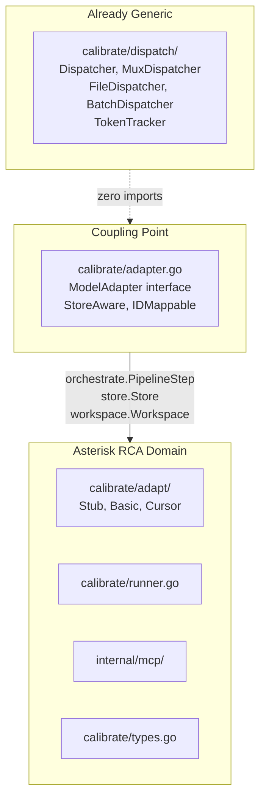
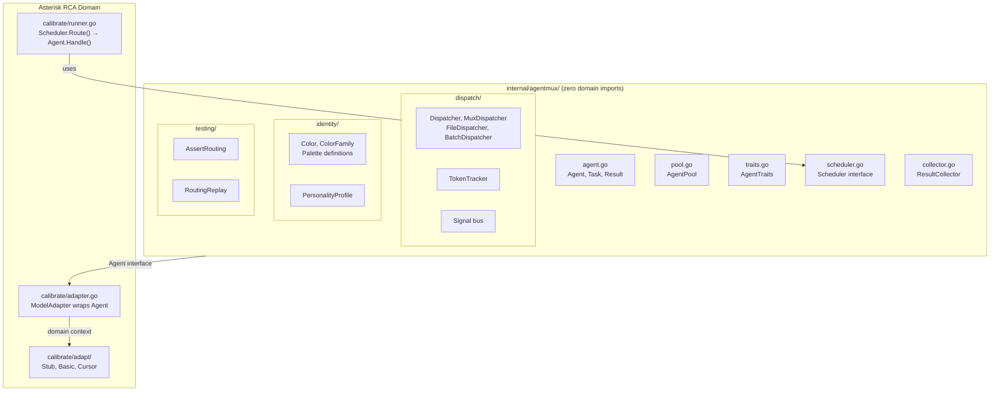

# Contract — AgentMux Decoupling

**Status:** draft  
**Goal:** Extract the generic multi-agent orchestration system (dispatch, scheduling, color identity, token tracking, testing) from Asterisk's RCA domain into `internal/agentmux/` — a self-contained package tree with zero domain imports, positioned for future extraction into a standalone repository.  
**Serves:** Architecture evolution (NICE — enables reuse beyond Asterisk)

## Contract rules

- The `internal/agentmux/` package tree must have **zero imports** from Asterisk domain packages (`internal/orchestrate`, `internal/store`, `internal/workspace`, `internal/rp`, `internal/preinvest`, `internal/calibrate`).
- Existing adapter implementations (Stub, Basic, Cursor) stay in `internal/calibrate/adapt/`. They implement the generic `Agent` interface via thin wrappers.
- Backward compatibility: `--adapter basic` (single-adapter mode) must work identically after refactoring. `PassthroughScheduler` wraps a single agent.
- This contract does not implement new scheduling strategies. It establishes the package boundary and generic interfaces only.
- Follow contract-sizing rule: this is a NICE-to-have. Do not block PoC work.

## Current Architecture

The dispatch package is already nearly generic (zero domain imports except one `internal/format` reference in `token.go`). The coupling point is the `ModelAdapter` interface in `adapter.go`, which takes `orchestrate.PipelineStep` — an RCA-specific typed enum.



### Coupling audit

| Location | Current coupling | Severity |
|----------|-----------------|----------|
| `dispatch/token.go` | Imports `internal/format` for table rendering | Trivial — move formatting to caller |
| `dispatch/*.go` (all others) | Zero domain imports | Already clean |
| `adapter.go` | `orchestrate.PipelineStep` in `SendPrompt` signature | The primary coupling seam |
| `adapter.go` | `store.Store`, `store.Case`, `workspace.Workspace` in `StoreAware` | Domain-specific optional interfaces |
| `adapt/*.go` | Full domain imports (`orchestrate.*`, `store.*`, etc.) | Expected — these are domain adapters |
| `runner.go` | Calls `cfg.Adapter.SendPrompt()` directly | Caller side of the seam |

## Desired Architecture

A clean `internal/agentmux/` package tree with zero domain imports. Asterisk's `calibrate/` package consumes it through a thin adapter bridge.



## Context

- `internal/calibrate/dispatch/` — 7 files, zero domain imports (except `internal/format` in `token.go`). Already generic.
- `internal/calibrate/adapter.go` — `ModelAdapter` interface with `orchestrate.PipelineStep` coupling.
- `internal/calibrate/adapt/` — Stub, Basic, Cursor adapter implementations. Full domain imports.
- `internal/calibrate/runner.go` — Calls `cfg.Adapter.SendPrompt()`. Uses `dispatch.TokenTracker`.
- `contracts/draft/agent-adapter-overloading.md` — Defines `AdapterPool`, `Scheduler`, `ResultCollector`, `AdapterTraits`, color system. All generic concepts.
- `contracts/draft/phase-5a-mitigation.md` — Item 2: color-coded subagent identity. Generic concept.
- `contracts/draft/defect-court.md` — Role-separated adapters (prosecution/defense/judge). Uses generic routing, domain-specific pipeline steps.

## Execution strategy

Two phases. Phase 1 is the contract scope. Phase 2 is future extraction.

### Phase 1: Internal package split (this contract)

Move generic orchestration code into `internal/agentmux/` with sub-packages. Introduce the generic `Agent` interface. Bridge existing `ModelAdapter` to `Agent` in `calibrate/adapter.go`. Only 2 files need signature changes.

### Phase 2: Standalone repository (future, post-PoC)

When the API stabilizes after PoC and at least one other project wants to use it, `git subtree split` or copy-and-clean extracts `internal/agentmux/` into `github.com/redhat-qe/agentmux` (or similar). Asterisk imports it as a dependency. Zero refactoring needed because the package boundary is already clean.

## The generic Agent interface

```go
package agentmux

type Agent interface {
    Name() string
    Handle(ctx context.Context, task Task) (Result, error)
}

type Task struct {
    ID     string            // opaque identifier ("case-7" in Asterisk, anything elsewhere)
    Step   string            // opaque step name ("F1" in Asterisk, "review" in another project)
    Prompt string            // input payload
    Meta   map[string]string // extensible metadata
}

type Result struct {
    Payload json.RawMessage
    Score   float64           // optional quality signal for routing decisions
    Meta    map[string]string
}
```

Asterisk bridges the domain to this interface:

```go
// In calibrate/adapter.go
func (a *adapterBridge) Handle(ctx context.Context, task agentmux.Task) (agentmux.Result, error) {
    step := orchestrate.PipelineStepFromString(task.Step)
    raw, err := a.inner.SendPrompt(task.ID, step, task.Prompt)
    return agentmux.Result{Payload: raw}, err
}
```

## Package layout

```
internal/
  agentmux/                    # Generic agent orchestration
    agent.go                   # Agent, Task, Result interfaces
    pool.go                    # AgentPool (registry with traits)
    traits.go                  # AgentTraits (color, speed, personality, cost)
    scheduler.go               # Scheduler interface + PassthroughScheduler
    collector.go               # ResultCollector interface + BestScoreCollector
    dispatch/                  # MOVED from calibrate/dispatch/
      dispatcher.go            # Dispatcher, DispatchContext, ExternalDispatcher
      mux.go                   # MuxDispatcher
      file.go                  # FileDispatcher
      batch.go                 # BatchFileDispatcher
      token.go                 # TokenTracker (format dependency removed)
      manifest.go              # BatchManifest
      lifecycle.go             # FinalizeSignals
    identity/                  # Color system
      color.go                 # Color, ColorFamily, palette definitions
      personality.go           # PersonalityProfile, trait tags
    testing/                   # Mux test helpers
      assertions.go            # AssertRouting, AssertColor
      replay.go                # RoutingReplay, LoadReplay
  calibrate/                   # Asterisk RCA domain (unchanged)
    adapter.go                 # ModelAdapter wraps agentmux.Agent
    adapt/                     # Stub, Basic, Cursor implementations
    runner.go                  # Uses agentmux.Scheduler
    types.go                   # Scenario, GroundTruth, CaseResult
```

## Tasks

### Phase 1 — Package boundary

- [ ] Create `internal/agentmux/agent.go` with `Agent`, `Task`, `Result` interfaces
- [ ] Create `internal/agentmux/traits.go` with `AgentTraits` (color, speed, personality tags, cost profile)
- [ ] Create `internal/agentmux/pool.go` with `AgentPool` (register, lookup by name, iterate)
- [ ] Create `internal/agentmux/scheduler.go` with `Scheduler` interface + `PassthroughScheduler`
- [ ] Create `internal/agentmux/collector.go` with `ResultCollector` interface + `BestScoreCollector`
- [ ] Move `internal/calibrate/dispatch/` → `internal/agentmux/dispatch/` (update all import paths)
- [ ] Remove `internal/format` dependency from `token.go` (move formatting to caller)
- [ ] Create `internal/agentmux/identity/color.go` with palette definitions
- [ ] Create `internal/agentmux/identity/personality.go` with personality profiles
- [ ] Create `internal/agentmux/testing/assertions.go` with routing assertion helpers
- [ ] Bridge `ModelAdapter` → `Agent` in `calibrate/adapter.go`
- [ ] Update `runner.go` to use `Scheduler.Route()` → `Agent.Handle()` (with `PassthroughScheduler` as default for backward compat)
- [ ] Update all import paths across `calibrate/`, `adapt/`, `mcp/`, `cmd/`
- [ ] Validate — `go build ./...`, all existing tests pass, single-adapter mode unchanged
- [ ] Tune — verify zero domain imports in `agentmux/` package tree (`go list -deps`)
- [ ] Validate — all tests still pass after tuning

## Acceptance criteria

- **Given** `go list -deps ./internal/agentmux/...` is run,
- **When** the output is inspected,
- **Then** no Asterisk domain packages appear (`internal/orchestrate`, `internal/store`, `internal/workspace`, `internal/rp`, `internal/preinvest`, `internal/calibrate`).

- **Given** a calibration run with `--adapter basic` (single adapter, no scheduler),
- **When** the full test suite and stub calibration run,
- **Then** behavior is identical to pre-refactor (PassthroughScheduler, zero overhead).

- **Given** the `internal/agentmux/` package tree,
- **When** a hypothetical external project imports it,
- **Then** it compiles without pulling in any Asterisk-specific types.

## Security assessment

| OWASP | Finding | Mitigation |
|-------|---------|------------|
| A04 | The `Task.Meta` map accepts arbitrary key-value pairs. Consumers must validate meta content before acting on it. | Document that `Meta` is opaque transport; consumers are responsible for validation. |

## Notes

- 2026-02-20 — **Absorbed by `agentic-framework-I.1-ontology.md`.** The generic Agent interface becomes Walker; Task becomes NodeContext; Result becomes Artifact. Package target changed from `internal/agentmux/` to `internal/framework/`. This contract's scope is fully covered by the Framework ontology contract.
- 2026-02-19 05:00 — Contract created from architectural coupling assessment. Key finding: `dispatch/` package already has zero domain imports. The coupling seam is exactly one type: `orchestrate.PipelineStep` in the `ModelAdapter.SendPrompt` signature. Only 2 files need signature changes (`adapter.go`, `runner.go`). Classified as NICE-to-have: the refactoring enables reuse but does not block PoC.
- The concept of color-coded multi-agent orchestration with personality-based routing, confidence escalation, and tournament consensus is domain-agnostic. Use cases beyond RCA: code review, test generation, document analysis, any heterogeneous AI pipeline.
- Phase 2 extraction target: `github.com/redhat-qe/agentmux` or similar. Deferred until API stabilizes post-PoC and at least one other project expresses interest.
