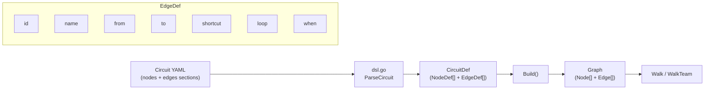
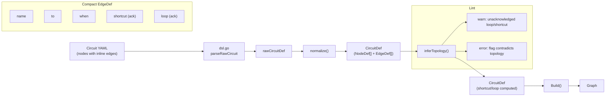

# Contract — Circuit DSL Shorthand

**Status:** draft  
**Goal:** Circuit YAML uses cohesive node-scoped edges, auto-inferred topology flags, and implicit defaults — cutting boilerplate ~50% without losing explicitness.  
**Serves:** 100% DSL — Zero Go

## Contract rules

- Backward compatibility: both verbose (current) and compact forms must parse to the same `CircuitDef`. No migration required.
- Auto-inference must be deterministic: given the same YAML, the same shortcuts/loops are always computed.
- Existing circuits must parse and behave identically without modification.

## Context

Design evolved through iterative discussion ([Circuit DSL design session](66be52b6-6924-4dad-8855-0f4805f73825)):

1. Started with one-liner edges — too dense, hard to diff.
2. Moved to 2-line `from -> to` + `when:` — better but lacked cohesion.
3. Applied cohesion principle: node + its outbound edges together.
4. Dropped `->` arrow — indentation already implies outbound direction.
5. Kept explicit `name:` on both nodes and edges (Ansible convention).
6. `shortcut:` / `loop:` become acknowledgment flags: auto-inferred from topology, optional in YAML to suppress lint warnings, error if they contradict the inferred topology.

### Current architecture



### Desired architecture



## FSC artifacts

| Artifact | Target | Compartment |
|----------|--------|-------------|
| DSL syntax reference | `docs/circuit-dsl.md` | domain |
| Topology inference design note | `notes/` | domain |

## Execution strategy

Three phases, each independently shippable:

**Phase 1 — Compact parsing (Origami).** Add `rawCircuitDef` / `rawNodeDef` with inline `edges:` support. Normalize into canonical `CircuitDef`. Both verbose and compact forms produce identical output. Existing tests pass unchanged.

**Phase 2 — Topology inference (Origami).** Compute `IsShortcut()` / `IsLoop()` from graph topology using topological sort from `start` node. Add lint rules: warn on unacknowledged inference, error on contradicting flags. LSP inlay hints for inferred edge types.

**Phase 3 — Consumer migration (Asterisk).** Rewrite all three circuit YAMLs in compact form. No behavioral change — just shorter, more cohesive files.

## Coverage matrix

| Layer | Applies | Rationale |
|-------|---------|-----------|
| **Unit** | yes | Parsing: verbose/compact equivalence, edge normalization, ID generation, topology inference |
| **Integration** | yes | Full circuit walk produces identical results with compact vs verbose YAML |
| **Contract** | yes | `CircuitDef` output shape unchanged — compact is syntactic sugar |
| **E2E** | yes | `calibrate-stub` passes with rewritten circuit YAMLs |
| **Concurrency** | no | Parsing is single-threaded; walker behavior unchanged |
| **Security** | no | No trust boundaries affected |

## Tasks

### Phase 1 — Compact parsing

- [ ] Add `rawCircuitDef` / `rawNodeDef` types with inline `edges:` field
- [ ] Implement `rawCircuitDef.normalize()` → `CircuitDef` (expand `from:` from parent node, auto-generate `id:`)
- [ ] Support `edges: [target]` flow-style for unconditional single-target edges
- [ ] When `name == family`, allow omitting `family:` (implicit from name)
- [ ] Tests: verbose/compact equivalence, edge cases (no edges, single edge, mixed forms)
- [ ] Existing circuit YAML tests pass unchanged

### Phase 2 — Topology inference

- [ ] Implement `inferTopology(def *CircuitDef)` — topological sort from `start`, classify edges as shortcut/loop
- [ ] Walker uses inferred flags (not just YAML-declared) for `IncrementLoop`
- [ ] Lint rule: warn on unacknowledged shortcut/loop (inferred but no YAML flag)
- [ ] Lint rule: error when YAML flag contradicts inferred topology
- [ ] LSP inlay hints showing inferred `← loop` / `→ shortcut` on edges
- [ ] Tests: inference correctness on DAGs, diamonds, multi-path graphs

### Phase 3 — Consumer migration

- [ ] Rewrite `asterisk-rca.yaml` in compact form
- [ ] Rewrite `asterisk-calibration.yaml` in compact form
- [ ] Rewrite `asterisk-ingest.yaml` in compact form
- [ ] Add onboarding comments to rewritten files
- [ ] Validate (green) — `calibrate-stub` 21/21, `test-race`, `origami lint --profile strict`
- [ ] Tune (blue) — refactor for quality. No behavior changes.
- [ ] Validate (green) — all tests still pass after tuning.

## Acceptance criteria

```gherkin
Given a circuit YAML with inline node-scoped edges
When parsed by the framework
Then the resulting CircuitDef is identical to the verbose equivalent

Given an edge that goes backward in topological order
When the circuit is loaded
Then the framework infers IsLoop() == true
And the loop counter increments on traversal
And lint warns if `loop: true` is absent
And lint errors if `loop: false` is declared

Given an edge that skips intermediate nodes
When the circuit is loaded
Then the framework infers IsShortcut() == true
And lint warns if `shortcut: true` is absent
And lint errors if `shortcut: false` is declared

Given the three Asterisk circuits rewritten in compact form
When calibrate-stub runs
Then all 21/21 metrics pass with identical values
```

## Security assessment

No trust boundaries affected. Parsing changes are input validation only; no new I/O, no credentials, no network calls.

## Notes

2026-03-04 19:45 — Contract created from iterative design session. Key decisions: cohesive node-scoped edges, `name:` explicit on both nodes and edges, topology flags as acknowledgments not declarations, backward-compatible parsing via rawCircuitDef normalization.
