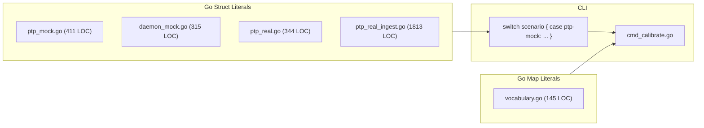
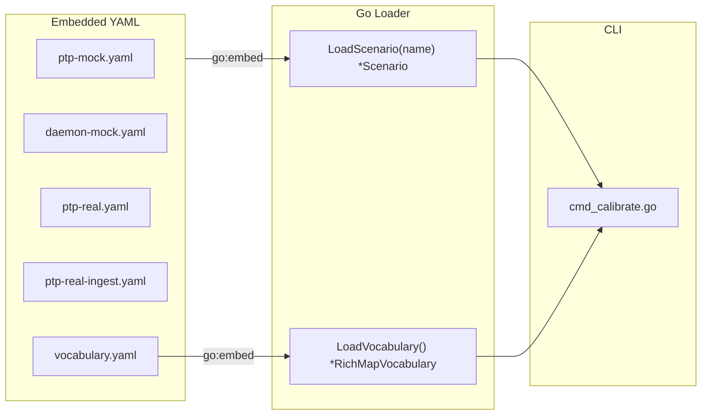

# Contract — data-dsl-extraction

**Status:** draft  
**Goal:** All calibration scenarios and vocabulary defined as YAML files; zero Go struct literals for ground truth data.  
**Serves:** Polishing & Presentation (pure-DSL vision)

## Contract rules

- Every scenario YAML must round-trip: load → marshal → reload → compare. No silent data loss.
- The `Scenario` Go types keep their `json:"..."` tags. YAML loading uses the same field names.
- No new Go dependencies for YAML parsing — use `gopkg.in/yaml.v3` (already transitive via Origami).

## Context

Asterisk's calibration scenarios are ~2,900 lines of Go struct literals across four files in `adapters/calibration/scenarios/`. Every field already has `json:"..."` tags, making the types fully serializable. The vocabulary registry is another ~145 lines of Go map literals. Both are pure data masquerading as code.

This contract converts them to YAML, adds a loader, and removes the hardcoded scenario `switch` in `cmd_calibrate.go`.

Related: the Pure DSL Cleanup (commit `e5ab4d7`) eliminated Go-closure heuristics. This contract continues that trajectory — data out of Go, into YAML.

### Current architecture

### Desired architecture

## FSC artifacts

Code only — no FSC artifacts.

## Execution strategy

Bottom-up: define the YAML schema, convert one scenario as proof, then mechanically convert the rest. Vocabulary is independent and can be done in parallel. CLI migration is last since it depends on the loader.

1. Build the YAML loader for `Scenario` (reuse existing JSON tags via `yaml:"...,omitempty"` or a JSON-compatible YAML decoder).
2. Convert `ptp-mock` first (smallest non-trivial scenario, used by `calibrate-stub`). Verify with `just calibrate-stub`.
3. Mechanically convert the remaining three scenarios.
4. Extract vocabulary to YAML.
5. Replace the hardcoded `switch` with embed-based discovery.
6. Delete the four Go scenario files and the Go vocabulary map literals.

## Coverage matrix

| Layer | Applies | Rationale |
|-------|---------|-----------|
| **Unit** | yes | Round-trip test: load YAML, compare fields to expected values. Vocabulary loader test. |
| **Integration** | yes | `just calibrate-stub` must produce identical results before and after. |
| **Contract** | no | No API boundary changes — internal refactor. |
| **E2E** | yes | `just calibrate-stub` is the E2E gate. |
| **Concurrency** | no | Scenario loading is init-time, single-goroutine. |
| **Security** | no | See Security assessment. |

## Tasks

- [ ] YAML loader: `LoadScenario(name string) (*rca.Scenario, error)` with `//go:embed scenarios/*.yaml`
- [ ] Convert `ptp_mock.go` to `scenarios/ptp-mock.yaml`; add round-trip test; delete Go file
- [ ] Convert `daemon_mock.go` to `scenarios/daemon-mock.yaml`; delete Go file
- [ ] Convert `ptp_real.go` to `scenarios/ptp-real.yaml`; delete Go file
- [ ] Convert `ptp_real_ingest.go` to `scenarios/ptp-real-ingest.yaml`; delete Go file
- [ ] Extract vocabulary tables to `adapters/vocabulary/vocabulary.yaml` + YAML loader; delete Go map literals
- [ ] Replace hardcoded scenario `switch` in `cmd_calibrate.go` with loader-based discovery
- [ ] Validate (green) — `go build`, `go test`, `just calibrate-stub`, `just test-race`
- [ ] Tune (blue) — review YAML for consistency, field naming, comments
- [ ] Validate (green) — all gates still pass after tuning

## Acceptance criteria

- **Given** a user runs `asterisk calibrate --scenario=ptp-mock`, **when** the scenario is loaded, **then** it comes from `scenarios/ptp-mock.yaml` (not Go code).
- **Given** `adapters/calibration/scenarios/`, **when** listing `.go` files, **then** zero scenario struct-literal files remain (only the loader).
- **Given** `adapters/vocabulary/vocabulary.go`, **when** inspecting it, **then** it contains a YAML loader, not hardcoded map literals.
- **Given** `just calibrate-stub`, **when** run before and after, **then** the report output (metrics, paths, scores) is identical.
- **Given** a new scenario YAML placed in `scenarios/`, **when** `--scenario=<name>` is used, **then** it loads without recompilation (for non-embedded scenarios loaded from disk).

## Security assessment

No trust boundaries affected. Scenarios are embedded at compile time or loaded from the local filesystem by the operator. No user-supplied YAML from untrusted sources.

## Notes

2026-02-27 22:00 — Restored Task 6 (vocabulary extraction). Vocabulary stays in this contract as a standalone YAML file with loader.
2026-02-27 20:15 — Contract drafted from DSL purity assessment. Scenarios are the single biggest non-DSL surface remaining in Asterisk (~2,900 lines of Go struct literals).
