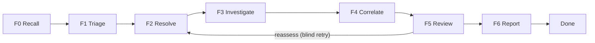
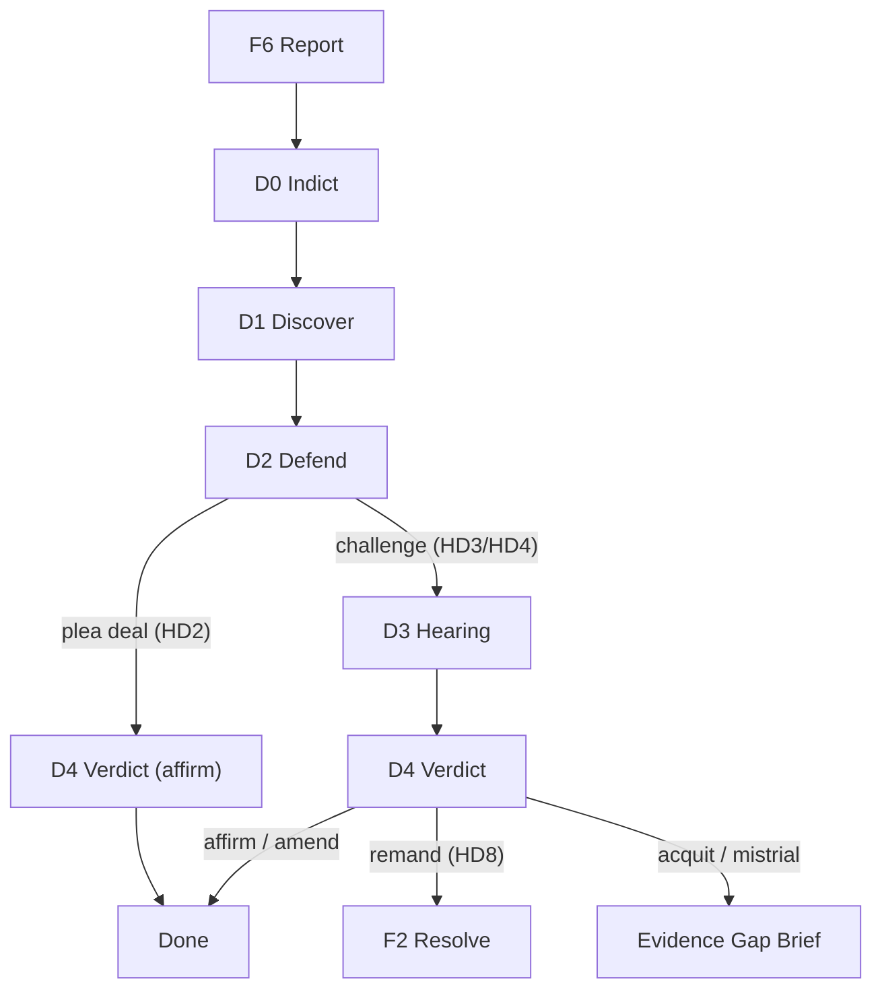
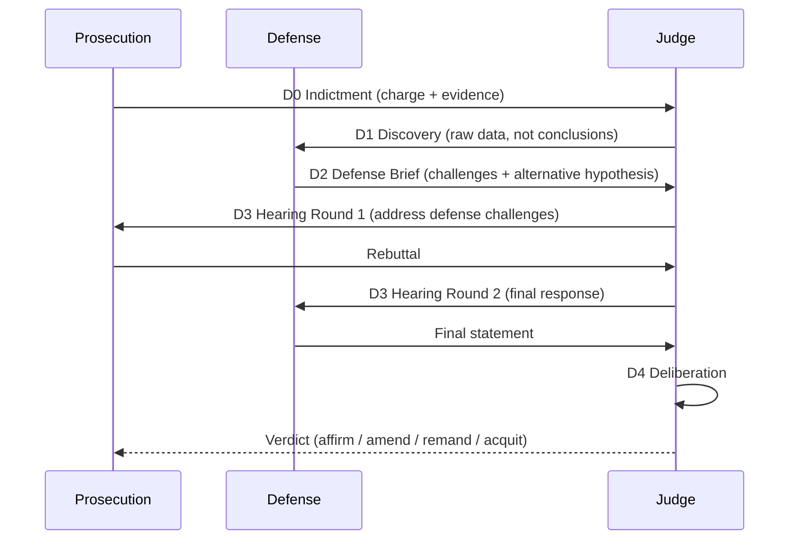

# Contract — Defect Court

**Status:** draft  
**Goal:** Extend the F0-F6 investigation pipeline with an adversarial "Defect Court" phase (D0-D4) where a prosecution brief, defense consul, and judicial verdict replace the single-perspective review, feeding contested findings back to investigation for reassessment. Future phase — post-MCP integration.  
**Serves:** Architecture evolution

## Contract rules

- Global rules only.
- This is a **future-phase** contract. Do not implement until MCP integration is operational.
- The court phase is **optional** and **additive** — it follows F6 and does not modify F0-F6 behavior.
- Fast-track (plea deal) must exist so easy cases bypass full adversarial review.
- Role separation is mandatory: prosecution, defense, and judge must use different adapter instances with different objectives.

## Context

- **Current pipeline:** F0-F6 (Recall, Triage, Resolve, Investigate, Correlate, Review, Report)
- **Current weakness:** Single-perspective analysis with confirmation bias. F5 Review is a rubber stamp (BasicAdapter always approves). No alternative hypotheses are considered.
- **Inspiration:** US federal criminal trial process — investigation, indictment, discovery, defense preparation, hearing, verdict, appeal/remand.
- **Baseline accuracy:** BasicAdapter M19 = 0.93 on ptp-real-ingest. The ~7% error rate is concentrated in ambiguous cases (product vs automation, component A vs component B).

## Metaphor mapping

The current F0-F6 pipeline is the **police and prosecutor** — it investigates, gathers evidence, and charges the defect. The court phase adds:

- **D0 Indictment** — Package the prosecution's case (from F6 output) into a formal charge with itemized evidence
- **D1 Discovery** — Make all raw failure data available to the defense (same data the prosecution saw, NOT the prosecution's conclusions)
- **D2 Defense** — Defense consul independently analyzes raw data, then reviews prosecution case, builds challenges and alternative hypotheses
- **D3 Hearing** — Structured adversarial exchange: prosecution argues, defense rebuts, possibly multiple rounds
- **D4 Verdict** — Judge weighs both sides, issues ruling (affirm, amend, acquit, or remand)

The **remand** path is the key feedback loop: if the judge finds the evidence insufficient, the case goes back to F2/F3 with the defense's specific challenges as structured feedback, transforming blind retry into targeted inquiry.

The **plea deal** fast-path handles easy cases: when prosecution confidence is very high and the defense concedes, skip directly to verdict.

## Current Architecture

Linear F0-F6 pipeline with single-perspective review. F5 Review is a rubber stamp (BasicAdapter always approves). No alternative hypotheses, no adversarial challenge, no structured feedback on reinvestigation.



All steps use the same adapter. The F5-to-F2 reassess loop is a blind retry with no structured feedback about what was wrong.

## Desired Architecture

F6 Report feeds into an adversarial court phase (D0-D4) with role-separated adapters. The remand path provides structured feedback to F2/F3, replacing blind retry with targeted reinvestigation.



Role interaction during a contested case:



## Architecture

### New pipeline steps

```
StepD0Indict   = "D0_INDICT"
StepD1Discover = "D1_DISCOVER"
StepD2Defend   = "D2_DEFEND"
StepD3Hearing  = "D3_HEARING"
StepD4Verdict  = "D4_VERDICT"
```

### New artifact types

- **Indictment** (D0) — charged defect type, component, prosecution narrative, itemized evidence with weights (primary/corroborating/circumstantial), prosecution confidence
- **DefenseBrief** (D2) — challenges to specific evidence items (with severity: fatal/weakening/minor), alternative hypothesis (if any), mitigating factors, plea deal flag, motion to dismiss flag
- **HearingRecord** (D3) — rounds of prosecution argument + defense rebuttal + judge notes
- **Verdict** (D4) — decision (affirm/amend/acquit/remand), final defect type, final component, confidence, reasoning, dissent (if multiple judges), remand reason and target step

### New heuristic rules

| Rule | Stage | Condition | Action |
|------|-------|-----------|--------|
| HD1 | D0 | Prosecution confidence >= 0.95 | Fast-track to D2 (defense may plea-deal) |
| HD2 | D2 | Defense plea-deal (concedes) | Skip to D4 with affirm |
| HD3 | D2 | Defense motion to dismiss | D3 Hearing (prosecution must respond) |
| HD4 | D2 | Defense has alternative hypothesis | D3 Hearing |
| HD5 | D3 | Hearing complete (max rounds or convergence) | D4 Verdict |
| HD6 | D4 | Verdict = affirm | Done (prosecution's classification stands) |
| HD7 | D4 | Verdict = amend | Done (judge's amended classification) |
| HD8 | D4 | Verdict = remand | Back to F2/F3 with defense feedback |
| HD9 | D4 | Verdict = acquit | Done (mark unclassified, needs human) |
| HD10 | any | Wall-clock TTL exceeded | Mistrial — emit Evidence Gap Brief with "time exhausted" |
| HD11 | any | Handoff counter exceeded | Mistrial — emit Evidence Gap Brief with "deliberation exhausted" |
| HD12 | D4 | Verdict = mistrial | Judge explicitly declares unresolvable — emit Evidence Gap Brief |

### Multi-adapter architecture

The court requires role-separated adapters:

- **ProsecutionAdapter** — the existing pipeline adapter (reused); presents the case
- **DefenseAdapter** — separate adapter with adversarial objective; challenges the prosecution
- **JudgeAdapter** — separate adapter with neutral objective; weighs both sides

For BasicAdapter: `BasicDefenseAdapter` (skeptical keyword rules) and `BasicJudgeAdapter` (confidence comparison). For MCP/CursorAdapter: different system prompts per role.

### Remand feedback (structured, not blind)

The existing F5 reassess loop says "try again." A court remand provides structured feedback:

- Which evidence items were challenged and why
- The defense's alternative hypothesis with supporting evidence
- Specific questions the reinvestigation must address

This transforms reinvestigation from blind retry to targeted inquiry.

After the remand limit is reached, the system must produce an Evidence Gap Brief instead of retrying. The gap brief carries the defense's unresolved challenges as structured gap items.

### TTL and handoff limits

The court phase has configurable resource bounds to prevent unbounded deliberation:

- **Wall-clock TTL:** maximum duration for the entire D0-D4 phase per case. Configured via `CourtConfig.TTL`. If exceeded at any stage, the current step is interrupted and the case goes to mistrial (HD10).
- **Handoff counter:** incremented each time the case moves between roles (prosecution -> defense -> judge -> remand -> prosecution). Maximum configured via `CourtConfig.MaxHandoffs`. Prevents infinite deliberation loops (HD11).
- **Remand limit:** maximum number of D4-to-F2/F3 remand cycles. Configured via `CourtConfig.MaxRemands`. Default: 2. After exhaustion, the case must reach a final verdict or mistrial. This is a subset of the handoff counter but specifically tracks remand depth.

```go
type CourtConfig struct {
    Enabled     bool          `json:"enabled"`
    TTL         time.Duration `json:"ttl"`
    MaxHandoffs int           `json:"max_handoffs"`
    MaxRemands  int           `json:"max_remands"`
}
```

### Mistrial outcome

A **mistrial** is not a failure — it is the system's honest declaration that the available evidence is insufficient for a confident verdict. The mistrial artifact is a superset of the Evidence Gap Brief (see `evidence-gap-brief.md`):

- Prosecution's best classification with confidence
- Defense's challenges and alternative hypotheses
- Judge's reasoning for why the case is unresolvable
- Structured `EvidenceGap` items (shared type from `evidence-gap-brief.md`)
- Court metadata: which role identified each gap, at which stage (D0-D4)
- Termination reason: `time_exhausted` | `deliberation_exhausted` | `judge_declared`

The `EvidenceGap` type is shared between the pipeline-level gap brief and the court-level mistrial brief. Court extends it with:

```go
type CourtEvidenceGap struct {
    EvidenceGap
    IdentifiedBy string `json:"identified_by"` // prosecution, defense, judge
    AtStage      string `json:"at_stage"`       // D0-D4
}
```

## Benefit assessment

**Real benefit, not just novelty.** Adversarial systems are proven in AI alignment (Constitutional AI, debate-based reasoning, red-teaming). The ~7% error rate is concentrated in ambiguous cases — exactly where adversarial review helps most. The plea-deal mechanism keeps overhead proportional to difficulty.

Estimated impact:
- BasicAdapter (heuristic): modest improvement (M19 0.93 -> 0.94-0.95)
- LLM-based adapters (MCP): significant improvement (M19 -> 0.96-0.98)
- Cost: 2-3x tokens for contested cases, near-zero for plea-deal cases

## Implementation phases

### Phase 1 — Data structures and plumbing
- [ ] Add D0-D4 step constants and artifact types (including `Mistrial`) to `internal/orchestrate/types.go`
- [ ] Add court heuristic rules (HD1-HD12) to `internal/orchestrate/heuristics.go`
- [ ] Extend state machine for D0-D4 transitions, remand paths, and mistrial exits
- [ ] Add `CourtConfig` (with `TTL`, `MaxHandoffs`, `MaxRemands`) to `internal/calibrate/types.go`
- [ ] Share `EvidenceGap` type with `evidence-gap-brief.md` — court extends it as `CourtEvidenceGap`

### Phase 2 — BasicAdapter court roles (heuristic baseline)
- [ ] Implement `BasicDefenseAdapter` (skeptical keyword rules)
- [ ] Implement `BasicJudgeAdapter` (confidence comparison)
- [ ] Wire into calibrate runner as post-F6 phase

### Phase 3 — Calibration metrics for court
- [ ] New metrics: verdict flip rate, defense challenge accuracy, remand effectiveness
- [ ] Ground truth extension: `ExpectedVerdict` on `GroundTruthCase`

### Phase 4 — LLM-based court (requires MCP)
- [ ] Prosecution, defense, and judge system prompts
- [ ] Multi-round hearing with structured JSON exchange
- [ ] Remand feedback integration with F2/F3

## Acceptance criteria

- **Given** the F0-F6 pipeline produces a defect classification with low confidence,
- **When** the Defect Court phase (D0-D4) runs with adversarial defense and judicial review,
- **Then** the final verdict has higher accuracy than the prosecution's original classification.

- **Given** a case where the prosecution correctly classifies the defect with high confidence,
- **When** the Defect Court fast-tracks via plea deal,
- **Then** overhead is near-zero (no full hearing).

- **Given** a court remand back to F2/F3,
- **When** the reinvestigation runs with the defense's structured feedback,
- **Then** the second-pass classification addresses the defense's specific challenges.

- **Given** the court's wall-clock TTL or handoff counter is exceeded,
- **When** the case cannot reach a verdict within those bounds,
- **Then** a mistrial is declared with an Evidence Gap Brief that includes the prosecution's best guess, defense challenges, and structured gap items.

## Dependencies

| Contract | Status | Required for |
|----------|--------|--------------|
| `mcp-server-foundation.md` | Pending | LLM-based adapters need MCP transport |
| `mcp-pipeline-tools.md` | Pending | Court phase reuses pipeline tool infrastructure |
| `rp-e2e-launch.md` | Active | PoC gate must pass before court phase |

## Files affected

- `internal/orchestrate/types.go` — new step constants and artifact types
- `internal/orchestrate/heuristics.go` — new court heuristic rules (HD1-HD12)
- `internal/orchestrate/state.go` — state machine extension for D0-D4
- `internal/calibrate/types.go` — CourtConfig, court-related CaseResult fields
- `internal/calibrate/runner.go` — post-F6 court phase execution
- `internal/calibrate/metrics.go` — new court metrics
- `internal/calibrate/adapt/` — new defense and judge adapter implementations
- New: `internal/court/` — court-specific orchestration logic
- Shared: `EvidenceGap` type from `evidence-gap-brief.md` contract — court extends with `CourtEvidenceGap`

## Security assessment

Implement these mitigations when executing this contract.

| OWASP | Finding | Mitigation |
|-------|---------|------------|
| A03 | Prosecution, defense, and judge adapters exchange structured data. If one role's output is injected into another role's prompt without sanitization, prompt injection between roles is possible (SEC-003 extended to court context). | All inter-role data must be treated as untrusted input. Structured JSON exchange only (no raw text injection). Validate schema before injecting into prompts. |
| A04 | TTL and handoff limits are a DoS mitigation (good). Without them, a malicious or buggy defense adapter could force infinite remand loops. | Already mitigated by HD10-HD12. This is a deliberate security design decision. |
| A08 | Court artifacts (prosecution brief, defense brief, verdict) are unsigned. A tampered verdict could alter the RCA outcome. | Acceptable risk for PoC (SEC-005 accepted-risk). For MVP: add artifact signing with HMAC or content hash chain. |

## Notes

(Running log, newest first.)

- 2026-02-20 — **Absorbed by `agentic-framework-III.3-shadow.md`.** All D0-D4 steps, HD1-HD12 heuristics, prosecution/defense/judge roles, remand feedback, and TTL/handoff limits are preserved in the Framework shadow contract. The court pipeline is now expressed as a second Graph instance using the Framework DSL.
- 2026-02-18 — Updated: added TTL, handoff limits, remand cap, and mistrial outcome (HD10-HD12). Mistrial artifact is a superset of Evidence Gap Brief (see `evidence-gap-brief.md`). `CourtEvidenceGap` extends shared `EvidenceGap` type with role and stage metadata.
- 2026-02-16 — Contract drafted. Adversarial RCA inspired by US federal trial process. Assessed as real benefit (not just novelty) based on proven adversarial techniques in AI alignment and the concentration of errors in ambiguous cases. Deferred to post-MCP phase.
