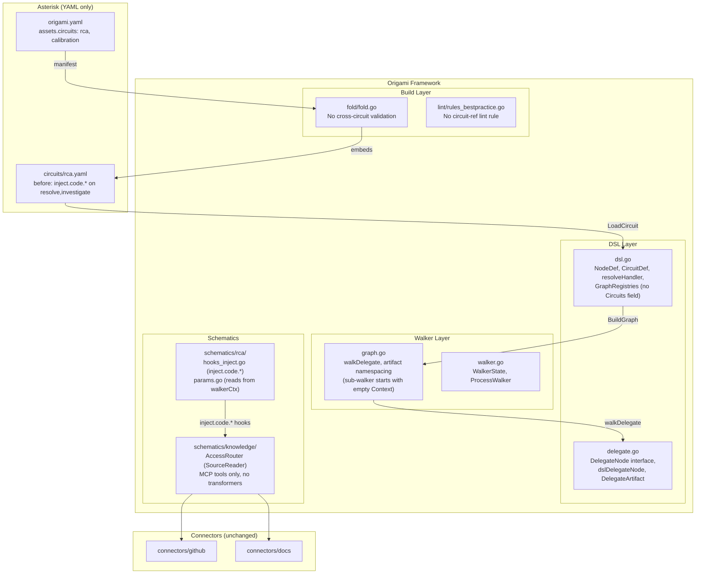
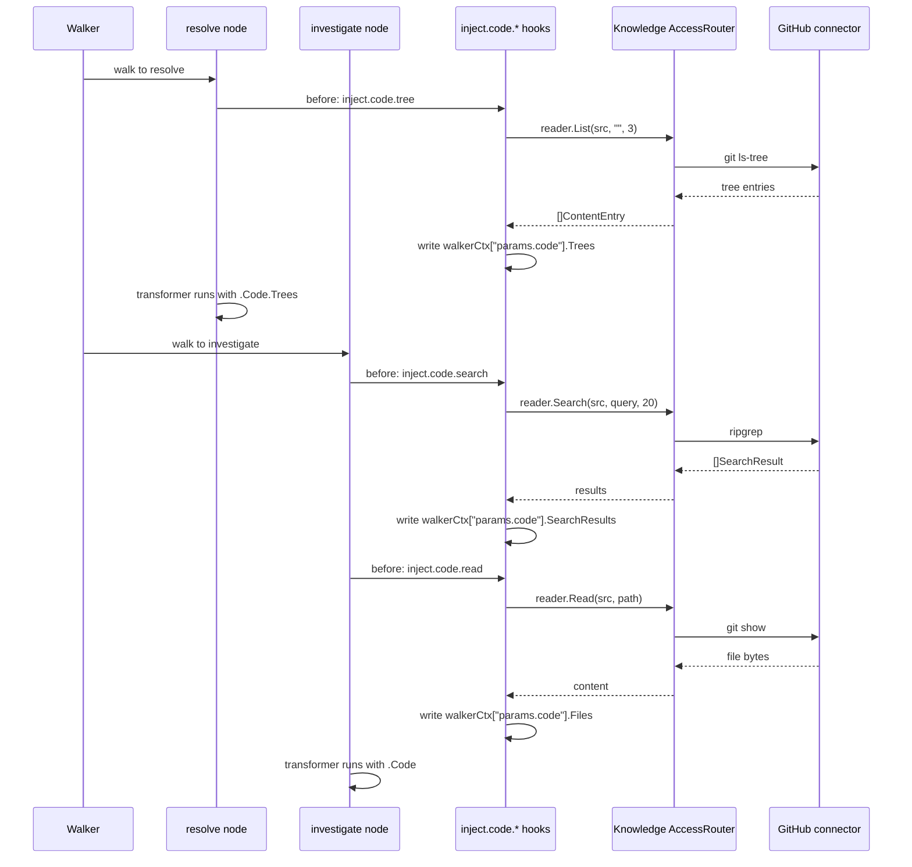
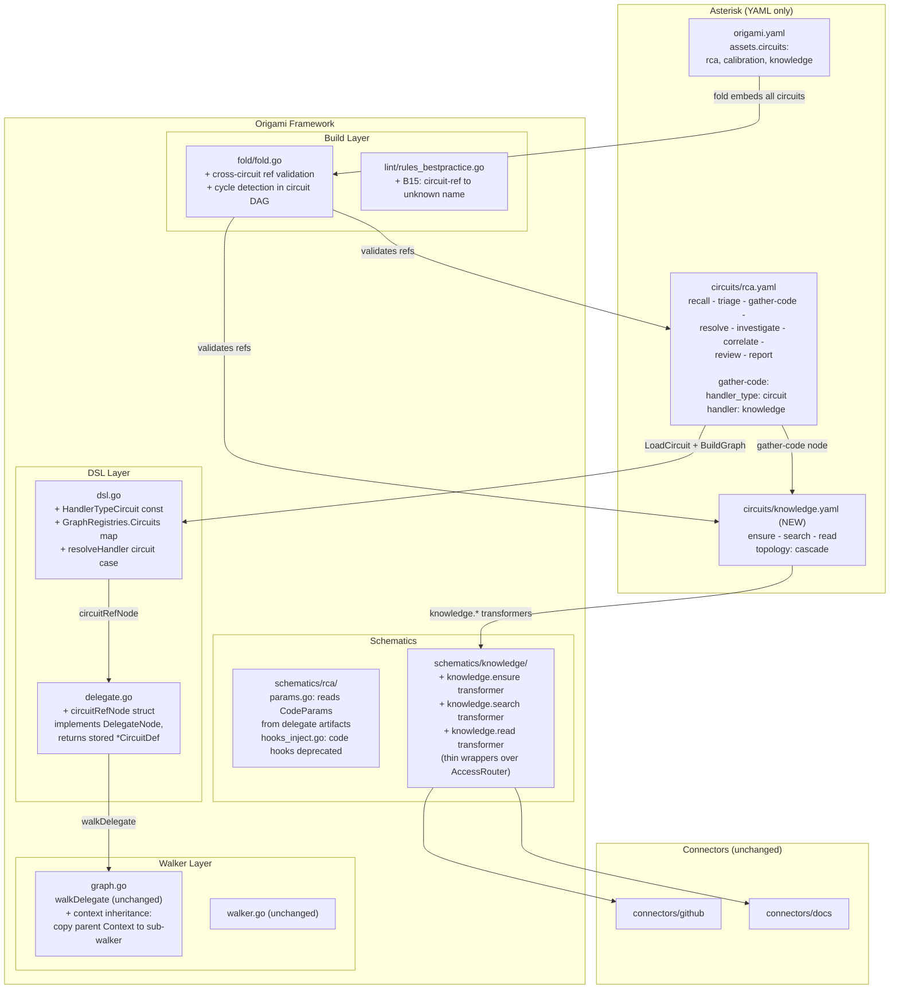
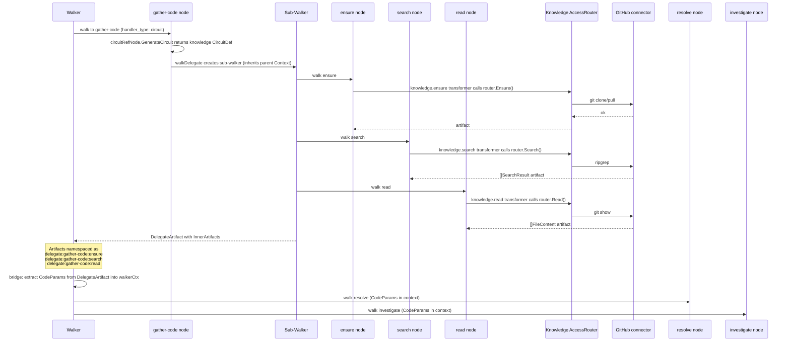

# Contract — circuit-subgraph-composition

**Status:** draft  
**Goal:** Any circuit can be invoked as a subgraph node in any other circuit via `handler_type: circuit`.  
**Serves:** 100% DSL — Zero Go

## Contract rules

- Origami framework changes land first; Asterisk consumer migration follows.
- The mechanism is symmetric: RCA can be a subgraph of Knowledge, Knowledge can be a subgraph of RCA, calibration can be a subgraph of anything. No circuit is privileged.
- Reuse the existing `DelegateNode`/`walkDelegate` walker path — do not create a parallel sub-walk mechanism.

## Context

Circuits are the core unit of work in Origami, but today they cannot compose. A circuit can only reference Go code (transformers, extractors, renderers) or dynamically generate sub-circuits at runtime (`handler_type: delegate`). There is no way to say "this node walks circuit X" in the DSL.

This forces Knowledge to be a hidden Go service dependency injected into RCA through opaque `before:` hooks (`inject.code.*`). Knowledge is invisible in circuit diagrams, can't be reasoned about at the DSL level, and can't be reused by other circuits without duplicating Go wiring.

The fix: `handler_type: circuit` — a node that references another circuit by name and walks it as a sub-graph. The referenced circuit is resolved from the circuit registry (populated from `assets.circuits` at startup). Context flows in, artifacts flow out, observability works unchanged.

- Prior art: `dsl-wiring` contract (handler unification, `handler_type` + `handler` pattern)
- Prior art: `DelegateNode` / `walkDelegate` in `graph.go` (dynamic sub-circuit walking)
- Related: `circuit-dsl-shorthand` contract (DSL improvements, unblocked, independent)

### Current architecture

**Component map** — dotted boxes are components that will be touched; solid boxes are reused as-is.

**Current data flow** — hooks inject code context into `walkerCtx` before resolve and investigate run.

### Desired architecture

**Component map** — all circuits are composable subgraph nodes. No circuit is privileged.

**Desired data flow** — Knowledge runs as a sub-circuit; artifacts bridge into walker context.

Any circuit is composable — RCA could equally be a subgraph node in a meta-analysis circuit, or calibration could invoke RCA as a subgraph.

### Gap analysis

Infrastructure audit: what exists vs what's missing.

| # | Component | Status | Detail |
|---|-----------|--------|--------|
| - | `DelegateNode` interface | Exists | `GenerateCircuit(ctx, nc) (*CircuitDef, error)` — works for static refs |
| - | `walkDelegate` | Exists | Full sub-walk: build graph, sub-walker, observe, namespace artifacts |
| - | `DelegateArtifact` | Exists | Wraps `InnerArtifacts`, elapsed, error. `Raw()` returns inner map |
| - | `LoadCircuit` | Exists | `YAML → rawCircuitDef → normalize() → CircuitDef` |
| - | Artifact namespacing | Exists | `delegate:<node>:<inner>` pattern, 6 tests cover it |
| - | `AccessRouter` | Exists | Clean `SourceReader` interface (Ensure, Search, Read, List) |
| G1 | `GraphRegistries.Circuits` | **Missing** | No circuit registry; need `map[string]*CircuitDef` field (~5 lines) |
| G2 | `HandlerTypeCircuit` | **Missing** | No handler type for static refs; need const + switch case (~15 lines) |
| G3 | `circuitRefNode` | **Missing** | No static delegate node; need thin `DelegateNode` wrapper (~25 lines) |
| G4 | Sub-walker context inheritance | **Missing** | Sub-walker starts with empty Context; parent's is not copied (~5 lines) |
| G5 | Artifacts-to-Context bridge | **Missing** | `ParamsFromContext` reads walkerCtx, not Outputs; need bridge (~30 lines) |
| G6 | Knowledge transformers | **Missing** | 4 thin wrappers over AccessRouter operations (~120 lines) |
| G7 | Knowledge circuit YAML | **Missing** | `circuits/knowledge.yaml` (~30 lines) |
| G8 | Fold cross-circuit validation | **Missing** | No ref checking or cycle detection (~70 lines) |
| G9 | Lint rule B15 | **Missing** | Circuit-ref to unknown name (~40 lines) |
| G10 | Tests | **Missing** | Static delegate tests (~100 lines) |

Estimated total: ~465 lines across 12 files in 2 repos. ~70% of the walker infrastructure is reusable as-is.

## FSC artifacts

| Artifact | Target | Compartment |
|----------|--------|-------------|
| Glossary: "circuit composition", "subgraph node", "circuit registry" | `glossary/` | domain |
| DSL design note: circuit-as-node pattern | `docs/` | domain |

## Execution strategy

Three phases, each independently shippable. Origami first, then Asterisk.

**Phase 1** adds the framework primitive (`handler_type: circuit`). Purely additive — no existing behavior changes. Tests prove a circuit can walk another circuit as a subgraph node.

**Phase 2** defines the Knowledge circuit YAML and registers its transformers. The existing `inject.code.*` hooks remain functional alongside the new circuit — no breaking change.

**Phase 3** migrates RCA to use the Knowledge circuit as a subgraph node, replacing the hook-based wiring. Then cleans up deprecated hooks.

### Key design decisions

- **Reuse DelegateNode interface** rather than a parallel walker path. `circuitRefNode` implements `DelegateNode` with a trivial `GenerateCircuit` that returns the pre-loaded def. All existing observability, namespacing, and artifact collection works unchanged.
- **`handler` field, not a new `circuit:` field** on NodeDef. The handler name maps to `GraphRegistries.Circuits` just like transformer names map to `GraphRegistries.Transformers`. No schema change to NodeDef.
- **Context inheritance**: sub-circuit walker inherits the parent's `Context` map (read-only copy). Sub-circuit outputs are namespaced back into the parent. This is exactly how `walkDelegate` already works.
- **Cycle detection at fold time**: if circuit A references B and B references A, fold fails with a clear error. No infinite recursion at walk time.

## Coverage matrix

| Layer | Applies | Rationale |
|-------|---------|-----------|
| **Unit** | yes | `circuitRefNode` resolution, `GraphRegistries.Circuits` lookup, `GenerateCircuit` pass-through |
| **Integration** | yes | Full sub-circuit walk with context inheritance and artifact namespacing |
| **Contract** | yes | `NodeDef` with `handler_type: circuit` parses correctly; `CircuitDef.BuildGraph` with circuit-ref nodes |
| **E2E** | yes | `just calibrate-stub` with Knowledge as subgraph must produce identical metrics |
| **Concurrency** | no | Sub-circuit walk is sequential (same as existing `walkDelegate`) |
| **Security** | no | No trust boundaries affected — circuit composition is internal framework plumbing |

## Tasks

### P1 — Framework: `handler_type: circuit` (Origami)

- [x] P1.1: Add `HandlerTypeCircuit = "circuit"` const to `dsl.go`
- [x] P1.2: Add `Circuits map[string]*CircuitDef` to `GraphRegistries`
- [x] P1.3: Implement `circuitRefNode` in `delegate.go` — wraps a `*CircuitDef`, implements `DelegateNode` (`GenerateCircuit` returns stored def)
- [x] P1.4: Add `case HandlerTypeCircuit` to `resolveHandler` in `dsl.go` — look up `handler` in `reg.Circuits`, return `circuitRefNode`
- [x] P1.5: Tests — 7 tests: interface, GenerateCircuit, BuildGraph, sub-walk, context inheritance, missing circuit, nil registry
- [x] P1.6: Fold validation — if `handler_type: circuit` references a circuit not in `assets.circuits`, fail at build time. Also detects circular dependencies.
- [ ] P1.7: Lint rule — circuit-ref to unknown circuit name (warning)

### P2 — Knowledge Circuit (Origami + Asterisk)

- [x] P2.1: Register `knowledge.tree`, `knowledge.search`, `knowledge.read` transformers in Knowledge schematic (`TransformerComponent` + 3 transformers wrapping SourceReader operations)
- [x] P2.2: Define `circuits/knowledge.yaml` in Asterisk (cascade: tree → search → read)
- [x] P2.3: Add `knowledge: circuits/knowledge.yaml` to `origami.yaml` assets.circuits
- [x] P2.4: Tests — 9 tests: tree/search/read transformers, token budget, circuit walk, empty catalog

### P3 — RCA Refactor + Cleanup (Asterisk + Origami)

- [x] P3.1: Add `gather-code` node to `circuits/rca.yaml` with `handler_type: circuit, handler: knowledge` (triage → gather-code → resolve)
- [x] P3.2: Bridge hook `bridge.code-context` converts Knowledge `*CodeContext` → `*CodeParams` in walker context
- [x] P3.3: Remove `inject.code.tree` from resolve's `before:`, remove `inject.code.search, inject.code.read` from investigate's `before:`
- [x] P3.4: Remove `inject.code.*` hooks from `hooks_inject.go` — dead code after Knowledge subgraph replaced them.
- [ ] P3.5: Update autodoc/mermaid rendering to show `handler_type: circuit` nodes distinctly (subgraph box)
- [x] P3.6: Added `inject.code-keywords` before-hook on gather-code that extracts search keywords from walker context

### Validation

- [x] Validate (green) — `go test ./...` (54 packages), `just build` (both repos)
- [ ] Tune (blue) — refactor for quality, no behavior changes
- [ ] Validate (green) — all tests still pass after tuning

## Acceptance criteria

**Given** a circuit YAML with a node using `handler_type: circuit` and `handler: <name>`,  
**When** the circuit is walked,  
**Then** the referenced circuit is loaded from the circuit registry and walked as a sub-graph, with context inherited from the parent walker and artifacts namespaced under `circuit:<node-name>:<inner-node>`.

**Given** the RCA circuit with a `gather-code` node referencing the Knowledge circuit,  
**When** stub calibration runs the full ptp-mock scenario,  
**Then** all 20 metrics pass with values identical (within rounding) to the hook-based baseline.

**Given** any two circuits A and B registered in the circuit registry,  
**When** A contains a node referencing B and B contains a node referencing A,  
**Then** fold detects the cycle and fails with a clear error (no infinite recursion at walk time).

**Given** any circuit C registered in `assets.circuits`,  
**When** another circuit references C as a subgraph node,  
**Then** C's internal topology, nodes, and edges are fully independent — C is walked as a self-contained sub-graph with its own start/done terminals.

## Security assessment

No trust boundaries affected. Circuit composition is internal framework plumbing — sub-circuits inherit the parent's context and run in the same process with the same permissions.

## Notes

2026-03-08 — Contract drafted. Key principle: all circuits are composable subgraph nodes — no circuit is privileged. K, R, Sa, Sb are all peers. First application: Knowledge as RCA subgraph, replacing opaque inject.code.* hooks.

2026-03-08 — P1-P3 core implementation complete. Framework: `handler_type: circuit` const, `GraphRegistries.Circuits`, `circuitRefNode`, resolver case, context inheritance in `walkDelegate`. Knowledge: 3 transformers (tree/search/read), `TransformerComponent`, circuit YAML, integration tests. RCA: `gather-code` delegate node, `bridge.code-context` after-hook, `inject.code-keywords` before-hook. Remaining: P1.6 fold validation, P1.7 lint rule, P3.4 hook deprecation, P3.5 autodoc rendering.

2026-03-09 — Quick-win pass: P1.6 fold validation (cross-circuit ref check + cycle detection) and P3.4 (inject.code.* hook removal) complete. Remaining: P1.7 lint rule, P3.5 autodoc rendering, Tune, final Validate.
