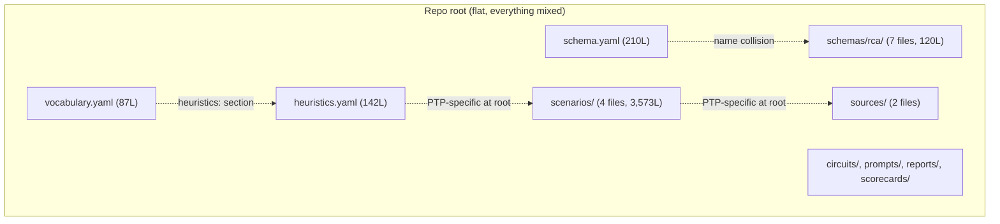
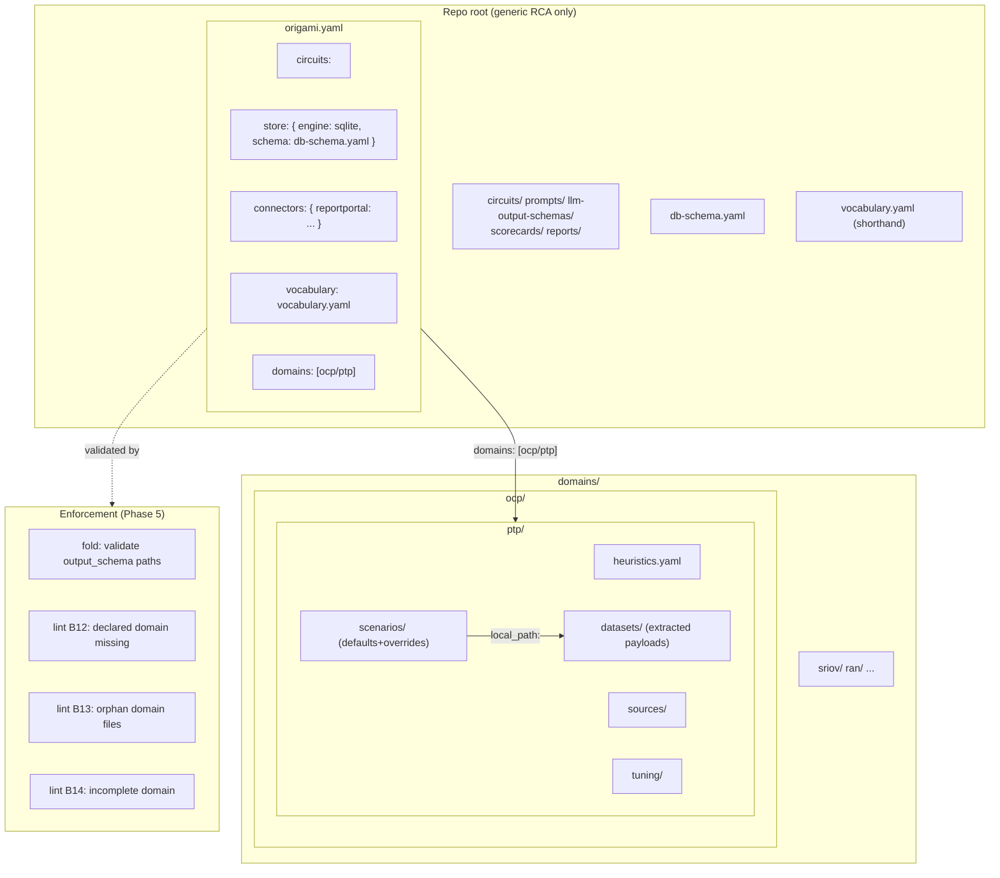

# Contract — yaml-dx-cleanup

**Status:** draft  
**Goal:** Every Asterisk YAML file is self-documenting, domain-specific data lives under `domains/<name>/`, zero redundant identity, vocabulary shorthand, schemas collapsed, scenario defaults+overrides, and the 2.3K-line ingest monster is externalized.  
**Serves:** 100% DSL — Zero Go

## Contract rules

- Zero behavioral changes. Every circuit, calibration, and build produces identical output before and after.
- Origami loader changes (vocabulary shorthand, scenario defaults, schema collapse, domain directory resolution) land first. Asterisk YAML migration follows in the same session.
- Each phase leaves the build green.

## Context

Audit of 24 YAML files (5,076 lines) in Asterisk revealed:

- **Domain sprawl:** Asterisk is a generic RCA tool, not a PTP tool. But PTP-specific data (heuristics, scenarios, sources, tuning, datasets, docs) is scattered across the repo root alongside generic RCA config. A new developer adding SRIOV or RAN support would have to interleave their domain data with PTP's. Domain data should live under `domains/<name>/` and be loaded on demand.
- **Naming collisions:** `schema.yaml` (SQLite DDL) vs `schemas/rca/` (LLM output validation). `vocabulary.yaml` has a `heuristics:` section AND `heuristics.yaml` is a separate file.
- **Identity stutter:** 19/24 files say their identity 3x — `kind:` envelope, `metadata.name:`, and a bare `name:` field. The envelope was added by dsl-lexicon but the legacy bare fields were left behind.
- **Vocabulary ceremony:** `M1: {short: M1, long: Defect Type Accuracy}` — the key IS the short code. Triple redundancy. Stage aliases (`F0` AND `F0_RECALL`) are duplicates.
- **Artifact schema sprawl:** 7 files (120 LOC, 42 LOC ceremony) for what could be 1 file with sections.
- **Scenario verbosity:** Each case repeats ~40 lines of ground-truth structure with no defaults or inheritance. Recall-hit cases are trivial but spelled out in full.
- **Inline payloads:** `ptp-real-ingest.yaml` is 2,272 lines — 45% of all YAML — because it inlines full RP JSON responses.
- **`files:` junk drawer:** The manifest's `files:` section is a typeless catch-all. `vocabulary`, `heuristics`, and `schema` are dumped together with no semantic distinction. A reader can't tell that `schema` is a SQLite DDL without opening the file.
- **Invisible infrastructure:** The RP connector (source of all test data) is hardcoded in Go, not declared in the manifest. The Knowledge circuit is absent. The persistence layer (SQLite) is mentioned nowhere. The manifest should be the single "what does this tool do?" document.

Related conversations: [YAML audit](6a3c6eaa-c863-42d3-8b75-2fb408a60299).

### Must vs optional

**Must** — circuit won't run without these:

| File | Role |
|------|------|
| `origami.yaml` | Manifest. `origami fold` entry point. |
| `circuits/*.yaml` | RCA + calibration pipelines. |
| `prompts/*.md` | LLM instructions per step. |
| `db-schema.yaml` | Store schema (cases, RCAs, symptoms). |
| `llm-output-schemas/` | LLM response validation. |
| `scorecards/` | Metric definitions + thresholds. |
| `domains/*/scenarios/` | Ground truth for calibration. |
| `domains/*/sources/` | Repo metadata for resolve/investigate. |

**Optional** — enhances quality or DX:

| File | Degradation without it |
|------|------------------------|
| `vocabulary.yaml` | Raw codes instead of display names. |
| `domains/*/heuristics.yaml` | No stub mode, no pre-filter. LLM-only still works. |
| `reports/*.yaml` | No formatted output. Raw data available. |
| `domains/*/tuning/` | Informational only. Nothing loads at runtime. |

### Domain vs generic split

| Location | Generic RCA | PTP-specific |
|----------|:-----------:|:------------:|
| `circuits/` | x | |
| `prompts/` | x | |
| `llm-output-schemas/` | x | |
| `scorecards/` | x | |
| `reports/` | x | |
| `db-schema.yaml` | x | |
| `vocabulary.yaml` | x | |
| `origami.yaml` | x | |
| `heuristics.yaml` | | x (`name: ptp-heuristics`) |
| `scenarios/` | | x (all 4 are PTP) |
| `sources/` | | x (ptp.yaml, ocp-platform.yaml) |
| `tuning/` | | x |
| `datasets/` | | x |

### Current architecture



### Desired architecture



## FSC artifacts

Code only — no FSC artifacts. The changes are syntactic cleanup.

## Execution strategy

Eight fixes + enforcement + manifest clarity in six phases, each independently shippable:

**Phase 1 — Domain directories (Origami + Asterisk)**
The structural move. Origami: fold/manifest accepts `domains:` list, scans each domain directory for scenarios/heuristics/sources/datasets/tuning by convention — no manual path enumeration. Asterisk: move PTP-specific files to `domains/ocp/ptp/`, update `origami.yaml` to declare `domains: [ocp/ptp]`.

**Phase 2 — Naming + ceremony (Asterisk, light Origami)**
Rename `schema.yaml` → `db-schema.yaml`, `schemas/` → `llm-output-schemas/`, kill redundant identity fields, vocabulary shorthand, rename vocabulary `heuristics:` → `decisions:`.

**Phase 3 — Schema collapse + scenario defaults (Origami loader + Asterisk)**
Origami: artifact schema loader accepts single-file multi-stage format. Origami: scenario loader supports `defaults:` block with per-case overrides. Asterisk: collapse 7 schema files to 1, rewrite scenarios with defaults.

**Phase 4 — Payload externalization (Origami loader + Asterisk)**
Origami: scenario loader resolves `local_path:` references for inline payloads. Asterisk: extract `ptp-real-ingest` payloads to `domains/ocp/ptp/datasets/`, reference by path.

**Phase 5 — Enforcement (Origami lint + fold)**
Lint rules and fold validations that make the domain convention enforceable, not just a suggestion. New domain can't ship with broken structure.

**Phase 6 — Manifest clarity (Origami + Asterisk)**
The manifest should answer "what are all the moving parts?" at a glance. Kill the `files:` junk drawer — each item gets a typed section. Add `store:` (engine + schema) so the persistence layer is visible. Add `connectors:` so external dependencies (RP) are declared, not hidden in Go code. Vocabulary becomes a first-class manifest field. The manifest becomes the single source of truth for the tool's architecture.

## Coverage matrix

| Layer | Applies | Rationale |
|-------|---------|-----------|
| **Unit** | yes | Domain directory scanning, vocabulary shorthand parsing, schema collapse loading, scenario defaults merging, payload reference resolution, lint rule validation |
| **Integration** | yes | `origami fold` builds with domain-structured YAML; `origami lint --profile strict` enforces domain structure; asset path validation catches typos |
| **Contract** | yes | Old format still accepted (backward compat) where Origami loaders change |
| **E2E** | yes | `just build`, `just calibrate-stub` produce identical results |
| **Concurrency** | no | No shared state changes |
| **Security** | no | No trust boundaries affected |

## Tasks

### Phase 1 — Domain directories

- [ ] P1.1 — Origami: fold/manifest accepts `Domains []string` (`yaml:"domains,omitempty"`). For each domain path, fold scans `domains/<path>/` for known subdirs (`scenarios/`, `sources/`, `heuristics.yaml`, `datasets/`, `tuning/`) and auto-merges discovered files into `AssetMap`. No manual path enumeration needed.
- [ ] P1.2 — Asterisk: create `domains/ocp/ptp/` and move domain-specific files:
  - `heuristics.yaml` → `domains/ocp/ptp/heuristics.yaml`
  - `scenarios/*.yaml` → `domains/ocp/ptp/scenarios/`
  - `sources/*.yaml` → `domains/ocp/ptp/sources/`
  - `tuning/*.yaml` → `domains/ocp/ptp/tuning/`
  - ~~`docs/ptp/`~~ — nuked (derivative of knowledge circuit, not source data)
- [ ] P1.3 — Asterisk: update `origami.yaml` — add `domains: [ocp/ptp]`, remove explicit per-file references for moved files. Manifest shrinks from ~60 lines to ~20.
- [ ] P1.4 — Validate: `just build`, `origami lint --profile strict`.

### Phase 2 — Naming + ceremony

- [ ] P2.1 — Rename `schema.yaml` → `db-schema.yaml`. Update `origami.yaml` ref.
- [ ] P2.2 — Rename `schemas/` → `llm-output-schemas/`. Collapse 7 individual files into `llm-output-schemas/rca.yaml`. Update `origami.yaml` and circuit `output_schema:` paths.
- [ ] P2.3 — Kill bare `name:` and `description:` from all files that have `metadata:` envelope (~19 files). The envelope is the identity.
- [ ] P2.4 — Vocabulary shorthand: `M1: Defect Type Accuracy` instead of `M1: {short: M1, long: ...}`. Verify/add Origami loader support (trivial: `if string → {short: key, long: value}`).
- [ ] P2.5 — Kill stage aliases (`F0_RECALL` etc.) — derive at load time from `F0` + node name.
- [ ] P2.6 — Rename vocabulary `heuristics:` section → `decisions:`. Update any Go code that reads this section name.
- [ ] P2.7 — Validate: `just build`, `origami lint --profile strict`.

### Phase 3 — Scenario defaults

- [ ] P3.1 — Origami: artifact schema loader accepts single-file format with sections keyed by stage name.
- [ ] P3.2 — Origami: scenario loader supports `defaults:` block. Case fields inherit from defaults; explicit case fields override.
- [ ] P3.3 — Asterisk: add `defaults:` to all 4 scenario files under `domains/ocp/ptp/scenarios/`. Remove redundant fields from individual cases.
- [ ] P3.4 — Validate: `just build`, `just calibrate-stub`, `go test -race ./...` (Origami).

### Phase 4 — Payload externalization

- [ ] P4.1 — Origami: scenario loader resolves `local_path:` for case payload fields.
- [ ] P4.2 — Asterisk: extract inline RP JSON payloads from `ptp-real-ingest.yaml` to `domains/ocp/ptp/datasets/`. Replace with `local_path:` references.
- [ ] P4.3 — Validate (green): `just build`, `just calibrate-stub`, all metrics identical.

### Phase 5 — Enforcement (Origami lint + fold)

- [ ] P5.1 — Origami fold: validate all `output_schema:` paths in circuit YAML resolve to real files. Fail the build on typos (currently silently embeds nothing).
- [ ] P5.2 — Origami lint B12: domain declared in `domains:` but `domains/<path>/` directory missing or empty → error.
- [ ] P5.3 — Origami lint B13: YAML file exists under `domains/<path>/` but `<path>` not in manifest `domains:` list → warning (orphan detection).
- [ ] P5.4 — Origami lint B14: domain directory missing required subdirs. If `domains/X/scenarios/` exists but `domains/X/sources/` does not → warning ("scenarios reference repos but no source pack found").
- [ ] P5.5 — Origami lint: update B11 `domainDirs` to include `"domains/"` prefix so `kind:` enforcement applies to domain-scoped files.
- [ ] P5.6 — Origami fold: validate manifest `domains:` entries have no duplicate or overlapping paths.
- [ ] P5.7 — Validate (green): all builds, tests, lints pass.

### Phase 6 — Manifest clarity

- [ ] P6.1 — Origami: add `Vocabulary string` field to `AssetMap` (`yaml:"vocabulary,omitempty"`). Replaces `files.vocabulary`. Vocabulary is a first-class concept, not a misc file.
- [ ] P6.2 — Origami: add `Store` section to `DomainServeConfig` (`yaml:"store,omitempty"`) with `Engine string` and `Schema string`. Replaces `files.schema`. Makes the persistence layer visible in the manifest.
- [ ] P6.3 — Origami: add `Connectors map[string]ConnectorConfig` to manifest (`yaml:"connectors,omitempty"`). Each connector declares `type:`, `api_key_path:` (with env var fallback), and other connection details. Replaces hardcoded Go wiring.
- [ ] P6.4 — Origami: remove `Files map[string]string` from `AssetMap`. All former `files:` entries now have typed homes. Fail the build if `files:` is present (migration error).
- [ ] P6.5 — Asterisk: rewrite `origami.yaml` — move `vocabulary` to top-level field, `schema` under `store:`, add `connectors:` section for RP. Remove `files:` block entirely.
- [ ] P6.6 — Origami: update codegen template to wire connectors from manifest config into the generated domain-serve binary (replaces manual Go injection in `mcpconfig/server.go`).
- [ ] P6.7 — Validate (green): `just build`, `origami lint --profile strict`, all tests pass.
- [ ] P6.8 — Tune (blue): refactor for quality, no behavior changes.
- [ ] P6.9 — Validate (green): all tests still pass after tuning.

## Acceptance criteria

```gherkin
Given the repo root
When I list top-level YAML files and directories
Then no PTP-specific files exist at root (heuristics, scenarios, sources, tuning)
  And domains/ocp/ptp/ contains all PTP-specific data
  And a new domain can be added by creating domains/<name>/ with no root changes

Given origami.yaml
When I read the domains: list
Then it contains ["ocp/ptp"]
  And fold auto-discovers scenarios, sources, heuristics from domains/ocp/ptp/ by convention
  And no per-file path enumeration is needed for domain files

Given schema.yaml renamed to db-schema.yaml
When I read the filename
Then I know it's a database schema without opening the file
  And no file named schema.yaml exists

Given any YAML file with a kind: envelope
When I search for bare name: or description: outside metadata:
Then zero matches (the envelope is the sole identity)

Given vocabulary.yaml
When I look up a metric code
Then the entry is "M1: Defect Type Accuracy" (string shorthand)
  And the loader produces {short: "M1", long: "Defect Type Accuracy"}
  And no F0_RECALL/F1_TRIAGE aliases exist (derived at load time)
  And the heuristics: section is named decisions:

Given llm-output-schemas/rca.yaml (single file)
When I look up F1_TRIAGE fields
Then they are defined under a stages.F1_TRIAGE: key in the single file
  And no llm-output-schemas/rca/ directory exists

Given a scenario with defaults: block
When a case omits expected_triage:
Then the case inherits defaults.expected_triage
  And explicit case fields override defaults

Given domains/ocp/ptp/scenarios/ptp-real-ingest.yaml
When I count lines
Then it is < 500 lines
  And inline RP payloads live in domains/ocp/ptp/datasets/ as separate files
  And calibration produces identical metrics

Given a circuit YAML with output_schema: llm-output-schemas/rca/TYPO.yaml
When origami fold runs
Then the build fails with "output_schema path not found: llm-output-schemas/rca/TYPO.yaml"

Given origami.yaml declares domains: [ocp/sriov]
When domains/ocp/sriov/ does not exist
Then origami lint emits B12 error "domain ocp/sriov declared but directory missing"

Given a YAML file at domains/ocp/ran/heuristics.yaml
When ocp/ran is not in the manifest domains: list
Then origami lint emits B13 warning "orphan domain file: ocp/ran not declared in manifest"

Given domains/ocp/ptp/ has scenarios/ but no sources/
Then origami lint emits B14 warning "domain ocp/ptp has scenarios but no source pack"

Given origami.yaml
When I read the manifest top to bottom
Then I see store: with engine and schema path
  And I see connectors: with reportportal config
  And I see vocabulary: pointing to vocabulary.yaml
  And no files: section exists
  And a new reader knows the tool uses SQLite, talks to RP, and has a vocabulary — without opening any other file

Given origami.yaml with a files: section
When origami fold runs
Then the build fails with "files: is deprecated — use vocabulary:, store:, or connectors:"
```

## Security assessment

No trust boundaries affected. All changes are syntactic — no new I/O, credentials, or network calls.

## Relationship to other contracts

| Contract | Relationship |
|----------|-------------|
| `dsl-lexicon` (complete) | Lexicon added the envelopes. This contract removes the legacy identity fields that lexicon left behind. |
| `circuit-dsl-shorthand` (draft) | No overlap. Shorthand is circuit syntax; this is data file cleanup. |

## Notes

2026-03-08 — Added Phase 6 (manifest clarity). Kill `files:` junk drawer — vocabulary gets its own field, schema goes under `store:` with engine declaration, RP connector declared under `connectors:`. The manifest becomes the single "what are all the moving parts?" document. `docs/ptp/` nuked — derivative of knowledge circuit.

2026-03-08 — Added Phase 5 (enforcement). Fold validates `output_schema:` paths exist at build time. New lint rules: B12 (declared domain missing), B13 (orphan domain files), B14 (incomplete domain structure). B11 updated for `domains/` prefix. Convention without enforcement is just a suggestion.

2026-03-08 — Added domain directories (Phase 1). Asterisk is a generic RCA tool, not PTP-specific. PTP data (heuristics, scenarios, sources, tuning, datasets, docs) belongs under `domains/ocp/ptp/`. New developers extend via `domains/<name>/`. Phases renumbered: domain move → naming → scenario defaults → payload externalization → enforcement.

2026-03-08 — Contract drafted from full YAML audit. 24 files, 5,076 lines. Key insight: 70% of YAML is scenarios, 45% is one file (`ptp-real-ingest`). The ceremony problem is real but the biggest win is scenario defaults + payload externalization.
