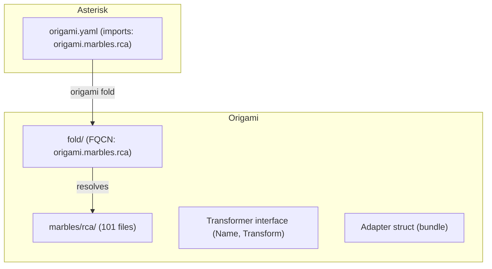
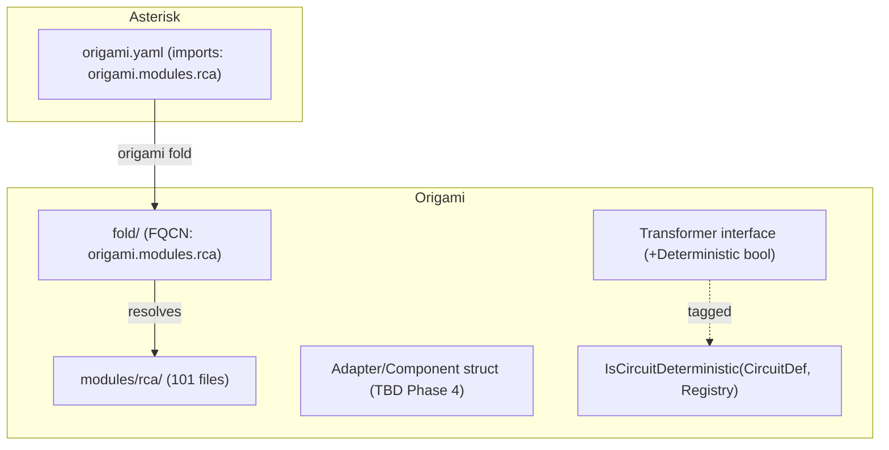

# Contract — naming-taxonomy

**Status:** draft  
**Goal:** Rename `marbles/` to `modules/` in Origami, add Deterministic/Stochastic classification to the Transformer interface, and evaluate Adapter → Component rename.  
**Serves:** 100% DSL — Zero Go; framework coherence; electronics metaphor consistency

## Contract rules

- The rename must be atomic per repo — no half-renamed state survives a commit.
- The `origami fold` binary must produce identical output after the rename.
- `just calibrate-stub` in Asterisk must pass before and after.

## Context

Three naming issues surfaced after `origami-fold` and `rca-pure-dsl` completed:

1. **Marble → Module.** "Marble" was a placeholder for "exportable Go package." In electronics, a **module** is a self-contained functional block with defined inputs, outputs, and internal wiring. `modules/rca/` avoids collision with `circuits/` (YAML definitions in consumer repos).

2. **Deterministic / Stochastic classification.** Transformers fall into two mathematically precise categories:
   - **Deterministic** — same input always produces same output. Zero token cost.
   - **Stochastic** — output varies per invocation, requires LLM tokens.
   A circuit is deterministic if all nodes use deterministic transformers; stochastic if at least one node uses a stochastic transformer.

3. **Adapter naming.** `framework.Adapter` bundles transformers + extractors + hooks under a namespace. In electronics, "adapter" implies passive format conversion, whereas ours provides active functionality — closer to a **component** or **IC**. Evaluate rename; decision deferred to Phase 4.

### Current architecture

### Desired architecture

## FSC artifacts

| Artifact | Target | Compartment |
|----------|--------|-------------|
| Glossary: Module, Deterministic/Stochastic Transformer, Deterministic/Stochastic Circuit | `glossary/glossary.mdc` (Origami) | domain |
| Design reference: D/S classification rationale | `docs/` (Origami) | domain |

## Execution strategy

### Phase 1: Taxonomy documentation
- Add `Module`, `Deterministic Transformer`, `Stochastic Transformer`, `Deterministic Circuit`, `Stochastic Circuit` to Origami `glossary/glossary.mdc`.
- Update Asterisk glossary if it references "marble."

### Phase 2: Module rename
- Rename `origami/marbles/` → `origami/modules/` (101 Go files + testdata).
- Update all import paths across Origami (`go.mod` unchanged — internal paths only).
- Update `fold/` FQCN resolution (`origami.modules.rca` replaces `origami.marbles.rca`).
- Update fold integration tests.
- Update Asterisk `origami.yaml` (`imports: origami.modules.rca`).
- Update Achilles if it references `marbles/`.
- Run `go build ./...` + `go test ./...` in Origami.
- Run `origami fold` + `just calibrate-stub` in Asterisk.

### Phase 3: Deterministic/Stochastic type system
- Add `Deterministic() bool` method to `Transformer` interface (or introduce a `DeterministicTransformer` marker interface to avoid breaking all implementations).
- Tag all built-in transformers: `core.match` (deterministic), `core.jq` (deterministic), `core.file` (deterministic), `core.template` (deterministic), `core.llm` (stochastic).
- Add `IsCircuitDeterministic(CircuitDef, TransformerRegistry) bool` utility.
- Wire into `origami lint`: informational note when a node is stochastic.

### Phase 4: Adapter evaluation (optional)
- Audit `framework.Adapter` usage surface (API, docs, consumer repos).
- If rename to `Component` is net-positive: rename `Adapter` → `Component`, `AdapterManifest` → `ComponentManifest`, `MergeAdapters` → `MergeComponents`, `adapter.yaml` → `component.yaml`.
- If marginal: document the metaphor gap in glossary and keep `Adapter`.

## Coverage matrix

| Layer | Applies | Rationale |
|-------|---------|-----------|
| **Unit** | yes | `IsCircuitDeterministic()`, FQCN resolution with new paths |
| **Integration** | yes | `origami fold` end-to-end with renamed modules |
| **Contract** | yes | `Transformer` interface change — all implementations must compile |
| **E2E** | yes | `just calibrate-stub` in Asterisk with renamed binary |
| **Concurrency** | no | No shared state changes |
| **Security** | no | No trust boundaries affected |

## Tasks

- [ ] Phase 1 — Glossary entries in Origami + Asterisk
- [ ] Phase 2a — Rename `marbles/` → `modules/` in Origami
- [ ] Phase 2b — Update fold FQCN resolution + tests
- [ ] Phase 2c — Update Asterisk `origami.yaml` + Achilles imports
- [ ] Phase 2d — Build + test all three repos
- [ ] Phase 3a — `Deterministic() bool` on Transformer (or marker interface)
- [ ] Phase 3b — Tag all built-in transformers
- [ ] Phase 3c — `IsCircuitDeterministic()` utility + tests
- [ ] Phase 3d — `origami lint` stochastic node flagging
- [ ] Phase 4 — Adapter → Component evaluation + decision
- [ ] Validate (green) — all tests pass, acceptance criteria met.
- [ ] Tune (blue) — refactor for quality. No behavior changes.
- [ ] Validate (green) — all tests still pass after tuning.

## Acceptance criteria

- **Given** the Origami source tree, **when** searching for `marbles/`, **then** zero results — all references use `modules/`.
- **Given** a `Transformer` implementation, **when** checking its determinism, **then** the framework can answer programmatically (via interface or method).
- **Given** `origami lint --profile strict` on a circuit YAML, **when** stochastic transformers are bound to nodes, **then** they are listed in output with informational severity.
- **Given** the glossary, **when** reading Module, Deterministic Transformer, and Stochastic Transformer entries, **then** definitions are clear with electronics analogies.
- **Given** `origami fold` in Asterisk, **when** run after the rename, **then** produces a working binary that passes `just calibrate-stub`.

## Security assessment

No trust boundaries affected. The rename is mechanical; the D/S classification is metadata only.

## Notes

2026-03-02 00:00 — Contract drafted from naming convention discussion. Marble→Module, Deterministic/Stochastic classification, Adapter evaluation.
