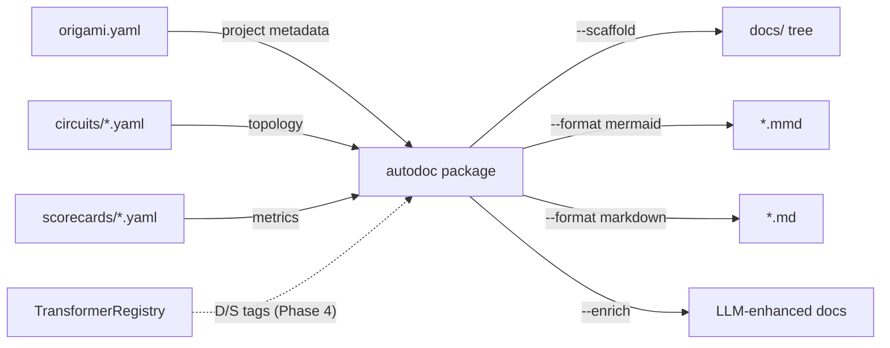

# Contract — origami-autodoc

**Status:** draft  
**Goal:** `origami autodoc` CLI command generates a complete documentation tree for Origami consumer projects — deterministic skeleton from YAML, optional stochastic enrichment via LLM.  
**Serves:** Developer experience; circuit reviewability; onboarding; pure-DSL payoff; framework-level docs tooling

## Contract rules

- The command lives in Origami (`cmd/origami/cmd_autodoc.go`). This contract tracks Origami implementation and Asterisk validation.
- Output must be valid Mermaid syntax that renders in GitHub/GitLab without modification.
- Zero domain knowledge — operates purely on the `CircuitDef` schema, `origami.yaml` manifest, and discovered YAML files.
- Two-tier model: deterministic generation is complete and standalone; stochastic enrichment is optional and additive.
- The docs tree follows the Kubernetes pattern: README.md as root appendix, `docs/` tree for deep dives.

## Context

With Asterisk achieving 100% DSL (zero Go), circuit YAML files are the complete source of truth for graph structure, zone groupings, transformer bindings, hook side-effects, and context propagation. Documentation generated from YAML is always in sync with the circuit.

This contract is a **precursor** to `yaml-playbook-docs` — the autodoc tool generates the deterministic documentation skeleton that the docs contract then extends with project-specific narrative. Consumer projects (Asterisk, Achilles, future tools) get high-quality, well-organized documentation out of the box.

### Dependencies

- `naming-taxonomy` Phase 2: `modules/` path (import references in generated docs)
- `naming-taxonomy` Phase 3: `Deterministic() bool` marker on transformers (D/S boundary visualization in Phase 4)
- Phases 0-3 can proceed independently of `naming-taxonomy`.

### Current architecture

No `autodoc` command exists. Circuit documentation is manual or nonexistent. `framework.Render(def *CircuitDef) string` in `render.go` generates basic Mermaid flowcharts from circuits — this is the seed for Phase 1.

### Desired architecture



### Docs tree structure (Kubernetes pattern)

The generated tree follows the Kubernetes documentation model — README.md as an appendix and high-level overview that enables instant usage, onboarding, and deep dives into each topic:

```
README.md                          (appendix + quick start + index to everything)
docs/
├── getting-started/
│   ├── installation.md            (prerequisites, origami CLI, just)
│   ├── quick-start.md             (first analysis in N minutes)
│   └── configuration.md           (origami.yaml, credentials, workspace)
├── circuits/
│   ├── index.md                   (circuit catalog with topology diagrams)
│   ├── <circuit-name>.md          (auto-generated per circuit: Mermaid + node table + D/S map)
│   └── ...
├── concepts/
│   ├── architecture.md            (stub: project architecture)
│   ├── pipeline-stages.md         (stub: pipeline explained)
│   └── ...                        (stubs for consumer to fill or --enrich to generate)
├── reference/
│   ├── cli.md                     (auto-generated from origami.yaml commands)
│   ├── scorecards.md              (auto-generated from scorecards/*.yaml if present)
│   └── ...
└── contributing/
    ├── development.md             (how to modify circuits, run calibration)
    └── conventions.md             (stub: project conventions)
```

User-facing docs live in `docs/` at the repo root. Agent-facing knowledge (`.cursor/docs/`) remains separate — internal schemas, models, journals, postmortems are not for external consumption.

## FSC artifacts

| Artifact | Target | Compartment |
|----------|--------|-------------|
| Autodoc design reference | `docs/` (Origami) | domain |
| Generated docs tree template | embedded in autodoc package | framework |

## Execution strategy

### Phase 0: Docs tree scaffold (new)
- `origami autodoc --scaffold` reads `origami.yaml` manifest (project name, description, version, CLI commands).
- Discovers `circuits/*.yaml` and `scorecards/*.yaml` in the project directory.
- Generates the Kubernetes-style tree structure with deterministic content where possible and stubs where narrative is needed.
- README.md generated with: project name/description from manifest, prerequisites section, quick start with CLI commands from manifest, directory index linking to every `docs/` page.
- Per-circuit pages generated with: Mermaid topology diagram, node reference table, zone summary.
- CLI reference page generated from `origami.yaml` command definitions (commands, flags, types, defaults).
- Scorecard reference page generated from `scorecards/*.yaml` if present (metric names, thresholds, descriptions).
- Idempotent: re-running updates auto-generated sections (delimited by markers) without overwriting hand-written content.

### Phase 1: Mermaid generation
- Extend existing `framework.Render(def *CircuitDef) string` in `render.go`.
- Generate Mermaid `graph LR` with nodes, edges (labeled with conditions), and zone subgraphs.
- Handle edge cases: shortcut edges, self-loops, dialectic sub-circuits.

### Phase 2: Markdown table
- Per-node row: name, zone, transformer, extractor, hooks, element affinity.
- Summary section: total nodes, total edges, deterministic vs stochastic node count.

### Phase 3: CLI command
- Add `origami autodoc` to `cmd/origami/`.
- Subcommands/flags: `--scaffold` (full tree), `--format` (mermaid|markdown|html), `--output`, `--enrich`, multi-file input.
- Tests with existing circuits (`asterisk-rca.yaml`, `asterisk-calibration.yaml`, `asterisk-ingest.yaml`).

### Phase 4: D/S boundary visualization
- Deterministic nodes rendered as rectangles; stochastic nodes as rounded/stadium shapes.
- Zone subgraphs colored by D/S majority (green for deterministic, amber for stochastic).
- Boundary edges (deterministic → stochastic transition) labeled or styled distinctly.
- Dynamic: the boundary depends on transformer binding, not static circuit structure.
- Depends on `naming-taxonomy` Phase 3.

### Phase 5: Stochastic enrichment (optional)
- `origami autodoc --enrich` uses LLM to read the deterministic docs and produce richer narrative:
  - Add conceptual explanations to circuit pages (what does this circuit do? why this topology?)
  - Generate "getting started" tutorial narrative from the quick-start stub
  - Weave cross-references between pages (link related circuits, concepts, reference entries)
  - Explain architecture decisions and design rationale
- Explicitly **optional** — the deterministic tier stands alone as complete, correct documentation.
- Design principle: deterministic docs are always correct; stochastic enrichment adds depth but never replaces generated facts.

### Phase 6: Context flow diagram (stretch)
- Parse `context_filter:` from zone definitions.
- Generate a data-flow diagram showing which context keys are available at each node.

## Coverage matrix

| Layer | Applies | Rationale |
|-------|---------|-----------|
| **Unit** | yes | Mermaid generation, Markdown table, scaffold tree structure, D/S boundary detection |
| **Integration** | yes | CLI command end-to-end with real circuit YAMLs |
| **Contract** | no | No API surface consumed by others |
| **E2E** | yes | Generate docs for all 3 Asterisk circuits + Achilles circuit, verify valid Mermaid, verify tree structure |
| **Concurrency** | no | Single-threaded CLI tool |
| **Security** | no | Read-only file processing |

## Tasks

- [ ] Phase 0 — Docs tree scaffold from origami.yaml + circuit/scorecard discovery
- [ ] Phase 1 — Mermaid flowchart from CircuitDef (extend `Render()`)
- [ ] Phase 2 — Markdown table generation (per-node reference)
- [ ] Phase 3 — CLI command with `--scaffold`, `--format`, `--output`, `--enrich` flags
- [ ] Phase 4 — D/S boundary visualization in Mermaid output (post naming-taxonomy)
- [ ] Phase 5 — Stochastic enrichment via LLM (optional `--enrich` flag)
- [ ] Phase 6 — Context flow diagram (stretch)
- [ ] Validate with all 3 Asterisk circuits (asterisk-rca, asterisk-calibration, asterisk-ingest)
- [ ] Validate with Achilles circuit (proves framework-level generality)
- [ ] Validate (green) — all tests pass, acceptance criteria met.
- [ ] Tune (blue) — refactor for quality. No behavior changes.
- [ ] Validate (green) — all tests still pass after tuning.

## Acceptance criteria

- **Given** `origami autodoc --scaffold` in Asterisk, **when** run with `origami.yaml` and `circuits/*.yaml` present, **then** a `docs/` tree is generated with README.md, per-circuit pages, CLI reference, and topic stubs.
- **Given** the generated README.md, **when** reading it, **then** it contains: project name/description, prerequisites, quick start commands, and an index linking to every `docs/` page.
- **Given** `asterisk-rca.yaml`, **when** running `origami autodoc --format mermaid`, **then** output is valid Mermaid syntax that renders correctly in GitHub/GitLab.
- **Given** a circuit with zones, **when** generating Mermaid, **then** zones appear as `subgraph` blocks with labels.
- **Given** a circuit with stochastic transformers (post `naming-taxonomy`), **when** generating Markdown, **then** nodes are tagged deterministic/stochastic.
- **Given** `--output docs/`, **when** running on multiple circuits, **then** each circuit produces a separate output file.
- **Given** a circuit with mixed D/S nodes, **when** generating Mermaid, **then** the D/S boundary is visually distinct (node shapes differ, boundary edges labeled).
- **Given** `origami autodoc --scaffold` in Achilles, **when** run, **then** Achilles gets the same tree structure with its own circuits — proving framework generality.
- **Given** a previously generated tree with hand-written content, **when** re-running `--scaffold`, **then** auto-generated sections update but hand-written content is preserved (idempotent).

## Security assessment

No trust boundaries affected. Read-only file processing; output is static text. Stochastic enrichment (Phase 5) sends circuit metadata to LLM — no secrets or PII in circuit YAML.

## Notes

2026-03-02 00:00 — Contract drafted. Direct payoff of pure-DSL architecture — documentation always in sync because it's generated from the same YAML source. D/S boundary visualization adds the mixed-signal analogy from electronics.

2026-03-02 01:00 — Contract expanded. Promoted from next-milestone to quick-win. Added Phase 0 (docs tree scaffold following Kubernetes pattern), Phase 5 (stochastic enrichment), and two-tier D/S documentation model. This contract is now a precursor to `yaml-playbook-docs` — it generates the deterministic skeleton that the docs contract extends with narrative.
