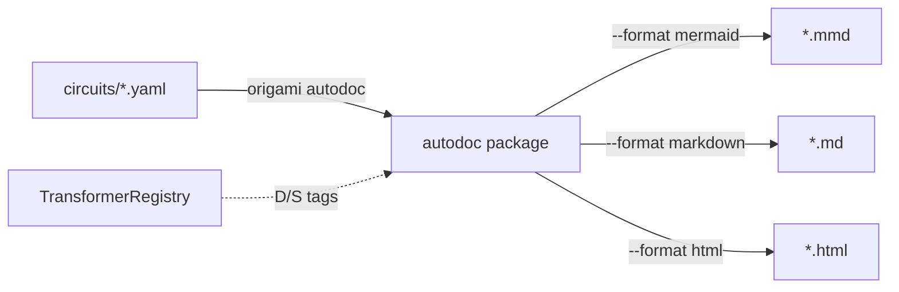

# Contract — origami-autodoc

**Status:** draft  
**Goal:** `origami autodoc` CLI command generates Mermaid diagrams and Markdown documentation from circuit YAML files — zero execution required.  
**Serves:** Developer experience; circuit reviewability; onboarding; pure-DSL payoff

## Contract rules

- The command lives in Origami (`cmd/origami/cmd_autodoc.go`). This contract tracks Origami implementation and Asterisk validation.
- Output must be valid Mermaid syntax that renders in GitHub/GitLab without modification.
- Zero domain knowledge — operates purely on the `CircuitDef` schema.

## Context

With Asterisk achieving 100% DSL (zero Go), circuit YAML files are the complete source of truth for graph structure, zone groupings, transformer bindings, hook side-effects, and context propagation. Documentation generated from YAML is always in sync with the circuit.

Depends on `naming-taxonomy` contract for:
- Phase 2: `modules/` path (import references)
- Phase 3: `Deterministic() bool` marker on transformers (D/S boundary visualization)

### Current architecture

No `autodoc` command exists. Circuit documentation is manual or nonexistent.

### Desired architecture

## FSC artifacts

| Artifact | Target | Compartment |
|----------|--------|-------------|
| Autodoc design reference | `docs/` (Origami) | domain |

## Execution strategy

### Phase 1: Mermaid generation
- Parse `CircuitDef` via `dsl.LoadCircuit`.
- Generate Mermaid `graph LR` with nodes, edges (labeled with conditions), and zone subgraphs.
- Handle edge cases: shortcut edges, self-loops, dialectic sub-circuits.

### Phase 2: Markdown table
- Per-node row: name, zone, transformer, extractor, hooks, element affinity.
- Summary section: total nodes, total edges, deterministic vs stochastic node count.

### Phase 3: CLI command
- Add `origami autodoc` to `cmd/origami/`.
- Support `--format` (mermaid|markdown|html), `--output`, multi-file input.
- Tests with existing circuits (`asterisk-rca.yaml`, `asterisk-calibration.yaml`, `asterisk-ingest.yaml`).

### Phase 4: D/S boundary visualization
- Deterministic nodes rendered as rectangles; stochastic nodes as rounded/stadium shapes.
- Zone subgraphs colored by D/S majority (green for deterministic, amber for stochastic).
- Boundary edges (deterministic → stochastic transition) labeled or styled distinctly.
- Dynamic: the boundary depends on transformer binding, not static circuit structure.

### Phase 5: Context flow diagram (stretch)
- Parse `context_filter:` from zone definitions.
- Generate a data-flow diagram showing which context keys are available at each node.

## Coverage matrix

| Layer | Applies | Rationale |
|-------|---------|-----------|
| **Unit** | yes | Mermaid generation, Markdown table, D/S boundary detection |
| **Integration** | yes | CLI command end-to-end with real circuit YAMLs |
| **Contract** | no | No API surface consumed by others |
| **E2E** | yes | Generate docs for all 3 Asterisk circuits, verify valid Mermaid |
| **Concurrency** | no | Single-threaded CLI tool |
| **Security** | no | Read-only file processing |

## Tasks

- [ ] Phase 1 — Mermaid flowchart from CircuitDef
- [ ] Phase 2 — Markdown table generation
- [ ] Phase 3 — CLI command with flags and multi-file support
- [ ] Phase 4 — D/S boundary visualization in Mermaid output
- [ ] Phase 5 — Context flow diagram (stretch)
- [ ] Validate with all 3 Asterisk circuits (asterisk-rca, asterisk-calibration, asterisk-ingest)
- [ ] Validate (green) — all tests pass, acceptance criteria met.
- [ ] Tune (blue) — refactor for quality. No behavior changes.
- [ ] Validate (green) — all tests still pass after tuning.

## Acceptance criteria

- **Given** `asterisk-rca.yaml`, **when** running `origami autodoc --format mermaid`, **then** output is valid Mermaid syntax that renders correctly in GitHub/GitLab.
- **Given** a circuit with zones, **when** generating Mermaid, **then** zones appear as `subgraph` blocks with labels.
- **Given** a circuit with stochastic transformers (post `naming-taxonomy`), **when** generating Markdown, **then** nodes are tagged deterministic/stochastic.
- **Given** `--output docs/`, **when** running on multiple circuits, **then** each circuit produces a separate output file.
- **Given** a circuit with mixed D/S nodes, **when** generating Mermaid, **then** the D/S boundary is visually distinct (node shapes differ, boundary edges labeled).

## Security assessment

No trust boundaries affected. Read-only file processing; output is static text.

## Notes

2026-03-02 00:00 — Contract drafted. Direct payoff of pure-DSL architecture — documentation always in sync because it's generated from the same YAML source. D/S boundary visualization adds the mixed-signal analogy from electronics.
