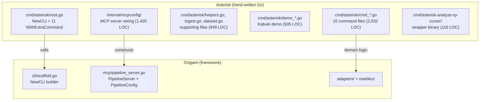
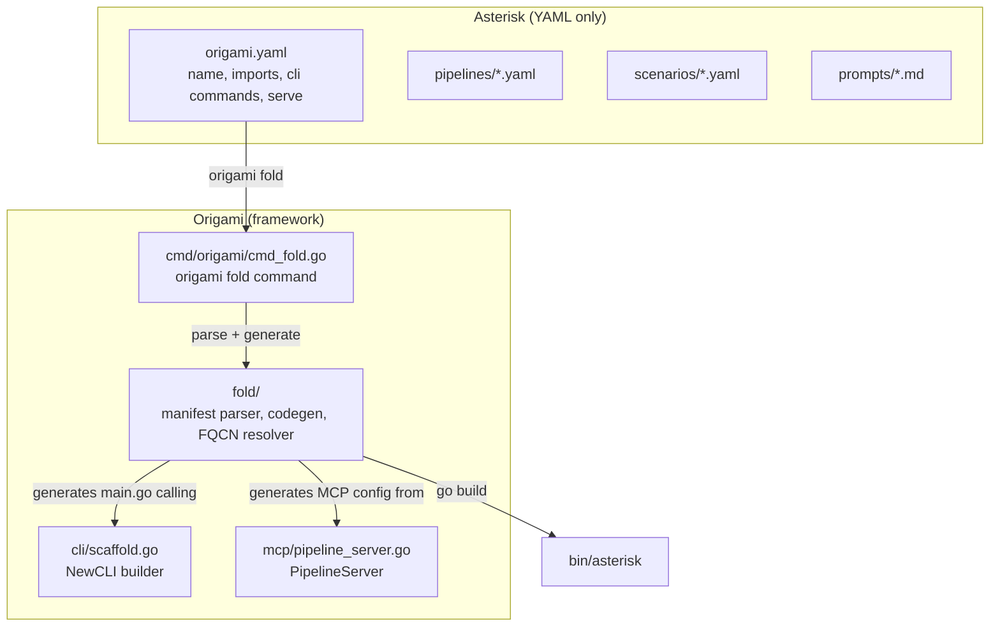

# Contract — origami-fold

**Status:** draft  
**Goal:** `origami fold` compiles a YAML-only consumer project into a standalone Go binary — Asterisk's `cmd/`, `internal/mcpconfig/`, and `cmd/asterisk-analyze-rp-cursor/` (~3,400 LOC) are replaced by an `origami.yaml` manifest.  
**Serves:** 100% DSL — Zero Go

## Contract rules

- The `origami fold` command lives in Origami. This contract tracks both the Origami implementation and the Asterisk migration.
- The generated binary must be functionally identical to the hand-written one. `origami fold && bin/asterisk --help` must produce the same command tree.
- Go toolchain is required at fold-time (code generation + `go build`). Cross-compilation via `GOOS`/`GOARCH` env vars.
- Split from `rca-pure-dsl` Phase 5, task G8 (previously cancelled as "Large effort").

## Context

- Concept note: `origami/.cursor/notes/origami-fold-concept.md`
- Precedent: Terraform Provider Dev Kit (schema → binary), Ansible Execution Environments (requirements → container), GraalVM native-image.
- The `origami.NewCLI()` builder and `PipelineServer` already exist. Fold generates the Go code that calls them.

### Current architecture



### Desired architecture



## FSC artifacts

| Artifact | Target | Compartment |
|----------|--------|-------------|
| `origami.yaml` manifest spec | Origami `docs/` | domain |
| Fold design reference | Origami `docs/` | domain |

## Execution strategy

Two phases: build the Origami `fold` command first, then migrate Asterisk from hand-written Go to a manifest.

### Phase 1: Origami — build `origami fold`

**Manifest spec** — Define `origami.yaml` schema:

```yaml
name: asterisk
description: Evidence-based RCA for ReportPortal test failures
version: "1.0"

imports:
  - origami.adapters.rp
  - origami.adapters.sqlite
  - origami.marbles.rca

embed:
  - pipelines/
  - scenarios/
  - scorecards/
  - prompts/
  - schema.yaml
  - vocabulary.yaml

cli:
  global_flags:
    - {name: log-level, type: string, default: info, usage: "log level: debug, info, warn, error"}
    - {name: log-format, type: string, default: text, usage: "log format: text, json"}
  commands:
    analyze:
      pipeline: asterisk-rca
      flags:
        - {name: launch, type: string, required: true, usage: "RP launch ID"}
        - {name: adapter, type: string, default: llm, usage: "adapter: basic, llm, stub"}
    calibrate:
      pipeline: asterisk-calibration
      flags:
        - {name: scenario, type: string, required: true, usage: "scenario name"}
        - {name: adapter, type: string, default: basic, usage: "adapter to calibrate"}
        - {name: runs, type: int, default: 1, usage: "number of runs"}
    ingest:
      pipeline: asterisk-ingest
      flags:
        - {name: project, type: string, required: true, usage: "RP project name"}

serve:
  name: asterisk-mcp
  pipeline: asterisk-calibration
  step_schemas: schema.yaml
```

**FQCN resolution** — Convention-based mapping:
- `origami.adapters.rp` → `github.com/dpopsuev/origami/adapters/rp`
- `origami.marbles.rca` → `github.com/dpopsuev/origami/marbles/rca`
- Rule: split on dots, first segment is module prefix (`origami` → `github.com/dpopsuev/origami`), rest is path.
- Override: `{name: custom.adapter, package: github.com/example/custom}` for non-standard packages.

**Code generation** — `text/template` producing a `main.go`:
1. Import all resolved adapter packages
2. `//go:embed` all declared embed paths
3. Build `origami.NewCLI(name, desc)` with `With*` builder calls
4. For each command: create `*cobra.Command` with declared flags, `RunE` that loads pipeline, sets flag values as vars, walks graph
5. For `serve:` section: generate `PipelineConfig` + `WithServe`
6. Write to temp dir, run `go build -o <output>`

**CLI flag → pipeline var wiring** — Each command flag becomes a pipeline input variable. The generated `RunE` reads flag values and passes them as `walk.Vars`.

### Phase 2: Asterisk — migrate to manifest

1. Write `origami.yaml` manifest for Asterisk
2. Run `origami fold --output bin/asterisk` and verify identical behavior
3. Delete `cmd/asterisk/`, `internal/mcpconfig/`, `cmd/asterisk-analyze-rp-cursor/`

### Commands requiring special handling

Most commands follow the "walk pipeline with flag inputs" pattern. Some need special builder methods:

| Command | Pattern | Fold mapping |
|---------|---------|-------------|
| `analyze` | Walk pipeline | `cli.commands.analyze` |
| `calibrate` | Walk pipeline + multi-run | `cli.commands.calibrate` or `WithCalibrate` |
| `consume` | Walk pipeline | `cli.commands.consume` |
| `serve` | MCP server | `serve:` section → `WithServe` |
| `demo` | Kabuki presentation | `WithDemo` → `demo:` manifest section |
| `dataset` | CRUD operations | `WithDataset` → `dataset:` manifest section |
| `push` | Walk pipeline | `cli.commands.push` |
| `gt` | Dataset management | `WithDataset` subcommands |
| `status` | Read-only query | `cli.commands.status` |
| `cursor` | Signal-based analysis | Wrapper for analyze |
| `save` | Artifact persistence | Wrapper for analyze step |

## Coverage matrix

| Layer | Applies | Rationale |
|-------|---------|-----------|
| **Unit** | yes | Manifest parser, FQCN resolver, codegen template rendering |
| **Integration** | yes | `origami fold` produces a binary that matches hand-written behavior |
| **Contract** | yes | `origami.yaml` schema validation |
| **E2E** | yes | `origami fold && bin/asterisk calibrate --scenario ptp-mock --adapter stub` matches current output |
| **Concurrency** | no | Fold is a single-threaded build command |
| **Security** | yes | Code generation from YAML — validate no injection in import paths or flag values |

## Tasks

### Phase 1: Origami — build fold

- [ ] T1: Define `origami.yaml` manifest types + YAML parser in `fold/manifest.go`
- [ ] T2: Implement FQCN → Go package path resolver in `fold/fqcn.go`
- [ ] T3: Create `main.go` code generation template in `fold/codegen.go`
- [ ] T4: Implement CLI flag → pipeline var wiring in `fold/codegen.go` (generated RunE reads flags, sets walk vars)
- [ ] T5: Implement MCP `serve:` section → `PipelineConfig` generation in `fold/codegen.go`
- [ ] T6: Wire `origami fold` CLI command in `cmd/origami/cmd_fold.go` (parse manifest, generate temp dir, go build)
- [ ] T7: Unit + integration tests for fold (manifest parsing, codegen output, FQCN resolution, round-trip build)

### Phase 2: Asterisk — migrate

- [ ] T8: Create `origami.yaml` manifest for Asterisk — all 11 commands, serve config, imports, embeds
- [ ] T9: Validate — `origami fold --output bin/asterisk` produces identical CLI and behavior
- [ ] T10: Delete `cmd/asterisk/`, `internal/mcpconfig/`, `cmd/asterisk-analyze-rp-cursor/`

### Tail

- [ ] T11: Validate (green) — `go build`, `go test`, `just calibrate-stub`
- [ ] T12: Tune (blue) — review manifest format, codegen output quality
- [ ] T13: Validate (green) — all gates still pass

## Acceptance criteria

- **Given** `origami.yaml` in Asterisk root, **when** running `origami fold --output bin/asterisk`, **then** the command succeeds and produces a working binary.
- **Given** the folded binary, **when** running `bin/asterisk --help`, **then** the command tree is identical to the hand-written binary.
- **Given** the folded binary, **when** running `bin/asterisk calibrate --scenario ptp-mock --adapter stub`, **then** the calibration output (metric values, pass/fail) matches the hand-written binary.
- **Given** `cmd/asterisk/` and `internal/mcpconfig/`, **when** listing after this contract, **then** the directories do not exist.
- **Given** a new Origami consumer, **when** creating `origami.yaml` with imports and commands, **then** `origami fold` produces a working binary without writing Go.

## Security assessment

| OWASP | Finding | Mitigation |
|-------|---------|------------|
| A03: Injection | FQCN import paths are used in generated Go `import` statements | Validate import paths against a strict regex (`^[a-z][a-z0-9._/-]*$`). Reject paths with backticks, semicolons, or other Go syntax characters. |
| A03: Injection | Flag names and default values appear in generated code | Validate flag names as identifiers. Escape string defaults in generated code. |

## Notes

2026-02-28 23:00 — Contract drafted. Split from rca-pure-dsl G8 (previously cancelled as "Large effort"). Scoped to 13 tasks across 2 phases. Key design: convention-based FQCN resolution, text/template codegen, manifest-declared CLI commands and MCP serve config. Prerequisites exist: NewCLI builder, PipelineServer, ResolveFQCN, MergeAdapters.
