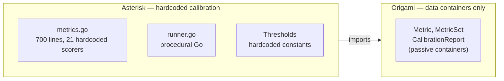
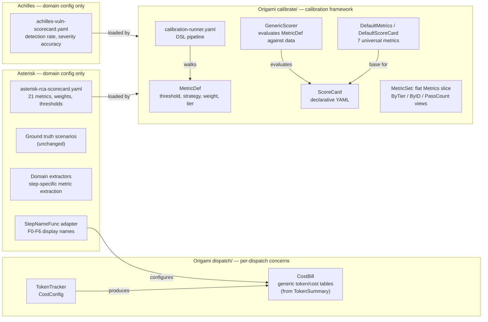

# Contract — Principled Calibration Scorecard

**Status:** draft  
**Goal:** Replace arbitrary metric thresholds with principled, ROI-grounded analysis for every metric; elevate calibration from Asterisk-specific code to a first-class Origami framework concern with declarative metric definitions, configurable thresholds, and a calibration pipeline expressible in DSL.  
**Serves:** System Refinement (gate)

## Contract rules

- Changes span **two repos**: Origami (framework-level `MetricDef`, `ScoreCard`, threshold strategies, calibration pipeline DSL) and Asterisk (migrate 21 hardcoded metrics to declarative definitions, reweight M19, adjust thresholds).
- Every threshold change must cite a rationale from one of: baseline analysis, ceiling analysis, ROI calculation, or diminishing returns argument.
- No threshold is sacred. If the analysis says remove a metric, remove it. If it says merge two, merge them.
- The calibration runner SHOULD become a DSL pipeline (visible in Kami, debuggable, shareable across Achilles).
- Budget constraints are secondary to accuracy constraints. The ROI math proves this definitively.
- **Safety > Speed doctrine applies.** All design decisions optimize for outcome correctness first. See `project-standards.mdc` § Safety > Speed.
- **Breaking is allowed.** One consumer (Asterisk), same developer, same sprint. No backward-compat shims. Delete old API, update consumer in the same session. The cost of not breaking (carrying `MetricSet` with 6 hardcoded groups) exceeds the cost of breaking (one `go get` upgrade).
- **Three-layer slog pattern.** Primitives (`MetricDef`, `ScoreCard`) → opinionated defaults (`DefaultMetrics()`, `DefaultScoreCard()`) → consumer extension (`.WithMetrics(domain...)`). Every consumer gets 7 universal metrics free; adds domain-specific on top.

## Context

### The ROI that changes everything

The user's insight: **$1 per 20 cases saves 10 people an accumulated 10 days of work.**

| Factor | Value |
|--------|-------|
| Cases per batch | 20 |
| AI cost per batch | ~$1 (at current token prices) |
| People saved from investigation | 10 |
| Days saved | 10 person-days |
| Cost per person-day | ~$500 |
| Labor savings per batch | **$50,000** |
| ROI | **50,000x** |
| Cost per case (AI) | $0.05 |
| Labor saved per case | $2,500 |

**Conclusion:** Token budget (M18 at 60,000) is almost irrelevant. Even at 200,000 tokens per batch (~$0.50), the ROI is 100,000x. What matters is: **did the system get the answer right?** A wrong answer wastes $2,500 of human investigation time. A correct answer that cost $0.25 instead of $0.05 saved $2,499.75.

This reframes the entire scorecard: **outcome metrics (accuracy) dominate; efficiency metrics (cost) are secondary health checks.**

### Current state

- 21 metrics (M1-M20 + M14b), all hardcoded in `internal/calibrate/metrics.go`
- Thresholds set during PoC calibration runs, not from business analysis
- M19 aggregate uses fixed weights that undervalue outcome metrics
- BasicAdapter: M19=0.83 (good heuristic baseline)
- CursorAdapter: M19=0.58 (the AI adapter fails — 10/21 pass)
- No framework-level metric definition — each consumer reimplements from scratch
- Calibration runner is procedural Go, not a DSL pipeline
- No threshold strategy primitives — just `value >= threshold` everywhere
- `MetricSet` has 6 hardcoded group fields (`Structured`, `Workspace`, `Evidence`, `Semantic`, `Pipeline`, `Aggregate`) — grouping baked into the container instead of being a view operation
- `AggregateRunMetrics` in `calibrate/aggregate.go` calls `updateMetrics()` on each of the 6 groups (lines 53-58) — collapses to 1 call after flattening
- `calibrate/aggregate.go` also exports `Mean`, `Stddev`, `SafeDiv`, `SafeDivFloat` — pure math with no calibration semantics, but any package needing basic stats (e.g. `observability/`) must import `calibrate` to get them
- TokiMeter cost bill (`asterisk/internal/calibrate/tokimeter.go`, 213 lines) is Asterisk-specific but 95% generic — step ordering hardcoded to F0-F6, display names import `display.StageWithCode`
- `dispatch.FormatTokenSummary` hardcodes `3.0`/`15.0` cost rates instead of using `CostConfig`
- No universal metrics — every consumer starts from zero. Token usage, latency, path efficiency are universally needed but not provided by the framework

### Cross-references

- `domain-calibration` (Origami, draft/vision) — per-domain eval types. This contract provides the framework primitives that `domain-calibration` builds on.
- `calibration-primitives` (Origami, completed) — established `Metric`, `MetricSet`, `CalibrationReport`, `ModelAdapter`. This contract extends those types with `MetricDef` and `ScoreCard`.
- `calibration-primitives-consumer` (Asterisk, completed) — imported Origami types. This contract migrates Asterisk's hardcoded metrics to declarative `MetricDef`s.
- `improve-asterisk-kabuki-demo` (Asterisk, draft) — demo showcases calibration results. Better thresholds = more impressive demo.
- `refine-rtfm-routing-policy` (Both, draft) — `ReadPolicy` feeds into RTFM, which feeds into evidence quality (M12, M13).
- `origami-observability` (Origami, draft) — OTel + Prometheus. Token/cost metrics become both ScoreCard metrics AND Prometheus counters. TokiMeter migration must design counters Prometheus-friendly from the start.

## Metric-by-Metric Deep Dive

### Tier 1: Outcome Correctness — "Did we get the right answer?"

These metrics directly determine whether a human gets useful output. Wrong answer = wasted investigation time ($2,500/case). Must have the highest thresholds and M19 weights.

#### M1 — Defect Type Accuracy

| Aspect | Analysis |
|--------|----------|
| **Measures** | Correct defect type classification (product_bug, automation_bug, system_issue, no_defect, to_investigate) |
| **Business impact** | Wrong classification → wrong team investigates → days wasted |
| **Baseline** | 0.20 (random, 5 categories) to 0.40 (most-common-class heuristic) |
| **Ceiling** | ~0.92 (human experts disagree on ~8% of edge cases — ambiguous cases where "product_bug vs automation_bug" is a judgment call) |
| **Diminishing returns** | Above 0.90 — remaining errors are genuinely ambiguous |
| **Cost to improve** | Low — classification is one LLM call at F6 Report |
| **Current threshold** | 0.80 |
| **Recommended threshold** | **0.85** |
| **Rationale** | At 0.80, 1 in 5 classifications is wrong. At 0.85, 1 in ~7. Each wrong classification costs ~$2,500 in wasted human time. The incremental cost to improve from 0.80→0.85 is near zero (better prompt). |

#### M15 — Component Identification

| Aspect | Analysis |
|--------|----------|
| **Measures** | Naming the correct component that caused the failure |
| **Business impact** | Wrong component → human looks in the wrong place → days wasted |
| **Baseline** | ~0.10-0.15 (many possible components in a multi-operator system) |
| **Ceiling** | ~0.85 (some components interact and attribution is genuinely ambiguous) |
| **Diminishing returns** | Above 0.80 — remaining errors are attribution ambiguity |
| **Cost to improve** | Medium — requires good evidence from investigation |
| **Current threshold** | 0.70 |
| **Recommended threshold** | **0.75** |
| **Rationale** | Component ID is the "where to look" signal. At 0.70, nearly 1 in 3 is wrong. 0.75 is achievable with better RTFM context and evidence. |

#### M2 — Symptom Category Accuracy

| Aspect | Analysis |
|--------|----------|
| **Measures** | Correct symptom classification (determines pipeline routing) |
| **Business impact** | Wrong category → wrong investigation path, but recoverable via review loop (H13) |
| **Baseline** | ~0.25 (4 categories) to ~0.45 (majority-class heuristic) |
| **Ceiling** | ~0.90 |
| **Diminishing returns** | Above 0.85 |
| **Cost to improve** | Low — triage is one LLM call |
| **Current threshold** | 0.75 |
| **Recommended threshold** | **0.80** |
| **Rationale** | Routing accuracy affects downstream quality. 0.75→0.80 is achievable with better triage prompts. |

### Tier 2: Investigation Quality — "Did we find the right evidence?"

These metrics affect the quality of the investigation process. Errors here degrade RCA quality but may be partially recoverable through the review loop.

#### M10 — Repo Selection Recall

| Aspect | Analysis |
|--------|----------|
| **Measures** | Selecting the correct repository for investigation |
| **Business impact** | Missing the right repo → cannot find evidence → wrong or inconclusive RCA |
| **Baseline** | ~0.20 (5 repos, random) |
| **Ceiling** | ~0.95 (RTFM + workspace metadata gives strong signal) |
| **Diminishing returns** | Above 0.90 |
| **Cost to improve** | Low — RTFM node and workspace Purpose metadata already provide strong signals |
| **Current threshold** | 0.80 |
| **Recommended threshold** | **0.85** |
| **Rationale** | This is the most critical investigation metric. Missing the right repo is unrecoverable — the entire investigation will be wrong. With RTFM and Purpose metadata, 0.85 is achievable. |

#### M9 — Repo Selection Precision

| Aspect | Analysis |
|--------|----------|
| **Measures** | Not selecting wrong/irrelevant repos |
| **Business impact** | Extra repos → extra investigation cost (tokens), but correct answer still possible |
| **Baseline** | ~0.20 (5 repos) |
| **Ceiling** | ~0.90 |
| **Diminishing returns** | Above 0.80 |
| **Cost to improve** | Low — better RTFM disambiguation |
| **Current threshold** | 0.70 |
| **Recommended threshold** | **0.65** (lowered) |
| **Rationale** | Given the ROI math, selecting an extra repo costs ~$0.01 in tokens but doesn't affect answer quality. Precision matters less than recall. Lower threshold, higher M10 weight. |

#### M12 — Evidence Recall

| Aspect | Analysis |
|--------|----------|
| **Measures** | Finding relevant evidence from investigated repos |
| **Business impact** | Missing evidence → weaker RCA, lower confidence, potentially wrong conclusion |
| **Baseline** | 0.00 (no investigation) |
| **Ceiling** | ~0.80 (some evidence is buried deep; structurally capped in dry mode because agent can't access real repos) |
| **Diminishing returns** | Above 0.75 |
| **Cost to improve** | High — requires better investigation prompts and deeper repo analysis |
| **Current threshold** | 0.60 |
| **Recommended threshold** | **0.65** wet / **0.40** dry (dry cap) |
| **Rationale** | Evidence is the backbone of explainable RCA. Raising to 0.65 for wet is justified. Dry cap at 0.40 acknowledges structural limitation. |

#### M13 — Evidence Precision

| Aspect | Analysis |
|--------|----------|
| **Measures** | Not citing irrelevant evidence |
| **Business impact** | Extra evidence → noise, but human can filter. Not harmful, just annoying. |
| **Baseline** | Variable |
| **Ceiling** | ~0.80 |
| **Diminishing returns** | Above 0.60 — more precision means potentially dropping borderline-relevant evidence |
| **Cost to improve** | Medium |
| **Current threshold** | 0.50 |
| **Recommended threshold** | **0.45** (lowered) |
| **Rationale** | Better to over-cite than under-cite. A human scanning 10 evidence items where 5 are relevant is better than scanning 5 where 4 are relevant but missing the 5th. |

#### M14 — RCA Message Relevance

| Aspect | Analysis |
|--------|----------|
| **Measures** | Keyword overlap between RCA message and expected keywords |
| **Business impact** | Medium — measures whether the RCA text is on-topic |
| **Baseline** | ~0.10 (random text) |
| **Ceiling** | ~0.85 (different phrasing for same concept) |
| **Cost to improve** | Low — better report prompts |
| **Current threshold** | 0.60 |
| **Recommended threshold** | **0.60** (keep) |

#### M14b — Smoking Gun Hit Rate

| Aspect | Analysis |
|--------|----------|
| **Measures** | Whether the RCA message reaches the same conclusion as the PR-proven fix |
| **Business impact** | HIGH — this IS the right answer. If the smoking gun is found, the RCA is correct by definition. |
| **Baseline** | 0.00 |
| **Ceiling** | ~0.70 (some fixes have non-obvious relationship to failure symptoms) |
| **Cost to improve** | High — requires deep investigation quality |
| **Current threshold** | 0.00 (always passes — tracking only) |
| **Recommended threshold** | **0.30** (promote from tracking to real metric) |
| **Rationale** | This is the most honest metric in the scorecard. It measures whether the system found what the human developer found. Currently ignored (always passes). Should be tracked seriously and included in M19 once the system can hit 0.30 reliably. |

### Tier 3: Detection & Routing — "Did we take the right path?"

These metrics measure pipeline efficiency and advanced detection capabilities. Errors here increase cost but are often recoverable.

#### M3 — Recall Hit Rate

| Aspect | Analysis |
|--------|----------|
| **Current threshold** | 0.70 |
| **Recommended** | **0.65** (lowered) |
| **Rationale** | Recall miss just means full investigation. More work, not wrong answer. Lower threshold, focus energy on outcome metrics. |

#### M4 — Recall False Positive Rate

| Aspect | Analysis |
|--------|----------|
| **Current threshold** | 0.10 |
| **Recommended** | **0.10** (keep) |
| **Rationale** | False positive skips investigation entirely → potentially wrong answer. This is a safety metric. Keep tight. |

#### M5 — Serial Killer Detection

| Aspect | Analysis |
|--------|----------|
| **Current threshold** | 0.70 |
| **Recommended** | **0.55** (lowered) |
| **Rationale** | Cross-case correlation is advanced. Helps with batch resolution but each case still gets analyzed. Dataset currently has few true serial killers to train on. Lower threshold reflects realistic capability. |

#### M6 — Skip Accuracy

| Aspect | Analysis |
|--------|----------|
| **Current threshold** | 0.80 |
| **Recommended** | **0.80** (keep) |
| **Rationale** | Wrong skip = missed root cause. This is a safety metric. |

#### M7 — Cascade Detection

| Aspect | Analysis |
|--------|----------|
| **Current threshold** | 0.50 |
| **Recommended** | **0.40** (lowered) |
| **Rationale** | Cascade detection is the hardest detection problem. 0.50 is aspirational given current data. |

#### M8 — Convergence Calibration

| Aspect | Analysis |
|--------|----------|
| **Current threshold** | 0.40 |
| **Recommended** | **0.35** (lowered slightly) |
| **Rationale** | Correlation between confidence and correctness. 0.40 is ambitious for LLMs. This is a health metric, not a correctness metric. |

#### M11 — Red Herring Rejection

| Aspect | Analysis |
|--------|----------|
| **Current threshold** | 0.80 |
| **Recommended** | **0.70** (lowered) |
| **Rationale** | Investigating a red herring costs tokens ($0.01), not human time. Given ROI math, lower threshold. |

### Tier 4: Efficiency — "How much did it cost?"

Given the 50,000x ROI, efficiency metrics should be health checks, not gates.

#### M16 — Pipeline Path Accuracy

| Aspect | Analysis |
|--------|----------|
| **Current threshold** | 0.60 |
| **Recommended** | **0.50** (lowered) |
| **Rationale** | Wrong path reaches the right answer via loops. Extra steps cost tokens, not human time. |

#### M17 — Loop Efficiency

| Aspect | Analysis |
|--------|----------|
| **Current threshold** | 0.5-2.0 |
| **Recommended** | **0.3-3.0** (widened) |
| **Rationale** | Extra loops cost tokens. Given ROI, be more liberal. |

#### M18 — Total Prompt Tokens

| Aspect | Analysis |
|--------|----------|
| **Current threshold** | 60,000 |
| **Recommended** | **200,000** (3.3x increase) |
| **Rationale** | At $3/1M input tokens (GPT-4 class): 60K tokens = $0.18, 200K tokens = $0.60. Per 20 cases: $3.60 vs $12.00. Both are negligible vs $50,000 labor savings. The current 60K budget starves investigation quality. Doubling the budget could improve M12 (evidence recall) significantly because agents can read more code. |

### Tier 5: Aggregate — "The bottom line"

#### M19 — Overall Accuracy (reweighted)

Current weights vs recommended:

| Metric | Current weight | Recommended weight | Change | Rationale |
|--------|---------------|-------------------|--------|-----------|
| M1 (Defect Type) | 0.20 | **0.25** | +0.05 | Primary output — weight highest |
| M2 (Symptom Category) | 0.10 | **0.10** | = | Routing quality |
| M5 (Serial Killer) | 0.15 | **0.05** | -0.10 | Advanced detection — lower priority |
| M9 (Repo Precision) | 0.10 | **0.05** | -0.05 | Cost metric disguised as quality |
| M10 (Repo Recall) | 0.10 | **0.15** | +0.05 | Missing right repo is unrecoverable |
| M12 (Evidence Recall) | 0.10 | **0.10** | = | Foundation of explainable RCA |
| M14 (RCA Relevance) | 0.10 | **0.10** | = | On-topic output |
| M15 (Component ID) | 0.15 | **0.20** | +0.05 | "Where to look" — high human value |

**New M19 threshold:** **0.70** (raised from 0.65)

**Rationale for raising:** After reweighting toward outcome metrics, 0.70 is achievable by any system that gets the big things right (defect type, component, repo selection). The current 0.65 allows a system that gets 35% of the important things wrong — too permissive.

**Future inclusion:** When M14b (Smoking Gun) consistently exceeds 0.30, include it in M19 at weight 0.10 (reducing M14 to 0.05). The smoking gun IS the ground truth.

#### M20 — Run Variance

| Aspect | Analysis |
|--------|----------|
| **Current threshold** | 0.15 |
| **Recommended** | **0.15** (keep) |
| **Rationale** | Consistency matters for trust. Keep tight. |

## Summary of threshold changes

| Metric | Current | Proposed | Direction | Category |
|--------|---------|----------|-----------|----------|
| M1 | 0.80 | **0.85** | raised | Outcome |
| M2 | 0.75 | **0.80** | raised | Outcome |
| M3 | 0.70 | **0.65** | lowered | Routing |
| M4 | 0.10 | **0.10** | keep | Safety |
| M5 | 0.70 | **0.55** | lowered | Detection |
| M6 | 0.80 | **0.80** | keep | Safety |
| M7 | 0.50 | **0.40** | lowered | Detection |
| M8 | 0.40 | **0.35** | lowered | Health |
| M9 | 0.70 | **0.65** | lowered | Cost |
| M10 | 0.80 | **0.85** | raised | Investigation |
| M11 | 0.80 | **0.70** | lowered | Cost |
| M12 | 0.60 | **0.65** | raised | Investigation |
| M13 | 0.50 | **0.45** | lowered | Cost |
| M14 | 0.60 | **0.60** | keep | Semantic |
| M14b | 0.00 | **0.30** | raised | Outcome |
| M15 | 0.70 | **0.75** | raised | Outcome |
| M16 | 0.60 | **0.50** | lowered | Efficiency |
| M17 | 0.5-2.0 | **0.3-3.0** | widened | Efficiency |
| M18 | 60,000 | **200,000** | 3.3x | Budget |
| M19 | 0.65 | **0.70** | raised | Aggregate |
| M20 | 0.15 | **0.15** | keep | Meta |

**Pattern:** Outcome and investigation metrics raised. Efficiency and cost metrics lowered. The system should optimize for correct answers, not cheap answers.

## Making Calibration a First-Class Origami Concern

### Problem

Every Origami consumer needs calibration:
- **Asterisk:** RCA accuracy (M1-M20)
- **Achilles:** Vulnerability detection rate, severity accuracy
- **Future tools:** Whatever their domain metrics are

Currently each consumer must build: metric definitions, scorer functions, runner, report formatter — all from scratch. Origami provides `Metric` and `MetricSet` as data containers but no framework for defining, evaluating, or configuring metrics.

### What Origami should provide

| Primitive | Purpose |
|-----------|---------|
| `MetricDef` | Declarative metric definition: ID, name, threshold, evaluation strategy, weight, cost tier, direction (higher/lower-is-better) |
| `ScoreCard` | Named collection of `MetricDef`s with aggregate formula. The "test suite" for a domain. |
| `ThresholdStrategy` | How thresholds are derived: `fixed`, `baseline_relative`, `percentile`, `roi_based` |
| `CostTier` | Classification: `outcome` (high weight), `investigation` (medium), `detection` (low), `efficiency` (health check) |
| `EvalDirection` | `higher_is_better` (default) or `lower_is_better` (M4, M18, M20) or `range` (M17) |
| `DefaultMetrics()` | 7 universal metrics every pipeline needs: `token_usage`, `token_cost_usd`, `latency_seconds`, `path_efficiency`, `loop_ratio`, `confidence_calibration`, `run_variance`. Three derived from TokiMeter, two from walk, two from multi-run. |
| `DefaultScoreCard()` | Wraps `DefaultMetrics()`. Consumer extends: `DefaultScoreCard().WithMetrics(domain...).Build()`. The Go `slog` pattern: works out of the box, fully customizable. |
| `CostBill` | Generic cost bill in `dispatch/` (migrated from Asterisk TokiMeter). Built from `TokenSummary` — available on every dispatch, not just calibration. Per-case and per-step token/cost tables. Configurable via functional options (`WithStepNames`, `WithCaseMetadata`). |

### ScoreCard YAML (proposed)

```yaml
scorecard: asterisk-rca
description: "Root-cause analysis quality scorecard"
version: 1

cost_model:
  cases_per_batch: 20
  cost_per_batch_usd: 1.00
  labor_saved_per_batch_person_days: 100
  person_day_cost_usd: 500

metrics:
  - id: M1
    name: defect_type_accuracy
    tier: outcome
    direction: higher_is_better
    threshold: 0.85
    weight: 0.25
    rationale: "Primary output — wrong classification wastes investigation time"

  - id: M15
    name: component_identification
    tier: outcome
    direction: higher_is_better
    threshold: 0.75
    weight: 0.20
    rationale: "Where to look — wrong component sends human to wrong codebase"

  - id: M18
    name: total_prompt_tokens
    tier: efficiency
    direction: lower_is_better
    threshold: 200000
    weight: 0.00
    rationale: "Health check only — $0.60 vs $50K savings makes cost irrelevant"

aggregate:
  id: M19
  name: overall_accuracy
  formula: weighted_average
  threshold: 0.70
  include: [M1, M2, M5, M9, M10, M12, M14, M15]
```

This replaces 700 lines of hardcoded Go scorer functions with a declarative, version-controlled, reviewable definition.

### Calibration as a DSL Pipeline

The calibration runner has a clear graph structure:

```yaml
pipeline: calibration-runner
description: "Run domain calibration against ground truth scenario"

nodes:
  - name: load_scenario
    family: calibrate.load
  - name: fan_out
    family: calibrate.fan_out
  - name: walk_case
    family: calibrate.walk_case
  - name: score_case
    family: calibrate.score_case
  - name: fan_in
    family: calibrate.fan_in
  - name: aggregate
    family: calibrate.aggregate
  - name: report
    family: calibrate.report

edges:
  - from: load_scenario
    to: fan_out
    when: "true"
  - from: fan_out
    to: walk_case
    when: "true"
  - from: walk_case
    to: score_case
    when: "true"
  - from: score_case
    to: fan_in
    when: "true"
  - from: fan_in
    to: aggregate
    when: "all_cases_complete"
  - from: aggregate
    to: report
    when: "true"

start: load_scenario
done: DONE
```

**Benefits:**
- **Visible in Kami** — live view of calibration progress, per-case status, failing cases highlighted
- **Debuggable** — breakpoint on a failing case, inspect artifacts
- **Shareable** — Achilles defines `achilles-calibration.yaml` and gets the same infrastructure
- **Dog-food** — Origami uses Origami to calibrate itself. This is the strongest possible proof of the framework.

### Current architecture



### Desired architecture



## FSC artifacts

| Artifact | Target | Compartment |
|----------|--------|-------------|
| Metric deep dive analysis | `docs/metric-analysis.md` (Asterisk) | domain |
| ScoreCard YAML schema reference | `docs/scorecard-spec.md` (Origami) | framework |
| ROI model documentation | `docs/calibration-roi.md` (Asterisk) | domain |

## Execution strategy

Phase 1 flattens `MetricSet` (breaking change), defines the framework primitives in Origami (`MetricDef`, `ScoreCard`, `CostTier`, `EvalDirection`), and ships 7 universal metrics via `DefaultMetrics()`/`DefaultScoreCard()`. Phase 2 creates a ScoreCard YAML loader and generic scorer, plus fixes `FormatTokenSummary` cost bug. Phase 2.5 migrates TokiMeter cost bill from Asterisk to Origami `dispatch/cost_bill.go` — lives in `dispatch/` because token tracking is a dispatch-level concern (every agent dispatch produces a cost bill, not just calibration). Phase 3 migrates Asterisk's 21 metrics from hardcoded Go to a `asterisk-rca-scorecard.yaml` file. Phase 4 applies the principled thresholds from this contract's analysis. Phase 5 reweights M19 and promotes M14b from tracking to real metric. Phase 6 expresses the calibration runner as a DSL pipeline (stretch). Phase 7 validates everything with stub + wet calibration runs.

Phases 1-2.5 are Origami-only (with TM4-TM5 touching Asterisk for deletion). Phases 3-5 are Asterisk. Phase 6 spans both. Phase 7 is validation.

## Coverage matrix

| Layer | Applies | Rationale |
|-------|---------|-----------|
| **Unit** | yes | MetricDef evaluation, ScoreCard loading, threshold strategies, reweighted M19 |
| **Integration** | yes | Stub calibration with new thresholds, ScoreCard YAML → metrics evaluation |
| **Contract** | yes | ScoreCard YAML schema, MetricDef fields, evaluation directions |
| **E2E** | yes | Full stub calibration produces report matching new thresholds |
| **Concurrency** | no | ScoreCard is read-only at runtime |
| **Security** | no | No trust boundaries affected |

## Tasks

### Phase 1 — Framework Primitives (Origami)

- [ ] **F0** Flatten `MetricSet` from 6-group struct (`Structured`, `Workspace`, `Evidence`, `Semantic`, `Pipeline`, `Aggregate`) to `Metrics []Metric`. Add `Tier CostTier` and `Direction EvalDirection` fields to `Metric` (populated by `ScoreCard.Evaluate()`). Replace `AllMetrics()` with direct slice access. `PassCount()` and new view methods `ByTier() map[CostTier][]Metric`, `ByID() map[string]Metric` become methods on the flat struct. Update `AggregateRunMetrics` in `aggregate.go` — collapse 6 explicit `updateMetrics()` calls to 1. Update `FormatReport` in `report.go` to auto-generate `MetricSection`s from `Tier`.
- [ ] **F0b** Extract `Mean`, `Stddev`, `SafeDiv`, `SafeDivFloat` from `calibrate/aggregate.go` to a new `internal/mathutil/stats.go` package in Origami. These are pure math with no calibration semantics. The `observability/` package (and any future stats consumer) should not need to import `calibrate` for basic arithmetic. Update `calibrate/aggregate.go` to import from `internal/mathutil`.
- [ ] **F1** Define `MetricDef` type in `calibrate/scorecard.go`: `ID`, `Name`, `Tier` (CostTier), `Direction` (EvalDirection), `Threshold`, `RangeMin`/`RangeMax` (for range checks like M17), `Weight` (for aggregate), `Rationale`
- [ ] **F2** Define `CostTier` enum: `TierOutcome`, `TierInvestigation`, `TierDetection`, `TierEfficiency`, `TierMeta`
- [ ] **F3** Define `EvalDirection` enum: `HigherIsBetter`, `LowerIsBetter`, `RangeCheck`
- [ ] **F4** Define `ScoreCard` type: `Name`, `Description`, `Version`, `CostModel`, `Metrics []MetricDef`, `Aggregate AggregateConfig`
- [ ] **F5** Define `CostModel` type: `CasesPerBatch`, `CostPerBatchUSD`, `LaborSavedPersonDays`, `PersonDayCostUSD`, computed `ROI()` method
- [ ] **F6** Define `AggregateConfig`: `ID`, `Name`, `Formula` (weighted_average), `Threshold`, `Include []string`
- [ ] **F7** Unit tests for all types
- [ ] **F8** Define `DefaultMetrics() []MetricDef` — 7 universal metrics: `token_usage` (efficiency, lower_is_better), `token_cost_usd` (efficiency, lower_is_better), `latency_seconds` (efficiency, lower_is_better), `path_efficiency` (efficiency, closer_to_1), `loop_ratio` (efficiency, range 0.5-3.0), `confidence_calibration` (meta, higher_is_better), `run_variance` (meta, lower_is_better). Three derived from existing TokiMeter/TokenTracker infrastructure, two from walk observer, two from multi-run aggregation.
- [ ] **F9** Define `DefaultScoreCard() *ScoreCardBuilder` — wraps `DefaultMetrics()`. Consumer extends via `.WithMetrics(domainMetrics...).Build()`. Follows the Go `slog` pattern: `slog.Default()` works out of the box, `slog.New(handler)` lets you customize everything.

### Phase 2 — ScoreCard Loader and Generic Scorer (Origami)

- [ ] **L1** `LoadScoreCard(path) (*ScoreCard, error)` — YAML/JSON loader with validation
- [ ] **L2** `ScoreCard.Evaluate(metric Metric) bool` — evaluate a metric value against its MetricDef (direction-aware, range-aware)
- [ ] **L3** `ScoreCard.ComputeAggregate(metrics []Metric) Metric` — compute weighted aggregate
- [ ] **L4** `ScoreCard.Report(metrics []Metric) CalibrationReport` — generate report using ScoreCard definitions
- [ ] **L5** Integration test: load a ScoreCard YAML, evaluate sample metrics, verify pass/fail
- [ ] **L6** Backward compatibility: existing `Metric` struct works unchanged. `MetricDef` enriches definition; `Metric` remains the runtime result.
- [ ] **L7** Three-layer API validation: `DefaultScoreCard()` returns a working ScoreCard with 7 universal metrics. `DefaultScoreCard().WithMetrics(M1, M2, ...).Build()` returns a ScoreCard with 7+N metrics. Consumer test: Achilles uses `DefaultScoreCard().WithMetrics(detection_rate, severity_accuracy).Build()` and gets 9 metrics total.
- [ ] **L8** Fix `dispatch.FormatTokenSummary` to accept `CostConfig` parameter instead of hardcoding `3.0`/`15.0` for per-line cost calculation. Bug: lines 159-160 of `dispatch/token.go` use literal values that diverge from the tracker's `CostConfig`.

### Phase 2.5 — TokiMeter Migration (Origami + Asterisk)

Migrate the generic cost bill from Asterisk to Origami so every consumer gets token/cost reporting for free.

- [ ] **TM1** Move `TokiMeterBill`, `TokiMeterCaseLine`, `TokiMeterStepLine` structs to `origami/dispatch/cost_bill.go`. Rename to `CostBill`, `CostBillCaseLine`, `CostBillStepLine` (drop the Asterisk branding). Lives in `dispatch/` because token tracking is a fundamental dispatch concern — every agent dispatch produces a cost bill, not just calibration.
- [ ] **TM2** Move `BuildTokiMeterBill` → `BuildCostBill(summary *TokenSummary, opts ...CostBillOption) *CostBill`. Takes `TokenSummary` directly (not `CalibrationReport`). Functional options: `WithStepNames(func(string) string)` for display names, `WithCaseMetadata([]CaseMeta)` for per-case enrichment. Calibration is just one call-site: `dispatch.BuildCostBill(report.Tokens, dispatch.WithStepNames(display.StageWithCode), dispatch.WithCaseMetadata(caseMeta))`.
- [ ] **TM3** Move `FormatTokiMeter` → `FormatCostBill(bill *CostBill) string`. Replace `display.StageWithCode()` calls with the step names already applied during build. The markdown format is generic (per-case table, per-step table, summary, pricing footnote).
- [ ] **TM4** In Asterisk: replace `tokimeter.go` usage with `dispatch.BuildCostBill(report.Tokens, dispatch.WithStepNames(display.StageWithCode))` and `dispatch.FormatCostBill(bill)`. The domain-specific part (step display names) stays in Asterisk as a one-line `StepNameFunc` adapter.
- [ ] **TM5** Delete `asterisk/internal/calibrate/tokimeter.go` and `tokimeter_test.go`. Verify `cmd_calibrate.go` compiles with the new import path (`dispatch` instead of `calibrate`).

### Phase 3 — Migrate Asterisk Metrics to ScoreCard (Asterisk)

- [ ] **M1** Create `scorecards/asterisk-rca.yaml` with all 21 metrics defined declaratively
- [ ] **M2** Update `internal/calibrate/metrics.go` to load `MetricDef`s from ScoreCard and use `ScoreCard.Evaluate()` instead of hardcoded `value >= threshold`
- [ ] **M3** Keep domain-specific scorer functions (they compute the `Value` — only threshold checking moves to ScoreCard)
- [ ] **M4** Unit tests: verify all 21 metrics produce same results with ScoreCard as with hardcoded thresholds

### Phase 4 — Apply Principled Thresholds (Asterisk)

- [ ] **T1** Update `asterisk-rca.yaml` scorecard with all threshold changes from the deep dive analysis
- [ ] **T2** Run stub calibration with new thresholds — document which metrics flip pass/fail
- [ ] **T3** Run wet calibration (3 cases) with new thresholds — document impact
- [ ] **T4** If M14b at 0.30 causes too many failures, adjust to 0.20 and document

### Phase 5 — Reweight M19 (Asterisk)

- [ ] **W1** Update M19 weights in scorecard YAML per the analysis table
- [ ] **W2** Run stub calibration — compare old M19 vs new M19
- [ ] **W3** Document the M19 delta and whether it better reflects actual quality

### Phase 6 — Calibration Pipeline DSL + Domain Calibration (Stretch, Both)

This phase also absorbs the `domain-calibration` contract: each domain defines its own ScoreCard YAML and gets the same pipeline infrastructure.

**Domain calibration taxonomy** (from absorbed `domain-calibration.md`):

| Domain | Product | ScoreCard | Ground truth | Key metrics |
|--------|---------|-----------|-------------|-------------|
| **Asterisk** | Root Cause Analysis | `asterisk-rca.yaml` | `calibrate.Scenario` | M1-M20 (defect type, evidence, convergence) |
| **Achilles** | Vulnerability Discovery | `achilles-vuln.yaml` | Known CVEs in target repos | Detection rate, false positive rate, severity accuracy |
| **Future** | Any Origami consumer | `<domain>-scorecard.yaml` | Domain-specific dataset | Domain-specific metrics |

- [ ] **P1** Define calibration pipeline nodes as Origami `Node` implementations: `LoadScenario`, `FanOutCases`, `WalkCase`, `ScoreCase`, `FanInResults`, `Aggregate`, `Report`
- [ ] **P2** Create `pipelines/calibration-runner.yaml` in Origami
- [ ] **P3** Wire the calibration pipeline into Kami for live visualization
- [ ] **P4** Update Asterisk's `RunCalibration` to optionally use the DSL pipeline instead of procedural runner
- [ ] **P5** Integration test: DSL calibration pipeline produces identical results to procedural runner
- [ ] **P6** Validate: Achilles can define `achilles-vuln-scorecard.yaml` and run the same pipeline without Origami code changes

### Phase 7 — Validate and Tune

- [ ] Validate (green) — `go build ./...`, `go test ./...` across both repos. Stub calibration with new thresholds passes. ScoreCard YAML loads and evaluates correctly.
- [ ] Tune (blue) — review threshold changes against CursorAdapter results. Are the raised thresholds achievable? Are the lowered thresholds too permissive? Document findings.
- [ ] Validate (green) — all tests still pass after tuning.

## Acceptance criteria

**Given** a `ScoreCard` loaded from `asterisk-rca.yaml`,  
**When** `ScoreCard.Evaluate(Metric{ID: "M18", Value: 150000})` is called,  
**Then** it returns `true` (pass) because the new threshold is 200,000 and direction is `LowerIsBetter`.

**Given** a `ScoreCard` with M1 threshold at 0.85,  
**When** the BasicAdapter stub calibration runs,  
**Then** M1 still passes (BasicAdapter achieves 1.00 on stub data).

**Given** the principled thresholds from this contract,  
**When** the CursorAdapter wet calibration runs,  
**Then** the number of passing metrics should increase compared to the old thresholds (some efficiency metrics that previously failed will now pass due to relaxed thresholds), even though outcome metrics are harder.

**Given** the new M19 weights,  
**When** M19 is computed for BasicAdapter stub calibration,  
**Then** the value is >= 0.70 (the new threshold).

**Given** a `ScoreCard` YAML for Achilles with 4 metrics (detection_rate, false_positive_rate, severity_accuracy, novel_plausibility),  
**When** loaded and evaluated,  
**Then** the ScoreCard system handles a completely different domain without code changes to Origami.

## Security assessment

No trust boundaries affected. ScoreCard is a configuration file read at startup. No new external calls. Threshold changes affect pass/fail judgments but not system behavior.

## Notes

2026-02-26 — Contract created after mock PoC demo failure. Core criticism: thresholds are arbitrary. The ROI analysis ($1/20 cases vs $50K labor savings = 50,000x ROI) reframes the entire scorecard: accuracy dominates, cost is irrelevant. 7 metrics raised (outcome), 8 lowered (efficiency/detection), 6 kept. M14b promoted from tracking to real metric. M19 reweighted toward outcome metrics. Calibration elevated from Asterisk-specific code to Origami framework concern with declarative ScoreCard YAML. Stretch goal: calibration runner as DSL pipeline (Origami eating its own dog food).

2026-02-26 — Expanded scope after design review. Breaking is allowed (one consumer, same developer). MetricSet flattened from 6-group struct to flat `Metrics []Metric` with Tier/Direction on each Metric. ScoreCard owns grouping as a view operation, not storage. 7 universal default metrics (`DefaultMetrics()`) ship with the framework — 3 from TokiMeter (token_usage, token_cost_usd, latency), 2 from walk (path_efficiency, loop_ratio), 2 from multi-run (confidence_calibration, run_variance). Three-layer API follows Go `slog` pattern. TokiMeter cost bill migrated from Asterisk to Origami `dispatch/cost_bill.go` — lives in `dispatch/` because every agent dispatch produces a cost bill, not just calibration. `BuildCostBill` takes `TokenSummary` directly with functional options (`WithStepNames`, `WithCaseMetadata`). `FormatTokenSummary` bug fix: use CostConfig, not hardcoded 3.0/15.0. New cross-reference to `origami-observability` — token metrics become both ScoreCard metrics and Prometheus counters.
