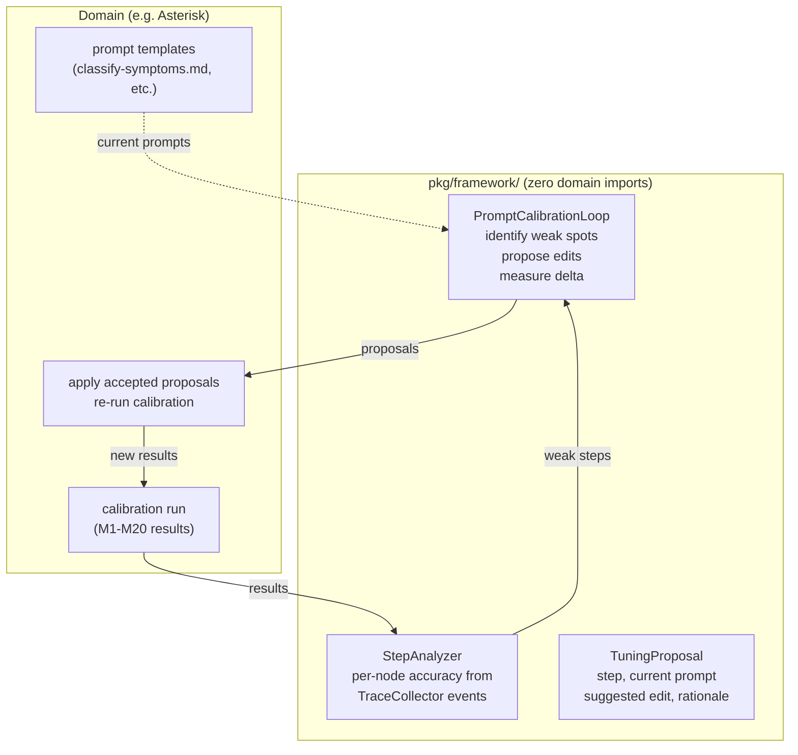

# Contract — Prompt Calibration

**Status:** draft  
**Goal:** Framework-level infrastructure for calibration-driven prompt tuning: measure walker effectiveness per node, identify underperforming prompts, and apply systematic improvements via a feedback loop.  
**Serves:** Architecture evolution (vision — extends Tome III personae + Tome IV meta-calibration)

## Contract rules

- Zero imports from Asterisk domain packages. This is a `pkg/framework/` concern.
- Prompt tuning is task-based (observe calibration results), never ad-hoc (guess what might help).
- Tuning proposals are reversible: every change produces a before/after measurement.
- Follows the Papert Paradigm (`rules/universal/papert-paradigm.mdc`): zero-config default, deep customization, composable.

## Context

### The problem

The framework has `PromptPreamble` on `AgentIdentity` (8 personas, each with a hardcoded string). Domain adapters have per-step prompt templates (e.g. Asterisk's `classify-symptoms.md`, `deep-rca.md`). When calibration reveals accuracy gaps, the current workflow is manual:

1. Human reads post-run analysis
2. Human identifies which prompt needs which fix
3. Human edits the prompt
4. Human re-runs calibration
5. Repeat

This works but doesn't scale. With multiple domains (Asterisk RCA, Origami curation), multiple adapters (basic, cursor), and multiple personas (8), the combinatorial space of prompt x model x persona x step is too large for manual tuning.

### What the framework should provide

A **PromptCalibration** feedback loop:

```
calibration results → identify weak spots → propose prompt edits → re-calibrate → measure delta → accept/reject
```

The framework provides the loop machinery. Domains provide the prompt templates, metrics, and acceptance thresholds.

### Existing seams

- `AgentIdentity.PromptPreamble` — per-persona behavioral preamble (framework)
- `AgentIdentity.StepAffinity` — per-node affinity scores that could inform which prompts to tune (framework)
- `WalkObserver` / `TraceCollector` — captures per-node artifacts and elapsed time (framework)
- `Vocabulary` — translates node names for human-readable tuning reports (framework)
- `NarrationObserver` — could narrate the tuning loop itself (framework)
- Domain calibration metrics (M1-M20 in Asterisk, TBD in Origami) — domain-specific

### Relationship to meta-calibration

Meta-calibration (`contracts/draft/meta-calibration.md`) assesses **model capabilities** (behavioral profiles). Prompt calibration tunes **prompt effectiveness** for a given model+persona+step combination. They are complementary:

| Concern | Meta-calibration | Prompt calibration |
|---------|-----------------|-------------------|
| What it measures | Model behavioral traits | Prompt accuracy per step |
| Input | Behavioral probes | Domain calibration results |
| Output | ModelProfile (scores per dimension) | Prompt edit proposals + delta |
| Scope | Framework (model-level) | Framework loop + domain prompts |
| When it runs | Model changes / periodic | After each domain calibration |

## Desired architecture



## FSC artifacts

| Artifact | Target | Compartment |
|----------|--------|-------------|
| Prompt calibration design reference | `docs/framework-guide.md` | domain |
| PromptCalibration types | `pkg/framework/` | universal |

## Execution strategy

1. Define `StepAnalyzer` — extracts per-node accuracy from `TraceCollector` events + domain metrics
2. Define `TuningProposal` — struct with step, current prompt hash, suggested improvement, rationale
3. Define `PromptCalibrationLoop` — orchestrates: analyze → propose → (domain applies) → re-analyze → accept/reject
4. Test with stub domain (synthetic metrics, mock prompts)
5. Wire into Asterisk domain as first real consumer

## Tasks

- [ ] Design `StepAnalyzer` interface — input: trace events + metric results; output: per-step accuracy report
- [ ] Design `TuningProposal` struct — step, prompt hash, suggestion, rationale, expected delta
- [ ] Design `PromptCalibrationLoop` — iterator pattern: Next() returns proposal, Accept()/Reject() records delta
- [ ] Unit tests with synthetic data
- [ ] Validate — green
- [ ] Tune — blue
- [ ] Validate — green

## Acceptance criteria

- **Given** a set of calibration results with per-step accuracy,
- **When** `StepAnalyzer` processes the results,
- **Then** it identifies the lowest-accuracy steps and ranks them by improvement potential.

- **Given** a `TuningProposal` for a specific step,
- **When** the domain applies it and re-calibrates,
- **Then** the delta (before/after accuracy) is recorded and the proposal is marked accepted or rejected.

## Security assessment

No trust boundaries affected.

## Notes

- 2026-02-21 15:00 — Contract created by splitting `cursor-prompt-tuning.md`. The domain-specific Asterisk prompt fixes stay in the active contract. This contract captures the framework-level concept: systematic, measurable prompt tuning infrastructure.
