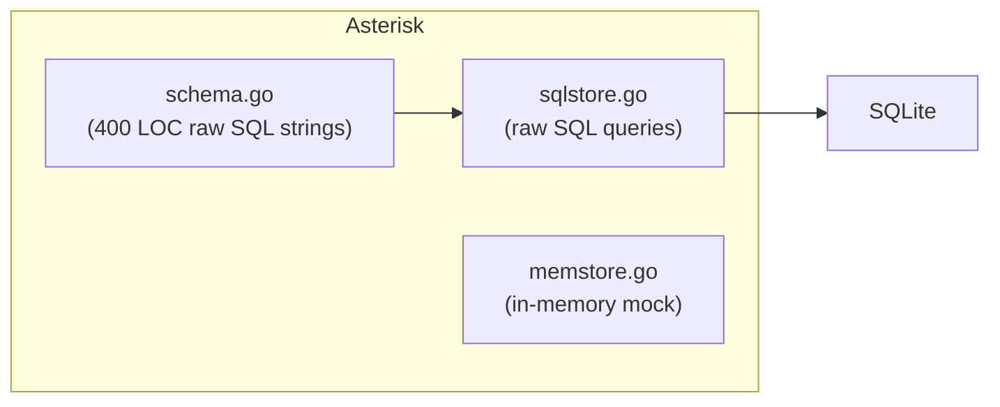
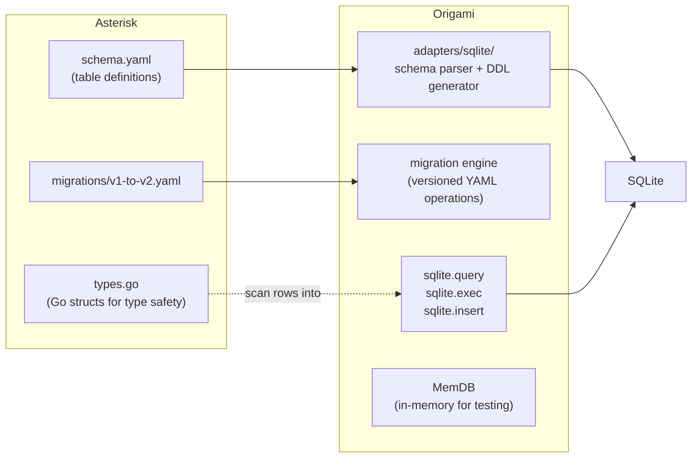

# Contract — sqlite-dsl-adapter

**Status:** draft  
**Goal:** Origami provides a YAML-defined SQLite adapter (schema, migrations, query/exec/insert transformers) following the Ansible `sqlite-utils` collection pattern.  
**Serves:** Polishing & Presentation (pure-DSL vision)

## Contract rules

- Ansible collection pattern: generic operations in the framework, domain schema/data in the consumer.
- Zero domain imports: the SQLite adapter must not import from Asterisk or any consumer.
- Schema-as-YAML: no SQL strings in consumer code. DDL is generated from YAML definitions.

## Context

Asterisk's `adapters/store/schema.go` contains ~400 lines of raw SQL DDL strings embedded in Go. The `ttafsir.sqlite_utils` Ansible collection proves this can be fully declarative: `create` (schema as YAML columns/pk/defaults), `insert` (records as YAML dicts), `run_sql` (parameterized queries), and `lookup` — all YAML, no SQL in the playbook.

This contract builds the equivalent for Origami: a YAML schema parser, DDL generator, migration engine, and CRUD transformers. Asterisk's store conversion is the validation step.

**Depends on:** `adapter-migration` WS1 (RP move) must land first — `store/` imports `rp.Envelope`, so the import path changes.

### Current architecture



### Desired architecture



## FSC artifacts

| Artifact | Target | Compartment |
|----------|--------|-------------|
| SQLite DSL schema spec | Origami `docs/` | domain |

## Execution strategy

Bottom-up: define the YAML schema format, build the parser, then layer migrations and transformers on top. Asterisk conversion is the final validation.

1. Design the YAML schema format (columns, types, pk, not_null, defaults, unique, foreign_keys, indexes).
2. Implement the schema parser + DDL generator.
3. Implement the migration engine (versioned YAML operations).
4. Implement CRUD transformers (`sqlite.query`, `sqlite.exec`, `sqlite.insert`).
5. Implement `MemDB` for testing.
6. Convert Asterisk's `schema.go` to `schema.yaml` + `migrations/v1-to-v2.yaml`.
7. Refactor Asterisk's `SqlStore`/`MemStore` to use the Origami adapter.

## Coverage matrix

| Layer | Applies | Rationale |
|-------|---------|-----------|
| **Unit** | yes | Schema parser, DDL generator, migration engine, transformer round-trips |
| **Integration** | yes | Asterisk `go build`, `go test` after store refactor; `just calibrate-stub` end-to-end |
| **Contract** | yes | SQLite schema YAML validation via `origami lint` |
| **E2E** | yes | `just calibrate-stub` must produce identical results before and after |
| **Concurrency** | yes | SQLite adapter must handle concurrent reads (MemDB in tests, SqlStore in walk) |
| **Security** | yes | Parameterized queries only; reject string interpolation |

## Tasks

### Origami: SQLite DSL adapter

- [ ] Design YAML schema format for table definitions (columns, types, pk, not_null, defaults, unique, foreign_keys, indexes)
- [ ] Implement `origami/adapters/sqlite/` package: schema parser, DDL generator from YAML
- [ ] Implement migration DSL: versioned YAML operations (create_table, add_column, rename_table, raw_sql for complex data migration)
- [ ] Implement `sqlite.query`, `sqlite.exec`, `sqlite.insert` transformers (Ansible-style parameterized operations)
- [ ] Implement `MemDB` (in-memory SQLite for testing)
- [ ] Unit tests: schema round-trip, migration engine, transformer CRUD

### Asterisk: Store conversion (validation)

- [ ] Convert `adapters/store/schema.go` DDL strings to `schema.yaml` + `migrations/v1-to-v2.yaml`
- [ ] Refactor `SqlStore` and `MemStore` to use Origami's SQLite adapter underneath
- [ ] Verify `just calibrate-stub` produces identical output

### Tail

- [ ] Validate (green) — `go build`, `go test`, `just calibrate-stub`, `just test-race` on both repos
- [ ] Tune (blue) — review YAML schemas for consistency; clean up dead Go code
- [ ] Validate (green) — all gates still pass after tuning

## Acceptance criteria

```gherkin
Feature: SQLite DSL Schema

  Scenario: Schema defined as YAML
    Given a schema.yaml with table "symptoms" (columns, pk, indexes)
    When the SQLite adapter parses and applies it
    Then the resulting DDL matches the expected CREATE TABLE + CREATE INDEX

  Scenario: Migration from YAML
    Given a migrations/v1-to-v2.yaml with rename_table and create_table operations
    When the migration engine runs against a v1 database
    Then the database schema matches v2
    And existing data is preserved

  Scenario: Query transformer
    Given a pipeline node using sqlite.query transformer
    And params: {status: "active"}
    When the node executes
    Then it returns rows matching the parameterized query

  Scenario: Schema stays reviewable
    Given schema.yaml in Asterisk
    When a developer modifies a column
    Then git diff shows the YAML change (not embedded Go SQL strings)
```

## Security assessment

| OWASP | Finding | Mitigation |
|-------|---------|------------|
| A03: Injection | Query/exec transformers accept parameterized queries | Enforce parameterized queries only; reject string interpolation in transformer input |

## Notes

2026-02-27 23:00 — Split from `adapter-migration` WS2. The SQLite DSL adapter is a significant new Origami framework feature — design + implementation of schema parser, migration engine, and CRUD transformers. It deserves its own contract, not a workstream inside a migration.
