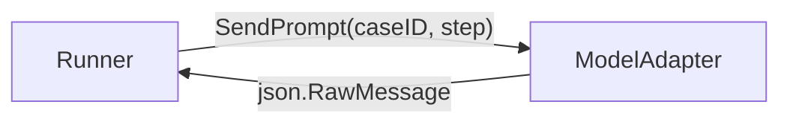
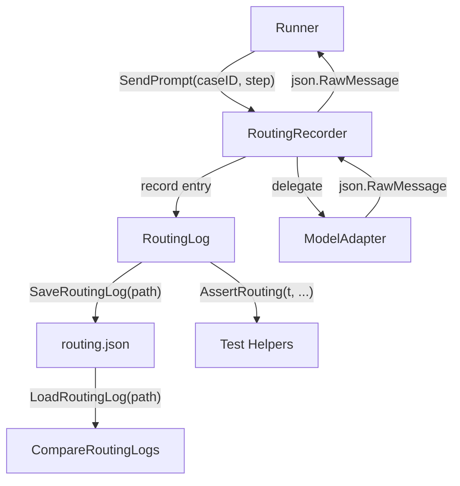

# Contract — Subagent Testing Framework

**Status:** complete  
**Goal:** Deterministic subagent dispatch assertions, color-tagged log filtering, and routing replay for reproducible multi-adapter testing.  
**Serves:** PoC completion

## Contract rules

- Zero runtime overhead when the recorder is disabled (no `--routing-log` flag = no allocation).
- Test helpers live in a `testutil` package under `internal/calibrate/adapt/` — not in production code paths.
- `RoutingLog` is JSON-serializable for replay mode.
- Color tags use the same identifiers as `AdapterTraits.Color` in `agent-adapter-overloading.md` (e.g., `crimson`, `cerulean`).

## Current Architecture

Runner calls `cfg.Adapter.SendPrompt()` directly with zero observability on routing decisions. No way to assert which adapter handled which step, no routing log, no replay capability.

The existing `MuxDispatcher` tests (`dispatch/mux_test.go`) cover transport-level correctness (dispatch ID routing, concurrency, abort) but not adapter-level routing decisions.

## Desired Architecture

A `RoutingRecorder` wraps any `ModelAdapter`, intercepting every `SendPrompt` call and recording `(caseID, step) -> adapterColor` into a `RoutingLog`. Test helpers assert on the log. Replay mode saves/loads logs for regression testing.

## Context

- `internal/calibrate/adapt/` — existing adapter implementations (basic, cursor, stub)
- `internal/calibrate/dispatch/mux.go` — `MuxDispatcher` with dispatch ID routing
- `internal/calibrate/dispatch/mux_test.go` — 10 transport-level tests (round-trip, concurrency, abort, context cancel)
- `internal/calibrate/runner.go:328` — `cfg.Adapter.SendPrompt(gtCase.ID, currentStep, "")` call site
- `contracts/draft/agent-adapter-overloading.md` — parent multi-adapter contract (color system, scheduler, pool)
- `rules/agent-bus.mdc` — delegation mandate requiring subagent dispatch for calibration steps

## Tasks

- [x] Define `RoutingEntry` struct: `CaseID`, `Step`, `AdapterColor`, `Timestamp`, `DispatchID`
- [x] Define `RoutingLog` type (slice of entries) with `ForCase(id)` and `ForStep(step)` accessors
- [x] Implement `RoutingRecorder`: wraps a `ModelAdapter`, records every `SendPrompt` call into a `RoutingLog`
- [x] Implement test helpers in `internal/calibrate/adapt/testutil/`: `AssertRouting(t, log, caseID, step, expectedColor)`, `AssertAllRouted(t, log, cases)`, `LoadRoutingReplay(path)`
- [x] Implement color-tagged slog output: adapter log lines include `slog.String("color", traits.Color)`
- [x] Add replay mode: `SaveRoutingLog(path)` / `LoadRoutingLog(path)` + `CompareRoutingLogs(expected, actual)`
- [x] Wire `RoutingRecorder` into calibration runner (opt-in via `--routing-log` flag)
- [x] Validate — existing tests pass, recorder is zero-overhead when disabled
- [x] Tune — refactor for quality, no behavior changes

## Acceptance criteria

- **Given** a calibration run with `--routing-log routing.json`,
- **When** the run completes,
- **Then** `routing.json` contains one entry per `(caseID, step)` dispatched.

- **Given** a test using `AssertRouting(t, log, "C1", "F1_TRIAGE", "crimson")`,
- **When** the adapter color matches,
- **Then** the assertion passes; when it mismatches, the test fails with a clear diff.

- **Given** two routing logs from separate runs with identical scenarios and adapters,
- **When** `CompareRoutingLogs` is called,
- **Then** matching decisions produce no diff and mismatches are listed per case/step.

## Dependencies

| Contract | Status | Required for |
|----------|--------|--------------|
| `agent-adapter-overloading.md` | draft | `AdapterTraits.Color` definition; `RoutingRecorder` wraps adapters from the pool |

## Security assessment

| OWASP | Finding | Mitigation |
|-------|---------|------------|
| A09 | Routing log could contain case IDs and step names that reveal test infrastructure topology. | `--routing-log` is opt-in and writes to a local file. File is not committed (`.asterisk/` is gitignored). |

## Notes

- 2026-02-19 — Contract created. Extracted from `agent-adapter-overloading.md` (lines 102-127 and Phase 1 task line 185) to keep concerns separated: multi-adapter architecture vs. testing/observability infrastructure.
- 2026-02-19 — Contract complete. All 9 tasks implemented. Files: `adapt/routing.go` (RoutingEntry, RoutingLog, RoutingRecorder, Save/Load/Compare), `adapt/testutil/routing.go` (AssertRouting, AssertAllRouted, LoadRoutingReplay), `cmd_calibrate.go` (--routing-log flag). 48 tests pass, 0 lint errors. `go test ./...` green.
