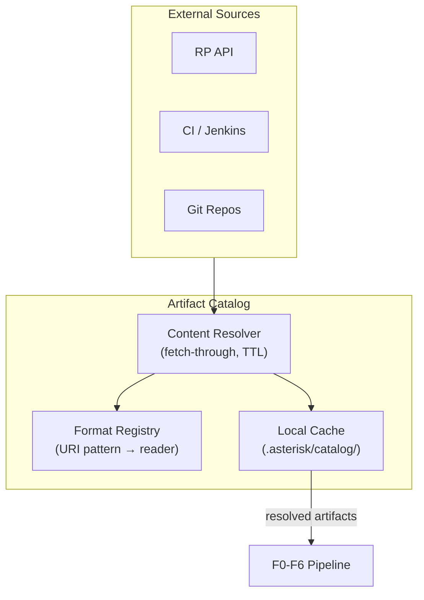

# Contract — Workspace Artifact Catalog

**Status:** draft  
**Goal:** Implement a local artifact catalog with fetch-through for RP data and local files, a format registry seeded with PTP CI patterns, and CI job log ingestion (Jenkins console, Ginkgo zip). Builds on Workspace MVP to provide structured artifact access.  
**Serves:** PoC quality / pitch polish (Phase 5a mitigation Item 3, SHOULD)

## Contract rules

- Requires Workspace MVP to be complete (depends on enriched `WorkspaceParams`).
- Catalog is local-first: fetch once, store locally, serve from cache.
- Follow scenario-vs-generic rule: catalog infrastructure is generic; format registry entries and reader implementations for PTP CI are scenario-specific.
- Every fetched artifact gets a resolution status and TTL.

## Current Architecture

No catalog exists. RP data is fetched per-request and discarded. CI artifacts on disk (`archive/ci/`) are never ingested. No format detection or content resolution.

## Desired Architecture

## Context

- `contracts/draft/workspace-mvp.md` — prerequisite; wires RP attributes and Jira links into prompts.
- `contracts/draft/workspace-revisited.md` — full vision; this contract covers Phase 2 (mid-term, should-have).
- `contracts/draft/phase-5a-mitigation.md` — parent mitigation plan.
- Real CI artifacts on disk: `archive/ci/4.21/16_feb_26/` contains `#5400.txt` (1.4 MB) and `failed_ptp_suite_test.zip` (9 MB).
- `notes/ci-notification-and-fetch.mdc` — CI notification email structure with RP, Jenkins, S3, Polarion URLs.

## Tasks

- [ ] Design catalog entry schema (URI, local path, content type, reader, TTL, resolution status, checksum)
- [ ] Implement catalog registry (`registry.json`) with CRUD operations
- [ ] Implement fetch-through resolver for RP API responses (cache `LaunchResource`, `TestItemResource`)
- [ ] Implement fetch-through resolver for local files (copy to catalog with metadata)
- [ ] Design format registry (URI pattern → reader mapping, seeded with PTP CI patterns)
- [ ] Implement `jenkins_console_log` reader (ANSI strip, error-line extraction)
- [ ] Implement `ginkgo_test_bundle` reader (ZIP extraction, Ginkgo JSON parse)
- [ ] Implement `plain_text` and `json` readers as baseline
- [ ] Wire catalog into pipeline: prompt templates can reference catalog artifacts
- [ ] Add `asterisk fetch --launch <ID>` pre-population command
- [ ] Validate — catalog fetch-through works for RP data and local CI logs in stub scenario
- [ ] Tune — TTL defaults, reader heuristics, token budget impact of injected artifacts

## Acceptance criteria

- **Given** `asterisk fetch --launch 33195` is run,
- **When** the catalog is inspected,
- **Then** RP launch data and associated test items are stored locally with metadata.

- **Given** a Jenkins console log (`#5400.txt`) is registered in the catalog,
- **When** the F3 Investigation prompt requests log context,
- **Then** the reader extracts error lines and injects a summarized view within token budget.

- **Given** `failed_ptp_suite_test.zip` is registered in the catalog,
- **When** the format registry is queried,
- **Then** it identifies the content as a Ginkgo test bundle and routes to the correct reader.

## Security assessment

| OWASP | Finding | Mitigation |
|-------|---------|------------|
| A10 | Catalog fetches from RP API and potentially S3/Jenkins URLs. URL injection possible via workspace config. | URL allowlist by domain. Default: configured RP host, known CI domains. |
| A01 | ZIP reader processes archive files. Malicious archives could contain path traversal entries. | Validate extracted paths: reject entries with `..` components. Limit extracted file size. |
| A02 | Catalog stores RP API responses and CI logs on disk. Sensitive data persistence. | Catalog directory `0700`, files `0600`. TTL-based eviction. Catalog contents must not be committed. |

## Notes

- 2026-02-19 04:00 — Contract created. Split from `workspace-revisited.md` Phase 2. Provides the artifact infrastructure that Workspace MVP depends on for richer content injection. Not PoC-blocking but significantly improves investigation quality.
- 2026-02-19 06:00 — **PoC scope trimming**: Recommend deferring this contract entirely for PoC. Hard dependency on `workspace-mvp` (MUST gate) means it cannot start until MVP is complete, and MVP alone covers the metric-blocking gaps (M12/M13=0.00). This is the heaviest Go-code SHOULD contract (12 tasks: catalog schema, readers, fetch-through, CLI). If time permits after all other SHOULDs, execute in full. Execution order: 6th of 6 SHOULD contracts (last or deferred).
