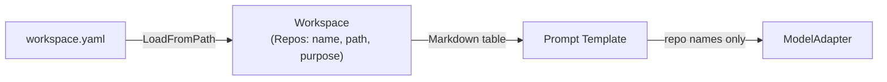
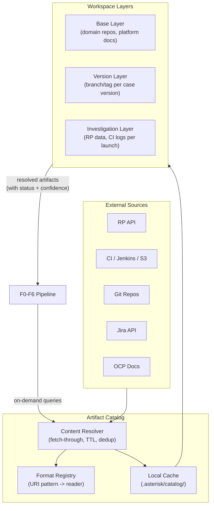

# Contract — Workspace Revisited

**Status:** draft  
**Goal:** Long-term workspace vision: layered composition (base + version + investigation), artifact dependency graph, token-budget-aware summarization pipeline, documentation caching, and must-gather ingestion. Remaining vision after MVP and Catalog splits.  
**Serves:** Architecture evolution (NICE to have)

## Contract rules

- Global rules only.
- This is a **future-phase** contract. Do not implement until Workspace MVP and Workspace Catalog are complete.
- Backward-compatible with existing workspace consumers.
- Split history: Workspace MVP (`workspace-mvp.md`, MUST) covers RP attributes, Jira links, repo paths. Workspace Catalog (`workspace-catalog.md`, SHOULD) covers artifact catalog, format registry, CI log ingestion. This contract retains the remaining vision.

## Decomposition note

This contract was split into three urgency tiers per Phase 5a mitigation:

| Contract | Urgency | Scope |
|----------|---------|-------|
| `workspace-mvp.md` | MUST | Wire RP attrs, Jira links, repo paths into prompts. Resolution status. |
| `workspace-catalog.md` | SHOULD | Artifact catalog, format registry, CI log readers, fetch-through. |
| `workspace-revisited.md` (this) | NICE | Layered composition, dependency graph, token-budget summarization, docs caching. |

## Current Architecture

Flat declarative repo list. The workspace declares repos by name and path but never clones, reads, or indexes content. Prompt templates receive a Markdown table of repo metadata. No artifact resolution, no format detection, no caching.



Real CI artifacts on disk (job logs, test bundles) and RP data fields (launch attributes, Jira links, logs) are available but never consumed by the pipeline.

## Desired Architecture

Layered workspace with a local artifact catalog, format registry, and content resolution chain. Every artifact reference carries a resolution status. The pipeline queries the catalog, which fetches through to sources on demand.



Effective workspace = Base + Version(case.Version) + Investigation(launch_id). Every artifact carries a resolution status (`resolved`, `cached`, `degraded`, `unavailable`, `unknown`) that caps pipeline confidence when degraded or missing.

## Context

- **Current workspace:** `internal/workspace/workspace.go` — flat `Repos []Repo` with `Path`, `URL`, `Name`, `Purpose`, `Branch`. Loaded via `LoadFromPath(path)`. Never clones, reads, or indexes repo content.
- **Current usage in pipeline:** `orchestrate/params.go` injects `WorkspaceParams` into prompt templates as a Markdown table (name, path, purpose, branch). `BasicAdapter` uses repo names as a fallback list in triage and resolve steps.
- **Calibration workspace:** `calibrate/types.go` defines `WorkspaceConfig` with `RepoConfig` carrying `RelevantToRCAs` and `IsRedHerring` ground-truth annotations. Two parallel types that are not unified.
- **Metrics:** M9 (repo selection precision), M10 (repo selection recall), M11 (red-herring rejection) measure workspace-related accuracy.
- **Real CI artifacts on disk:** `archive/ci/4.21/16_feb_26/` contains `#5400.txt` (1.4 MB job console log) and `failed_ptp_suite_test.zip` (9 MB test bundle). These are never ingested by the pipeline.
- **RP data not surfaced:** `LaunchResource.Attributes` (OCP version, operator versions, cluster name, CI lane), `ExternalSystemIssues` (Jira links), RP logs, RP attachments — all parsed or parseable but not reaching prompts.
- **CI notification email:** Contains RP launch URL, Jenkins URL, S3 collect URL, Polarion URL. Documented in `notes/ci-notification-and-fetch.mdc`.
- **Related contracts:** `defect-dialectic.md` (prosecution and defense share an artifact pool), `persona-system.md` (workspace-bound personas), `rp-adapter-v2.md` (LogScope stretch goal), `mcp-pipeline-tools.md` (MCP tools for artifact access).

## Connection to Evidence Gap Brief

The `evidence-gap-brief.md` contract defines an Evidence Gap Brief system that identifies what artifact types are missing during an investigation. The gap categories (`log_depth`, `source_code`, `ci_context`, `cluster_state`, `version_info`, `historical`, `jira_context`, `human_input`) map 1:1 to the artifact taxonomy domains below. This makes the gap brief a **demand signal** for workspace expansion: when the system repeatedly reports `log_depth` gaps, it means the workspace should prioritize wiring CI job logs (domain C). When it reports `version_info` gaps, RP launch attributes need surfacing (domain B). The gap brief tells us *what to build next* in the workspace, ordered by real investigation need rather than speculation.

## Part 1: Artifact taxonomy

Workspace artifacts grouped by information domain. Each artifact type is listed with its current status in the system and its RCA value.

### A. Source code

| Artifact | Current status | RCA value |
|----------|---------------|-----------|
| Git repositories (local clones, checked out to version-matched branches) | Declared (name+purpose only); never cloned or read | High — enables `git blame`, `git log`, code reading |
| Git history (`git log`, `git blame`, `git diff` for specific paths/commits) | Referenced in prompts as instructions; never executed | High — connects code changes to failures |
| File trees (directory listings, exported symbols, test name mappings) | Not implemented | Moderate — narrows focus during investigation |

### B. Test execution data

| Artifact | Current status | RCA value |
|----------|---------------|-----------|
| RP launch metadata (`LaunchResource` with `Attributes`) | Fetched but `Attributes` not surfaced to prompts | High — versions, cluster, CI lane, operator builds |
| RP test item details (with `ExternalSystemIssues`) | Fetched but Jira links dropped before prompts | Moderate — connects failures to known tickets |
| RP logs (full step-level logs via `LogScope`) | Stretch goal in `rp-adapter-v2.md`; not implemented | Critical — replaces truncated `Description` used as `ErrorMessage` |
| RP attachments (screenshots, files attached to items) | Not fetched | Low-Moderate — visual evidence for UI failures |

### C. CI artifacts

Evidence from real CI runs in `archive/ci/`:

| Artifact | Current status | RCA value |
|----------|---------------|-----------|
| Job console logs (raw `.txt`, 1-2 MB) | On disk but never ingested | Critical — richest RCA signal after error message |
| Test result bundles (`.zip` with Ginkgo JSON / JUnit XML) | On disk but never ingested | High — structured pass/fail/skip with timing |
| CI pipeline configs (Jenkins job defs, CI profile YAMLs) | Not fetched | Moderate — reveals env setup, feature gates, versions |
| S3/Minio collect job (artifact index per run) | URL in email; not fetched | Moderate — gateway to all CI artifacts for a run |

### D. Issue tracking

| Artifact | Current status | RCA value |
|----------|---------------|-----------|
| Jira tickets (summary, description, comments, fix versions, linked issues) | `ExternalSystemIssue.TicketID` + `URL` in RP data; dropped | High — known-issue correlation, duplicate detection |
| Bugzilla / Errata (version-specific known issues, advisories) | Not integrated | Moderate — platform-level known defects |
| GitHub/GitLab issues (for open-source components) | Not integrated | Low-Moderate — upstream defect context |

### E. Documentation

| Artifact | Current status | RCA value |
|----------|---------------|-----------|
| OCP documentation (versioned at `docs.redhat.com/en/documentation/openshift_container_platform/{version}/`) | Not integrated; identified in persona brainstorming | Moderate — expected platform behavior reference |
| Operator-specific docs (PTP operator release notes, upgrade guides) | Not integrated | Moderate — version-specific behavior changes |
| Red Hat Knowledge Base (known issues, workarounds) | Not integrated | Moderate — established workarounds and patterns |
| Internal wikis / Confluence (runbooks, failure pattern catalogs) | Not integrated | Low-Moderate — team knowledge |

### F. Cluster / environment state

| Artifact | Current status | RCA value |
|----------|---------------|-----------|
| must-gather dumps (OCP diagnostic bundle: logs, configs, resource YAMLs) | Not integrated | High for env/hardware failures; low for code bugs |
| Node-level logs (kernel, journald, dmesg) | Not integrated | High for hardware (PTP clock, NIC, GNSS) |
| Operator CRDs / ConfigMaps (deployed config vs expected) | Not integrated | Moderate — config drift detection |
| Image manifests (running container images) | Not integrated | Low — version pinpointing |

### G. Prior knowledge

| Artifact | Current status | RCA value |
|----------|---------------|-----------|
| Symptom database | In `store.symptoms`; F0 Recall checks fingerprints | High — symptom reuse, occurrence tracking |
| Prior RCA reports | In `store.rcas`; fingerprint match only, full text not injected | High — detailed prior analysis for similar failures |
| Calibration history (scores, trends) | Persisted as JSON reports | Low — regression detection, not direct RCA |

### H. Notification / trigger data

| Artifact | Current status | RCA value |
|----------|---------------|-----------|
| CI notification email (RP URL, Jenkins URL, S3 URL, Polarion URL) | Documented in `notes/ci-notification-and-fetch.mdc`; not parsed | High as entry point — contains all IDs needed to fetch everything else |

## Part 2: Graceful degradation

### Resolution status model

Every artifact reference carries a resolution status:

```
resolved    — content successfully fetched and available
cached      — content available from catalog (may be stale; TTL-controlled)
degraded    — partial content (truncated log, summary only, wrong version)
unavailable — fetch failed (network, auth, 404, timeout, rate limit)
unknown     — resolution not yet attempted (lazy resolution)
```

### Pipeline behavior per status

- **resolved / cached**: Full analysis proceeds. Confidence baseline from evidence strength.
- **degraded**: Analysis proceeds but confidence is capped. Prompt explicitly states what is partial and why conclusions are limited. Mirrors existing guards G1 (truncated log), G2 (missing logs), G17 (confidence anchoring).
- **unavailable**: Analysis proceeds without artifact. Absence is recorded as a "blind spot" in the investigation report. If the artifact is critical (e.g. no error message), confidence floor drops significantly.
- **unknown**: Lazy resolution — resolve on first access during pipeline execution. Allows the pipeline to start immediately and only fetch what it actually needs for a given case.

### Confidence impact matrix

| Artifact type | If missing | Confidence impact |
|---|---|---|
| Error message / log snippet | Critical | Cap at 0.30 |
| Full job console log | Moderate | Cap at 0.60 |
| Source code access | Moderate | Cap at 0.65 (pattern-based RCA still possible) |
| RP launch attributes (versions, cluster) | Low-Moderate | -0.10 for env/version failures |
| Jira ticket context | Low | -0.05 |
| CI config (job profile, feature gates) | Low-Moderate | -0.10 for env/config failures |
| OCP documentation | Low | -0.05 for platform-level issues |
| Prior RCA | Low | Miss recall hit; no accuracy penalty |
| Cluster state (must-gather, node logs) | Variable | Critical for hardware/env; irrelevant for code bugs |

These are tuning targets for calibration — actual values should be determined experimentally.

### Explicit "I don't know" over hallucination

When an artifact is unavailable, the system must:

1. State what was expected and why it is missing
2. List what conclusions cannot be drawn without it
3. Suggest how the human can provide the missing data (e.g. "attach the job console log to retry with full context")
4. Never fabricate content to fill the gap (existing guard G29: hallucinated-evidence)

## Part 3: Format learning

### Problem

"This link is actually a tgz or zip — now I know, but next time I don't, and I have to re-learn this."

Artifacts arrive in diverse formats. The system needs to detect, remember, and reuse format knowledge.

### Content type resolution chain

When encountering a new artifact reference:

```
1. Check catalog metadata (exact URI resolved before? → reuse reader + type)
2. Check URI pattern rules (*.zip → archive, *.tgz → archive, s3://… → s3 object)
3. HTTP HEAD / content sniffing (Content-Type header, magic bytes for local files)
4. Attempt parse with known readers (JSON, XML, YAML, plain text, gzip, zip)
5. If all fail → mark as "opaque binary", store raw bytes with metadata
```

### Format memory (persistent type registry)

```yaml
# .asterisk/format-registry.yaml
entries:
  # Current use case: PTP CI / Jenkins / Minio
  - uri_pattern: "https://minio-s3-*.apps.*/eco-bucket/*/index.html"
    content_type: "text/html"
    reader: "s3_index_html"
    notes: "Minio collect job index; parse links for individual artifacts"

  - uri_pattern: "*/failed_ptp_suite_test.zip"
    content_type: "application/zip"
    reader: "ginkgo_test_bundle"
    inner_format: "ginkgo_json"
    notes: "Ginkgo test results in ZIP; extract and parse as JSON"

  - uri_pattern: "#*.txt"
    content_type: "text/plain"
    reader: "jenkins_console_log"
    notes: "Jenkins job console log; plain text with ANSI codes"
```

Registry properties:
- **Seeded** with known patterns for the current use case (PTP CI)
- **Updated** automatically when a new format is encountered and successfully parsed
- **Versionable** and shareable (per workspace or global)
- **Scenario-specific sections** allowed (per the scenario-vs-generic rule)

### Reader abstraction

Each artifact format has a `Reader` interface that knows how to:

1. **Detect**: Can I handle this content? (magic bytes, extension, content-type)
2. **Extract**: Parse/decompress into usable text or structured data
3. **Summarize**: Produce a concise summary for prompt injection (token-budget aware)
4. **Index**: Build searchable index for on-demand queries

Built-in readers (brainstorm):

| Reader | Input | Output |
|--------|-------|--------|
| `plain_text` | `.txt`, `.log` | Raw text, line-indexed |
| `json` | `.json` | Parsed structure |
| `xml` | `.xml` | Parsed structure |
| `yaml` | `.yaml`, `.yml` | Parsed structure |
| `gzip` | `.gz` | Decompressed → delegate to inner reader |
| `zip` | `.zip` | Extracted entries → delegate per entry |
| `tar_gz` | `.tgz`, `.tar.gz` | Extracted entries → delegate per entry |
| `html` | `.html` | Stripped text + extracted links |
| `jenkins_console_log` | `#NNNN.txt` | ANSI-stripped text, error-line extraction |
| `ginkgo_json` | Ginkgo JSON reporter output | Structured test results |
| `junit_xml` | JUnit XML | Structured test results |
| `must_gather` | OCP must-gather tarball | Resource YAMLs, logs, configs |

## Part 4: Artifact catalog

### Concept

A local-first artifact pool sitting between workspace references and the pipeline. Every artifact fetched from any source is stored locally with metadata. Before going online, the pipeline checks the catalog.

### Catalog entry structure

```yaml
uri: "https://reportportal.../api/v1/ecosystem-qe/launch/33195"
local_path: ".asterisk/catalog/rp/launch_33195.json"
content_type: "application/json"
reader: "rp_launch"
fetched_at: "2026-02-16T10:30:00Z"
ttl: "24h"
etag: "abc123"
size_bytes: 4096
checksum: "sha256:..."
source_type: "rp_api"
tags: ["launch", "33195", "4.21"]
resolution_status: "resolved"
```

### Catalog behaviors

- **Fetch-through**: If artifact is not in catalog or TTL expired, fetch from source, store locally, update metadata.
- **Offline mode**: If source is unreachable, use cached version with "stale" warning. Pipeline records staleness in investigation report.
- **Deduplication**: Same content from different URIs shares the local file (content-addressed by checksum).
- **Eviction**: LRU or manual cleanup. Investigation-scoped catalogs can be archived with the investigation.
- **Pre-population**: `asterisk fetch --launch 33195` populates the catalog proactively before analysis runs. Also supports `asterisk fetch --jenkins <url>` and `asterisk fetch --email <path>`.
- **Warm-up**: At workspace load time, resolve all `unknown` artifacts whose TTL has expired or that have never been fetched. Optional and configurable.

### Catalog directory structure

```
.asterisk/catalog/
  registry.json              # index of all entries
  rp/                        # RP API responses
    launch_33195.json
    items_33195_failed.json
    logs_item_12345.json
  ci/                        # CI artifacts
    jenkins_15003_console.txt
    s3_24607_index.html
    failed_ptp_suite_test.zip
  repos/                     # Cloned/checked-out repos (shallow or full)
    linuxptp-daemon@release-4.21/
    cnf-gotests@master/
  docs/                      # Cached documentation pages
    ocp_4.21_ptp_config.html
  jira/                      # Cached ticket data
    OCPBUGS-70233.json
  email/                     # Parsed notification emails
    far-edge-vran_33195.json
```

## Part 5: Additional design concerns

### Version-aware artifact resolution

The workspace currently hardcodes `Branch: "release-4.18"` for all cases, but cases span 4.18-4.21. The revised workspace should support version-parametric resolution:

- Map `case.Version` (e.g. "4.21") to the correct branch/tag per repo via a version matrix
- Map to the correct OCP docs version URL
- Map to the correct operator release notes
- Cache per-version artifacts separately in the catalog

Example version matrix (scenario-specific: PTP Operator CI):

```yaml
version_matrix:
  "4.18":
    linuxptp-daemon: "release-4.18"
    ptp-operator: "release-4.18"
    ocp_docs: "4.18"
  "4.21":
    linuxptp-daemon: "release-4.21"
    ptp-operator: "release-4.21"
    ocp_docs: "4.21"
```

### Artifact dependency graph

Some artifacts depend on others for resolution or interpretation:

- Parsing a `.zip` test bundle requires knowing the test framework (Ginkgo vs JUnit) — needs format registry
- Correlating a Jira ticket requires the RP `ExternalSystemIssue` link — needs RP item data first
- Git blame requires knowing which file path the error originated from — needs triage/investigation output
- OCP docs version selection requires the launch attributes — needs RP launch metadata first

The workspace should express these dependencies so the pipeline resolves them in topological order.

### Token budget awareness

Not all artifacts should be injected into prompts. Large logs (1+ MB) need summarization or targeted extraction before prompt injection.

Per-artifact injection strategy:

| Strategy | Behavior | Use for |
|----------|----------|---------|
| `full` | Inject verbatim into prompt | Small structured data (RP metadata, Jira summary) |
| `summary` | LLM or heuristic summarization before injection | Job console logs, must-gather dumps |
| `on_demand` | Query only when pipeline step requests it | Git history, file trees |
| `index_only` | Searchable but not injected; pipeline can query specific sections | Large docs, full repo contents |

Token budget is tracked by the existing TokiMeter infrastructure.

### Artifact provenance and trust

Not all sources are equally trustworthy:

| Trust level | Meaning | Examples |
|-------------|---------|----------|
| `authoritative` | Primary source, live data | RP API (fresh), direct git clone |
| `verified` | Validated against primary source | Cached with matching ETag/checksum |
| `cached` | Previously fetched, may be stale | Catalog entries past TTL |
| `unverified` | User-provided or inferred | Manual log upload, parsed email URLs |

Pipeline should factor trust level into confidence calculations.

### Workspace composition (layered workspaces)

A workspace should be composable from layers:

- **Base layer**: Common repos and docs for the operator domain (e.g. PTP operator repos, OCP platform docs). Shared across investigations. Aligns with persona workspace-binding from the persona system contract.
- **Version layer**: Version-specific branches, docs, configs, release notes. Parameterized by `case.Version`.
- **Investigation layer**: Run-specific artifacts (RP data, CI logs, job console output). Unique per launch.

```
Effective workspace = Base ∪ Version(case.Version) ∪ Investigation(launch_id)
```

This naturally supports the persona workspace-binding concept: base and version layers can be pre-loaded with personas, while investigation-layer artifacts are fetched on demand.

## Part 6: Connection to existing contracts

| Contract | Relationship |
|----------|-------------|
| **Persona system** | Persona workspace-binding maps directly to base/version layers. Domain-expert personas reference the same OCP docs and operator repos. |
| **Defect Dialectic** | Prosecution and defense must see the same artifact pool. The catalog guarantees consistent evidence for adversarial review. Discovery phase (D1) = expose catalog to defense. |
| **MCP dispatcher** | MCP tools can expose catalog queries: `search_catalog`, `fetch_artifact`, `get_artifact_summary`. Pipeline tools consume artifacts via catalog. |
| **rp-adapter-v2** | `LogScope` (stretch goal) naturally feeds into the catalog as a new source type. |
| **RP E2E launch** | First real consumer of a multi-source workspace (RP data + workspace repos + ground truth). |

## Execution strategy

Phases 1-2 have been split into separate contracts. This contract covers the remaining vision:

1. ~~**Phase 1 (near-term)**~~ → `workspace-mvp.md`
2. ~~**Phase 2 (mid-term)**~~ → `workspace-catalog.md`
3. **Phase 3 (future)**: Git repo checkout with version matrix. Documentation caching. Jira integration. Reader plugins.
4. **Phase 4 (distant)**: Workspace composition layers. Artifact dependency graph. Full token-budget-aware summarization pipeline.

## Tasks

Tasks for Phases 1-2 have moved to `workspace-mvp.md` and `workspace-catalog.md`. Remaining:

- [ ] Define version matrix format and resolution logic (Phase 3)
- [ ] Implement Git repo checkout with version-parametric branch selection (Phase 3)
- [ ] Implement documentation caching (OCP docs, operator release notes) (Phase 3)
- [ ] Define workspace composition layer semantics (base + version + investigation) (Phase 4)
- [ ] Implement artifact dependency graph with topological resolution (Phase 4)
- [ ] Implement token-budget-aware summarization pipeline (Phase 4)
- [ ] Wire must-gather dump ingestion (Phase 4)
- [ ] Validate — composition layers produce correct effective workspace per case
- [ ] Tune — confidence impact values via calibration experiments

## Acceptance criteria

- Artifact taxonomy covers all data sources observed in real PTP CI investigations (A-H domains)
- Every artifact type has a defined resolution status model and confidence impact
- Format registry can express known PTP CI patterns (Jenkins log, Ginkgo zip, S3 index)
- Catalog design supports offline mode, deduplication, TTL-based staleness, and pre-population
- Existing `internal/workspace.Workspace` consumers are not broken by the new design
- Degradation behavior is defined: missing artifacts lower confidence, never cause hallucination

## Security assessment

Implement these mitigations when executing this contract.

| OWASP | Finding | Mitigation |
|-------|---------|------------|
| A10 | Artifact catalog fetches from arbitrary URLs (RP API, S3, Jenkins, docs.redhat.com). URL injection via workspace config could redirect fetches to attacker-controlled servers. | URL allowlist by domain. Default: `*.redhat.com`, `*.apps.your-ocp-cluster.example.com`, `github.com`. Reject other domains unless explicitly added to workspace config. |
| A01 | Format learning reads archive files (ZIP, TGZ). Malicious archives could contain path traversal entries or symlinks escaping the catalog directory. | Use `archive/zip` with path validation: reject entries with `..` components. Resolve symlinks within catalog boundary. Limit extracted file size. |
| A02 | Catalog stores RP API responses, Jira data, CI logs on disk in `.asterisk/catalog/`. This is a persistent store of sensitive data. | Catalog directory permissions: `0700`. Individual files: `0600`. Add TTL-based eviction. Catalog contents are sensitive and must not be committed. |
| A06 | Fetched artifacts could contain known-malicious payloads (e.g., log4j strings in Jenkins logs). Readers must not evaluate content as code. | Readers are parse-only (JSON, XML, YAML, plain text). Never `eval` or `exec` content. Validate parsed structures against expected schemas. |

## Notes

- 2026-02-18 — Added connection to `evidence-gap-brief.md`: gap categories map 1:1 to artifact taxonomy domains, making gap briefs a demand signal for workspace expansion priorities.
- 2026-02-18 — Contract drafted from brainstorming session. Grounded in exploration of current codebase (`internal/workspace/`, `internal/calibrate/`, `internal/rp/`, `internal/orchestrate/`, `.cursor/prompts/`, `archive/ci/`). Key finding: the workspace is purely declarative metadata today — never clones, reads, or indexes any content. Real CI archives on disk (`#5400.txt`, `failed_ptp_suite_test.zip`) and RP data fields (`Attributes`, `ExternalSystemIssues`, logs) are available but not consumed by the pipeline.
- 2026-02-19 04:00 — Split into three contracts per Phase 5a mitigation urgency audit. `workspace-mvp.md` (MUST) takes Phase 1, `workspace-catalog.md` (SHOULD) takes Phase 2, this contract retains Phases 3-4 as NICE-to-have vision.
