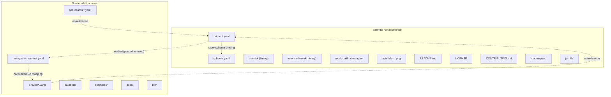
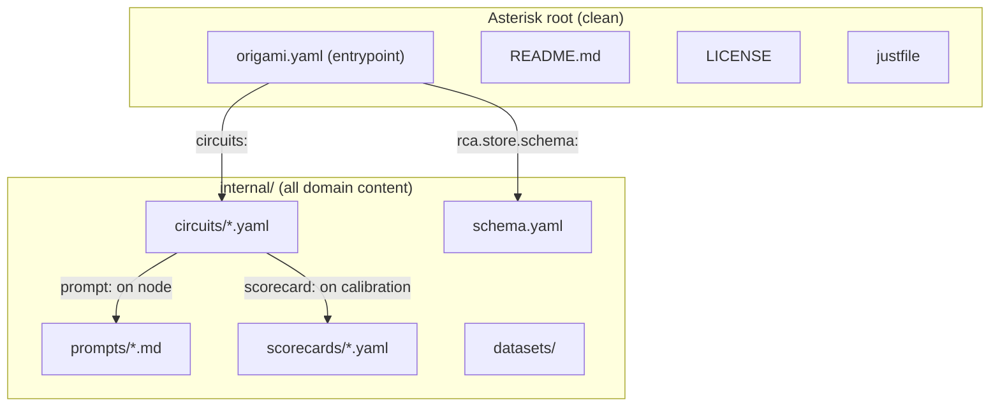

# Contract — yaml-cohesion

**Status:** draft  
**Goal:** One entrypoint YAML that references everything; no orphaned configs, no hardcoded mappings, clean root directory.  
**Serves:** 100% DSL — Zero Go

## Contract rules

- Changes span both Origami (framework) and Asterisk/Achilles (consumers).
- Origami changes land first; consumers update in the same session.
- Every gap resolved must have a test proving the old path is gone.
- Root directory policy: only `origami.yaml` and repo-standard files (README, LICENSE, justfile, .gitignore) live at root. All domain content under named directories.

## Context

Conversation analysis ([YAML cohesion discussion](66be52b6-6924-4dad-8855-0f4805f73825)) identified 18 gaps in the current YAML structure. The manifest (`origami.yaml`) claims to be the entrypoint but only knows about imports, bindings, and embed. Circuits, scorecard, and prompt manifest are disconnected — loaded by convention or hardcoded Go. Bindings are flat (no namespace scoping), `embed:` is parsed but never used, and `component.yaml` files are ignored by fold.

### Current architecture



### Desired architecture



## FSC artifacts

| Artifact | Target | Compartment |
|----------|--------|-------------|
| YAML design principles | `docs/yaml-cohesion.md` | domain |
| Updated architecture diagram | `docs/architecture.md` | domain |

## Execution strategy

Three phases, each leaving the build green:

1. **Root cleanup + directory reorganization** (Asterisk only) — move domain content under `internal/`, update all path references.
2. **Manifest cohesion** (Origami fold + Asterisk manifest) — implement `circuits:` in manifest, namespaced bindings, prompt-on-node, scorecard-on-circuit, derived embed, component.yaml-driven codegen.
3. **Cleanup** (both repos) — delete orphaned code (`socketOptionMap`, `lookupFactory`, `TemplatePathForStep`), remove `embed:` field, align consumer manifests.

## Coverage matrix

| Layer | Applies | Rationale |
|-------|---------|-----------|
| **Unit** | yes | Manifest parsing, binding resolution, component.yaml loading, prompt path derivation |
| **Integration** | yes | `origami fold` end-to-end with new manifest shape; `origami lint` validates new fields |
| **Contract** | yes | Manifest schema backward compat (old shape must error with clear message) |
| **E2E** | yes | `just build` produces working binary from new manifest |
| **Concurrency** | no | No shared state changes |
| **Security** | no | No trust boundary changes |

## Tasks

### Phase 1: Root cleanup (Asterisk)

- [ ] P1.1 — Move `schema.yaml` → `internal/schema.yaml`
- [ ] P1.2 — Move `circuits/` → `internal/circuits/`
- [ ] P1.3 — Move `prompts/` → `internal/prompts/`
- [ ] P1.4 — Move `scorecards/` → `internal/scorecards/`
- [ ] P1.5 — Move `datasets/` → `internal/datasets/`
- [ ] P1.6 — Move stale root files (`asterisk-bin`, `mock-calibration-agent`, `asterisk-rh.png`, `roadmap.md`) to `internal/` or delete
- [ ] P1.7 — Update `origami.yaml` paths, `justfile`, any scripts referencing moved files
- [ ] P1.8 — Verify `just build` still produces working binary

### Phase 2: Manifest cohesion (Origami + consumers)

- [ ] P2.1 — Fold reads `component.yaml` for socket declarations and factory names; delete `socketOptionMap` and `lookupFactory`
- [ ] P2.2 — Namespaced bindings: `rca.source` instead of `source`; fold strips prefix and matches to import namespace
- [ ] P2.3 — `imports:` includes connectors (`origami.connectors.reportportal`, `origami.connectors.sqlite`); bindings use short namespace names
- [ ] P2.4 — `circuits:` map in manifest; fold validates referenced files exist
- [ ] P2.5 — Add `prompt:` and `output_schema:` fields to `NodeDef`; fold/DSL loader populates transformer context from them
- [ ] P2.6 — Delete `TemplatePathForStep()` and `prompts/manifest.yaml`; prompt path comes from node definition
- [ ] P2.7 — Add `scorecard:` field to circuit YAML; calibration runner reads it from circuit config
- [ ] P2.8 — Remove `embed:` from manifest struct; fold derives embed set from all referenced paths
- [ ] P2.9 — Remove `imports:` from individual circuit files; entrypoint owns all imports
- [ ] P2.10 — Fix circuit name redundancy: `asterisk-rca` → `rca`
- [ ] P2.11 — Consistent terminal node name: pick one convention (`DONE` or `_done`)
- [ ] P2.12 — Fix `component: asterisk-rca` → `component: origami-rca` in schematic component.yaml
- [ ] P2.13 — Remove unused `CLI`, `Serve`, `Demo` fields from manifest struct (or implement them)

### Phase 3: Validation

- [ ] P3.1 — Validate (green) — `just build`, `go test ./...`, `origami lint --profile strict` all pass
- [ ] P3.2 — Update Achilles manifest to match new shape
- [ ] P3.3 — Tune (blue) — refactor for quality, no behavior changes
- [ ] P3.4 — Validate (green) — all tests still pass after tuning

## Acceptance criteria

```gherkin
Given the Asterisk root directory
When I list non-hidden files
Then I see only: origami.yaml, README.md, LICENSE, CONTRIBUTING.md, justfile, .gitignore
  And all domain content lives under internal/

Given origami.yaml
When I read it
Then I can see every dependency (schematics + connectors), every circuit, and the store schema
  And no configuration is orphaned or discovered by convention

Given a circuit YAML with nodes
When a node has a stochastic transformer
Then the node definition includes prompt: and output_schema: fields
  And no hardcoded Go mapping exists for prompt paths

Given the calibration circuit YAML
When it declares scorecard: scorecards/rca.yaml
Then the calibration runner loads the scorecard from that path
  And no convention-based path guessing exists

Given origami.yaml with bindings
When I write rca.source: reportportal
Then fold resolves "rca" to the import namespace, "source" to the socket,
  and "reportportal" to the connector's component.yaml satisfies entry
  And socketOptionMap and lookupFactory do not exist

Given two schematics imported
When both declare a "source" socket
Then bindings rca.source and vulnscan.source resolve independently
  And no collision occurs
```

## Security assessment

No trust boundaries affected.

## Gap reference

| # | Area | Current | Desired |
|---|------|---------|---------|
| G1 | Binding scope | Flat `map[string]string`, no namespace | `rca.source` prefix from import namespace |
| G2 | component.yaml ignored | Hardcoded `socketOptionMap` | Fold reads component.yaml |
| G3 | Disconnected circuits | Convention-based discovery | `circuits:` in entrypoint |
| G4 | Orphaned scorecard | Convention-based loading | `scorecard:` on calibration circuit |
| G5 | Prompt-node cohesion | Separate manifest + hardcoded Go | `prompt:` field on node in circuit YAML |
| G6 | Redundant embed | Manual `embed:` section | Fold derives embed set from references |
| G7 | No single source of truth | 7 disconnected YAMLs | One entrypoint, everything referenced |
| G8 | Hidden imports | Connectors resolved implicitly | `imports:` is complete dependency list |
| G9 | Duplicate circuit definitions | Schematic + consumer both define same circuit | One authoritative definition per circuit |
| G10 | `family:` vs `transformer:` | Two fields for same concept | Single field; component.yaml maps names to transformers |
| G11 | Circuit name redundancy | `asterisk-rca` repeats app name | Bare name `rca`; entrypoint scopes |
| G12 | `imports:` in circuit files | Each circuit re-declares imports | Entrypoint owns all imports |
| G13 | Inconsistent terminal node | `DONE` vs `_done` | One convention |
| G14 | `before:` hooks split | Consumer has `after:` only; schematic has both | Hooks declared in one place |
| G15 | CLI/Serve/Demo ghost fields | Struct fields exist, unused | Remove or implement |
| G16 | Schematic component name | `component: asterisk-rca` | `component: origami-rca` |
| G17 | Connector naming | `namespace: rp` | `namespace: reportportal` (done) |
| G18 | Hardcoded app name | `"(via Asterisk)"` in pusher | `appName` parameter (done) |

## Notes

2026-03-04 00:30 — Contract created from conversation analysis. G17 and G18 already resolved (connector rename + appName param). Phase 1 is Asterisk-only and can ship independently.
