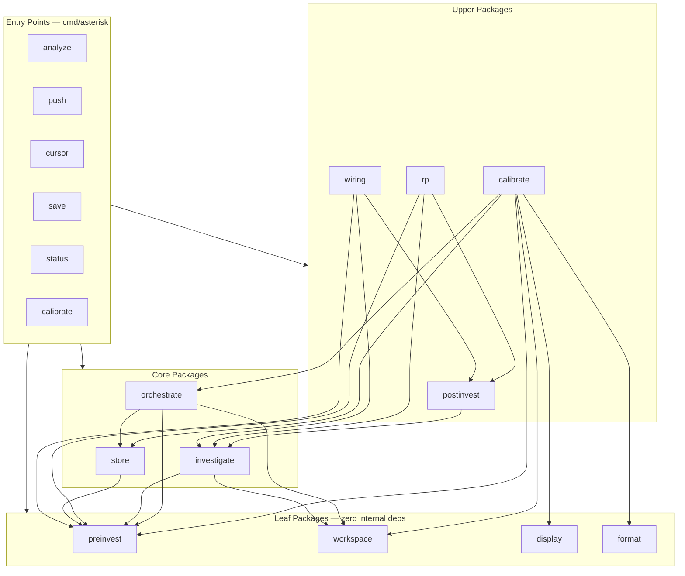

# Asterisk Architecture

## Overview

Asterisk is a standalone CLI tool (Go) that performs evidence-based Root Cause Analysis (RCA) on ReportPortal test failures. It correlates failures with CI/infra data and external code repositories. The system has 5 layers and 12 packages + 2 commands.

## Layers

1. **Entry Points** (`cmd/`) — CLI commands: `analyze`, `push`, `cursor`, `save`, `status`, `calibrate`
2. **Upper Packages** — High-level orchestration: `calibrate` (7,307 LOC), `rp` (762 LOC), `postinvest` (82 LOC), `wiring` (96 LOC)
3. **Core Packages** — Domain logic: `store` (2,992 LOC), `orchestrate` (1,585 LOC), `investigate` (94 LOC)
4. **Leaf Packages** (zero internal deps) — Utilities: `preinvest` (92 LOC), `workspace` (73 LOC), `display` (206 LOC), `format` (165 LOC)
5. **Commands** — `cmd/asterisk` (880 LOC main.go), `cmd/mock-calibration-agent` (1,284 LOC)

## Dependency Graph



## Component Inventory

### Per-Component Raison d'Être

| Component | Input | Transformation | Output | LOC (source only) | Test Files |
|-----------|-------|----------------|--------|-------------------|------------|
| `preinvest` | Fetcher + launch ID | Fetch envelope, persist | `Envelope` in Store | 92 | 1 |
| `workspace` | YAML/JSON file path | Parse config | `*Workspace` with repos | 73 | 1 |
| `display` | Machine codes | Lookup table | Human-readable strings | 206 | 1 |
| `format` | Table data | go-pretty adapter | ASCII/Markdown tables | 165 | 1 |
| `store` | Entity structs | SQLite CRUD | Persisted entities | 2,992 | 4 |
| `orchestrate` | Store + case + envelope + workspace | F0–F6 pipeline: templates, heuristics, state | Prompts, artifacts, state transitions | 1,585 | 4 |
| `investigate` | Envelope + workspace | Mock analysis | JSON artifact | 94 | 1 |
| `postinvest` | Artifact path + PushStore | Parse artifact, record push | `PushedRecord` | 82 | 1 |
| `rp` | RP base URL + API key + project | HTTP client for RP API | Envelope fetch, defect push | 762 | 1 |
| `calibrate` | Scenarios + adapters + store | Run pipeline, score results, report | `CalibrationReport`, `AnalysisReport` | 7,307 | 10 |
| `wiring` | Fetcher + stores + paths | Chain fetch → analyze → push | End-to-end mock flow | 96 | 2 |
| `cmd/asterisk` | CLI args | Flag parsing, wiring, dispatch | Subcommand execution | 880 | — |
| `cmd/mock-calibration-agent` | Signal-file responder | Signal-file responder for calibration runs | — | 1,284 | — |

## Data Flow ("Origami")

### Analysis Flow (analyze command)

```
CLI args → preinvest.Fetch(launchID) → Envelope
         → workspace.Load(path) → *Workspace
         → store.Open(dbPath) → Store
         → orchestrate.Run(store, envelope, workspace) → Prompts + Artifacts
         → investigate.Analyze(envelope, workspace) → JSON artifact → file
```

### Push Flow (push command)

```
artifact file → postinvest.Push(artifactPath, store) → PushedRecord
             → rp.Client.Push(defectUpdate) → RP API
```

### Calibration Flow (calibrate command)

```
Scenario definition → calibrate.RunCalibration(scenario, adapter, store)
    → For each case:
        orchestrate.Run() → prompt dispatch → adapter.Classify()
        → artifact ingestion → metrics scoring
    → CalibrationReport (M1–M20)
    → TokiMeter cost report
```

### Cursor Flow (cursor command)

```
CLI args → preinvest.Fetch → Envelope
         → workspace.Load → *Workspace
         → orchestrate.Run → per-case F0–F6 pipeline
         → FileDispatcher → signal file
         → (external Cursor agent reads signal, writes artifact)
         → artifact ingestion → next pipeline step
```

## External Dependencies (third-party)

| Module | Purpose | Version |
|--------|---------|---------|
| `modernc.org/sqlite` | Pure-Go SQLite driver | Latest |
| `jedib0t/go-pretty/v6` | Table formatting (ASCII + Markdown) | v6 |
| `golang.org/x/sync/errgroup` | Structured concurrency (transitive) | Latest |
| `hbollon/go-edlib` | String similarity (Jaccard) | Latest |

## Coupling Hotspots

### 1. `calibrate` — God package (7,307 LOC, 18+ files, 6 internal deps)

Mixes 8 concerns: data types, pipeline runner, parallel execution, metrics scoring, formatting, dispatchers, adapters, lifecycle/clustering.

### 2. `cmd/asterisk/main.go` — Fat controller (880 LOC)

Contains business logic: envelope loading, store scaffolding, adapter wiring, `orchestrate.BasePath` global mutation.

### 3. `orchestrate.BasePath` — Mutable global

Set from `main.go` and read across the package. Should be passed via config struct.

## Test Coverage Summary

| Package | Source LOC | Test Files | Coverage Status |
|---------|-----------|------------|-----------------|
| calibrate | 7,307 | 10 | Critical gaps: metrics.go (0 unit tests for M1–M20), runner.go, analysis.go |
| orchestrate | 1,585 | 4 | Medium gap: runner.go effects untested |
| store | 2,992 | 4 | Adequate |
| rp | 762 | 1 | High gap: push/fetch no httptest |
| preinvest | 92 | 1 | Adequate |
| workspace | 73 | 1 | Adequate |
| display | 206 | 1 | Adequate |
| format | 165 | 1 | Adequate |
| investigate | 94 | 1 | Adequate |
| postinvest | 82 | 1 | Adequate |
| wiring | 96 | 2 | Adequate |

**Total source LOC (internal/ + cmd/):** ~16,340

## Modernization Opportunities

| Area | Status | Module |
|------|--------|--------|
| CLI framework | Planned | `spf13/cobra` (replace 880-LOC hand-rolled main.go) |
| Concurrency | Planned | `golang.org/x/sync/errgroup` (replace hand-rolled pools) |
| File watching | Planned | `fsnotify/fsnotify` (replace polling dispatcher) |
| Table formatting | **Done** | `jedib0t/go-pretty/v6` |
| Display labels | **Done** | `internal/display` registry |

See contracts: `calibrate-decomposition.md`, `cobra-cli.md`, `critical-test-coverage.md`, `concurrency-modernization.md`.
