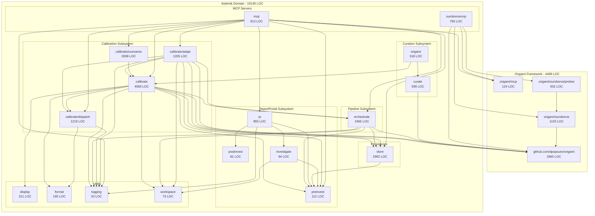

# Asterisk-Origami Distillation Manifest

Assessment date: 2026-02-22

## Package Classification

### Framework (github.com/dpopsuev/origami) — zero domain imports

| Package | LOC (prod) | LOC (test) | Imports from asterisk/ |
|---------|-----------|-----------|------------------------|
| `github.com/dpopsuev/origami` | 2660 | 3797 | — |
| `github.com/dpopsuev/origami/mcp/` | 124 | 123 | — |
| `github.com/dpopsuev/origami/ouroboros/` | 1103 | 1780 | `origami` |
| `github.com/dpopsuev/origami/ouroboros/probes/` | 602 | 445 | `origami/ouroboros` |
| **Total** | **4489** | **6145** | |

Framework boundary is clean: all imports stay within `github.com/dpopsuev/origami` subtree. Zero references to `internal/`. Origami is a separate repo; Asterisk imports it as an external dependency.

### Domain (internal/) — Asterisk-specific

| Package | LOC | Imports framework? | Imports other domain? |
|---------|-----|-------------------|----------------------|
| `internal/calibrate/` | 4569 | Yes (`github.com/dpopsuev/origami`) | `dispatch`, `display`, `format`, `logging`, `orchestrate`, `preinvest`, `store`, `workspace` |
| `internal/calibrate/adapt/` | 1205 | Yes (`github.com/dpopsuev/origami`) | `calibrate`, `dispatch`, `logging`, `orchestrate`, `preinvest`, `store`, `workspace` |
| `internal/calibrate/dispatch/` | 1219 | No | `format`, `logging` |
| `internal/calibrate/scenarios/` | 2838 | No | `calibrate` |
| `internal/orchestrate/` | 1965 | Yes (`github.com/dpopsuev/origami`) | `logging`, `preinvest`, `store`, `workspace` |
| `internal/rp/` | 855 | No | `investigate`, `logging`, `postinvest`, `preinvest` |
| `internal/store/` | 2992 | No | `preinvest` |
| `internal/curate/` | 599 | Yes (`github.com/dpopsuev/origami`) | — |
| `internal/origami/` | 318 | No | `calibrate`, `curate` |
| `internal/mcp/` | 913 | Yes (`github.com/dpopsuev/origami/mcp`) | `calibrate`, `adapt`, `dispatch`, `scenarios`, `logging`, `orchestrate`, `preinvest`, `rp`, `store` |
| `internal/metacalmcp/` | 796 | Yes (`github.com/dpopsuev/origami`, `mcp`, `metacal`, `probes`) | — |
| `internal/display/` | 221 | No | — |
| `internal/format/` | 165 | No | — |
| `internal/logging/` | 33 | No | — |
| `internal/preinvest/` | 112 | No | — |
| `internal/postinvest/` | 82 | No | `investigate` |
| `internal/investigate/` | 94 | No | `preinvest`, `workspace` |
| `internal/wiring/` | 96 | No | `investigate`, `postinvest`, `preinvest` |
| `internal/workspace/` | 73 | No | — |
| **Total** | **19,145** | | |

### CLI Binaries

| Binary | Imports framework? | Imports internal? |
|--------|-------------------|------------------|
| `cmd/asterisk/` | (via internal) | 15 internal packages |
| `cmd/metacal/` | Yes (direct) | `metacalmcp` only |
| `cmd/run-mock-flow/` | No | `postinvest`, `preinvest`, `wiring` |
| `cmd/asterisk-analyze-rp-cursor/` | No | No (shells out) |

## Dependency Graph



## Boundary Violations

**None found.** The framework (`github.com/dpopsuev/origami`) has zero imports from `internal/`. The dependency arrow is strictly one-directional: domain -> framework, never framework -> domain.

## Promotion Candidates

Packages currently in `internal/` that could be promoted to `pkg/` or `github.com/dpopsuev/origami`:

| Package | LOC | Barrier | Effort | Recommendation |
|---------|-----|---------|--------|----------------|
| `internal/curate/` | 599 | None — zero Asterisk imports, uses `github.com/dpopsuev/origami` types only | Low | **Promote to `origami/curate/`** — generic curation pipeline is a framework primitive |
| `internal/format/` | 165 | None — zero imports from asterisk | Trivial | **Promote to `pkg/format/`** — pure utility, useful for any Origami tool |
| `internal/logging/` | 33 | None — zero imports from asterisk | Trivial | **Promote to `pkg/logging/`** — though tiny, every tool needs structured logging setup |
| `internal/display/` | 221 | Content is RP-specific (defect types, F0-F6 stages) | N/A | **Keep in domain** — display names are Asterisk vocabulary |
| `internal/calibrate/dispatch/` | 1219 | `DispatchContext` references `format` and `logging` (both promotable) | Medium | **Candidate for `origami/dispatch/`** after format/logging promotion. Generic dispatcher pattern. |
| `internal/metacalmcp/` | 796 | Imports only `github.com/dpopsuev/origami` subtree | Low | **Migrated to `origami/ouroborosmcp/`** — already framework-only |

## Summary

| Category | Packages | LOC (prod) | Percentage |
|----------|----------|-----------|------------|
| Framework | 4 | 4,489 | 19% |
| Domain | 19 | 19,145 | 81% |
| **Total** | **23** | **23,634** | 100% |

Asterisk is a thick domain application (81%) built on a thin framework (19%). The boundary is clean — zero violations.

## Boundary Validation (Achilles)

Achilles (`github.com/dpopsuev/achilles`) is a working Go vulnerability scanner built entirely on Origami. It confirms the framework boundary. **Three-repo structure:** Origami and Achilles are separate repos; Asterisk imports Origami as an external dependency.

### Import proof

```
achilles transitive deps:
  github.com/dpopsuev/origami   <-- sole framework import
  github.com/dpopsuev/achilles  <-- itself

asterisk/internal/ imports: NONE (Achilles has no dependency on Asterisk)
```

### Shared primitives

Both tools use the same Origami primitives:

| Primitive | Asterisk | Achilles |
|-----------|----------|----------|
| PipelineDef / LoadPipeline | rca-investigation.yaml | achilles.yaml |
| NodeDef / NodeRegistry | F0-F6 nodes | scan, classify, assess, report |
| EdgeDef / EdgeFactory | Heuristic edges (H1-H12) | Vuln edges (V1-V6) |
| Graph / Walk | Case walk with loop detection | Linear + shortcut walk |
| Walker / WalkerState | Herald persona | Herald persona |
| Artifact / Confidence | RCA artifacts (0.0-1.0) | Scan/Classify/Assess/Report artifacts |
| Element affinity | Fire, Water, Earth, Diamond | Earth, Fire, Diamond, Air |
| Extractor interface | StepExtractor, IdentityExtractor | GovulncheckExtractor, ClassifyExtractor |
| Render (Mermaid) | Pipeline diagram | Pipeline diagram |
| WalkObserver | Narration observer | Live event trace |

### What Achilles did NOT need

- Adversarial Dialectic (adversarial deliberation)
- Masks (middleware capabilities)
- Team Walk (multi-persona scheduling)
- Cycles (generative/destructive)
- Ouroboros (model profiling)

These are available but unused — progressive disclosure working as intended (P7).

### Conclusion

The framework boundary is empirically validated. A second tool with a completely different domain (security assessment vs test failure analysis) was built using only `github.com/dpopsuev/origami` — zero internal imports, zero code duplication, same DSL and graph walk engine.
