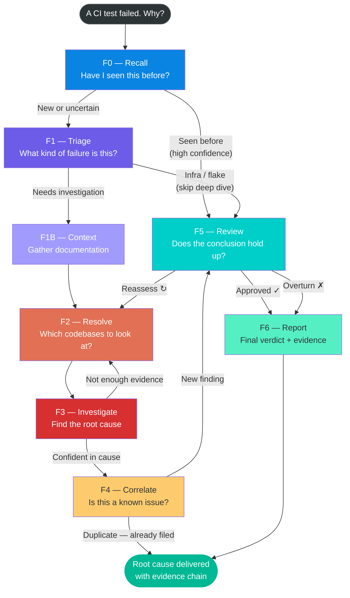

# Asterisk Investigation Circuit — Visual Explainer

A non-technical overview of how Asterisk investigates CI test failures, and why Origami exists as the orchestration framework beneath it.

## The Core Problem

Classical programming is deterministic and domain-scoped but too rigid to handle ever-changing inputs and outputs. AI agents are non-deterministic and suffer from context issues. How do you get the best of both worlds?

**Answer:** Make the *structure* deterministic and the *reasoning* non-deterministic. The graph is the contract. The AI is the worker. Origami is the enforcement layer between them.

## Circuit Diagram

## Step-by-Step Breakdown

| Step | What it does | Who decides |
|------|-------------|-------------|
| **Recall** | Check if we've seen this failure before | AI agent (pattern matching) |
| **Triage** | Classify the failure type (product bug? infra? flake?) | AI agent (reasoning) |
| **Context** | Gather relevant docs and repo metadata | Deterministic code (no AI) |
| **Resolve** | Pick which codebases to investigate | AI agent (evidence weighting) |
| **Investigate** | Dig into code and logs for root cause | AI agent (deep analysis) |
| **Correlate** | Check if this is a duplicate of a known issue | AI agent + database |
| **Review** | Self-check: does the conclusion hold up? | AI agent (adversarial review) |
| **Report** | Produce the final verdict with evidence chain | AI agent (synthesis) |

## How Origami + Asterisk Map to Agentic AI Governance

**Origami** is the framework — the railway system. It defines the tracks, the switches, the stations, and the rules for which train goes where. Everything about the *structure* of the circuit is deterministic: the graph of steps, the branching conditions, the data contracts, the checkpoints. It's declared in plain YAML that a human can read and audit. No agent decides the shape of the circuit — code does.

**Asterisk** is one train that runs on those tracks. It's a root-cause analysis tool for CI test failures.

The graph is the governance layer. The AI agents at each step can reason freely, but they can't skip steps, can't invent new steps, can't change the order, and can't proceed without meeting data contracts. Every branch in the diagram above (the arrows) is a rule — expressed as a simple expression like `confidence >= 0.80` — that the framework evaluates deterministically. The agent doesn't decide where to go next. The graph does.

### Guardrails the framework enforces

- Every step has a **schema** (data contract — the agent must produce exactly these fields)
- Every transition has a **rule** (the agent doesn't choose the path — the evidence does)
- Every execution produces a **trace** (OpenTelemetry spans, Prometheus metrics — full observability)
- The circuit can **pause and resume** (human-in-the-loop checkpoints)
- The whole thing is defined in **auditable YAML** — not buried in code

### Relevance to NHI / Agentic AI Security

This is the same problem NHI security platforms tackle: agents need freedom to act, but they need guardrails that are observable, auditable, and enforceable. Origami provides exactly that for AI agent workflows — structured circuits where the structure is deterministic and the reasoning is non-deterministic.
