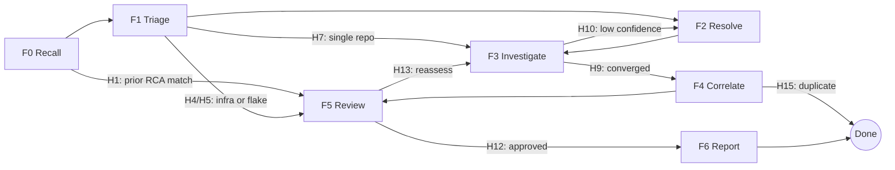
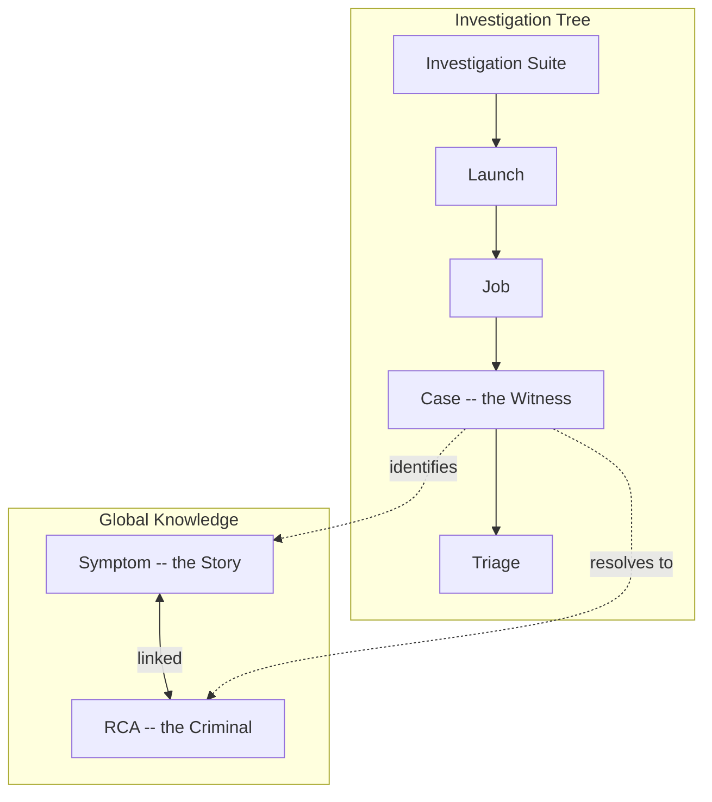

<p align="center">
  
</p>

<h1 align="center">Asterisk</h1>

<p align="center">
  Evidence-based root cause analysis for ReportPortal test failures.
</p>

---

## Overview

**Asterisk** is a standalone CLI written in Go that performs automated Root Cause Analysis (RCA) on test failures reported in [ReportPortal](https://reportportal.io/). It correlates failures with external repositories, CI pipeline context, and historical investigation data to produce explainable, evidence-first RCA reports with confidence scores.

Asterisk ingests a ReportPortal launch, runs each failure through a six-stage investigation pipeline (F0-F6), and outputs structured RCA artifacts that can be pushed back to ReportPortal or exported to issue trackers.

### Who is it for?

- **QA engineers** who need fast, structured failure analysis across CI runs.
- **Triagers** who want probable root cause categories with evidence links.
- **Developers** who need failures mapped to suspect commits, repos, and components.
- **Release managers** tracking regressions across versions.

---

## Architecture

### Investigation Pipeline (F0 -- F6)

Every failed test case flows through a heuristic-routed pipeline. At each stage, the engine evaluates rules (H1-H18) to decide the next step -- short-circuiting when possible, looping when evidence is insufficient.



| Stage | Purpose | Output |
|-------|---------|--------|
| **F0 Recall** | Check if this failure matches a known symptom/RCA | `recall-result.json` |
| **F1 Triage** | Classify symptom category, severity, defect type | `triage-result.json` |
| **F2 Resolve** | Select candidate repositories for investigation | `resolve-result.json` |
| **F3 Investigate** | Deep RCA -- analyze logs, commits, code paths | `artifact.json` |
| **F4 Correlate** | Match against other cases; detect duplicates | `correlate-result.json` |
| **F5 Review** | Present findings; approve, reassess, or overturn | `review-decision.json` |
| **F6 Report** | Generate Jira draft / regression table | `jira-draft.json` |

### Data Model

Asterisk uses a two-tier persistence model inspired by a forensic metaphor:



- **Case** (witness): a single failed test -- the unit of investigation.
- **Symptom** (story): a recurring failure pattern with fingerprint and error signature.
- **RCA** (criminal): the root cause -- a specific bug, config issue, or infra fault.

---

## Features

- **ReportPortal integration** -- fetch launches, test items, and logs via the RP 5.11 API; push RCA defect updates back.
- **Prompt-driven investigation** -- each pipeline stage uses a structured prompt template (`.cursor/prompts/`), enabling AI-assisted analysis via Cursor or any LLM adapter.
- **Heuristic routing** -- 18 configurable rules (H1-H18) with tunable thresholds for recall confidence, convergence, loop limits, and duplicate detection.
- **Calibration framework** -- run the full pipeline against ground-truth scenarios with 20 metrics (M1-M20) covering defect classification, recall accuracy, repo selection, semantic quality, and pipeline path correctness.
- **Storage layer** -- SQLite-backed persistence (via pure-Go `modernc.org/sqlite`) with an in-memory alternative for testing.
- **Context workspace** -- YAML/JSON configuration mapping failures to relevant repositories with purpose metadata.
- **File-based dispatch** -- `signal.json` polling protocol enabling automated agent communication without stdin.
- **Evidence-first outputs** -- every conclusion cites evidence (logs, commits, pipeline data) with confidence scores.

---

## Quick Start

### Prerequisites

- **Go** 1.24+
- **just** (optional, for task runner -- `cargo install just`)

### Build

```bash
# Build all binaries (using just)
just build-all

# Or with Make
make build-all

# Or directly
go build -o bin/asterisk ./cmd/asterisk/
go build -o bin/signal-responder ./cmd/signal-responder/
```

### Run an analysis

```bash
# Analyze a ReportPortal launch from a local envelope
asterisk analyze --launch=examples/pre-investigation-33195-4.21/envelope_33195_4.21.json \
                 --workspace=workspace.yaml \
                 -o /tmp/rca-artifact.json

# Analyze by launch ID (requires RP credentials)
asterisk analyze --launch=33195 \
                 --rp-base-url=https://your-rp-instance.com \
                 --rp-api-key=.rp-api-key \
                 -o /tmp/rca-artifact.json
```

### Run calibration

```bash
# Stub calibration (deterministic, no AI)
asterisk calibrate --scenario=ptp-mock --adapter=stub

# Wet calibration with file dispatcher and auto-responder
asterisk calibrate --scenario=ptp-real-ingest --adapter=cursor \
                   --dispatch=file --responder=auto --clean
```

---

## CLI Reference

```
asterisk <analyze|push|cursor|save|status|calibrate> [options]
```

### `analyze` -- Run F0-F6 pipeline

| Flag | Default | Description |
|------|---------|-------------|
| `--launch` | *(required)* | Path to envelope JSON or RP launch ID |
| `--workspace` | | Path to context workspace file (YAML/JSON) |
| `-o` | *(required)* | Output artifact path |
| `--db` | `.asterisk/asterisk.db` | Store DB path |
| `--adapter` | `basic` | Adapter: `basic` (heuristic) |
| `--rp-base-url` | | ReportPortal base URL |
| `--rp-api-key` | `.rp-api-key` | Path to RP API key file |

### `push` -- Push artifact to ReportPortal

| Flag | Default | Description |
|------|---------|-------------|
| `-f` | *(required)* | Path to the artifact file |
| `--rp-base-url` | | ReportPortal base URL |
| `--rp-api-key` | `.rp-api-key` | Path to RP API key file |

### `cursor` -- Orchestrate interactive investigation

| Flag | Default | Description |
|------|---------|-------------|
| `--launch` | *(required)* | Path to envelope JSON or launch ID |
| `--workspace` | | Path to context workspace file |
| `--case-id` | | Investigate a specific case only |
| `--prompt-dir` | `.cursor/prompts` | Prompt template directory |
| `--db` | `.asterisk/asterisk.db` | Store DB path |

### `save` -- Save artifact and advance pipeline

| Flag | Default | Description |
|------|---------|-------------|
| `-f` | *(required)* | Path to artifact file |
| `--case-id` | *(required)* | Case ID |
| `--suite-id` | *(required)* | Suite ID |
| `--db` | `.asterisk/asterisk.db` | Store DB path |

### `status` -- Show investigation state

| Flag | Default | Description |
|------|---------|-------------|
| `--case-id` | *(required)* | Case ID |
| `--suite-id` | *(required)* | Suite ID |

### `calibrate` -- Run calibration against ground truth

| Flag | Default | Description |
|------|---------|-------------|
| `--scenario` | `ptp-mock` | Scenario: `ptp-mock`, `daemon-mock`, `ptp-real`, `ptp-real-ingest` |
| `--adapter` | `stub` | Model adapter: `stub` (deterministic), `cursor` (AI) |
| `--dispatch` | `stdin` | Dispatch mode: `stdin`, `file` |
| `--runs` | `1` | Number of calibration runs |
| `--prompt-dir` | `.cursor/prompts` | Prompt template directory |
| `--clean` | `true` | Remove artifacts and DB before starting |
| `--responder` | `auto` | Responder lifecycle: `auto`, `external`, `none` |
| `--agent-debug` | `false` | Verbose debug logging for dispatcher |

---

## Calibration

The calibration framework validates the investigation pipeline end-to-end against known ground truth.

### Scenarios

| Scenario | Cases | Description |
|----------|-------|-------------|
| `ptp-mock` | 12 | Synthetic PTP failures: holdover, cleanup, NTP across 3 OCP versions |
| `daemon-mock` | 8 | Synthetic daemon process failures: broken pipe, config hang |
| `ptp-real` | 8 | Real PTP bugs: OCPBUGS-74895 (broken pipe), OCPBUGS-74904 (config hang) |
| `ptp-real-ingest` | 30 | Ingested from CI data: 30 real PTP failures (Jan 2025 -- Feb 2026) |

### Adapters

- **Stub** -- returns ground-truth answers deterministically. Validates pipeline logic and heuristic routing.
- **Cursor** -- fills prompt templates, dispatches to an AI agent (or signal-responder), and evaluates real outputs against ground truth.

### Metrics (M1 -- M20)

| Group | Metrics | What they measure |
|-------|---------|-------------------|
| Classification | M1 defect type, M2 symptom category | Triage accuracy |
| Recall | M3 recall hit rate, M4 false positive rate | Known-symptom detection |
| Knowledge | M5 serial killer detection, M6 skip accuracy, M7 cascade | Pattern recognition |
| Convergence | M8 convergence score | Investigation depth quality |
| Repo Selection | M9 precision, M10 recall | Repository targeting |
| Evidence | M11 evidence count, M12 link validity | Supporting data quality |
| Semantic | M13 summary quality, M14 RCA relevance | Output usefulness |
| Pipeline | M15 component ID, M16 path accuracy, M17 loop efficiency | Routing correctness |
| Aggregate | M18 total prompt tokens, M19 overall accuracy, M20 run variance | System-level performance |

Target: **M19 (overall accuracy) >= 0.95**.

---

## Project Structure

```
asterisk/
├── cmd/
│   ├── asterisk/              # Main CLI (analyze, push, cursor, save, status, calibrate)
│   ├── signal-responder/      # Auto-responder for file-dispatch calibration
│   └── run-mock-flow/         # Dev tool: run mock fetch→analyze→push flow
├── internal/
│   ├── calibrate/             # Calibration runner, adapters, dispatchers, metrics
│   │   └── scenarios/         # Ground-truth scenarios (ptp-mock, daemon-mock, ptp-real, ...)
│   ├── orchestrate/           # F0-F6 pipeline engine, heuristics (H1-H18), state, templates
│   ├── store/                 # Persistence: Store interface, SqlStore (SQLite), MemStore
│   ├── rp/                    # ReportPortal API client (fetch, push, project/launch scopes)
│   ├── preinvest/             # Pre-investigation: envelope fetch and storage
│   ├── investigate/           # Investigation: envelope → artifact analysis
│   ├── postinvest/            # Post-investigation: push results to RP
│   ├── workspace/             # Context workspace: repo mappings (YAML/JSON)
│   └── wiring/                # End-to-end mock flow (Ginkgo integration tests)
├── examples/                  # Fixture data (launch 33195 envelope + items)
├── .cursor/
│   ├── prompts/               # F0-F6 prompt templates (Markdown)
│   ├── contracts/             # Work contracts (execution plans)
│   ├── docs/                  # Deep references (data model, envelope, artifacts)
│   ├── notes/                 # Short summaries (PoC constraints, workspace structure)
│   ├── guide/                 # Dev workflows (test matrix, BDD templates)
│   ├── strategy/              # Invariants (evidence-first RCA)
│   ├── glossary/              # Domain terminology
│   ├── goals/                 # PoC and MVP goal checklists
│   ├── skills/                # Cursor agent skills (investigate, bootstrap, ...)
│   └── rules/                 # Development rules (Go testing, security, scenarios)
├── .dev/                      # Private dev data (git-ignored): scripts, calibration runs
├── justfile                   # Task runner (just) — primary
├── Makefile                   # Build and test targets (legacy)
├── roadmap.md                 # Phased roadmap with user stories
└── go.mod                     # Go 1.24, SQLite, Ginkgo, Gomega
```

---

## Development

### Methodology

Asterisk follows **BDD + TDD + AI**:

1. **Gherkin first** -- write acceptance criteria (Given/When/Then) for every story.
2. **Test matrix** -- unit, integration, contract, E2E, and security tests per feature.
3. **Red-Green-Blue** -- fail (red), pass (green), tune prompts/refactor (blue).
4. **Calibration loop** -- run scenarios, diagnose weakest metrics, apply fixes, re-run.

### Testing

```bash
# All Go tests
just test

# Ginkgo BDD suites (all)
just test-ginkgo

# Ginkgo wiring suite only
just test-ginkgo-wiring

# All checks: vet + lint + staticcheck
just check

# Full cleanup: binaries + runtime + orphan processes
just clean
```

### Prompt Templates

Investigation prompts live in `.cursor/prompts/` organized by pipeline stage:

| Directory | Stage | Template |
|-----------|-------|----------|
| `recall/` | F0 | `judge-similarity.md` |
| `triage/` | F1 | `classify-symptoms.md` |
| `resolve/` | F2 | `select-repo.md` |
| `investigate/` | F3 | `deep-rca.md` |
| `correlate/` | F4 | `match-cases.md` |
| `review/` | F5 | `present-findings.md` |
| `report/` | F6 | `regression-table.md` |

---

## Roadmap

| Phase | Focus | Status |
|-------|-------|--------|
| **0 -- Foundations** | Ingest RP failures, map to repositories | Done |
| **1 -- Evidence Gathering** | Commit history, CI pipeline context | In progress |
| **2 -- Correlation** | Multi-run correlation, link to code paths | Planned |
| **3 -- Triage Intelligence** | Root cause category + confidence, next actions | Planned |
| **4 -- Reporting** | Export to RP / GitHub, learn from outcomes | Planned |
| **5 -- Advanced** | Flaky test detection, cluster metrics, NL explanations | Future |

---

## Quality Gates

- No PII or secrets in outputs (redaction required).
- Deterministic outputs for the same inputs (seeded ordering).
- All external API calls have timeouts and retries with exponential backoff.
- Partial results with clear errors when data sources are unavailable.
- Every AI-generated conclusion must cite evidence (logs, commits, pipeline data).
- Security evaluated against OWASP Top 10 before shipping.

---

## License

*License information to be added.*
